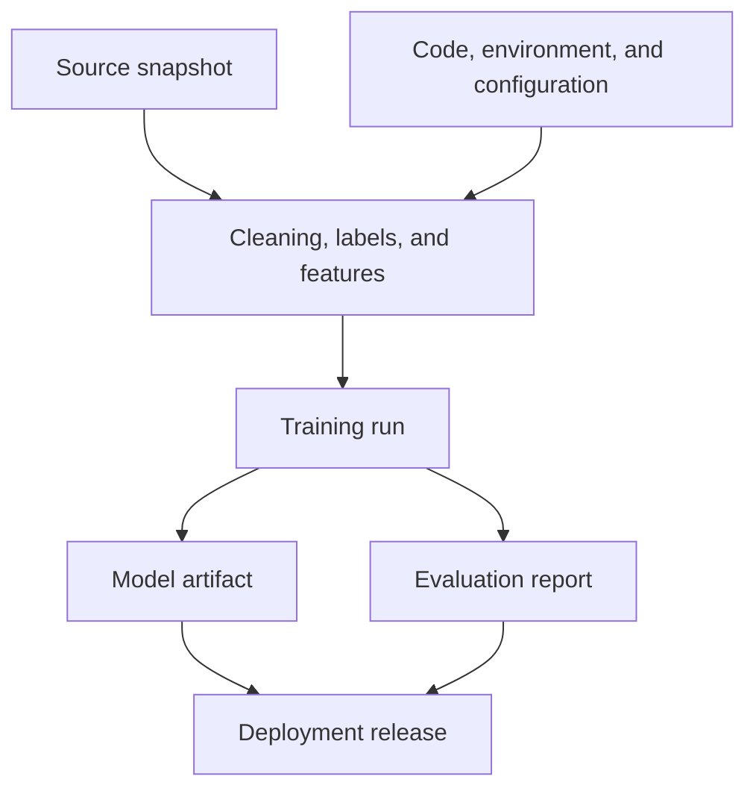
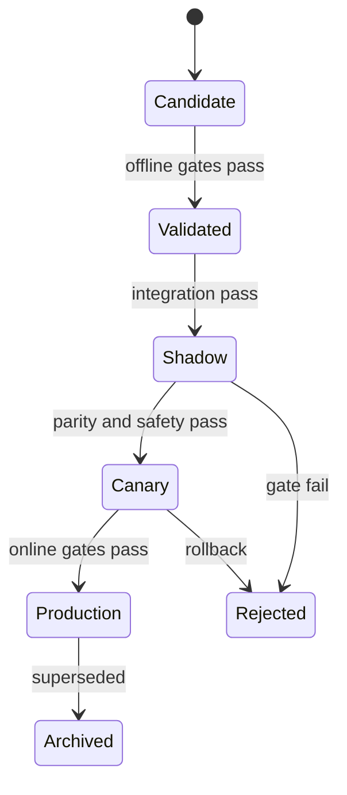



Le MLOps ne consiste pas seulement à automatiser l'entraînement des modèles. Son essence est de **prouver quelles données et quel code ont produit un modèle et pourquoi, de le reconstruire dans les mêmes conditions, de le promouvoir en toute sécurité et de revenir en arrière en cas de problème**.

Enregistrer un fichier de modèle conserve une sortie, mais pas un système reproductible. Données d'entrée, définition des étiquettes, code des variables, environnement d'exécution, politique d'évaluation, seuils et configuration de déploiement doivent tous être reliés.

## 1. Le problème : pourquoi « le même code » ne produit pas le même modèle

Un résultat d'apprentissage automatique est fonction de :

\[
Artifact = F(D, L, S, C, E, H, R, P)
\]

- \(D\): source data and snapshot
- \(L\): label definition
- \(S\): train/validation/test split
- \(C\): feature, preprocessing, and training code
- \(E\): operating system, runtime, libraries, and hardware environment
- \(H\): hyperparameters
- \(R\): random seeds and nondeterministic operations
- \(P\): training policy and execution order

Même avec le même commit Git, une modification des données change le résultat. Même avec le même instantané de données, une requête SQL d'étiquetage, une bibliothèque ou un ordre d'entraînement distribué différent peut modifier le résultat.

### Ruptures opérationnelles fréquentes

- Cela fonctionne dans un notebook mais ne peut être reproduit dans le pipeline par lots.
- Relire la dernière table source modifie silencieusement les données d'une expérience passée.
- Un fichier de modèle portant le même nom est écrasé.
- Le prétraitement hors ligne diffère du calcul des variables en ligne.
- Les métriques ont été enregistrées, mais pas les données d'évaluation ni la version de leur implémentation.
- Le modèle probabiliste est inchangé et seul le seuil a changé, mais aucun historique ne l'indique.
- L'étiquette `production` n'est qu'un alias ajouté manuellement, sans barrière de validation.
- Après le déploiement, personne ne peut retrouver le modèle ayant répondu à une requête donnée.

### La reproductibilité comporte plusieurs niveaux

1. **Repeatability**: Repeat the same run with the same code, data, and environment.
2. **Reproducibility**: Reproduce the result within a defined tolerance in an independent environment by following the same procedure.
3. **Replicability**: Confirm that the conclusion holds with an independent implementation and data.

Lorsque les opérations matérielles sont non déterministes, il est plus réaliste de définir des tolérances pour les métriques et les écarts de prédiction que d'exiger une égalité bit à bit.

## 2. Modèle mental : un graphe de provenance d'artefacts immuables

Pensez le MLOps comme un graphe orienté acyclique plutôt que comme un dépôt de fichiers.



Chaque nœud possède un identifiant immuable et chaque arête signifie « a été produit à partir de ». Un nom comme « latest » n'est qu'un pointeur mobile vers un artefact immuable.

### Distinguer un artefact d'une version publiée

- **Model artifact**: Trained weights, preprocessing, signature, and metadata
- **Decision policy**: Calibrator, thresholds, rules, and fallback
- **Release**: A deployment unit combining a particular artifact, policy, serving code, and environment

Modifier un seuil change le comportement réel même si les poids du modèle restent identiques. La politique doit donc être versionnée et incluse dans la traçabilité de la version publiée.

### Un registre est une machine à états, pas un entrepôt de fichiers

Exemple d'états recommandés :



Chaque transition d'état doit conserver la preuve de validation, l'approbateur, l'heure et le motif. Un processus manuel qui se contente de modifier une étiquette offre peu d'auditabilité et de reproductibilité.

## 3. Processus pratique

### Étape 1. Définir le contrat de reproductibilité

Au début du projet, précisez :

- Les réexécutions doivent-elles produire la même empreinte d'artefact, les mêmes prédictions ou la même plage de métriques ?
- Quelle erreur numérique est acceptable ?
- Les données sources seront-elles figées sous forme d'instantané, de journal en ajout seul ou de résultat de requête à une date donnée ?
- Quelles sont les politiques de conservation et de suppression ?
- Existe-t-il des données dérivées permettant la reproduction sans données sensibles ?
- Qui peut promouvoir quel artefact en production ?

Les options déterministes peuvent réduire les performances. On peut distinguer une reproductibilité stricte en recherche d'une reproductibilité statistique pour l'entraînement de production à grande échelle, mais cette différence doit être documentée.

### Étape 2. Séparer le code exécutable de la configuration déclarative

Les notebooks sont utiles pour l'exploration, mais placez le chemin d'entraînement final dans des fonctions et commandes paramétrées.

```yaml
run:
  code_revision: "immutable-commit-id"
  random_seed: 1729

data:
  snapshot_id: "content-addressed-id"
  label_spec_version: "label-v4"
  split_spec_version: "temporal-split-v2"

features:
  definition_version: "features-v7"
  fit_scope: "train-only"

model:
  family: "candidate-family"
  hyperparameters:
    regularization: 0.01

evaluation:
  metric_spec_version: "metrics-v3"
  slices: [time, domain, data_quality]
```

Les valeurs numériques ne sont que des exemples. L'important est qu'un fichier de configuration versionné — et non des arguments retenus de mémoire — définisse l'exécution.

Ne placez pas de secrets dans la configuration. Injectez-les par un canal dédié et masquez-les dans les journaux et artefacts.

### Étape 3. Créer des instantanés et la traçabilité des données

La stratégie de versionnage des données dépend de l'échelle et de la réglementation.

#### Instantané physique

Stockez les lignes d'entraînement dans des fichiers immuables. La reproduction est simple, mais la duplication du stockage et la conservation de données sensibles créent des risques.

#### Requête et version de la source

Stockez la requête, la version de partition source et l'horodatage de référence. La source doit prendre en charge le voyage temporel et l'immuabilité.

#### Manifeste adressé par le contenu

Regroupez dans un manifeste les chemins, tailles, sommes de contrôle, schéma, nombres de lignes et plage temporelle. Si le contenu change, l'identifiant change aussi.

Exemple de manifeste de données :

```json
{
  "dataset_id": "sha256:...",
  "created_at": "ISO-8601 timestamp",
  "schema_version": "v5",
  "label_spec": "label-v4",
  "time_range": {"start": "...", "end": "..."},
  "partitions": [
    {"uri": "immutable/path", "sha256": "...", "rows": 0}
  ],
  "quality_report_id": "sha256:..."
}
```

Ne répliquez pas d'informations personnelles ni le texte original des enregistrements dans les métadonnées du registre. La traçabilité ne doit contenir que les identifiants minimaux et les emplacements à accès contrôlé.

### Étape 4. Versionner variables et étiquettes dans le code comme dans les données

Une version de variables est plus qu'une liste de colonnes.

- formulas and window definitions
- point-in-time join rules
- missing-value, outlier, and unit conversions
- category dictionaries and unknown handling
- statistics that require fitting
- equivalence of online and offline implementations

Une version d'étiquette comprend la définition de l'événement, l'horizon d'observation, les règles d'exclusion, le délai de maturité et la politique d'arbitrage manuel.

Regroupez le préprocesseur ajusté avec le modèle dans l'artefact d'entraînement, ou référencez l'artefact exact requis. Ne récupérez pas arbitrairement le dernier préprocesseur au moment de l'inférence.

### Étape 5. Verrouiller l'environnement et consigner la provenance de la construction

Fixez au minimum :

- runtime version
- lockfile for direct and transitive dependencies
- système d'exploitation et bibliothèques système
- informations sur CPU, GPU et bibliothèques d'accélération
- container image digest
- compiler options
- environment-variable values that affect results

Les étiquettes pouvant changer, consignez l'empreinte de l'image ainsi que son étiquette. Pour sécuriser la chaîne d'approvisionnement, reliez inventaire des dépendances, analyses de vulnérabilités, signatures et attestations aux preuves de publication.

### Étape 6. Enregistrer chaque exécution sous forme structurée

Chaque exécution nécessite les éléments suivants :

| Category | Recorded items |
|---|---|
| Input | dataset, label, split, feature version |
| Code | commit, dirty status, build ID |
| Environment | image digest, runtime, hardware |
| Training | config, seed, duration, resource usage |
| Output | model checksum, preprocessor, signature |
| Evaluation | metric, confidence interval, slice report |
| Decision | reason for acceptance or rejection, reviewer, comparison baseline |

Si l'exécution a eu lieu avec un arbre de travail modifié, conservez les différences comme artefact ou excluez l'exécution de la promotion. « L'identifiant de commit était identique, mais des modifications locales existaient » est une cause fréquente de reproductibilité rompue.

### Step 7. Include Contracts in the Model Package

A model package should contain at least:

- weights or a serialized model
- preprocessing and postprocessing artifacts
- input/output signature
- feature names, order, data types, and units
- policies for missing values and unknown categories
- training-data and code-lineage IDs
- evaluation-report ID
- expected resource and latency ranges
- license, security, and usage restrictions
- supported domains and known failure modes

Example signature:

```json
{
  "inputs": [
    {"name": "feature_a", "dtype": "float32", "nullable": false},
    {"name": "category_b", "dtype": "string", "unknown": "map_to_other"}
  ],
  "outputs": [
    {"name": "risk_probability", "dtype": "float32", "range": [0, 1]}
  ]
}
```

Matching schemas do not guarantee matching meaning. Semantic contract tests are also required for units, reference times, and category definitions.

### Step 8. Implement Promotion Gates as Code

A candidate must pass automated and manual gates before moving to the next stage.

#### Data Gates

- schema and semantic contracts
- leakage, duplication, and time boundaries
- changes in missingness, ranges, and categories
- label maturity and quality

#### Model Gates

- minimum performance relative to a fixed baseline
- lower bounds for important slices
- calibration and uncertainty quality
- robustness and stress tests
- fairness and safety requirements

#### System Gates

- serialization round trip
- batch/online prediction parity
- latency, memory, and throughput
- fallbacks for failures, timeouts, and missing features
- security checks and dependency policy

A gate should not compare only average performance. For example:

\[
\Delta m = m_{candidate}-m_{champion}
\]

In addition to average \(\Delta m>0\), consider confidence intervals, subgroup regressions, and operating cost. A candidate may improve the overall average while harming an important slice.

### Step 9. Limit Online Risk with Shadowing and Canaries

In **shadow** mode, real requests are copied to the candidate for prediction, but its output does not affect behavior.

- signature and feature parity
- latency and resources
- differences between candidate and current-model predictions
- errors and fallbacks
- OOD rate in real traffic

In a **canary**, the candidate release is actually applied to limited traffic.

- gradual traffic expansion
- predefined guardrails
- automatic stop and rollback conditions
- stable assignment so a user or entity does not move back and forth between models
- outcome tracking by model version

For safety-critical decisions, human approval or an advisory-only stage may precede the canary.

### Step 10. Practice Rollback Before Deployment

Rollback requires more than the previous model file.

- previous release's model, preprocessing, and policy
- compatible feature schema
- backward compatibility for data migrations
- traffic-routing configuration
- rules that prevent reprocessing and duplicate actions
- post-rollback monitoring criteria

If the model and feature pipeline are deployed independently, a compatibility matrix is needed. Manage the release bundle atomically so an emergency rollback does not combine an old model with new features incorrectly.

### Step 11. Operate CI, CD, and CT Separately

- **CI**: code and data contracts, unit/integration tests, and a small reproducibility training run
- **CD**: deploy a validated release to an environment and progress through shadowing and canaries
- **CT**: refresh data and produce candidate models based on a condition or schedule

Automatic CT does not require automatic production promotion. Depending on risk, require human approval, a minimum observation period, and online evidence.

## 4. Evaluation and Verification Checklist

### Reproducibility

- [ ] Record the code commit and dirty status.
- [ ] Link dataset, label, split, and feature versions through immutable IDs.
- [ ] Preserve the lockfile, image digest, and hardware information.
- [ ] Specify the policy for seeds and nondeterministic operations.
- [ ] Define bitwise or statistical reproducibility tolerances.
- [ ] Replay a representative run in a clean environment.

### Lineage and Registry

- [ ] A model can be traced back to its source snapshot.
- [ ] The evaluation report references the exact artifact and test set.
- [ ] Model, policy, and release versions are distinct.
- [ ] Artifacts are never overwritten and are identified by checksum.
- [ ] Every state transition retains its gate, approver, time, and reason.
- [ ] Sensitive source data and secrets are absent from metadata and logs.

### Promotion

- [ ] The candidate was compared with the baseline and current production model under identical conditions.
- [ ] Important slices have lower bounds, not just overall performance.
- [ ] Signature, semantic, and online/offline parity tests pass.
- [ ] Latency, memory, throughput, and fallback behavior were verified.
- [ ] Shadow evidence was reviewed.
- [ ] Canary expansion, stop, and rollback conditions are quantified.

### Operations and Recovery

- [ ] Every prediction can be linked to a release ID.
- [ ] Inputs, outputs, performance, and policy results are monitored by version.
- [ ] The previous release and compatible features can be restored immediately.
- [ ] The rollback runbook has been practiced.
- [ ] Data deletion and retention requirements also apply to lineage artifacts.
- [ ] Retraining causes and promotion decisions are auditable after the fact.

## 5. Limitations and Caveats

First, saving everything improves reproducibility but also increases cost and privacy risk. Use immutable references, manifests, and access controls instead of duplicating source data, and set retention periods.

Second, complete determinism can conflict with performance and speed. The important thing is to disclose the limits and verify that results and conclusions repeat within the defined tolerance.

Third, a registry does not automatically create governance. If it consists of meaningless manual tags, bypassable gates, and ceremonial approvals, it is no different from a file server.

Fourth, offline gates do not guarantee online causal effects. Shadowing verifies system compatibility; canaries verify limited real-world impact. Each provides different evidence.

Finally, automatic retraining is not synonymous with automatic improvement. It may learn a data outage or policy bias more quickly. Design retraining, recalibration, threshold changes, and rollback as separate responses.
