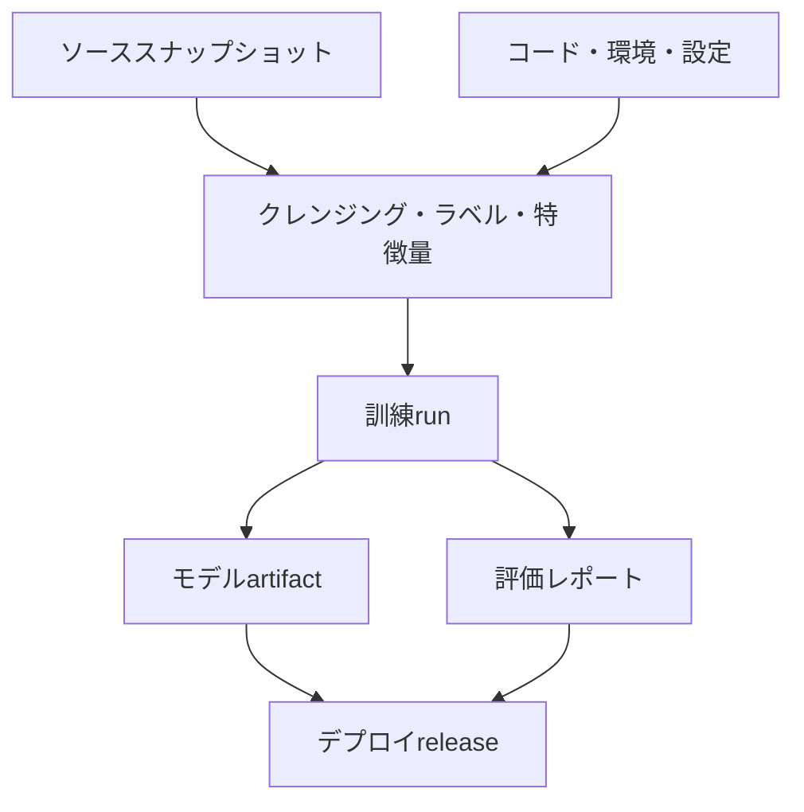
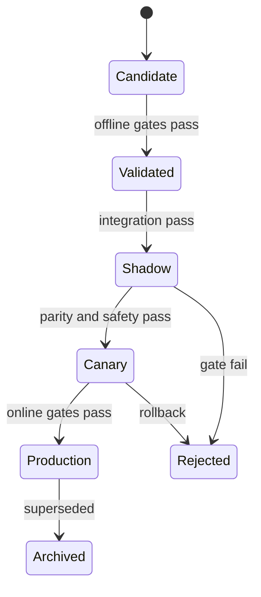



MLOpsの目的は、モデル訓練の自動化だけにとどまらない。**どのデータとコードから、なぜこのモデルが作られたのかを証明し、同じ条件で再作成し、安全に昇格させ、問題が生じたら元に戻せるようにすること**が核心である。

モデルファイルを1つ保存するだけなら成果物は残るが、システムは再現されない。入力データ、ラベル定義、特徴量コード、実行環境、評価方針、しきい値、デプロイ設定が一緒につながっている必要がある。

## 1. 問題：「同じコード」でも同じモデルにならない理由

機械学習の結果は、次の関数である。

\[
Artifact = F(D, L, S, C, E, H, R, P)
\]

- \(D\)：ソースデータとスナップショット
- \(L\)：ラベル定義
- \(S\)：train/validation/test分割
- \(C\)：特徴量・前処理・学習コード
- \(E\)：オペレーティングシステム、ランタイム、ライブラリ、ハードウェア環境
- \(H\)：ハイパーパラメータ
- \(R\)：乱数seedと非決定的演算
- \(P\)：学習方針と実行順序

Git commitが同じでも、データが変われば結果は異なる。データスナップショットが同じでも、ラベルSQL、ライブラリ、分散学習の順序が異なれば、結果が変わる可能性がある。

### よくある運用上の断絶

- notebookでは動作しても、batch pipelineでは再現できない。
- 最新のソーステーブルを再び読み込み、過去の実験データがひそかに変わる。
- 同じ名前のモデルファイルが上書きされる。
- オフライン前処理とオンライン特徴量計算が異なる。
- 指標は記録したものの、評価データとmetric実装のversionがない。
- 確率モデルは同じで、しきい値だけが変わった場合でも変更履歴がない。
- 「production」タグが人によって恣意的に付けられた別名にすぎず、検証gateがない。
- デプロイ後、どのモデルがどのリクエストに応答したか追跡できない。

### 再現性には段階がある

1. **Repeatability**：同じコード・データ・環境で同じ実行を反復
2. **Reproducibility**：独立した環境で同じ手順により、許容誤差内の結果を再現
3. **Replicability**：独立した実装・データでも結論が維持されるかを確認

非決定的なハードウェア演算がある場合、bitwise equalityよりもmetric・予測差に対する許容誤差を定義するほうが現実的である。

## 2. Mental model：不変artifactのprovenance graph

MLOpsをファイルストレージではなく、有向非巡回グラフとして考える。



各ノードは不変IDを持ち、各edgeは「何から作られたか」を意味する。最新の名前は、不変artifactを指す移動可能なポインタにすぎない。

### Artifactとreleaseを区別する

- **Model artifact**：学習済みの重み・前処理・signature・メタデータ
- **Decision policy**：calibrator、しきい値、ルール、fallback
- **Release**：特定のartifactとpolicy、serving code、環境をまとめたデプロイ単位

同じモデルの重みでも、しきい値が変われば実際の動作は変わる。したがって、policyもversion管理し、release lineageに含める。

### Registryはファイル倉庫ではなく状態機械である

推奨状態の例：



状態遷移には、検証証拠、承認主体、時刻、理由を残す必要がある。タグ名だけを変える手動手順は、監査可能性と再現性が弱い。

## 3. 実践workflow

### Step 1. 再現性の契約を定める

プロジェクト開始時に次の項目を明示する。

- 再実行時に同一であるべきものは、artifact hashか、予測値か、metric範囲か？
- 許容可能な数値誤差はいくらか？
- ソースデータはsnapshot、append-only log、query-as-ofのどれで固定するか？
- 保存期間と削除方針は何か？
- 機密データなしで再現できる派生データがあるか？
- 誰がどのartifactをproductionへ昇格できるか？

決定論オプションは性能を低下させる可能性がある。研究段階における厳密な再現と、大規模運用学習における統計的再現を区別できるが、その違いを文書化する必要がある。

### Step 2. 実行可能コードと宣言的設定を分離する

notebookは探索に役立つが、最終的な学習経路はパラメータ化された関数・コマンドへ移す。

```yaml
run:
  code_revision: "immutable-commit-id"
  random_seed: 1729

data:
  snapshot_id: "content-addressed-id"
  label_spec_version: "label-v4"
  split_spec_version: "temporal-split-v2"

features:
  definition_version: "features-v7"
  fit_scope: "train-only"

model:
  family: "candidate-family"
  hyperparameters:
    regularization: 0.01

evaluation:
  metric_spec_version: "metrics-v3"
  slices: [time, domain, data_quality]
```

数値は例にすぎない。重要なのは、人が記憶している引数ではなく、commitされた設定ファイルが実行を定義することだ。

設定には秘密値を入れない。秘密は専用のsecret注入経路から渡し、ログ・artifactではmaskingする。

### Step 3. データsnapshotとlineageを作る

データversionの戦略は、規模と規制によって異なる。

#### 物理snapshot

訓練に使用した行を不変ファイルとして保存する。再現は容易だが、重複保存と機密情報を保持するリスクがある。

#### Query + source version

クエリ、ソースpartitionのversion、as-of timestampを保存する。ソースがtime travelと不変性をサポートしていなければならない。

#### Content-addressed manifest

ファイルパス、サイズ、checksum、schema、row count、時間範囲をmanifestにまとめる。内容が変わるとIDも変わる。

データmanifestの例：

```json
{
  "dataset_id": "sha256:...",
  "created_at": "ISO-8601 timestamp",
  "schema_version": "v5",
  "label_spec": "label-v4",
  "time_range": {"start": "...", "end": "..."},
  "partitions": [
    {"uri": "immutable/path", "sha256": "...", "rows": 0}
  ],
  "quality_report_id": "sha256:..."
}
```

個々のレコードの個人情報や原文をregistry metadataへ複製しない。lineageには最小限の識別子と、アクセス制御された場所だけを置く。

### Step 4. 特徴量とラベルをコード・データの両面でversion管理する

特徴量versionは列の一覧だけではない。

- 計算式とwindowの定義
- point-in-time joinのルール
- 欠損・異常値・単位変換
- カテゴリ辞書とunknownの処理
- fitが必要な統計量
- オンライン・オフライン実装の同等性

ラベルversionには、イベント定義、観測期間、除外ルール、maturity delay、手動判定方針を含める。

訓練artifactにはfitted preprocessorをモデルとまとめるか、必要な前処理artifactを正確に参照する。推論時に恣意的に最新の前処理器を取得してはならない。

### Step 5. 環境を固定し、build provenanceを残す

少なくとも次の項目を固定する。

- ランタイムversion
- 直接・推移依存関係のlockfile
- OS・system library
- CPU/GPU・アクセラレーションライブラリの情報
- コンテナimage digest
- コンパイルオプション
- 環境変数のうち、結果に影響する値

タグは変わりうるため、デプロイ時にはimage tagだけでなくdigestも記録する。サプライチェーンの安全性を確保するため、依存関係の一覧、脆弱性検査結果、署名・attestationをrelease evidenceへ関連付けることもできる。

### Step 6. すべてのrunを構造化して記録する

Runごとに次の情報が必要である。

| 分類 | 記録項目 |
|---|---|
| 入力 | dataset、label、split、feature version |
| コード | commit、dirtyかどうか、build ID |
| 環境 | image digest、runtime、hardware |
| 学習 | config、seed、duration、resource usage |
| 出力 | model checksum、preprocessor、signature |
| 評価 | metric、confidence interval、slice report |
| 判断 | 採用・却下理由、reviewer、比較baseline |

作業ツリーが変更された状態で実行したなら、diffをartifactとして残すか、昇格対象から除外する。「commit IDは同じだが、ローカルの変更があった」という状況は、再現性を壊す一般的な原因である。

### Step 7. Model packageに契約を含める

モデルパッケージには、少なくとも次のものを含める。

- 重み、またはシリアライズ済みモデル
- 前処理・後処理artifact
- input/output signature
- featureの名前、順序、データ型、単位
- 欠損・unknownカテゴリの方針
- 学習データとコードのlineage ID
- 評価レポートID
- 想定リソースとlatency範囲
- ライセンス・セキュリティ・使用制限
- サポートするドメインと既知のfailure mode

Signatureの例：

```json
{
  "inputs": [
    {"name": "feature_a", "dtype": "float32", "nullable": false},
    {"name": "category_b", "dtype": "string", "unknown": "map_to_other"}
  ],
  "outputs": [
    {"name": "risk_probability", "dtype": "float32", "range": [0, 1]}
  ]
}
```

schemaが一致するだけでは意味が正しいとは限らない。単位・基準時点・カテゴリ定義のようなsemantic contract testも必要である。

### Step 8. Promotion gateをコードにする

候補が次の段階へ進むには、自動・手動gateを通過する必要がある。

#### データgate

- schemaとsemantic contract
- 漏えい・重複・時間境界
- 欠損・範囲・カテゴリ変化
- label maturityと品質

#### モデルgate

- 固定baselineに対する最低性能
- 重要sliceの下限
- calibration・不確実性の品質
- robustness・stress test
- fairness・safety要件

#### システムgate

- シリアライズround-trip
- batch/online prediction parity
- latency、memory、throughput
- 障害・timeout・欠落特徴量のfallback
- セキュリティ検査と依存関係の方針

Gateでは平均性能だけを比較しない。たとえば、

\[
\Delta m = m_{candidate}-m_{champion}
\]

平均 \(\Delta m>0\) だけでなく、信頼区間、サブグループの劣化、運用コストを併せて確認する。候補が全体平均を向上させながら、重要なsliceを悪化させる可能性があるためだ。

### Step 9. Shadowとcanaryでオンラインリスクを制限する

**Shadow**では実際のリクエストを複製し、候補が予測するものの、動作には利用しない。

- signature・feature parity
- 遅延とリソース
- 候補モデルと現行モデルの予測差
- エラー・fallback
- 実トラフィックのOOD比率

**Canary**では、限定したトラフィックに候補releaseを実際に適用する。

- 段階的なトラフィック拡大
- 事前定義されたguardrail
- 自動停止・rollback条件
- ユーザー・個体がモデル間を行き来しないようにする安定した割り当て
- モデルversionごとの結果追跡

安全性が重要な意思決定では、canaryの前にもhuman approvalやadvisory-onlyの段階を設けることができる。

### Step 10. Rollbackをデプロイ前に練習する

Rollbackに必要なのは、以前のモデルファイルだけではない。

- 以前のreleaseのモデル・前処理・policy
- 互換性のあるfeature schema
- データmigrationの後方互換性
- traffic routing設定
- 再処理・重複動作を防ぐルール
- rollback後のmonitoring基準

モデルと特徴量pipelineを独立してデプロイする場合、互換性マトリックスが必要である。緊急rollback時に古いモデルと新しい特徴量を誤って組み合わせないよう、release bundleをアトミックに管理する。

### Step 11. CI、CD、CTを分離して運用する

- **CI**：コード・データ契約・unit/integration test、小規模な再現訓練
- **CD**：検証済みreleaseを環境へデプロイし、shadow/canaryを進める
- **CT**：条件またはスケジュールに応じてデータを更新し、候補モデルを生成する

CTが自動でも、productionへの昇格まで自動にする必要はない。リスク水準に応じて、human approval、最短観測期間、オンラインevidenceを要求する。

## 4. 評価・検証checklist

### 再現性

- [ ] コードcommitとdirty状態を記録する。
- [ ] dataset・label・split・featureのversionが不変IDで関連付けられている。
- [ ] lockfile、image digest、ハードウェア情報を保存する。
- [ ] seedと非決定的演算の方針が明示されている。
- [ ] bitwiseまたは統計的再現の許容範囲を定義した。
- [ ] クリーンな環境で代表runの再生テストを実施した。

### Lineageとregistry

- [ ] modelからソースsnapshotまで遡って追跡できる。
- [ ] 評価レポートが正確なartifactとtest setを参照している。
- [ ] model、policy、releaseのversionが区別されている。
- [ ] artifactは上書きせず、checksumで識別する。
- [ ] 状態遷移のgate、承認者、時刻、理由が残っている。
- [ ] 機密性の高い原文とsecretがmetadata・logに含まれていない。

### Promotion

- [ ] baselineおよび現在のproductionと同じ条件で比較した。
- [ ] 全体性能だけでなく、重要sliceの下限がある。
- [ ] signature、semantic、online/offline parity testに合格した。
- [ ] latency・memory・throughput・fallbackを検証した。
- [ ] shadow evidenceを確認した。
- [ ] canaryの拡大・停止・rollback条件が数値化されている。

### 運用と復旧

- [ ] すべての予測をrelease IDに関連付けられる。
- [ ] 入力・出力・性能・policyの結果をversionごとにmonitoringする。
- [ ] 以前のreleaseと互換性のある特徴量を即座に復元できる。
- [ ] rollback runbookを実際に演習した。
- [ ] データの削除・保存要件がlineage artifactにも適用される。
- [ ] 再学習の原因と昇格判断を事後に監査できる。

## 5. 限界と注意点

第一に、すべてを保存すると再現性は高まるが、コストと個人情報のリスクも増える。ソースの複製ではなく、不変参照・manifest・アクセス制御を活用し、保存期間を定める必要がある。

第二に、完全な決定性は性能・速度と衝突する可能性がある。重要なのは限界を隠さず、許容誤差の範囲内で結果と結論が反復されることを検証することである。

第三に、registryがあってもgovernanceが自動的に生まれるわけではない。意味のない手動タグ、迂回可能なgate、形式的な承認であれば、ファイルサーバーと変わらない。

第四に、offline gateはオンラインの因果効果を保証しない。shadowはシステム互換性を、canaryは限定された実際の影響を検証し、それぞれ異なる証拠を提供する。

最後に、自動再学習は自動改善と同義ではない。データ障害や方針の偏りを、より速く学習してしまう可能性もある。再学習、再calibration、しきい値変更、rollbackをそれぞれ別の対応として設計しなければならない。
