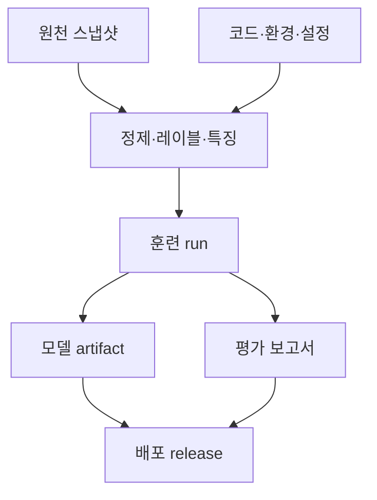
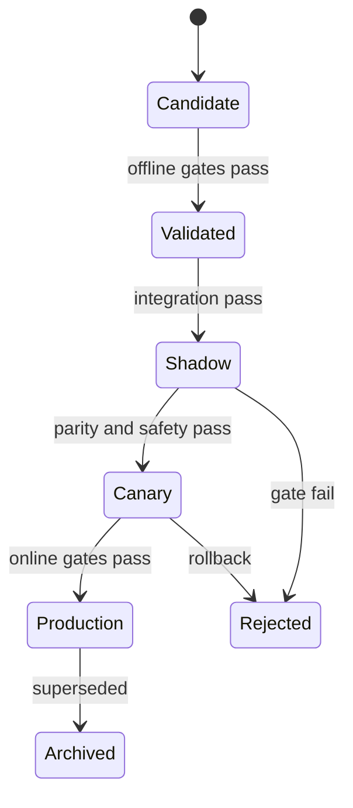



MLOps의 목적은 모델 훈련을 자동화하는 데 그치지 않는다. **어떤 데이터와 코드로 왜 이 모델이 만들어졌는지 증명하고, 같은 조건에서 다시 만들며, 안전하게 승격하고, 문제가 생기면 되돌릴 수 있게 하는 것**이 핵심이다.

모델 파일 하나만 저장하면 결과물은 남지만 시스템은 재현되지 않는다. 입력 데이터, 레이블 정의, 특징 코드, 실행 환경, 평가 정책, 임계값, 배포 설정이 함께 연결되어야 한다.

## 1. 문제: “같은 코드”인데도 같은 모델이 나오지 않는 이유

머신러닝 결과는 다음의 함수다.

\[
Artifact = F(D, L, S, C, E, H, R, P)
\]

- \(D\): 원천 데이터와 스냅샷
- \(L\): 레이블 정의
- \(S\): train/validation/test 분할
- \(C\): 특징·전처리·학습 코드
- \(E\): 운영체제, 런타임, 라이브러리, 하드웨어 환경
- \(H\): 하이퍼파라미터
- \(R\): 난수 시드와 비결정적 연산
- \(P\): 학습 정책과 실행 순서

Git commit만 같아도 데이터가 바뀌면 결과가 다르다. 데이터 스냅샷이 같아도 레이블 SQL, 라이브러리, 분산 학습 순서가 달라지면 결과가 달라질 수 있다.

### 흔한 운영 단절

- 노트북에서는 되지만 batch pipeline에서는 재현되지 않는다.
- 최신 원천 테이블을 다시 읽어 과거 실험의 데이터가 조용히 바뀐다.
- 동일한 이름의 모델 파일이 덮어써진다.
- 오프라인 전처리와 온라인 특징 계산이 다르다.
- 지표는 기록했지만 평가 데이터와 metric 구현 버전이 없다.
- 확률 모델은 같은데 임계값만 바뀌었는데도 변경 이력이 없다.
- “production” 태그가 사람이 임의로 붙인 별칭일 뿐 검증 gate가 없다.
- 배포 후 어느 모델이 어떤 요청에 응답했는지 추적할 수 없다.

### 재현성에는 수준이 있다

1. **Repeatability**: 같은 코드·데이터·환경에서 같은 실행을 반복
2. **Reproducibility**: 독립 환경에서 같은 절차로 허용 오차 내 결과 재현
3. **Replicability**: 독립 구현·데이터로도 결론이 유지되는지 확인

비결정적 하드웨어 연산이 있는 경우 bitwise equality보다 metric·예측 차이에 대한 허용 오차를 정의하는 편이 현실적이다.

## 2. Mental model: 불변 artifact의 provenance graph

MLOps를 파일 저장소가 아니라 방향성 비순환 그래프로 생각한다.



각 노드는 불변 ID를 갖고, 각 edge는 “무엇으로부터 만들어졌는가”를 뜻한다. 최신 이름은 불변 artifact를 가리키는 이동 가능한 포인터일 뿐이다.

### Artifact와 release를 구분한다

- **Model artifact**: 학습된 가중치·전처리·signature·메타데이터
- **Decision policy**: 보정기, 임계값, 규칙, fallback
- **Release**: 특정 artifact와 policy, serving code, 환경을 묶은 배포 단위

같은 모델 가중치라도 임계값이 바뀌면 실제 행동은 달라진다. 그러므로 policy도 버전 관리하고 release lineage에 포함한다.

### Registry는 파일 창고가 아니라 상태 머신이다

권장 상태 예시:



상태 전이는 검증 증거, 승인 주체, 시간, 사유를 남겨야 한다. 태그 이름만 바꾸는 수동 절차는 감사 가능성과 재현성이 약하다.

## 3. 실전 workflow

### Step 1. 재현성 계약을 정한다

프로젝트 시작 시 다음을 명시한다.

- 재실행 시 동일해야 하는 것은 artifact hash인가, 예측값인가, metric 범위인가?
- 허용할 수 있는 수치 오차는 얼마인가?
- 원천 데이터는 snapshot, append-only log, query-as-of 중 무엇으로 고정하는가?
- 보존 기간과 삭제 정책은 무엇인가?
- 민감 데이터 없이 재현 가능한 파생 데이터가 있는가?
- 누가 어떤 artifact를 production으로 승격할 수 있는가?

결정론 옵션은 성능을 낮출 수 있다. 연구 단계의 엄격 재현과 대규모 운영 학습의 통계적 재현을 구분할 수 있지만, 차이를 문서화해야 한다.

### Step 2. 실행 가능한 코드와 선언적 설정을 분리한다

노트북은 탐색에 유용하지만 최종 학습 경로는 파라미터화된 함수·명령으로 옮긴다.

```yaml
run:
  code_revision: "immutable-commit-id"
  random_seed: 1729

data:
  snapshot_id: "content-addressed-id"
  label_spec_version: "label-v4"
  split_spec_version: "temporal-split-v2"

features:
  definition_version: "features-v7"
  fit_scope: "train-only"

model:
  family: "candidate-family"
  hyperparameters:
    regularization: 0.01

evaluation:
  metric_spec_version: "metrics-v3"
  slices: [time, domain, data_quality]
```

숫자 값은 예시일 뿐이다. 중요한 점은 사람이 기억하는 인수가 아니라 commit된 설정 파일이 실행을 정의한다는 것이다.

설정에는 비밀값을 넣지 않는다. 비밀은 전용 secret 주입 경로로 전달하고 로그·artifact에서 마스킹한다.

### Step 3. 데이터 snapshot과 lineage를 만든다

데이터 버전 전략은 규모와 규제에 따라 다르다.

#### 물리 snapshot

훈련에 사용한 행을 불변 파일로 저장한다. 재현은 쉽지만 중복 저장과 민감 정보 보존 위험이 있다.

#### Query + source version

쿼리, 원천 파티션 버전, as-of timestamp를 저장한다. 원천이 time travel과 불변성을 지원해야 한다.

#### Content-addressed manifest

파일 경로, 크기, checksum, schema, row count, 시간 범위를 manifest로 묶는다. 내용이 바뀌면 ID도 바뀐다.

데이터 manifest 예시:

```json
{
  "dataset_id": "sha256:...",
  "created_at": "ISO-8601 timestamp",
  "schema_version": "v5",
  "label_spec": "label-v4",
  "time_range": {"start": "...", "end": "..."},
  "partitions": [
    {"uri": "immutable/path", "sha256": "...", "rows": 0}
  ],
  "quality_report_id": "sha256:..."
}
```

개별 레코드의 개인정보나 원문을 registry metadata에 복제하지 않는다. lineage에는 최소 식별자와 접근 통제된 위치만 둔다.

### Step 4. 특징과 레이블을 코드·데이터 양쪽에서 버전 관리한다

특징 버전은 열 목록만이 아니다.

- 계산식과 window 정의
- point-in-time join 규칙
- 결측·이상치·단위 변환
- 범주 사전과 unknown 처리
- fit이 필요한 통계량
- 온라인·오프라인 구현의 동등성

레이블 버전에는 사건 정의, 관측 지평, 제외 규칙, maturity delay, 수동 판정 정책을 포함한다.

훈련 artifact에는 fitted preprocessor를 모델과 묶거나, 정확히 어떤 전처리 artifact가 필요한지 참조한다. 추론 시 임의로 최신 전처리기를 가져오지 않는다.

### Step 5. 환경을 잠그고 build provenance를 남긴다

최소한 다음을 고정한다.

- 런타임 버전
- 직접·전이 의존성 lockfile
- OS·system library
- CPU/GPU·가속 라이브러리 정보
- 컨테이너 image digest
- 컴파일 옵션
- 환경 변수 중 결과에 영향을 주는 값

태그는 바뀔 수 있으므로 배포에는 image tag뿐 아니라 digest를 기록한다. 공급망 안전을 위해 의존성 목록, 취약점 검사 결과, 서명·attestation을 release evidence에 연결할 수 있다.

### Step 6. 모든 run을 구조화해 기록한다

Run마다 다음이 필요하다.

| 범주 | 기록 항목 |
|---|---|
| 입력 | dataset, label, split, feature version |
| 코드 | commit, dirty 여부, build ID |
| 환경 | image digest, runtime, hardware |
| 학습 | config, seed, duration, resource usage |
| 출력 | model checksum, preprocessor, signature |
| 평가 | metric, confidence interval, slice report |
| 판단 | 채택·기각 사유, reviewer, 비교 baseline |

작업 트리가 변경된 상태에서 실행했다면 diff를 artifact로 남기거나 승격 대상에서 제외한다. “commit ID는 같지만 로컬 수정이 있었다”는 재현성을 깨는 흔한 원인이다.

### Step 7. Model package에 계약을 포함한다

모델 패키지는 적어도 다음을 포함한다.

- 가중치 또는 직렬화된 모델
- 전처리·후처리 artifact
- input/output signature
- feature 이름, 순서, 자료형, 단위
- 결측·unknown 범주 정책
- 학습 데이터와 코드 lineage ID
- 평가 보고서 ID
- 예상 자원과 latency 범위
- 라이선스·보안·사용 제한
- 지원 도메인과 알려진 실패 모드

Signature 예시:

```json
{
  "inputs": [
    {"name": "feature_a", "dtype": "float32", "nullable": false},
    {"name": "category_b", "dtype": "string", "unknown": "map_to_other"}
  ],
  "outputs": [
    {"name": "risk_probability", "dtype": "float32", "range": [0, 1]}
  ]
}
```

스키마만 맞는다고 의미가 맞는 것은 아니다. 단위·기준 시점·범주 정의 같은 semantic contract test도 필요하다.

### Step 8. Promotion gate를 코드로 만든다

후보가 다음 단계로 이동하려면 자동·수동 gate를 통과한다.

#### 데이터 gate

- schema와 semantic contract
- 누수·중복·시간 경계
- 결측·범위·범주 변화
- label maturity와 품질

#### 모델 gate

- 고정 baseline 대비 최소 성능
- 중요 slice의 하한
- calibration·불확실성 품질
- 강건성·스트레스 테스트
- 공정성·안전성 요구

#### 시스템 gate

- 직렬화 round-trip
- batch/online prediction parity
- latency, memory, throughput
- 장애·timeout·누락 특징 fallback
- 보안 검사와 의존성 정책

Gate는 평균 성능만 비교하지 않는다. 예를 들어:

\[
\Delta m = m_{candidate}-m_{champion}
\]

평균 \(\Delta m>0\)뿐 아니라 신뢰구간, 하위집단 열화, 운영 비용을 함께 본다. 후보가 전체 평균을 높이면서 중요한 slice를 악화시킬 수 있기 때문이다.

### Step 9. Shadow와 canary로 온라인 위험을 제한한다

**Shadow**에서는 실제 요청을 복제해 후보가 예측하지만 행동에는 사용하지 않는다.

- signature·feature parity
- 지연과 자원
- 후보–현재 모델 예측 차이
- 오류·fallback
- 실제 트래픽의 OOD 비율

**Canary**에서는 제한된 트래픽에 후보 release를 실제 적용한다.

- 점진적 트래픽 확대
- 사전 정의된 guardrail
- 자동 중단·rollback 조건
- 사용자·개체가 모델 사이를 오가지 않도록 안정적 할당
- 모델 버전별 결과 추적

안전이 중요한 의사결정에서는 canary 이전에도 human approval이나 advisory-only 단계를 둘 수 있다.

### Step 10. Rollback을 배포 전에 연습한다

Rollback에 필요한 것은 이전 모델 파일만이 아니다.

- 이전 release의 모델·전처리·policy
- 호환되는 feature schema
- 데이터 마이그레이션 역호환성
- traffic routing 설정
- 재처리·중복 행동 방지 규칙
- rollback 후 모니터링 기준

모델과 특징 파이프라인을 독립 배포하면 호환성 표가 필요하다. 긴급 rollback이 오래된 모델과 새 특징을 잘못 결합하지 않도록 release bundle을 원자적으로 관리한다.

### Step 11. CI, CD, CT를 분리해 운영한다

- **CI**: 코드·데이터 계약·unit/integration test, 작은 재현 훈련
- **CD**: 검증된 release를 환경에 배포하고 shadow/canary 진행
- **CT**: 조건 또는 일정에 따라 데이터를 갱신하고 후보 모델 생성

CT가 자동이라고 production 승격도 자동일 필요는 없다. 위험 수준에 따라 human approval, 최소 관측 기간, 온라인 evidence를 요구한다.

## 4. 평가·검증 checklist

### 재현성

- [ ] 코드 commit과 dirty 상태를 기록한다.
- [ ] dataset·label·split·feature 버전이 불변 ID로 연결된다.
- [ ] lockfile, image digest, 하드웨어 정보를 보존한다.
- [ ] seed와 비결정적 연산 정책이 명시되었다.
- [ ] bitwise 또는 통계적 재현 허용치를 정의했다.
- [ ] 깨끗한 환경에서 대표 run 재생 테스트를 했다.

### Lineage와 registry

- [ ] model에서 원천 snapshot까지 역추적할 수 있다.
- [ ] 평가 보고서가 정확한 artifact와 test set을 참조한다.
- [ ] model, policy, release 버전이 구분된다.
- [ ] artifact는 덮어쓰지 않고 checksum으로 식별한다.
- [ ] 상태 전이의 gate, 승인자, 시각, 사유가 남는다.
- [ ] 민감 원문과 secret이 metadata·log에 포함되지 않는다.

### Promotion

- [ ] baseline 및 현재 production과 동일 조건에서 비교했다.
- [ ] 전체 성능뿐 아니라 중요 slice 하한이 있다.
- [ ] signature, semantic, online/offline parity test를 통과했다.
- [ ] latency·memory·throughput·fallback을 검증했다.
- [ ] shadow evidence를 확인했다.
- [ ] canary 확대·중단·rollback 조건이 수치화되었다.

### 운영과 복구

- [ ] 모든 예측에 release ID를 연결할 수 있다.
- [ ] 입력·출력·성능·정책 결과를 버전별로 모니터링한다.
- [ ] 이전 release와 호환 특징을 즉시 복원할 수 있다.
- [ ] rollback runbook을 실제로 연습했다.
- [ ] 데이터 삭제·보존 요구가 lineage artifact에도 적용된다.
- [ ] 재학습 원인과 승격 판단이 사후 감사 가능하다.

## 5. 한계와 주의점

첫째, 모든 것을 저장하면 재현성은 높아지지만 비용과 개인정보 위험도 커진다. 원천 복제 대신 불변 참조·manifest·접근 통제를 활용하고, 보존 기간을 정해야 한다.

둘째, 완전한 결정론은 성능·속도와 충돌할 수 있다. 중요한 것은 한계를 숨기지 않고 허용 오차 안에서 결과와 결론이 반복됨을 검증하는 것이다.

셋째, registry가 있다고 governance가 자동으로 생기지는 않는다. 의미 없는 수동 태그, 우회 가능한 gate, 형식적인 승인이라면 파일 서버와 다르지 않다.

넷째, offline gate는 온라인 인과 효과를 보장하지 않는다. shadow는 시스템 호환성을, canary는 제한된 실제 영향을 검증하며 각각 다른 증거를 제공한다.

마지막으로, 자동 재학습은 자동 개선과 같은 말이 아니다. 데이터 장애나 정책 편향을 더 빠르게 학습할 수도 있다. 재학습, 재보정, 임계값 변경, rollback을 별개의 대응으로 설계해야 한다.
