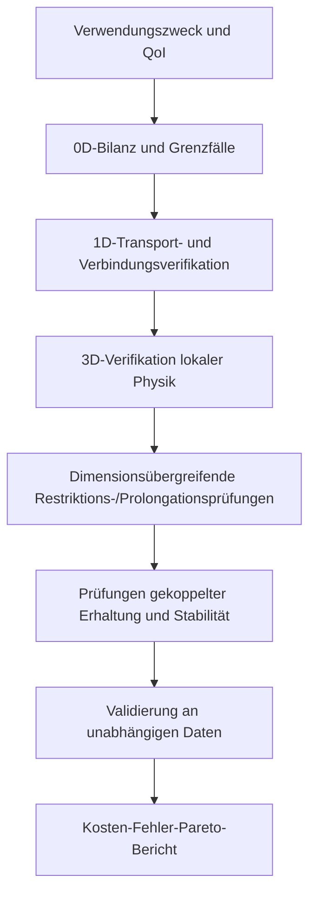



Das detaillierteste Modell ist nicht immer das beste Modell.
Berechnungen, die wesentlich teurer sind als die für eine Entscheidung benötigte Information, behindern Exploration, Unsicherheitsfortpflanzung und Optimierung; scheinbar detaillierte Eingabeannahmen können die Nichtidentifizierbarkeit sogar erhöhen.

Eine gute Modellierungsstrategie baut daher eine **Hierarchie mehrerer Fidelitätsstufen mit unterschiedlichen Zwecken** auf statt eines einzigen enormen Modells.

## 1. Fidelität bedeutet nicht nur Dimension

Modellfidelität vermischt folgende Dimensionen.

- räumliche Dimension und Netzauflösung
- Zeitskala und Integrationsdetail
- Detaillierungsgrad physikalischer Terme und Abschlüsse
- Grad der Geometriedarstellung
- Komplexität konstitutiver Gesetze
- deterministische oder stochastische Darstellung
- Rechentoleranzen und Solver-Genauigkeit
- Trainingsbereich eines datengetriebenen Surrogats

Ein Modell besitzt daher nicht allein deshalb hohe Fidelität, weil es dreidimensional ist.
Für eine bestimmte QoI kann ein grobes 3D-Modell einen größeren Fehler als ein gut validiertes 1D-Modell besitzen.

## 2. Informationsstrukturen von 0D-, 1D- und 3D-Modellen

### Konzentriertes 0D-Modell

Ein 0D-Modell mittelt räumliche Verteilungen und beschreibt gespeicherte Größen sowie Konnektivität mit ODEs oder algebraischen Gleichungen.

$$
\frac{d\mathbf x}{dt}=f(\mathbf x,\mathbf u,\boldsymbol\theta),
\qquad
\mathbf y=g(\mathbf x,\mathbf u,\boldsymbol\theta).
$$

Seine Vorteile sind schnelle Parametersweeps, Reglerentwurf und Online-Schätzung.
Seine Grenze besteht darin, dass räumliche Gradienten oder lokale Hotspots nicht direkt dargestellt werden können.

### Verteiltes 1D-Modell

Ein 1D-Modell transportiert Querschnittsmittelwerte entlang des Hauptpfads mithilfe von Erhaltungsgesetzen.

$$
\frac{\partial \mathbf U}{\partial t}
+\frac{\partial \mathbf F(\mathbf U)}{\partial x}
=\mathbf S(\mathbf U,x,t).
$$

Bei relativ geringen Kosten kann es Netzwerktopologie und Wellenausbreitung behandeln.
Querschnittsabschlüsse und Verbindungsbedingungen werden zu zentralen Fehlerquellen.

### 3D-Feldmodell

Ein 3D-Modell löst räumlich veränderliche Felder mit PDEs auf.
Es kann lokale Ablösung, komplexe Geometrie und mehrdimensionalen Transport sichtbar machen, doch Fehler von Netz, Randbedingungen, Abschlüssen und Solver können wachsen.

## 3. Modellhierarchie rückwärts von der QoI entwerfen

Die Modellauswahl beginnt nicht mit „Welche Werkzeuge besitzen wir?“, sondern mit folgenden Fragen.

1. Welche Entscheidung muss getroffen werden?
2. Welche QoI informiert diese Entscheidung?
3. Welche räumliche, zeitliche und probabilistische Auflösung ist erforderlich?
4. Welcher Gesamtfehler und welche Latenz sind akzeptabel?
5. Welche Eingaben sind tatsächlich identifizierbar?

Fidelität bezogen auf die QoI statt auf das gesamte Feld zu definieren verringert unnötige Details.

## 4. Reduktion erzeugt Abschlüsse

Wird eine 3D-Gleichung über den Querschnitt zu 1D gemittelt, bleibt die verschwindende transversale Information in Form von Abschlusstermen erhalten.
Wird etwa der Mittelwert über einen Querschnitt \(A\) definiert als

$$
\bar q(x,t)=\frac{1}{A(x)}\int_{A(x)}q(x,\mathbf r,t)\,dA
$$

so gilt für einen nichtlinearen Term im Allgemeinen

$$
\overline{q_1q_2}\ne\bar q_1\bar q_2
$$

Abschlüsse wie Korrekturfaktoren, Reibungsgesetze und Wärmeübergangskoeffizienten sind daher erforderlich.

Ohne den Kalibrierungsbereich eines Abschlusses aufzuzeichnen, ist das Extrapolationsrisiko des reduzierten Modells unbekannt.

## 5. Unidirektionale und bidirektionale Kopplung

### Unidirektionale Kopplung

Die Ausgabe des vorgelagerten Modells fließt ohne Rückwirkung als Eingabe in das nachgelagerte Modell.

$$
\mathbf y_A \rightarrow \mathbf u_B.
$$

Dies ist einfach und stabil, wenn die Rückkopplung schwach ist oder eine Offline-Verfeinerung bezweckt wird.
Es erzeugt jedoch Bias, wenn Änderungen in B A merklich beeinflussen.

### Bidirektionale Kopplung

Die beiden Modelle tauschen iterativ Schnittstellenvariablen aus.

$$
\mathbf y_A=F_A(\mathbf y_B),
\qquad
\mathbf y_B=F_B(\mathbf y_A).
$$

Stark gekoppelte Probleme erfordern Fixpunkt- oder Newton-Iterationen innerhalb eines einzelnen Zeitfensters.

## 6. Was an der Schnittstelle erhalten werden muss

An einer Kopplungsgrenze kann die Konsistenz von **Fluss und Arbeit** wichtiger als die Variablenwerte selbst sein.

Zwei häufige Arten von Schnittstellenbedingungen sind:

$$
\text{Zustandskontinuität}:\quad q_A=q_B,
$$

$$
\text{Flussbilanz}:\quad
F_A\cdot n_A+F_B\cdot n_B=0.
$$

Die Verbindung von Modellen unterschiedlicher Dimension verlangt Abbildungen zwischen Flächenmitteln, Punktwerten und Modalkoeffizienten.
Der Projektionsoperator beeinflusst Erhaltung, Stabilität und adjungierte Konsistenz.

## 7. Partitionierte Kopplung und Stabilität

Ein partitioniertes Schema erleichtert die Wiederverwendung vorhandener Solver, kann aber bei Added-Mass-Effekten oder starker Steifigkeit instabil sein.

Sequenzielle explizite Kopplung tauscht Daten einmal aus, etwa als

$$
x_A^{n+1}=F_A(x_A^n,x_B^n),
$$

$$
x_B^{n+1}=F_B(x_B^n,x_A^{n+1})
$$

Implizite Kopplung iteriert das Schnittstellenresiduum

$$
r_I(z)=z-G(z)
$$

bis zur Toleranz.
Relaxation, Aitken-Beschleunigung und Quasi-Newton-Schnittstellenverfahren können eingesetzt werden.

## 8. Unterschiedliche Zeitskalen koppeln

Jedes Modell besitzt einen anderen stabilen und genauen Zeitschritt.

- Subcycling: schnelles Modell mehrfach innerhalb eines Makroschritts integrieren
- Extrapolation: noch nicht verfügbaren Schnittstellenzustand vorhersagen
- Interpolation: gespeicherte Kommunikationspunkte verbinden
- Waveform Relaxation: gesamte Trajektorie über ein Zeitfenster iterativ austauschen

Selbst bei zeitlicher Interpolation hoher Ordnung kann der Kopplungsverzug die Gesamtordnung begrenzen.
Kopplungsfehler wird getrennt vom lokalen Fehler jedes Solvers evaluiert.

## 9. Modelle reduzierter Ordnung

Die SVD der Snapshot-Matrix \(X\) lautet

$$
X=U\Sigma V^T
$$

und die ersten \(r\) Moden können als Basis \(\Phi\) verwendet werden.

$$
x\approx\Phi a.
$$

Galerkin-Projektion reduziert die Dimension durch Lösen von

$$
\Phi^T R(\Phi a)=0
$$

Erfordert die Auswertung eines nichtlinearen Terms jedoch weiterhin die volle Dimension, wird Hyperreduktion benötigt.

Das Risiko eines ROM besteht darin, dass seine Basis außerhalb der Trainings-Snapshots benötigte Strukturen nicht darstellen kann.
Residuenindikatoren und Detektoren für außerhalb der Domäne liegende Eingaben sind wichtig.

## 10. Multifidelity-Surrogate

Statt ein Low-Fidelity-Modell \(f_L(x)\) und ein High-Fidelity-Modell \(f_H(x)\) lediglich zu vermischen, wird ihre Korrelationsstruktur modelliert.

Eine autoregressive Form lautet

$$
f_H(x)=\rho f_L(x)+\delta(x)
$$

Dabei ist \(\delta\) die Diskrepanz zwischen den Fidelitäten.

Dieses Modell setzt voraus, dass niedrige und hohe Fidelität ausreichend korreliert sind und die Diskrepanz lernbar ist.
Ist die Bias-Struktur diskontinuierlich oder ändert sich je nach Regime, kann sein Nutzen verschwinden.

## 11. Stichprobenzuteilung

Ein Multifidelity-Entwurf berücksichtigt Rechenkosten \(c_\ell\), Varianz und Kreuzkorrelation gemeinsam.
Mehr Low-Fidelity-Stichproben unter demselben Budget sind nicht immer optimal.

High-Fidelity-Punkte können zuerst an Orten platziert werden, an denen:

- eine große Abweichung zwischen niedriger und hoher Fidelität erwartet wird
- der QoI-Gradient groß ist
- eine Beschränkungsgrenze nahe liegt
- die Posterior-Masse hoch ist
- die Surrogatunsicherheit hoch ist

Außerdem sollte die Auswahlregel vorab definiert werden, ohne das Validierungsset einzusehen.

## 12. Hierarchische Verifikationsstrategie

Ein Modell geringerer Fidelität muss keine Miniaturversion des höherfidelen Modells sein.
Unabhängige Modelle mit unterschiedlichen Fehlermodi können einen größeren Wert für die gegenseitige Prüfung bieten.

## 13. Empfohlener Workflow

1. Eingaben, Zustände, Ausgaben und Annahmen jeder Fidelitätsstufe tabellieren.
2. Prüfen, ob gleichnamige Variablen dieselbe physikalische Größe und denselben Mittelungsoperator bezeichnen.
3. Restriktions- und Prolongationsoperatoren angeben.
4. Schnittstellenerhaltung und Einheiten automatisch testen.
5. Jeden ungekoppelten Solver vor Hinzufügen der Kopplung verifizieren.
6. Mit schwacher Kopplung beginnen und die Rückkopplungsstärke schrittweise erhöhen.
7. Raum, Zeit und Kopplungsiterationen getrennt verfeinern.
8. Neben Genauigkeit auch Walltime, Speicher und Latenz berichten.

## 14. Prüfliste zur Verifikation

- [ ] Verwendungszweck und ausgeschlossener Umfang jeder Fidelitätsstufe wurden erfasst.
- [ ] QoI-Definition und Mittelungsoperator sind über die Fidelitäten identisch.
- [ ] Zustandsstetigkeit und Flussbilanz an Schnittstellen wurden geprüft.
- [ ] Transformationen von Einheit, Vorzeichen und Koordinatensystem wurden getestet.
- [ ] Empfindlichkeit gegenüber dem Kommunikationszeitschritt wurde evaluiert.
- [ ] Toleranz der Kopplungsiteration ist kleiner als der Diskretisierungsfehler.
- [ ] Größe der Rückkopplung unter der Annahme unidirektionaler Kopplung wurde quantifiziert.
- [ ] ROM-Projektionsfehler und Dynamikfehler wurden getrennt.
- [ ] Eingaben außerhalb der Surrogat-Trainingsdomäne werden erkannt.
- [ ] High-Fidelity-Validierungspunkte wurden vom Training getrennt.
- [ ] Kosten und Fehler jeder Fidelität wurden an derselben QoI verglichen.
- [ ] Globale Erhaltung des gekoppelten Modells wurde auditiert.

## 15. Häufige Fehlermuster und Einschränkungen

### Annehmen, eine höhere Dimension sei näher an der Wahrheit

Sind Eingabe-, Abschluss- und Randunsicherheiten groß, kann ein detailliertes Netz Bias nicht beseitigen.

### Nur Werte an der Schnittstelle angleichen

Selbst bei stetigem Zustand kann ein diskontinuierlicher Fluss erhaltene Größen künstlich erzeugen.

### Nur die Konvergenz jedes Solvers prüfen

Auch wenn jedes Subsystemresiduum klein ist, können Schnittstellenresiduum und globale Unwucht groß sein.

### Unbegrenzt Low-Fidelity-Stichproben hinzufügen

In Bereichen mit geringer Korrelation oder großer systematischer Diskrepanz kann dies lediglich Bias verstärken.

### Ein ROM nur als Interpolationswerkzeug evaluieren

Auch Stabilität im geschlossenen Kreis, langfristige Integrationsdrift, Erhaltung und Verhalten außerhalb der Domäne müssen untersucht werden.

## 16. Offizielle und primäre Referenzen

- Kennedy und O’Hagan, „Predicting the Output from a Complex Computer Code When Fast Approximations Are Available“, *Biometrika*, 2000.
- Peherstorfer, Willcox, Gunzburger, „Survey of Multifidelity Methods in Uncertainty Propagation“, *SIAM Review*, 2018.
- Benner, Gugercin, Willcox, „A Survey of Projection-Based Model Reduction Methods“, *SIAM Review*, 2015.
- Modelica Association, [Functional-Mock-up-Interface-Spezifikation](https://fmi-standard.org/).
- NASA, [OpenMDAO-Framework für multidisziplinären Entwurf](https://openmdao.org/).

Das Ziel einer Modellhierarchie besteht nicht darin, die höchste Fidelität einmal auszuführen.
Es besteht darin, **wiederholt die erforderlichen Nachweise zu den erforderlichen Kosten zu erzeugen und zugleich Unterschiede zwischen den Fidelitäten im Fehlerbudget offenzulegen**.
