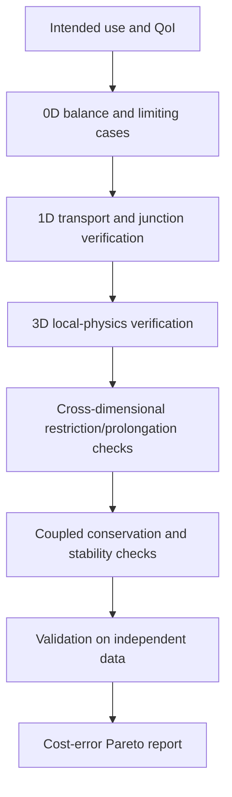



The most detailed model is not always the best model.
Computation far more expensive than the information a decision needs obstructs exploration, uncertainty propagation, and optimization, while seemingly detailed input assumptions can actually increase non-identifiability.

A good modeling strategy builds a **hierarchy connecting multiple fidelities with different purposes** rather than one enormous model.

## 1. Fidelity does not mean dimension alone

Model fidelity mixes the following dimensions.

- Spatial dimension and mesh resolution
- Time scale and integration detail
- Detail of physical terms and closures
- Level of geometric representation
- Complexity of constitutive laws
- Deterministic or stochastic representation
- Computational tolerances and solver accuracy
- Training range of a data-driven surrogate

A model is therefore not automatically high-fidelity merely because it is 3D.
For a particular QoI, a coarse 3D model can have greater error than a well-validated 1D model.

## 2. The information structures of 0D, 1D, and 3D models

### 0D lumped model

A 0D model averages spatial distributions and represents stored quantities and connectivity with ODEs or algebraic equations.

$$
\frac{d\mathbf x}{dt}=f(\mathbf x,\mathbf u,\boldsymbol\theta),
\qquad
\mathbf y=g(\mathbf x,\mathbf u,\boldsymbol\theta).
$$

Its advantages are fast parameter sweeps, control design, and online estimation.
Its limitation is that it cannot directly represent spatial gradients or local hotspots.

### 1D distributed model

A 1D model transports cross-sectional averages along the main path through conservation laws.

$$
\frac{\partial \mathbf U}{\partial t}
+\frac{\partial \mathbf F(\mathbf U)}{\partial x}
=\mathbf S(\mathbf U,x,t).
$$

It can handle network topology and wave propagation at relatively low cost.
Cross-sectional closures and junction conditions become central sources of error.

### 3D field model

A 3D model resolves spatially varying fields with PDEs.
It can reveal local separation, complex geometry, and multidimensional transport, but mesh, boundary, closure, and solver errors may grow.

## 3. Design the model hierarchy backward from the QoI

Model selection begins not with “Which tools do we own?” but with the following questions.

1. What decision must be made?
2. Which QoI informs that decision?
3. What spatial, temporal, and probabilistic resolution is required?
4. What total error and latency are acceptable?
5. Which inputs are actually identifiable?

Defining fidelity with respect to the QoI instead of the entire field reduces unnecessary detail.

## 4. Reduction creates closures

When a 3D equation is cross-sectionally averaged into 1D, the transverse information that disappears remains as closure terms.
For example, defining the average over a cross section (A) as

$$
\bar q(x,t)=\frac{1}{A(x)}\int_{A(x)}q(x,\mathbf r,t)\,dA
$$

generally gives, for a nonlinear term,

$$
\overline{q_1q_2}\ne\bar q_1\bar q_2
$$

Closures such as correction factors, friction laws, and heat-transfer coefficients are therefore necessary.

Without recording a closure's calibration domain, the extrapolation risk of the reduced model is unknown.

## 5. One-way and two-way coupling

### One-way coupling

The upstream model's output flows into the downstream model as input, with no feedback.

$$
\mathbf y_A \rightarrow \mathbf u_B.
$$

This is simple and stable when feedback is weak or the purpose is offline refinement.
But it creates bias if changes in B have a meaningful effect on A.

### Two-way coupling

The two models iteratively exchange interface variables.

$$
\mathbf y_A=F_A(\mathbf y_B),
\qquad
\mathbf y_B=F_B(\mathbf y_A).
$$

Strongly coupled problems require fixed-point or Newton iterations within a single time window.

## 6. What to conserve at the interface

At a coupling boundary, consistency of **flux and work** may matter more than the variable values themselves.

There are two common types of interface condition.

$$
\text{state continuity}:\quad q_A=q_B,
$$

$$
\text{flux balance}:\quad
F_A\cdot n_A+F_B\cdot n_B=0.
$$

Connecting models of different dimensions requires mappings among face averages, point values, and modal coefficients.
The projection operator affects conservation, stability, and adjoint consistency.

## 7. Partitioned coupling and stability

A partitioned scheme makes it easy to reuse existing solvers but can be unstable under added-mass effects or strong stiffness.

Sequential explicit coupling exchanges data once, as in

$$
x_A^{n+1}=F_A(x_A^n,x_B^n),
$$

$$
x_B^{n+1}=F_B(x_B^n,x_A^{n+1})
$$

Implicit coupling iterates the interface residual

$$
r_I(z)=z-G(z)
$$

to tolerance.
Relaxation, Aitken acceleration, and quasi-Newton interface methods can be used.

## 8. Coupling different time scales

Each model has a different stable and accurate time step.

- Subcycling: Integrate the fast model several times within one macro step
- Extrapolation: Predict an interface state that is not yet available
- Interpolation: Connect stored communication points
- Waveform relaxation: Iteratively exchange the entire trajectory over a time window

Even when temporal interpolation is high-order, coupling lag can limit the overall order.
Evaluate coupling error separately from each solver's local error.

## 9. Reduced-order models

The SVD of the snapshot matrix (X) is

$$
X=U\Sigma V^T
$$

and the first (r) modes can be used as the basis (Phi).

$$
x\approx\Phi a.
$$

Galerkin projection reduces the dimension by solving

$$
\Phi^T R(\Phi a)=0
$$

However, if evaluating a nonlinear term still requires the full dimension, hyper-reduction is needed.

The risk of a ROM is that its basis cannot represent structures required outside the training snapshots.
Residual indicators and out-of-domain detectors are important.

## 10. Multifidelity surrogates

Rather than simply mixing a low-fidelity model (f_L(x)) and a high-fidelity model (f_H(x)), model their correlation structure.

An autoregressive form can be written as

$$
f_H(x)=\rho f_L(x)+\delta(x)
$$

Here, (delta) is the discrepancy representing the difference between fidelities.

This model relies on low fidelity being sufficiently correlated with high fidelity and the discrepancy being learnable.
Its benefit may disappear if the bias structure is discontinuous or changes by regime.

## 11. Sample allocation

A multifidelity design considers computational cost (c_ell), variance, and cross-correlation together.
Using more low-fidelity samples under the same budget is not always optimal.

High-fidelity points can be placed first in locations where:

- Large low/high disagreement is expected
- The QoI gradient is large
- A constraint boundary is nearby
- Posterior mass is high
- Surrogate uncertainty is high

It is also preferable to define the selection rule in advance without looking at the validation set.

## 12. Hierarchical verification strategy

A lower-fidelity model need not be a miniature version of the higher-fidelity model.
Independent models with different failure modes may offer greater cross-checking value.

## 13. Recommended workflow

1. Tabulate the inputs, states, outputs, and assumptions for each fidelity.
2. Check whether identically named variables mean the same physical quantity and averaging operator.
3. Specify the restriction and prolongation operators.
4. Automatically test interface conservation and units.
5. Verify each uncoupled solver before adding coupling.
6. Start with weak coupling and gradually increase feedback strength.
7. Refine space, time, and coupling iterations separately.
8. Report wall time, memory, and latency alongside accuracy.

## 14. Verification checklist

- [ ] The intended use and excluded scope of each fidelity were recorded.
- [ ] The QoI definition and averaging operator are the same across fidelities.
- [ ] State continuity and flux balance at interfaces were checked.
- [ ] Unit, sign, and coordinate-frame transformations were tested.
- [ ] Sensitivity to the communication time step was evaluated.
- [ ] The coupling-iteration tolerance is smaller than the discretization error.
- [ ] The magnitude of feedback under the one-way assumption was quantified.
- [ ] ROM projection error and dynamics error were separated.
- [ ] Inputs outside the surrogate training domain are detected.
- [ ] High-fidelity validation points were separated from training.
- [ ] Cost and error for each fidelity were compared on the same QoI.
- [ ] Global conservation of the coupled model was audited.

## 15. Common failure patterns and limitations

### Assuming higher dimension is closer to truth

If input, closure, and boundary uncertainties are large, a detailed mesh cannot remove bias.

### Matching only values at the interface

Even if state is continuous, discontinuous flux can artificially create conserved quantities.

### Checking only convergence of each solver

Even when every subsystem residual is small, the interface residual and global imbalance may be large.

### Adding unlimited low-fidelity samples

In regions with low correlation or large systematic discrepancy, doing so may only reinforce bias.

### Evaluating a ROM only as an interpolation tool

Closed-loop stability, long-term integration drift, conservation, and out-of-domain behavior must also be examined.

## 16. Official and primary references

- Kennedy and O’Hagan, “Predicting the Output from a Complex Computer Code When Fast Approximations Are Available,” *Biometrika*, 2000.
- Peherstorfer, Willcox, Gunzburger, “Survey of Multifidelity Methods in Uncertainty Propagation,” *SIAM Review*, 2018.
- Benner, Gugercin, Willcox, “A Survey of Projection-Based Model Reduction Methods,” *SIAM Review*, 2015.
- Modelica Association, [Functional Mock-up Interface specification](https://fmi-standard.org/).
- NASA, [OpenMDAO multidisciplinary design framework](https://openmdao.org/).

The goal of a model hierarchy is not to run the highest fidelity once.
It is to **repeatedly produce the required evidence at the required cost while exposing differences among fidelities in the error budget**.
