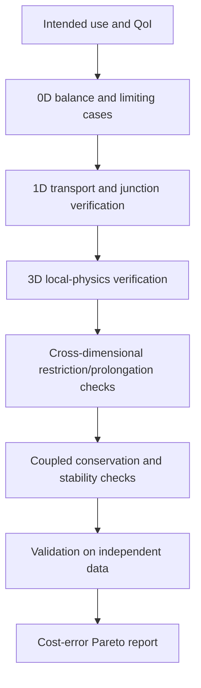



El modelo más detallado no siempre es el mejor modelo.
La computación, mucho más costosa que la información que necesita una decisión, obstruye la exploración, la propagación de la incertidumbre y la optimización, mientras que los supuestos de entrada aparentemente detallados pueden en realidad aumentar la no identificabilidad.

Una buena estrategia de modelado construye una **jerarquía que conecta múltiples fidelidades con diferentes propósitos** en lugar de un modelo enorme.

## 1. La fidelidad no significa solo dimensión

La fidelidad del modelo combina las siguientes dimensiones.

- Dimensión espacial y resolución de malla.
- Escala de tiempo y detalle de integración.
- Detalle de plazos físicos y cierres.
- Nivel de representación geométrica.
- Complejidad de las leyes constitutivas
- Representación determinista o estocástica
- Tolerancias computacionales y precisión del solucionador.
- Rango de formación de una madre sustituta basada en datos

Por lo tanto, un modelo no es automáticamente de alta fidelidad simplemente porque sea 3D.
Para una QoI particular, un modelo 3D aproximado puede tener un error mayor que un modelo 1D bien validado.

## 2. Las estructuras de información de los modelos 0D, 1D y 3D.

### Modelo agrupado 0D

Un modelo 0D promedia distribuciones espaciales y representa cantidades almacenadas y conectividad con EDO o ecuaciones algebraicas.

$$
\frac{d\mathbf x}{dt}=f(\mathbf x,\mathbf u,\boldsymbol\theta),
\qquad
\mathbf y=g(\mathbf x,\mathbf u,\boldsymbol\theta).
$$

Sus ventajas son barridos rápidos de parámetros, diseño de control y estimación en línea.
Su limitación es que no puede representar directamente gradientes espaciales o puntos críticos locales.

### Modelo distribuido 1D

Un modelo 1D transporta promedios transversales a lo largo del camino principal a través de leyes de conservación.

$$
\frac{\partial \mathbf U}{\partial t}
+\frac{\partial \mathbf F(\mathbf U)}{\partial x}
=\mathbf S(\mathbf U,x,t).
$$

Puede manejar la topología de la red y la propagación de ondas a un costo relativamente bajo.
Los cierres de secciones transversales y las condiciones de los cruces se convierten en fuentes centrales de error.

### modelo de campo 3D

Un modelo 3D resuelve campos que varían espacialmente con PDE.
Puede revelar separación local, geometría compleja y transporte multidimensional, pero los errores de malla, límites, cierre y resolución pueden aumentar.

## 3. Diseñe la jerarquía del modelo hacia atrás desde la QoI

La selección del modelo no comienza con "¿Qué herramientas poseemos?" pero con las siguientes preguntas.

1. ¿Qué decisión se debe tomar?
2. ¿Qué QoI informa esa decisión?
3. ¿Qué resolución espacial, temporal y probabilística se requiere?
4. ¿Qué error total y latencia son aceptables?
5. ¿Qué insumos son realmente identificables?

Definir la fidelidad con respecto a la QoI en lugar de todo el campo reduce los detalles innecesarios.

## 4. La reducción crea cierres

Cuando una ecuación 3D se promedia transversalmente en 1D, la información transversal que desaparece permanece como términos de cierre.
Por ejemplo, definir el promedio sobre una sección transversal (A) como

$$
\bar q(x,t)=\frac{1}{A(x)}\int_{A(x)}q(x,\mathbf r,t)\,dA
$$

generalmente da, para un término no lineal,

$$
\overline{q_1q_2}\ne\bar q_1\bar q_2
$$

Por tanto, son necesarios cierres como factores de corrección, leyes de fricción y coeficientes de transferencia de calor.

Sin registrar el dominio de calibración de un cierre, se desconoce el riesgo de extrapolación del modelo reducido.

## 5. Acoplamiento unidireccional y bidireccional

### Acoplamiento unidireccional

La salida del modelo ascendente fluye hacia el modelo descendente como entrada, sin retroalimentación.

$$
\mathbf y_A \rightarrow \mathbf u_B.
$$

Esto es simple y estable cuando la retroalimentación es débil o el propósito es el refinamiento fuera de línea.
Pero crea un sesgo si los cambios en B tienen un efecto significativo en A.

### Acoplamiento bidireccional

Los dos modelos intercambian variables de interfaz de forma iterativa.

$$
\mathbf y_A=F_A(\mathbf y_B),
\qquad
\mathbf y_B=F_B(\mathbf y_A).
$$

Los problemas fuertemente acoplados requieren iteraciones de punto fijo o de Newton dentro de una única ventana de tiempo.

## 6. Qué conservar en la interfaz

En un límite de acoplamiento, la coherencia del **flujo y el trabajo** puede importar más que los valores de las variables en sí.

Hay dos tipos comunes de condición de interfaz.

$$
\text{state continuity}:\quad q_A=q_B,
$$

$$
\text{flux balance}:\quad
F_A\cdot n_A+F_B\cdot n_B=0.
$$

Conectar modelos de diferentes dimensiones requiere mapeos entre promedios faciales, valores de puntos y coeficientes modales.
El operador de proyección afecta la conservación, la estabilidad y la consistencia adjunta.

## 7. Acoplamiento particionado y estabilidad.

Un esquema particionado facilita la reutilización de los solucionadores existentes, pero puede ser inestable bajo efectos de masa agregada o una rigidez fuerte.

El acoplamiento explícito secuencial intercambia datos una vez, como en

$$
x_A^{n+1}=F_A(x_A^n,x_B^n),
$$

$$
x_B^{n+1}=F_B(x_B^n,x_A^{n+1})
$$

El acoplamiento implícito itera el residuo de la interfaz.

$$
r_I(z)=z-G(z)
$$

a la tolerancia.
Se pueden utilizar métodos de relajación, aceleración de Aitken y interfaz cuasi-Newton.

## 8. Acoplamiento de diferentes escalas de tiempo

Cada modelo tiene un paso de tiempo estable y preciso diferente.

- Subciclismo: integre el modelo rápido varias veces en un macro paso
- Extrapolación: predice un estado de interfaz que aún no está disponible
- Interpolación: conecta puntos de comunicación almacenados
- Relajación de forma de onda: intercambia iterativamente toda la trayectoria durante una ventana de tiempo

Incluso cuando la interpolación temporal es de alto orden, el retraso del acoplamiento puede limitar el orden general.
Evalúe el error de acoplamiento por separado del error local de cada solucionador.

## 9. Modelos de orden reducido

El SVD de la matriz de instantáneas (X) es

$$
X=U\Sigma V^T
$$

y los primeros modos (r) se pueden utilizar como base (Phi).

$$
x\approx\Phi a.
$$

La proyección de Galerkin reduce la dimensión resolviendo

$$
\Phi^T R(\Phi a)=0
$$

Sin embargo, si la evaluación de un término no lineal aún requiere la dimensión completa, se necesita una hiperreducción.

El riesgo de un ROM es que su base no puede representar las estructuras requeridas fuera de las instantáneas de entrenamiento.
Los indicadores residuales y los detectores fuera de dominio son importantes.

## 10. Representantes de multifidelidad

En lugar de simplemente mezclar un modelo de baja fidelidad (f_L(x)) y un modelo de alta fidelidad (f_H(x)), modele su estructura de correlación.

Una forma autorregresiva se puede escribir como

$$
f_H(x)=\rho f_L(x)+\delta(x)
$$

Aquí, (delta) es la discrepancia que representa la diferencia entre fidelidades.

Este modelo se basa en que la baja fidelidad esté suficientemente correlacionada con la alta fidelidad y que la discrepancia se pueda aprender.
Su beneficio puede desaparecer si la estructura del sesgo es discontinua o cambia según el régimen.

## 11. Asignación de muestras

Un diseño de multifidelidad considera el costo computacional (c_ell), la varianza y la correlación cruzada juntos.
Usar más muestras de baja fidelidad con el mismo presupuesto no siempre es óptimo.

Los puntos de alta fidelidad se pueden colocar primero en lugares donde:

- Se espera un gran desacuerdo bajo/alto
- El gradiente QoI es grande.
- Hay un límite de restricción cerca
- La masa posterior es alta.
- La incertidumbre sobre la madre sustituta es alta

También es preferible definir la regla de selección de antemano sin mirar el conjunto de validación.

## 12. Estrategia de verificación jerárquica

Un modelo de menor fidelidad no tiene por qué ser una versión en miniatura del modelo de mayor fidelidad.
Los modelos independientes con diferentes modos de falla pueden ofrecer un mayor valor de verificación cruzada.

## 13. Flujo de trabajo recomendado

1. Tabule los insumos, estados, resultados y supuestos para cada fidelidad.
2. Compruebe si variables con nombres idénticos significan la misma cantidad física y operador promediador.
3. Especifique los operadores de restricción y prolongación.
4. Pruebe automáticamente la conservación y las unidades de la interfaz.
5. Verifique cada solucionador desacoplado antes de agregar el acoplamiento.
6. Comience con un acoplamiento débil y aumente gradualmente la fuerza de la retroalimentación.
7. Refinar las iteraciones de espacio, tiempo y acoplamiento por separado.
8. Informe el tiempo de pared, la memoria y la latencia junto con la precisión.

## 14. Lista de verificación de verificación

- [ ] Se registró el uso previsto y alcance excluido de cada fidelidad.
- [] La definición de QoI y el operador de promedio son los mismos en todas las fidelidades.
- [ ] Se verificó la continuidad del estado y el equilibrio de flujo en las interfaces.
- [ ] Se probaron transformaciones de unidades, signos y marcos de coordenadas.
- [ ] Se evaluó la sensibilidad al paso del tiempo de comunicación.
- [ ] La tolerancia de iteración de acoplamiento es menor que el error de discretización.
- [ ] Se cuantificó la magnitud de la retroalimentación bajo el supuesto unidireccional.
- [ ] ROM se separaron el error de proyección y el error de dinámica.
- [] Se detectan entradas fuera del dominio de entrenamiento sustituto.
- [] Los puntos de validación de alta fidelidad se separaron del entrenamiento.
- [ ] Se compararon el costo y el error de cada fidelidad en el mismo QoI.
- [ ] Se auditó la conservación global del modelo acoplado.

## 15. Patrones de falla comunes y limitaciones

### Asumir una dimensión superior está más cerca de la verdad.

Si las incertidumbres de entrada, cierre y límites son grandes, una malla detallada no puede eliminar el sesgo.

### Coincidencia únicamente de valores en la interfaz

Incluso si el estado es continuo, el flujo discontinuo puede crear artificialmente cantidades conservadas.

### Comprobando solo la convergencia de cada solucionador

Incluso cuando el residuo de cada subsistema es pequeño, el residuo de la interfaz y el desequilibrio global pueden ser grandes.

### Agregar muestras ilimitadas de baja fidelidad

En regiones con baja correlación o gran discrepancia sistemática, hacerlo sólo puede reforzar el sesgo.

### Evaluar un ROM solo como herramienta de interpolación

También deben examinarse la estabilidad de circuito cerrado, la deriva de la integración a largo plazo, la conservación y el comportamiento fuera de dominio.

## 16. Referencias oficiales y primarias.

- Kennedy y O'Hagan, "Predicción del resultado de un código informático complejo cuando hay aproximaciones rápidas disponibles", *Biometrika*, 2000.
- Peherstorfer, Willcox, Gunzburger, “Encuesta de métodos de multifidelidad en la propagación de la incertidumbre”, *SIAM Review*, 2018.
- Benner, Gugercin, Willcox, “Una encuesta sobre métodos de reducción de modelos basados en proyecciones”, *SIAM Review*, 2015.
- Asociación Modelica, [Especificación de interfaz de maqueta funcional](https://fmi-standard.org/).
- NASA, [marco de diseño multidisciplinario OpenMDAO](https://openmdao.org/).

El objetivo de una jerarquía de modelos no es ejecutar la máxima fidelidad una vez.
Se trata de **producir repetidamente la evidencia requerida al costo requerido y al mismo tiempo exponer las diferencias entre las fidelidades en el presupuesto de error**.
