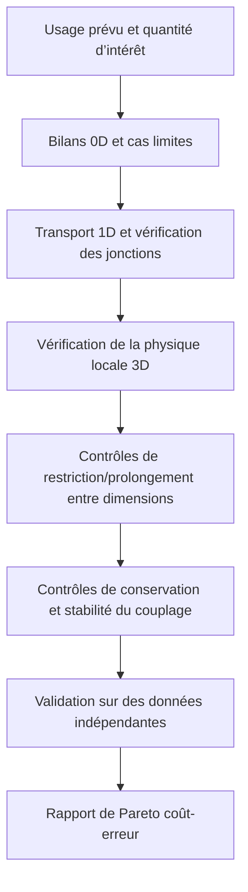



Le modèle le plus détaillé n’est pas toujours le meilleur.
Un calcul bien plus coûteux que l’information nécessaire à une décision entrave l’exploration, la propagation des incertitudes et l’optimisation, tandis que des hypothèses d’entrée apparemment détaillées peuvent en réalité accroître la non-identifiabilité.

Une bonne stratégie de modélisation construit une **hiérarchie reliant plusieurs fidélités aux objectifs différents**, plutôt qu’un seul modèle gigantesque.

## 1. La fidélité ne se réduit pas à la dimension

La fidélité d’un modèle mêle les dimensions suivantes.

- Dimension spatiale et résolution du maillage
- Échelle temporelle et détail de l’intégration
- Détail des termes physiques et des fermetures
- Niveau de représentation géométrique
- Complexité des lois de comportement
- Représentation déterministe ou stochastique
- Tolérances de calcul et précision du solveur
- Domaine d’entraînement d’un substitut fondé sur les données

Un modèle n’est donc pas automatiquement de haute fidélité sous le seul prétexte qu’il est tridimensionnel.
Pour une quantité d’intérêt donnée, un modèle 3D grossier peut présenter plus d’erreur qu’un modèle 1D correctement validé.

## 2. Structures d’information des modèles 0D, 1D et 3D

### Modèle 0D à paramètres concentrés

Un modèle 0D moyenne les distributions spatiales et représente les quantités stockées et les connexions par des EDO ou des équations algébriques.

$$
\frac{d\mathbf x}{dt}=f(\mathbf x,\mathbf u,\boldsymbol\theta),
\qquad
\mathbf y=g(\mathbf x,\mathbf u,\boldsymbol\theta).
$$

Ses avantages résident dans les balayages rapides de paramètres, la conception de commandes et l’estimation en ligne.
Sa limite tient à son incapacité à représenter directement les gradients spatiaux ou les points chauds locaux.

### Modèle 1D distribué

Un modèle 1D transporte les moyennes de section le long du trajet principal au moyen de lois de conservation.

$$
\frac{\partial \mathbf U}{\partial t}
+\frac{\partial \mathbf F(\mathbf U)}{\partial x}
=\mathbf S(\mathbf U,x,t).
$$

Il peut traiter la topologie d’un réseau et la propagation des ondes pour un coût relativement faible.
Les fermetures transversales et les conditions aux jonctions deviennent les principales sources d’erreur.

### Modèle de champ 3D

Un modèle 3D résout des champs variables dans l’espace à l’aide d’EDP.
Il peut révéler les séparations locales, les géométries complexes et le transport multidimensionnel, mais les erreurs de maillage, de frontière, de fermeture et de solveur peuvent s’amplifier.

## 3. Concevoir la hiérarchie à rebours depuis la quantité d’intérêt

Le choix du modèle ne commence pas par « De quels outils disposons-nous ? », mais par les questions suivantes.

1. Quelle décision faut-il prendre ?
2. Quelle quantité d’intérêt éclaire cette décision ?
3. Quelle résolution spatiale, temporelle et probabiliste est requise ?
4. Quelle erreur totale et quelle latence sont acceptables ?
5. Quelles entrées sont réellement identifiables ?

Définir la fidélité relativement à la quantité d’intérêt, plutôt qu’à l’ensemble du champ, réduit les détails inutiles.

## 4. La réduction crée des fermetures

Lorsqu’une équation 3D est moyennée sur une section pour devenir 1D, l’information transversale disparue subsiste sous forme de termes de fermeture.
Par exemple, en définissant la moyenne sur une section (A) par

$$
\bar q(x,t)=\frac{1}{A(x)}\int_{A(x)}q(x,\mathbf r,t)\,dA
$$

on obtient généralement, pour un terme non linéaire,

$$
\overline{q_1q_2}\ne\bar q_1\bar q_2
$$

Des fermetures telles que facteurs de correction, lois de frottement et coefficients de transfert thermique sont donc nécessaires.

Sans consignation du domaine d’étalonnage d’une fermeture, le risque d’extrapolation du modèle réduit reste inconnu.

## 5. Couplage unidirectionnel et bidirectionnel

### Couplage unidirectionnel

La sortie du modèle amont devient l’entrée du modèle aval, sans rétroaction.

$$
\mathbf y_A \rightarrow \mathbf u_B.
$$

Cette approche est simple et stable lorsque la rétroaction est faible ou que l’objectif est un raffinement hors ligne.
Elle crée toutefois un biais si les changements dans B influent sensiblement sur A.

### Couplage bidirectionnel

Les deux modèles échangent itérativement les variables d’interface.

$$
\mathbf y_A=F_A(\mathbf y_B),
\qquad
\mathbf y_B=F_B(\mathbf y_A).
$$

Les problèmes fortement couplés nécessitent des itérations de point fixe ou de Newton au sein d’une même fenêtre temporelle.

## 6. Que conserver à l’interface

À une frontière de couplage, la cohérence du **flux et du travail** peut être plus importante que celle des valeurs des variables elles-mêmes.

Deux types de conditions d’interface sont fréquents.

$$
\text{state continuity}:\quad q_A=q_B,
$$

$$
\text{flux balance}:\quad
F_A\cdot n_A+F_B\cdot n_B=0.
$$

Relier des modèles de dimensions différentes requiert des transformations entre moyennes de face, valeurs ponctuelles et coefficients modaux.
L’opérateur de projection influe sur la conservation, la stabilité et la cohérence adjointe.

## 7. Couplage partitionné et stabilité

Un schéma partitionné facilite la réutilisation des solveurs existants, mais peut devenir instable en présence d’effets de masse ajoutée ou de forte rigidité.

Un couplage explicite séquentiel échange les données une seule fois, comme dans

$$
x_A^{n+1}=F_A(x_A^n,x_B^n),
$$

$$
x_B^{n+1}=F_B(x_B^n,x_A^{n+1})
$$

Le couplage implicite itère sur le résidu d’interface

$$
r_I(z)=z-G(z)
$$

jusqu’à la tolérance choisie.
On peut utiliser la relaxation, l’accélération d’Aitken ou des méthodes quasi-Newton à l’interface.

## 8. Coupler des échelles de temps différentes

Chaque modèle possède un pas de temps stable et précis qui lui est propre.

- Sous-cyclage : intégrer le modèle rapide plusieurs fois pendant un même macropas
- Extrapolation : prédire un état d’interface qui n’est pas encore disponible
- Interpolation : relier les points de communication enregistrés
- Relaxation par formes d’onde : échanger itérativement toute la trajectoire sur une fenêtre temporelle

Même lorsque l’interpolation temporelle est d’ordre élevé, le retard de couplage peut limiter l’ordre global.
Évaluez l’erreur de couplage séparément de l’erreur locale de chaque solveur.

## 9. Modèles d’ordre réduit

La SVD de la matrice d’instantanés (X) est

$$
X=U\Sigma V^T
$$

et les (r) premiers modes peuvent servir de base (Phi).

$$
x\approx\Phi a.
$$

La projection de Galerkin réduit la dimension en résolvant

$$
\Phi^T R(\Phi a)=0
$$

Toutefois, si l’évaluation d’un terme non linéaire exige encore la dimension complète, une hyperréduction est nécessaire.

Le risque d’un modèle d’ordre réduit est que sa base ne puisse représenter les structures requises hors des instantanés d’entraînement.
Les indicateurs résiduels et détecteurs de sortie de domaine sont importants.

## 10. Modèles substituts multifidélité

Plutôt que de simplement mélanger un modèle de basse fidélité (f_L(x)) et un modèle de haute fidélité (f_H(x)), modélisez leur structure de corrélation.

Une forme autorégressive s’écrit

$$
f_H(x)=\rho f_L(x)+\delta(x)
$$

Ici, (delta) représente l’écart entre les fidélités.

Ce modèle suppose que la basse fidélité est suffisamment corrélée à la haute fidélité et que l’écart est apprenable.
Son bénéfice peut disparaître si la structure du biais est discontinue ou change selon le régime.

## 11. Allocation des échantillons

Un plan multifidélité considère simultanément le coût de calcul (c_ell), la variance et la corrélation croisée.
Utiliser davantage d’échantillons de basse fidélité à budget égal n’est pas toujours optimal.

Les points de haute fidélité peuvent être placés en priorité là où :

- un fort désaccord entre basse et haute fidélité est attendu ;
- le gradient de la quantité d’intérêt est grand ;
- une frontière de contrainte est proche ;
- la masse a posteriori est élevée ;
- l’incertitude du substitut est grande.

Il est aussi préférable de définir la règle de sélection à l’avance, sans regarder le jeu de validation.

## 12. Stratégie de vérification hiérarchique

Un modèle de fidélité inférieure n’a pas besoin d’être une version miniature du modèle de fidélité supérieure.
Des modèles indépendants aux modes de défaillance différents peuvent offrir une meilleure capacité de vérification croisée.

## 13. Flux de travail recommandé

1. Présenter dans un tableau les entrées, états, sorties et hypothèses de chaque fidélité.
2. Vérifier si des variables de même nom désignent la même grandeur physique et le même opérateur de moyenne.
3. Préciser les opérateurs de restriction et de prolongement.
4. Tester automatiquement la conservation et les unités aux interfaces.
5. Vérifier chaque solveur non couplé avant d’ajouter le couplage.
6. Commencer par un couplage faible puis augmenter progressivement la force de rétroaction.
7. Raffiner séparément l’espace, le temps et les itérations de couplage.
8. Rapporter le temps réel, la mémoire et la latence avec la précision.

## 14. Liste de vérification

- [ ] L’usage prévu et le périmètre exclu de chaque fidélité ont été consignés.
- [ ] La définition de la quantité d’intérêt et l’opérateur de moyenne sont identiques entre fidélités.
- [ ] La continuité des états et l’équilibre des flux aux interfaces ont été vérifiés.
- [ ] Les transformations d’unités, de signes et de repères ont été testées.
- [ ] La sensibilité au pas de temps de communication a été évaluée.
- [ ] La tolérance des itérations de couplage est inférieure à l’erreur de discrétisation.
- [ ] L’amplitude de la rétroaction sous l’hypothèse unidirectionnelle a été quantifiée.
- [ ] L’erreur de projection et l’erreur dynamique du modèle d’ordre réduit ont été séparées.
- [ ] Les entrées hors du domaine d’entraînement du substitut sont détectées.
- [ ] Les points de validation à haute fidélité ont été séparés de l’entraînement.
- [ ] Le coût et l’erreur de chaque fidélité ont été comparés sur la même quantité d’intérêt.
- [ ] La conservation globale du modèle couplé a été auditée.

## 15. Schémas d’échec courants et limites

### Supposer qu’une dimension supérieure est plus proche de la vérité

Si les incertitudes sur les entrées, les fermetures et les frontières sont grandes, un maillage détaillé ne peut supprimer le biais.

### Faire seulement coïncider les valeurs à l’interface

Même si l’état est continu, un flux discontinu peut créer artificiellement des quantités conservées.

### Ne vérifier que la convergence de chaque solveur

Même si le résidu de chaque sous-système est faible, le résidu d’interface et le déséquilibre global peuvent rester importants.

### Ajouter sans limite des échantillons de basse fidélité

Dans les régions de faible corrélation ou d’écart systématique important, cela peut simplement renforcer le biais.

### Évaluer un modèle d’ordre réduit uniquement comme outil d’interpolation

Il faut aussi examiner la stabilité en boucle fermée, la dérive d’intégration à long terme, la conservation et le comportement hors domaine.

## 16. Références officielles et primaires

- Kennedy and O’Hagan, “Predicting the Output from a Complex Computer Code When Fast Approximations Are Available,” *Biometrika*, 2000.
- Peherstorfer, Willcox, Gunzburger, “Survey of Multifidelity Methods in Uncertainty Propagation,” *SIAM Review*, 2018.
- Benner, Gugercin, Willcox, “A Survey of Projection-Based Model Reduction Methods,” *SIAM Review*, 2015.
- Modelica Association, [spécification Functional Mock-up Interface](https://fmi-standard.org/).
- NASA, [cadre de conception multidisciplinaire OpenMDAO](https://openmdao.org/).

L’objectif d’une hiérarchie de modèles n’est pas d’exécuter une fois la fidélité la plus élevée.
Il consiste à **produire de manière répétée les preuves requises au coût requis, tout en exposant les écarts entre fidélités dans le budget d’erreur**.
