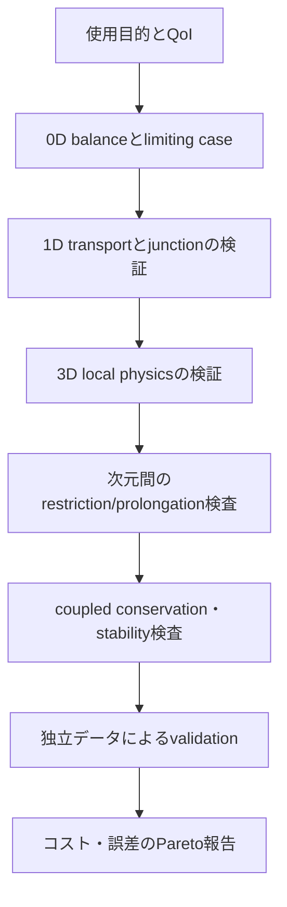



最も詳細なモデルが、常に最良のモデルとは限らない。
意思決定に必要な情報に比べてはるかに高価な計算は、探索・不確実性伝播・最適化を妨げる。また、詳細に見える入力仮定は、かえって識別不能性を高めることがある。

優れたモデリング戦略は、一つの巨大なモデルではなく、**目的の異なる複数のfidelityを接続した階層**を構築する。

## 1. fidelityは次元だけを意味しない

モデル忠実度は、次の軸が組み合わさった概念である。

- 空間次元と格子解像度
- 時間scaleとintegration detail
- 物理項とclosureの詳細度
- 形状表現の水準
- constitutive lawの複雑さ
- deterministicまたはstochasticな表現
- 計算tolerancesとsolver accuracy
- データ駆動surrogateの学習範囲

したがって、3Dだからといって必ずhigh-fidelityであるとは限らない。
粗い3Dモデルが、十分に検証された1Dモデルよりも、特定のQoIで大きな誤差を持つこともある。

## 2. 0D、1D、3Dの情報構造

### 0D lumped model

空間分布を平均化し、保存量と接続関係をODEまたはalgebraic equationで表現する。

$$
\frac{d\mathbf x}{dt}=f(\mathbf x,\mathbf u,\boldsymbol\theta),
\qquad
\mathbf y=g(\mathbf x,\mathbf u,\boldsymbol\theta).
$$

利点は、高速なparameter sweep、control design、online estimationである。
限界は、空間gradientと局所hotspotを直接表現できない点にある。

### 1D distributed model

主要な経路に沿って、断面平均量を保存則により輸送する。

$$
\frac{\partial \mathbf U}{\partial t}
+\frac{\partial \mathbf F(\mathbf U)}{\partial x}
=\mathbf S(\mathbf U,x,t).
$$

network topologyとwave propagationを比較的低いコストで扱える。
断面closureとjunction conditionが誤差の中心となる。

### 3D field model

空間的に変化するfieldをPDEで解像する。
局所的な剥離、複雑形状、多次元transportを観察できる一方、mesh・boundary・closure・solver errorが大きくなり得る。

## 3. モデル階層をQoIから逆算して設計する

モデル選択は「どのツールを保有しているか」ではなく、次の問いから始める。

1. どのような意思決定が必要か。
2. その決定に用いるQoIは何か。
3. 必要な空間・時間・確率解像度はどの程度か。
4. 許容できる総誤差とレイテンシはどの程度か。
5. どの入力が実際に識別可能か。

field全体ではなくQoIに対してfidelityを定義すれば、不要な詳細化を減らせる。

## 4. reduction過程はclosureを生み出す

3D方程式を断面平均して1Dに縮約すると、失われる横方向の情報がclosure termとして残る。
たとえば、断面 (A) における平均を

$$
\bar q(x,t)=\frac{1}{A(x)}\int_{A(x)}q(x,\mathbf r,t)\,dA
$$

と定義すると、非線形項は一般に

$$
\overline{q_1q_2}\ne\bar q_1\bar q_2
$$

となる。
したがって、correction factor、friction law、heat-transfer coefficientのようなclosureが必要になる。

このclosureのcalibration domainを記録しなければ、reduced modelのextrapolationリスクを把握できない。

## 5. one-wayとtwo-way coupling

### one-way coupling

上位モデルの出力が下位モデルの入力へ流れるが、フィードバックはない。

$$
\mathbf y_A \rightarrow \mathbf u_B.
$$

フィードバックが弱い場合やoffline refinementが目的の場合には、単純で安定している。
しかし、Bの変化がAに意味のある影響を及ぼすなら、バイアスが生じる。

### two-way coupling

二つのモデルがinterface variableを反復して交換する。

$$
\mathbf y_A=F_A(\mathbf y_B),
\qquad
\mathbf y_B=F_B(\mathbf y_A).
$$

強結合問題では、一つのtime window内でfixed-pointまたはNewton iterationを実行する必要がある。

## 6. interfaceで何を保存するか

結合境界では、variableの値よりも**fluxとworkの整合性**が重要な場合がある。

一般的なinterface条件には、次の二種類がある。

$$
\text{state continuity}:\quad q_A=q_B,
$$

$$
\text{flux balance}:\quad
F_A\cdot n_A+F_B\cdot n_B=0.
$$

異なる次元のモデルを接続する場合、面平均、point value、modal coefficient間のmappingが必要になる。
projection operatorは、保存性、安定性、adjoint consistencyに影響する。

## 7. partitioned couplingと安定性

partitioned schemeは既存のsolverを再利用しやすいが、added-mass effectや強いstiffnessに対して不安定になり得る。

逐次explicit couplingでは、

$$
x_A^{n+1}=F_A(x_A^n,x_B^n),
$$

$$
x_B^{n+1}=F_B(x_B^n,x_A^{n+1})
$$

のように一度だけ交換する。
implicit couplingでは、interface residual

$$
r_I(z)=z-G(z)
$$

をtoleranceに達するまで反復する。
relaxation、Aitken acceleration、quasi-Newton interface methodを使用できる。

## 8. 異なるtime scaleを結合する

モデルごとに、安定かつ正確なtime stepは異なる。

- subcycling：高速なモデルを一つのmacro step内で複数回積分
- extrapolation：まだ存在しないinterface stateを予測
- interpolation：保存されたcommunication point間を接続
- waveform relaxation：time window全体のtrajectoryを反復交換

時間補間が高次であっても、coupling lagが全体の次数を制限することがある。
各solverのlocal errorだけでなく、coupling errorも別途評価する。

## 9. reduced-order model

snapshot matrix (X) のSVDを

$$
X=U\Sigma V^T
$$

として求め、先頭の (r) 個のmodeをbasis (Phi) として使用できる。

$$
x\approx\Phi a.
$$

Galerkin projectionでは、

$$
\Phi^T R(\Phi a)=0
$$

を解いて次元を削減する。
ただし、nonlinear termの評価が依然としてfull dimensionであるなら、hyper-reductionが必要になる。

ROMのリスクは、training snapshotの範囲外で、basisが必要な構造を表現できないことである。
residual indicatorとout-of-domain detectorが重要になる。

## 10. マルチフィデリティsurrogate

低忠実度 (f_L(x)) と高忠実度 (f_H(x)) を単純に混ぜるのではなく、相関構造をモデル化する。

autoregressive形式は、

$$
f_H(x)=\rho f_L(x)+\delta(x)
$$

と書ける。
ここで (delta) はfidelityの差を表すdiscrepancyである。

このモデルは、low-fidelityがhigh-fidelityと十分に相関し、discrepancyが学習可能であるという仮定に依存する。
バイアス構造がdiscontinuousであったり、regimeごとに変化したりする場合、その利点は失われる可能性がある。

## 11. sample allocation

マルチフィデリティ設計では、計算コスト (c_ell)、variance、cross-correlationを併せて考える。
同じ予算でlow-fidelity sampleを多く用いることが、常に最適とは限らない。

高忠実度点は、次の位置に優先的に配置できる。

- low/high disagreementが大きいと予想される場所
- QoI gradientが大きい場所
- constraint boundary付近
- posterior massが大きい場所
- surrogate uncertaintyが大きい場所

selection ruleも、validation setを見ずに事前定義しておく方がよい。

## 12. 階層的検証戦略

低いfidelityは、高いfidelityの縮小版である必要はない。
異なる失敗モードを持つ独立したモデルであれば、cross-checkの価値がさらに高い場合もある。

## 13. 推奨ワークフロー

1. fidelityごとの入力・状態・出力・仮定を表にまとめる。
2. 同じ名前の変数が、同じ物理量とaveraging operatorを意味するか確認する。
3. restrictionとprolongation operatorを明示する。
4. interface conservationとunitsを自動テストする。
5. uncoupled solverをそれぞれ検証してからcouplingを追加する。
6. weak couplingから始め、feedback strengthを徐々に高める。
7. space、time、coupling iterationをそれぞれrefineする。
8. accuracyだけでなく、wall time、memory、latencyも併せて報告する。

## 14. 検証チェックリスト

- [ ] 各fidelityのintended useと適用除外範囲を記録した。
- [ ] QoIの定義とaveraging operatorがfidelity間で同一である。
- [ ] interfaceのstate continuityとflux balanceを確認した。
- [ ] unit、sign、coordinate frameの変換をテストした。
- [ ] communication time step sensitivityを評価した。
- [ ] coupling iteration toleranceがdiscretization errorより小さい。
- [ ] one-way assumptionにおけるfeedbackの大きさを定量化した。
- [ ] ROM projection errorとdynamics errorを分離した。
- [ ] surrogate training domainの範囲外を検出する。
- [ ] high-fidelity validation pointをtrainingから分離した。
- [ ] fidelityごとのコストとerrorを同じQoIで比較した。
- [ ] coupled modelのglobal conservationを監査した。

## 15. よくある失敗パターンと限界

### 次元が高ければ真実に近いと仮定する

入力・closure・boundary uncertaintyが大きければ、詳細な格子でもバイアスは減らない。

### interfaceで値だけを合わせる

stateが連続でもfluxが不連続であれば、保存量が人工的に生成される可能性がある。

### 各solverの収束だけを確認する

各subsystem residualが小さくても、interface residualとglobal balanceは大きい場合がある。

### low-fidelity sampleを無制限に追加する

相関が低い領域やsystematic discrepancyが大きい領域では、バイアスを強めるだけになり得る。

### ROMをinterpolationツールとしてのみ評価する

closed-loop安定性、長期integration drift、conservation、out-of-domain behaviorも確認する必要がある。

## 16. 公式資料・原典

- Kennedy and O’Hagan, “Predicting the Output from a Complex Computer Code When Fast Approximations Are Available,” *Biometrika*, 2000.
- Peherstorfer, Willcox, Gunzburger, “Survey of Multifidelity Methods in Uncertainty Propagation,” *SIAM Review*, 2018.
- Benner, Gugercin, Willcox, “A Survey of Projection-Based Model Reduction Methods,” *SIAM Review*, 2015.
- Modelica Association, [Functional Mock-up Interface specification](https://fmi-standard.org/).
- NASA, [OpenMDAO multidisciplinary design framework](https://openmdao.org/).

モデル階層の目的は、最高のfidelityを一度実行することではない。
**必要な根拠を必要なコストで繰り返し生成し、fidelity間の差を誤差予算に明示すること**である。
