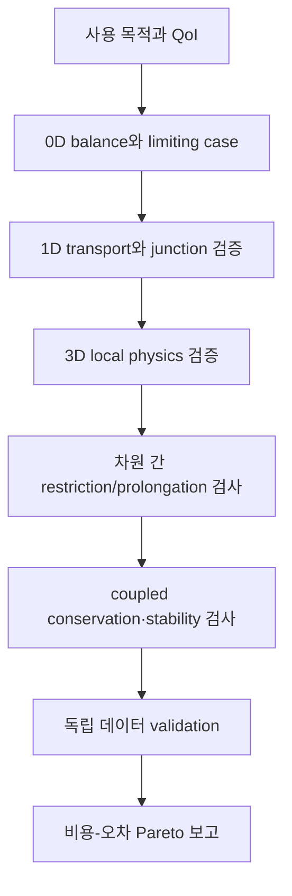



가장 상세한 모델이 항상 가장 좋은 모델은 아니다.
의사결정에 필요한 정보보다 훨씬 비싼 계산은 탐색·불확실성 전파·최적화를 막고, 상세해 보이는 입력 가정은 오히려 식별 불가능성을 키울 수 있다.

좋은 모델링 전략은 하나의 거대한 모델보다 **목적이 다른 여러 fidelity를 연결한 계층**을 만든다.

## 1. fidelity는 차원만을 뜻하지 않는다

모델 충실도는 다음 축이 섞인 개념이다.

- 공간 차원과 격자 해상도
- 시간 scale과 integration detail
- 물리 항과 closure의 상세도
- 형상 표현 수준
- constitutive law의 복잡도
- deterministic 또는 stochastic 표현
- 계산 tolerances와 solver accuracy
- 데이터 기반 surrogate의 학습 범위

따라서 3D라고 무조건 high-fidelity가 아니다.
거친 3D 모델이 잘 검증된 1D 모델보다 특정 QoI에서 더 큰 오차를 가질 수 있다.

## 2. 0D, 1D, 3D의 정보 구조

### 0D lumped model

공간 분포를 평균화하고 저장량과 연결관계를 ODE 또는 algebraic equation으로 표현한다.

$$
\frac{d\mathbf x}{dt}=f(\mathbf x,\mathbf u,\boldsymbol\theta),
\qquad
\mathbf y=g(\mathbf x,\mathbf u,\boldsymbol\theta).
$$

장점은 빠른 parameter sweep, control design, online estimation이다.
한계는 공간 gradient와 국소 hotspot을 직접 표현하지 못한다는 점이다.

### 1D distributed model

주된 경로를 따라 평균 단면량을 보존식으로 운반한다.

$$
\frac{\partial \mathbf U}{\partial t}
+\frac{\partial \mathbf F(\mathbf U)}{\partial x}
=\mathbf S(\mathbf U,x,t).
$$

network topology와 wave propagation을 비교적 낮은 비용으로 다룰 수 있다.
단면 closure와 junction condition이 오차의 핵심이 된다.

### 3D field model

공간적으로 변하는 field를 PDE로 해상한다.
국소 분리, 복잡 형상, 다차원 transport를 볼 수 있지만 mesh·boundary·closure·solver error가 커질 수 있다.

## 3. 모델 계층을 QoI에서 거꾸로 설계한다

모델 선택은 “어떤 도구를 보유했는가”가 아니라 다음 질문에서 시작한다.

1. 어떤 의사결정이 필요한가?
2. 그 결정에 쓰이는 QoI는 무엇인가?
3. 필요한 공간·시간·확률 해상도는 얼마인가?
4. 허용 가능한 총 오차와 지연시간은 무엇인가?
5. 어느 입력이 실제로 식별 가능한가?

field 전체가 아니라 QoI에 대한 fidelity를 정의하면 불필요한 상세화를 줄일 수 있다.

## 4. reduction 과정은 closure를 만든다

3D 방정식을 단면 평균해 1D로 줄이면 사라지는 횡방향 정보가 closure term으로 남는다.
예를 들어 단면 (A)에서 평균을

$$
\bar q(x,t)=\frac{1}{A(x)}\int_{A(x)}q(x,\mathbf r,t)\,dA
$$

로 정의하면 비선형 항은 일반적으로

$$
\overline{q_1q_2}\ne\bar q_1\bar q_2
$$

이다.
따라서 correction factor, friction law, heat-transfer coefficient 같은 closure가 필요하다.

이 closure의 calibration domain을 기록하지 않으면 reduced model의 extrapolation 위험을 알 수 없다.

## 5. one-way와 two-way coupling

### one-way coupling

상위 모델 출력이 하위 모델 입력으로 흐르지만 피드백은 없다.

$$
\mathbf y_A \rightarrow \mathbf u_B.
$$

피드백이 약하거나 offline refinement가 목적일 때 단순하고 안정적이다.
하지만 B의 변화가 A에 의미 있는 영향을 주면 편향이 생긴다.

### two-way coupling

두 모델이 interface variable을 반복 교환한다.

$$
\mathbf y_A=F_A(\mathbf y_B),
\qquad
\mathbf y_B=F_B(\mathbf y_A).
$$

강결합 문제에서는 한 time window 안에서 fixed-point 또는 Newton iteration을 수행해야 한다.

## 6. interface에서 무엇을 보존할 것인가

결합 경계에서는 variable 값보다 **flux와 work의 일관성**이 중요할 수 있다.

일반적인 interface 조건은 다음 두 종류다.

$$
\text{state continuity}:\quad q_A=q_B,
$$

$$
\text{flux balance}:\quad
F_A\cdot n_A+F_B\cdot n_B=0.
$$

서로 다른 차원의 모델을 연결하면 면 평균, point value, modal coefficient 사이 mapping이 필요하다.
projection operator는 보존성, 안정성, adjoint consistency에 영향을 준다.

## 7. partitioned coupling과 안정성

partitioned scheme은 기존 solver를 재사용하기 쉽지만 added-mass effect나 강한 stiffness에서 불안정할 수 있다.

순차 explicit coupling은

$$
x_A^{n+1}=F_A(x_A^n,x_B^n),
$$

$$
x_B^{n+1}=F_B(x_B^n,x_A^{n+1})
$$

처럼 한 번 교환한다.
implicit coupling은 interface residual

$$
r_I(z)=z-G(z)
$$

를 tolerance까지 반복한다.
relaxation, Aitken acceleration, quasi-Newton interface method를 사용할 수 있다.

## 8. 서로 다른 time scale을 결합하기

모델마다 안정적·정확한 time step이 다르다.

- subcycling: 빠른 모델을 한 macro step 안에서 여러 번 적분
- extrapolation: 아직 없는 interface state를 예측
- interpolation: 저장된 communication point 사이를 연결
- waveform relaxation: time window 전체 trajectory를 반복 교환

시간 보간이 고차라도 coupling lag가 전체 차수를 제한할 수 있다.
각 solver의 local error뿐 아니라 coupling error를 별도 평가한다.

## 9. reduced-order model

snapshot matrix (X)의 SVD를

$$
X=U\Sigma V^T
$$

로 구해 앞의 (r)개 mode를 basis (Phi)로 사용할 수 있다.

$$
x\approx\Phi a.
$$

Galerkin projection은

$$
\Phi^T R(\Phi a)=0
$$

을 풀어 차원을 낮춘다.
그러나 nonlinear term 평가가 여전히 full dimension이면 hyper-reduction이 필요하다.

ROM의 위험은 training snapshot 밖에서 basis가 필요한 구조를 표현하지 못하는 것이다.
residual indicator와 out-of-domain detector가 중요하다.

## 10. 다중충실도 surrogate

저충실도 (f_L(x))와 고충실도 (f_H(x))를 단순히 섞지 말고 상관 구조를 모델링한다.

autoregressive 형태는

$$
f_H(x)=\rho f_L(x)+\delta(x)
$$

로 쓸 수 있다.
여기서 (delta)는 fidelity 차이를 나타내는 discrepancy다.

이 모델은 low-fidelity가 high-fidelity와 충분히 상관되고 discrepancy가 학습 가능하다는 가정에 의존한다.
편향 구조가 discontinuous하거나 regime마다 바뀌면 이점이 사라질 수 있다.

## 11. sample allocation

다중충실도 설계에서는 계산비용 (c_ell), variance, cross-correlation을 함께 본다.
같은 예산에서 low-fidelity sample을 많이 쓰는 것이 항상 최적은 아니다.

고충실도 점은 다음 위치에 우선 배치할 수 있다.

- low/high disagreement가 클 것으로 예상되는 곳
- QoI gradient가 큰 곳
- constraint boundary 부근
- posterior mass가 큰 곳
- surrogate uncertainty가 큰 곳

selection rule도 validation set을 보지 않고 사전에 정의하는 편이 좋다.

## 12. 계층적 검증 전략

낮은 fidelity는 높은 fidelity의 축소판일 필요가 없다.
서로 다른 실패 모드를 가진 독립적인 모델이면 cross-check 가치가 더 클 수도 있다.

## 13. 권장 워크플로

1. fidelity별 입력·상태·출력·가정을 표로 만든다.
2. 같은 이름의 변수가 같은 물리량과 averaging operator를 뜻하는지 확인한다.
3. restriction과 prolongation operator를 명시한다.
4. interface conservation과 units를 자동 시험한다.
5. uncoupled solver를 각각 검증한 뒤 coupling을 추가한다.
6. weak coupling에서 시작해 feedback strength를 점차 높인다.
7. space, time, coupling iteration을 각각 refine한다.
8. accuracy뿐 아니라 wall time, memory, latency를 함께 보고한다.

## 14. 검증 체크리스트

- [ ] 각 fidelity의 intended use와 제외 범위를 기록했다.
- [ ] QoI 정의와 averaging operator가 fidelity 간 동일하다.
- [ ] interface의 state continuity와 flux balance를 확인했다.
- [ ] unit, sign, coordinate frame 변환을 시험했다.
- [ ] communication time step sensitivity를 평가했다.
- [ ] coupling iteration tolerance가 discretization error보다 작다.
- [ ] one-way assumption의 feedback 크기를 정량화했다.
- [ ] ROM projection error와 dynamics error를 분리했다.
- [ ] surrogate training domain 밖을 탐지한다.
- [ ] high-fidelity validation point를 training과 분리했다.
- [ ] fidelity별 비용과 error를 같은 QoI로 비교했다.
- [ ] coupled model의 global conservation을 감사했다.

## 15. 자주 실패하는 패턴과 한계

### 차원이 높으면 진실에 가깝다고 가정

입력·closure·boundary uncertainty가 크면 상세 격자는 편향을 줄이지 못한다.

### interface에서 값만 맞추기

state가 연속이어도 flux가 불연속이면 보존량이 인공적으로 생성될 수 있다.

### solver 각각의 수렴만 확인

각 subsystem residual이 작아도 interface residual과 global balance가 클 수 있다.

### low-fidelity sample을 무제한 추가

상관이 낮거나 systematic discrepancy가 큰 영역에서는 bias만 강화할 수 있다.

### ROM을 interpolation 도구로만 평가

closed-loop 안정성, 장기 integration drift, conservation, out-of-domain behavior도 봐야 한다.

## 16. 공식·원전 참고자료

- Kennedy and O’Hagan, “Predicting the Output from a Complex Computer Code When Fast Approximations Are Available,” *Biometrika*, 2000.
- Peherstorfer, Willcox, Gunzburger, “Survey of Multifidelity Methods in Uncertainty Propagation,” *SIAM Review*, 2018.
- Benner, Gugercin, Willcox, “A Survey of Projection-Based Model Reduction Methods,” *SIAM Review*, 2015.
- Modelica Association, [Functional Mock-up Interface specification](https://fmi-standard.org/).
- NASA, [OpenMDAO multidisciplinary design framework](https://openmdao.org/).

모델 계층의 목표는 최고 fidelity를 한 번 실행하는 것이 아니다.
**필요한 근거를 필요한 비용으로 반복 생산하고, fidelity 사이 차이를 오차 예산에 드러내는 것**이다.
