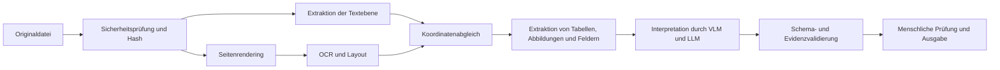



Dokumentenintelligenz bedeutet nicht, lediglich ein PDF in ein LLM einzuspeisen und Fragen dazu zu stellen. Sie ist eine Pipeline, die Text, Tabellen, Abbildungen, Koordinaten, Lesereihenfolge und seitenübergreifende Beziehungen erhält, während sie die für einen Anwendungsfall erforderlichen Strukturen extrahiert und validiert.

## 1. Das Problem: Dokumente sind komplexer als Zeichenketten

Dokumenteingaben verbinden unter anderem folgende Fälle.

- Textebene eines digital erzeugten PDFs
- gescannte Bilder
- hybride PDFs aus beiden Arten
- mehrspaltige Layouts
- Kopf- und Fußzeilen sowie Fußnoten
- Tabellen mit verbundenen Zellen
- Abbildungen und Bildunterschriften
- Gleichungen und Symbole
- Handschrift und Stempel
- gedrehte Seiten
- geringe Auflösung und Kompressionsartefakte

Selbst wenn die PDF-Textextraktion gelingt, kann die Lesereihenfolge falsch sein. Eine OCR-Zeichenkette kann plausibel aussehen, doch schon eine veränderte Ziffer kann das fachliche Ergebnis unbrauchbar machen.

## 2. Mentales Modell: schrittweise Interpretation unter Erhalt der Artefakte



Wer die Zwischenergebnisse jeder Stufe speichert, kann später feststellen, wo ein Fehler entstanden ist.

- Prüfsumme des Originals
- Seitenbild und Rendering-Einstellungen
- Tokentext und Begrenzungsrahmen
- Layoutblöcke und Lesereihenfolge
- Zellraster einer Tabelle
- extrahiertes Feld und Quellregion
- Modell- und Promptversion

## 3. Eingabesicherheit und Normalisierung

Ein Dokumentprozessor ist ein Parser für nicht vertrauenswürdige Dateien.

Grundlegende Schutzmaßnahmen:

- Erlaubten MIME-Typ mit den tatsächlichen Magic Bytes vergleichen.
- Dateigröße und Seitenzahl begrenzen.
- Parser in einer Sandbox ausführen.
- Eingebettete Dateien, Skripte oder externe Links nicht automatisch ausführen.
- Passwortgeschützte Dokumente nach einer ausdrücklichen Richtlinie behandeln.
- Dekompressionsbomben und übergroße Bildabmessungen begrenzen.
- Das Original als unveränderliches Artefakt erhalten.

Normalisierungsschritte:

- Seitendrehung erkennen
- mit einheitlicher DPI rendern
- Farbräume konvertieren
- Schräglage korrigieren
- Rauschen entfernen
- Kontrast korrigieren
- Zuschneiden protokollieren

Da Vorverarbeitung Zeichen entfernen kann, müssen Originalrendering und vorverarbeitete Darstellung miteinander verglichen werden.

## 4. Textebene und OCR gemeinsam verwenden

Digitaler Text ist nicht zwangsläufig korrekt.

- Fehler in Zeichencodierungstabellen
- Abweichungen zwischen Glyphen und Unicode
- unsichtbare Textebenen
- unterschiedliche Positionen von Scan und Text
- falsche Lesereihenfolge

Für jede Seite werden Vertrauenssignale berechnet.

- Anzahl der Textzeichen
- Anteil druckbarer Zeichen
- Lage der Begrenzungsrahmen innerhalb der Seite
- Bildabdeckung
- Übereinstimmung zwischen Rendering und Text

OCR wird nur auf ausgewählte Seiten angewandt. Widersprechen sich Textebene und OCR, muss die Herkunft beider Ergebnisse erhalten bleiben.

Ausgabeeinheit der OCR:

```json
{
  "page": 3,
  "text": "추출된 문자열",
  "bbox": [0.10, 0.22, 0.42, 0.27],
  "engine": "engine-version",
  "confidence": 0.91,
  "source": "ocr"
}
```

Koordinaten werden anhand der Seitengröße normalisiert; alternativ sind Einheit und Ursprung ausdrücklich anzugeben.

## 5. Layout und Lesereihenfolge

Die Bedeutung eines Dokuments hängt von seiner räumlichen Struktur ab.

Beispiele für Layoutklassen:

- Titel
- Absatz
- Liste
- Tabelle
- Abbildung
- Bildunterschrift
- Kopf-/Fußzeile
- Fußnote
- Gleichung

Eine falsche Lesereihenfolge vermischt Sätze verschiedener Spalten oder ordnet eine Beschriftung der falschen Abbildung zu.

Verarbeitungsstrategie:

1. Seite in Layoutblöcke aufteilen.
2. Vertikale Beziehungen und Spaltenbeziehungen zwischen Blöcken berechnen.
3. Wiederkehrende Kopf- und Fußzeilen erkennen.
4. Lesereihenfolgegraph für den Hauptinhalt aufbauen.
5. Reihenfolge von Zeilen und Token innerhalb jedes Blocks bestimmen.

Eine einfache Sortierung nach y-Koordinate scheitert bei mehreren Spalten und Seitenleisten.

## 6. Eine Tabelle ist ein Raster, keine Zeichenkette

Die Tabellenextraktion benötigt mindestens folgende Angaben.

- Zeilen- und Spaltenindex
- Begrenzungsrahmen der Zellen
- Zeilen- und Spaltenüberspannung
- Überschriftenhierarchie
- Zelltext und Konfidenz
- Verknüpfungen zu Fußnoten

Bei der Umwandlung in Markdown können verbundene Zellen, mehrstufige Überschriften und die Bedeutung leerer Zellen verloren gehen. Deshalb wird zuerst kanonisches Tabellen-JSON erzeugt; Markdown oder CSV werden daraus abgeleitet.

```json
{
  "table_id": "page-3-table-1",
  "cells": [
    {"row": 0, "col": 0, "row_span": 1, "col_span": 2,
     "text": "header", "source_region": "bbox-id"}
  ]
}
```

Numerische Felder werden gemeinsam mit Locale, Dezimaltrennzeichen, Einheit und Fußnotenmarkierung validiert.

## 7. Rollen von VLMs und LLMs

VLMs helfen bei der Interpretation komplexer Layouts und der Bedeutung von Abbildungen. Pixelgenaue Koordinaten oder jede kleine Zahl können sie jedoch nicht garantieren.

Geeignete Aufgaben:

- Klassifikation des Dokumenttyps
- Interpretation der Beziehung zwischen Abbildung und Beschriftung
- kontextabhängige Auswahl zwischen OCR-Kandidaten
- Zuordnung zu Schemafeldern
- Erzeugung menschenlesbarer Zusammenfassungen
- Triage unsicherer Fälle

Aufgaben, die ein Modell nicht allein übernehmen sollte:

- im Quelldokument fehlende Felder ergänzen
- kleine Zahlen endgültig extrahieren
- Koordinaten für Quellenangaben erfinden
- Zugriffsrichtlinien entscheiden
- Rechts- oder Finanzurteile ohne Validierung fällen

Modelleingaben erhalten Quellblock-IDs; die Ausgabe muss auf diese IDs verweisen.

## 8. Praktischer Ablauf für die Schemaextraktion

```python
def extract_document(file, schema):
    artifact = validate_and_hash(file)
    pages = render_pages(artifact)
    text_layer = extract_text_layer(artifact)
    ocr = run_ocr(select_ocr_pages(pages, text_layer))
    layout = reconcile_layout(text_layer, ocr, pages)
    proposal = model_extract(layout, schema=schema)
    checked = validate_fields(proposal, schema, layout)
    return route_low_confidence(checked)
```

Beispiele für Feldvalidierungen:

- Typ und Format
- erlaubte Enum-Werte
- zeitliche Reihenfolge von Daten
- Übereinstimmung von Zwischensummen und Gesamtsumme
- konsistente Einheiten
- Existenz einer Quellregion
- Verknüpfung zwischen Quelltext und normalisiertem Wert
- widersprüchliche seitenübergreifende Duplikate

Bei automatischen Korrekturen wird der Quellwert getrennt vom normalisierten Wert aufbewahrt.

## 9. Segmentierung und Retrieval

Ein Dokument für RAG in gleich lange Klartextblöcke zu teilen zerstört seine Struktur.

Empfohlene Einheiten:

- Absatz mit seinem Abschnittspfad
- Zeilengruppe mit Tabellenüberschrift
- Abbildung mit ihrer Beschriftung
- Seite mit den zugehörigen Fußnoten
- Listeneintrag mit übergeordneter Überschrift

Jedes Segment speichert Seite, Begrenzungsrahmen, Quellprüfsumme und Abschnittspfad. Eine Antwort muss den betreffenden Seitenbereich wieder anzeigen können.

Ändert sich die Dokumentversion, sind alte Segmente und Caches zu identifizieren und ungültig zu machen.

## 10. Evaluationsdatensatz

Für jeden Dokumenttyp werden repräsentative Beispiele und Stresstests zusammengestellt.

- saubere digitale PDFs
- Scans mit geringer Auflösung
- schiefe Seiten
- mehrspaltige Layouts
- kleine Schriftarten
- komplexe Tabellen
- Gleichungen und Sonderzeichen
- gemischte Sprachen
- leere oder doppelte Seiten
- beschädigte Dateien

Ground Truth muss mehr als Zeichenketten enthalten.

- Ausrichtung auf Seitenebene
- Begrenzungsrahmen von Token oder Zeilen
- Lesereihenfolge
- Tabellenraster
- Feldwert und Quellregion
- dokumentweite Beziehungen

Annotationsrichtlinien und Übereinstimmung der Prüfenden werden ebenfalls verwaltet.

## 11. Evaluationsmetriken

OCR:

- Zeichenfehlerrate
- Wortfehlerrate
- exakte Übereinstimmung bei Zahlen und Kennungen

Layout:

- Precision und Recall der Blockerkennung
- Genauigkeit der Lesereihenfolge
- Leistung je Klasse

Tabellen:

- Zellerkennung
- Strukturübereinstimmung
- Zuordnung von Überschriften
- Genauigkeit numerischer Felder

Ende zu Ende:

- exakte oder normalisierte Übereinstimmung der Schemafelder
- Richtigkeit der Quellenangabe
- Aufgabenerfolg auf Dokumentebene
- menschliche Korrekturzeit
- Precision beim Weiterleiten unsicherer Fälle
- Latenz und Kosten pro Seite

Eine niedrige durchschnittliche Zeichenfehlerrate schließt eine hohe Fehlerrate bei kritischen Zahlen nicht aus. Geschäftskritische Felder benötigen eigene Freigabeschwellen.

## 12. Evaluationscheckliste

- [ ] Sind Prüfsumme und unveränderliches Originalartefakt erhalten?
- [ ] Läuft der Parser in einer Sandbox mit Ressourcenlimits?
- [ ] Werden Seitenrendering-Einstellungen und DPI aufgezeichnet?
- [ ] Bleibt die Herkunft von Textebene und OCR unterscheidbar?
- [ ] Lassen sich Token, Blöcke und Felder auf Seitenkoordinaten zurückführen?
- [ ] Wird die Lesereihenfolge mehrspaltiger Seiten getestet?
- [ ] Bleiben Tabellen als kanonische Raster erhalten?
- [ ] Besitzt jedes Modellausgabefeld eine Quellregion?
- [ ] Werden Zahlen, Datumswerte und Einheiten regelbasiert nachgeprüft?
- [ ] Werden Fälle mit niedriger Konfidenz und Konflikte an Menschen weitergeleitet?
- [ ] Sind OCR-, Layout-, Schema- und Ende-zu-Ende-Metriken getrennt?
- [ ] Wird eine Dokumentlöschung auf abgeleiteten Text, Indizes und Caches übertragen?

## 13. Häufige Fehler und Grenzen

### OCR-Konfidenz mit tatsächlicher Genauigkeit verwechseln

Die Konfidenz eines Engines kann unkalibriert sein. Sie muss für jeden Dokumenttyp und jede Zeichenklasse gegen empirische Fehler kalibriert werden.

### Erfolgreiche PDF-Textextraktion als Abschluss ansehen

Lesereihenfolge, Tabellenstruktur und Seitenpositionen können falsch sein. Sie sind anhand gerenderter Bilder und Koordinaten zu prüfen.

### Von einem VLM die fehlerfreie Abschrift einer ganzen Tabelle erwarten

Kleine Zellen und Zahlen können fehlen oder verändert werden. Das Modell wird mit Strukturerkennung, OCR und regelbasierter Validierung kombiniert.

### Markdown als kanonisches Artefakt verwenden

Markdown ist ein Präsentationsformat und verliert verbundene Zellen sowie Koordinaten. Es wird aus strukturiertem JSON abgeleitet.

Informationen, die in einer beschädigten oder unscharfen Quelle nicht vorhanden sind, können nicht zurückgewonnen werden. Unsicherheit darf nicht verborgen werden; solche Dokumente gehen zur erneuten Erfassung oder menschlichen Bestätigung.

## 14. Offizielle Referenzen

- [Offizielle Dokumentation zu Tesseract OCR](https://tesseract-ocr.github.io/)
- [Offizielle Dokumentation zu OCRmyPDF](https://ocrmypdf.readthedocs.io/)
- [Öffentliche Ressourcen zur PDF-Spezifikation ISO 32000](https://pdfa.org/resource/iso-32000-pdf/)
- [Originalarbeit zu LayoutLM](https://arxiv.org/abs/1912.13318)
- [Dokumenten-KI-Benchmark DocVQA](https://www.docvqa.org/)

## 15. Fazit

Die Zuverlässigkeit von Dokumentenintelligenz entsteht stärker durch Provenienz und schrittweise Validierung als durch Modellgröße. Eine bis zur ursprünglichen Seitenregion rückverfolgbare Struktur macht Fehler aus OCR, Layoutverarbeitung oder VLM auffindbar und korrigierbar.
