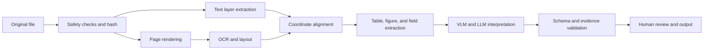



Document intelligence is not simply a feature that puts a PDF into an LLM and asks questions.
It is a pipeline that preserves text, tables, figures, coordinates, reading order, and relationships between pages while extracting and validating the structures needed for a particular use case.

## 1. The Problem: Documents Are More Complex Than Strings

Document inputs combine cases such as the following.

- The text layer of a digital-born PDF
- Scanned images
- Hybrid PDFs that mix both types
- Multi-column layouts
- Headers, footers, and footnotes
- Tables with merged cells
- Figures and captions
- Equations and symbols
- Handwriting and stamps
- Rotated pages
- Low resolution and compression artifacts

Even when PDF text extraction succeeds, the reading order may be wrong.
An OCR string may look natural, but changing a single digit can still make the business outcome fail.

## 2. Mental Model: Stage-by-Stage Interpretation That Preserves Artifacts



Saving the intermediate outputs of every stage makes it possible to trace where an error occurred.

- Original checksum
- Page image and rendering settings
- Token text and bounding box
- Layout blocks and reading order
- Table cell grid
- Extracted field and source region
- Model and prompt version

## 3. Input Safety and Normalization

A document processor is an untrusted-file parser.

Baseline defenses:

- Compare the allowed MIME type with the actual magic bytes.
- Limit file size and page count.
- Run the parser in a sandbox.
- Do not automatically execute embedded files, scripts, or external links.
- Handle password-protected documents according to an explicit policy.
- Limit decompression bombs and excessive image dimensions.
- Preserve the original as an immutable artifact.

Normalization steps:

- Detect page rotation
- Render at a consistent DPI
- Convert color spaces
- Deskew
- Remove noise
- Correct contrast
- Record whether cropping occurred

Because preprocessing can erase characters, compare both the original render and the preprocessed render.

## 4. Use the Text Layer and OCR Together

Do not assume digital text is necessarily accurate.

- Encoding-map errors
- Mismatches between glyphs and Unicode
- Invisible text layers
- Mismatched scan and text positions
- Incorrect reading order

Calculate trust signals for each page.

- Number of text characters
- Proportion of printable characters
- Whether bounding boxes are inside the page
- Image coverage
- Alignment between rendering and text

Select the pages to which OCR should be applied, and preserve provenance when the text layer and OCR results conflict.

OCR output unit:

```json
{
  "page": 3,
  "text": "추출된 문자열",
  "bbox": [0.10, 0.22, 0.42, 0.27],
  "engine": "engine-version",
  "confidence": 0.91,
  "source": "ocr"
}
```

Normalize coordinates by page size, or explicitly state their units and origin.

## 5. Layout and Reading Order

The meaning of a document depends on its spatial structure.

Example layout classes:

- Title
- Paragraph
- List
- Table
- Figure
- Caption
- Header/footer
- Footnote
- Equation

An incorrect reading order mixes sentences from different columns and attaches a caption to the wrong figure.

Processing strategy:

1. Divide the page into layout blocks.
2. Calculate vertical and column relationships among blocks.
3. Identify repeated headers and footers.
4. Build a reading-order graph for the body.
5. Determine the order of lines and tokens within each block.

A simple y-coordinate sort fails with multiple columns and sidebars.

## 6. A Table Is a Grid, Not a String

Table extraction requires at least the following information.

- Row and column indexes
- Cell bounding boxes
- Row/column spans
- Header hierarchy
- Cell text and confidence
- Footnote connections

Converting to Markdown can lose merged cells, multi-level headers, and the meaning of empty cells.
Create canonical table JSON first, then derive Markdown or CSV from it.

```json
{
  "table_id": "page-3-table-1",
  "cells": [
    {"row": 0, "col": 0, "row_span": 1, "col_span": 2,
     "text": "header", "source_region": "bbox-id"}
  ]
}
```

Validate numeric fields together with locale, decimal separator, unit, and footnote marker.

## 7. Roles of VLMs and LLMs

VLMs are useful for interpreting complex layouts and the meaning of figures.
However, they do not guarantee pixel-accurate coordinates or every small number.

Suitable roles:

- Document-type classification
- Interpreting relationships between figures and captions
- Contextual selection among OCR candidates
- Schema field mapping
- Generating human-readable summaries
- Triaging uncertain cases

Roles that are dangerous for a model to perform alone:

- Filling in fields that are absent from the source
- Definitively extracting small numbers
- Fabricating citation coordinates
- Making access-policy decisions
- Making legal or financial judgments without validation

Attach source block IDs to model inputs and require the output to reference those IDs.

## 8. A Practical Schema-Extraction Workflow

```python
def extract_document(file, schema):
    artifact = validate_and_hash(file)
    pages = render_pages(artifact)
    text_layer = extract_text_layer(artifact)
    ocr = run_ocr(select_ocr_pages(pages, text_layer))
    layout = reconcile_layout(text_layer, ocr, pages)
    proposal = model_extract(layout, schema=schema)
    checked = validate_fields(proposal, schema, layout)
    return route_low_confidence(checked)
```

Examples of field validation:

- Type and format
- Allowed enum values
- Date ordering
- Agreement between subtotals and total
- Unit consistency
- Existence of a source region
- Link between source text and normalized value
- Conflicting cross-page duplicates

For automatic corrections, preserve the source value separately from the normalized value.

## 9. Chunking and Retrieval

Splitting a document into fixed-length plain-text chunks for RAG destroys its structure.

Recommended units:

- Paragraph with its section path
- Row group with the table header
- Figure with its caption
- Page with its connected footnotes
- List item with its parent heading

Store the page, bounding box, source checksum, and section path with each chunk.
It must be possible to display the relevant page region again in an answer.

When the document version changes, identify and invalidate old chunks and caches.

## 10. Evaluation Dataset

Build representative and stress samples for each document type.

- Clean digital PDFs
- Low-resolution scans
- Skewed pages
- Multi-column layouts
- Small fonts
- Complex tables
- Equations and special characters
- Mixed languages
- Blank or duplicate pages
- Damaged files

Ground truth must contain more than strings.

- Page-level orientation
- Token or line bounding boxes
- Reading order
- Table grid
- Field value and source region
- Document-wide relationships

Manage annotation guidelines and reviewer agreement.

## 11. Evaluation Metrics

OCR:

- Character error rate
- Word error rate
- Exact match for numbers and identifiers

Layout:

- Block-detection precision/recall
- Reading-order accuracy
- Performance by class

Tables:

- Cell detection
- Structure match
- Header association
- Numeric-field accuracy

End to end:

- Exact/normalized match for schema fields
- Source-citation accuracy
- Document-level task success
- Human correction time
- Precision of low-confidence routing
- Latency and cost per page

The average CER can be low even when the error rate for critical numbers is high.
Use business-critical fields as separate gates.

## 12. Evaluation Checklist

- [ ] Are the original checksum and immutable artifact preserved?
- [ ] Does the parser run within a sandbox and resource limits?
- [ ] Are the page-rendering settings and DPI recorded?
- [ ] Is provenance distinguished between the text layer and OCR?
- [ ] Can tokens, blocks, and fields be traced back to page bounding boxes?
- [ ] Is multi-column reading order tested?
- [ ] Are tables preserved as canonical grids?
- [ ] Does every model-output field have a source region?
- [ ] Are numbers, dates, and units revalidated with rules?
- [ ] Are low-confidence cases and conflicts routed to a person?
- [ ] Are OCR, layout, schema, and end-to-end metrics separated?
- [ ] Does document deletion propagate to derived text, indexes, and caches?

## 13. Common Failures and Limitations

### Treating OCR Confidence as Actual Accuracy

Engine confidence may not be calibrated.
Calibrate it against empirical error for each document type and character class.

### Treating Successful PDF Text Extraction as Completion

Reading order, table structure, and page positions may be incorrect.
Validate them against rendered images and coordinates.

### Expecting a VLM to Copy an Entire Table Accurately

Small cells and numbers may be omitted or altered.
Combine the model with structure detection, OCR, and rule-based validation.

### Using Markdown as the Canonical Artifact

Markdown is a presentation format and loses merged cells and coordinates.
Derive it from structured JSON.

Information that does not exist in a damaged or blurry source cannot be recovered.
Do not hide uncertainty; route such documents to rescanning or human confirmation.

## 14. Official References

- [Official Tesseract OCR documentation](https://tesseract-ocr.github.io/)
- [Official OCRmyPDF documentation](https://ocrmypdf.readthedocs.io/)
- [Public resources for the PDF specification ISO 32000](https://pdfa.org/resource/iso-32000-pdf/)
- [Original LayoutLM paper](https://arxiv.org/abs/1912.13318)
- [Document AI benchmark DocVQA](https://www.docvqa.org/)

## 15. Conclusion

The reliability of document intelligence comes more from provenance and stage-by-stage validation than from model size.
Maintaining a structure that can be traced all the way to the original page region makes it possible to locate and correct errors introduced by OCR, layout processing, or a VLM.
