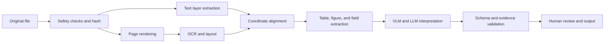



La inteligencia de documentos no es simplemente una característica que coloca un PDF en un LLM y hace preguntas.
Es una canalización que conserva texto, tablas, figuras, coordenadas, orden de lectura y relaciones entre páginas mientras extrae y valida las estructuras necesarias para un caso de uso particular.

## 1. El problema: los documentos son más complejos que las cadenas

Las entradas de documentos combinan casos como los siguientes.

- La capa de texto de un PDF nacido digitalmente
- Imágenes escaneadas
- PDF híbridos que combinan ambos tipos
- Diseños de varias columnas
- Encabezados, pies de página y notas al pie.
- Tablas con celdas fusionadas.
- Figuras y leyendas
- Ecuaciones y símbolos
- Caligrafía y sellos.
- Páginas rotadas
- Artefactos de baja resolución y compresión.

Incluso cuando la extracción del texto PDF se realiza correctamente, el orden de lectura puede ser incorrecto.
Una cadena OCR puede parecer natural, pero cambiar un solo dígito aún puede hacer que el resultado empresarial falle.

## 2. Modelo mental: interpretación etapa por etapa que preserva los artefactos



Guardar las salidas intermedias de cada etapa permite rastrear dónde ocurrió un error.

- Suma de comprobación original
- Imagen de página y configuración de renderizado.
- Texto simbólico y cuadro delimitador.
- Bloques de diseño y orden de lectura.
- Cuadrícula de celdas de mesa
- Campo extraído y región de origen.
- Modelo y versión prompt

## 3. Seguridad y normalización de entradas

Un procesador de documentos es un analizador de archivos que no es de confianza.

Defensas de fondo:

- Compare el tipo MIME permitido con los bytes mágicos reales.
- Limite el tamaño del archivo y el recuento de páginas.
- Ejecutar el analizador en un sandbox.
- No ejecute automáticamente archivos incrustados, scripts o enlaces externos.
- Manejar documentos protegidos con contraseña de acuerdo con una política explícita.
- Limitar las bombas de descompresión y las dimensiones excesivas de la imagen.
- Preservar el original como un artefacto inmutable.

Pasos de normalización:

- Detectar rotación de página
- Renderizar a un DPI consistente
- Convertir espacios de color
- Alinear
- Eliminar ruido
- Contraste correcto
- Registrar si se produjo el recorte

Debido a que el preprocesamiento puede borrar caracteres, compare tanto el renderizado original como el renderizado preprocesado.

## 4. Utilice la capa de texto y OCR juntos

No asuma que el texto digital es necesariamente exacto.

- Errores de mapa de codificación
- Faltas de coincidencia entre glifos y Unicode
- Capas de texto invisibles
- Posiciones de escaneo y texto no coincidentes
- Orden de lectura incorrecto

Calcule las señales de confianza para cada página.

- Número de caracteres de texto
- Proporción de caracteres imprimibles
- Si los cuadros delimitadores están dentro de la página.
- Cobertura de imagen
- Alineación entre renderizado y texto.

Seleccione las páginas a las que se debe aplicar OCR y conserve la procedencia cuando la capa de texto y los resultados de OCR entren en conflicto.

OCR unidad de salida:

```json
{
  "page": 3,
  "text": "추출된 문자열",
  "bbox": [0.10, 0.22, 0.42, 0.27],
  "engine": "engine-version",
  "confidence": 0.91,
  "source": "ocr"
}
```

Normalice las coordenadas por tamaño de página o indique explícitamente sus unidades y origen.

## 5. Diseño y orden de lectura

El significado de un documento depende de su estructura espacial.

Clases de diseño de ejemplo:

- Título
- Párrafo
- Lista
- Mesa
- Figura
- Título
- Encabezado/pie de página
- Nota al pie
- Ecuación

Un orden de lectura incorrecto mezcla oraciones de diferentes columnas y adjunta un título a la figura incorrecta.

Estrategia de procesamiento:

1. Divida la página en bloques de diseño.
2. Calcule las relaciones verticales y de columnas entre bloques.
3. Identifique encabezados y pies de página repetidos.
4. Construya una gráfica de orden de lectura para el cuerpo.
5. Determine el orden de las líneas y fichas dentro de cada bloque.

Una ordenación simple mediante coordenadas y falla con varias columnas y barras laterales.

## 6. Una tabla es una cuadrícula, no una cadena

La extracción de tablas requiere al menos la siguiente información.

- Índices de filas y columnas.
- Cuadros delimitadores de celdas
- tramos de filas/columnas
- Jerarquía de encabezados
- Texto celular y confianza.
- Conexiones de notas al pie

La conversión a Markdown puede perder celdas fusionadas, encabezados de varios niveles y el significado de las celdas vacías.
Primero cree la tabla canónica JSON y luego derive Markdown o CSV a partir de ella.

```json
{
  "table_id": "page-3-table-1",
  "cells": [
    {"row": 0, "col": 0, "row_span": 1, "col_span": 2,
     "text": "header", "source_region": "bbox-id"}
  ]
}
```

Valide campos numéricos junto con la configuración regional, el separador decimal, la unidad y el marcador de nota al pie.

## 7. Funciones de los VLM y LLM

Los VLM son útiles para interpretar diseños complejos y el significado de figuras.
Sin embargo, no garantizan coordenadas con precisión de píxeles ni cada número pequeño.

Roles adecuados:

- Clasificación por tipo de documento
- Interpretar las relaciones entre figuras y leyendas.
- Selección contextual entre OCR candidatos
- Mapeo de campos de esquema
- Generación de resúmenes legibles por humanos.
- Triaje de casos inciertos.

Roles que son peligrosos para que un modelo los desempeñe solo:

- Completar campos que están ausentes en la fuente.
- Extrayendo definitivamente números pequeños
- Fabricación de coordenadas de citas.
- Tomar decisiones sobre políticas de acceso.
- Hacer juicios legales o financieros sin validación.

Adjunte ID de bloque de origen a las entradas del modelo y solicite que la salida haga referencia a esas ID.

## 8. Un flujo de trabajo práctico de extracción de esquemas

```python
def extract_document(file, schema):
    artifact = validate_and_hash(file)
    pages = render_pages(artifact)
    text_layer = extract_text_layer(artifact)
    ocr = run_ocr(select_ocr_pages(pages, text_layer))
    layout = reconcile_layout(text_layer, ocr, pages)
    proposal = model_extract(layout, schema=schema)
    checked = validate_fields(proposal, schema, layout)
    return route_low_confidence(checked)
```

Ejemplos de validación de campos:

- Tipo y formato
- Valores de enumeración permitidos
- Orden de fecha
- Concordancia entre subtotales y total
- Consistencia de la unidad
- Existencia de una región fuente
- Enlace entre el texto fuente y el valor normalizado.
- Duplicados conflictivos entre páginas.

Para correcciones automáticas, conserve el valor de origen por separado del valor normalizado.

## 9. Fragmentación y recuperación

Dividir un documento en fragmentos de texto sin formato de longitud fija para RAG destruye su estructura.

Unidades recomendadas:

- Párrafo con su ruta de sección
- Grupo de filas con el encabezado de la tabla.
- Figura con su título.
- Página con sus notas a pie de página conectadas.
- Listar elemento con su encabezado principal

Almacene la página, el cuadro delimitador, la suma de verificación de origen y la ruta de la sección con cada fragmento.
Debe ser posible volver a mostrar la región de la página relevante en una respuesta.

Cuando cambie la versión del documento, identifique e invalide fragmentos y cachés antiguos.

## 10. Conjunto de datos de evaluación

Cree muestras representativas y estresantes para cada tipo de documento.

- Limpiar archivos PDF digitales
- Escaneos de baja resolución
- páginas torcidas
- Diseños de varias columnas
- Fuentes pequeñas
- Tablas complejas
- Ecuaciones y caracteres especiales.
- Idiomas mixtos
- Páginas en blanco o duplicadas
- Archivos dañados

La verdad fundamental debe contener más que cadenas.

- Orientación a nivel de página
- Cuadros delimitadores de token o línea
- Orden de lectura
- Rejilla de mesa
- Valor de campo y región de origen.
- Relaciones en todo el documento

Gestionar las pautas de anotación y el acuerdo del revisor.

## 11. Métricas de evaluación

OCR:

- Tasa de error de caracteres
- Tasa de error de palabras
- Coincidencia exacta de números e identificadores.

Diseño:

- Precisión/recuperación de detección de bloques
- Precisión del orden de lectura
- Rendimiento por clase

Tablas:

- Detección de células
- Coincidencia de estructura
- Asociación de encabezado
- Precisión de campo numérico

De punta a punta:

- Coincidencia exacta/normalizada para campos de esquema
- Precisión de las citas de fuentes
- Éxito de la tarea a nivel de documento
- Tiempo de corrección humana
- Precisión del enrutamiento de baja confianza
- Latencia y costo por página.

El CER promedio puede ser bajo incluso cuando la tasa de error de los números críticos es alta.
Utilice campos críticos para el negocio como puertas independientes.

## 12. Lista de verificación de evaluación

- [] ¿Se conservan la suma de comprobación original y el artefacto inmutable?
- [] ¿El analizador se ejecuta dentro de un espacio aislado y límites de recursos?
- [] ¿Se registran la configuración de representación de páginas y DPI?
- [] ¿Se distingue la procedencia entre la capa de texto y OCR?
- [] ¿Se pueden rastrear los tokens, bloques y campos hasta los cuadros delimitadores de página?
- [] ¿Se prueba el orden de lectura de varias columnas?
- [] ¿Se conservan las tablas como cuadrículas canónicas?
- [] ¿Cada campo de salida del modelo tiene una región de origen?
- [ ] ¿Se revalidan números, fechas y unidades con reglas?
- [ ] ¿Los casos de baja confianza y los conflictos se trasladan a una persona?
- [] ¿Están separados OCR, el diseño, el esquema y las métricas de un extremo a otro?
- [] ¿La eliminación de documentos se propaga al texto derivado, índices y cachés?

## 13. Fallas y limitaciones comunes

### Tratar la confianza OCR como precisión real

Es posible que la confianza del motor no esté calibrada.
Calibrelo contra errores empíricos para cada tipo de documento y clase de caracteres.

### Tratar la extracción de texto PDF exitosa como finalización

El orden de lectura, la estructura de la tabla y las posiciones de las páginas pueden ser incorrectos.
Valídalos con imágenes y coordenadas renderizadas.

### Esperando que VLM copie una tabla completa con precisión

Las celdas y los números pequeños pueden omitirse o modificarse.
Combine el modelo con detección de estructuras, OCR y validación basada en reglas.

### Usando Markdown como artefacto canónico

Markdown es un formato de presentación y pierde celdas y coordenadas fusionadas.
Derivarlo de JSON estructurado.

La información que no existe en una fuente dañada o borrosa no se puede recuperar.
No ocultes la incertidumbre; encaminar dichos documentos para un nuevo escaneo o confirmación humana.

## 14. Referencias oficiales

- [Documentación oficial de Tesseract OCR](https://tesseract-ocr.github.io/)
- [Documentación oficial de OCRmyPDF](https://ocrmypdf.readthedocs.io/)
- [Recursos públicos para la especificación PDF ISO 32000](https://pdfa.org/resource/iso-32000-pdf/)
- [Papel original de LayoutLM](https://arxiv.org/abs/1912.13318)
- [Documento AI benchmark DocVQA](https://www.docvqa.org/)

## 15. Conclusión

La confiabilidad de la inteligencia documental proviene más de la procedencia y la validación etapa por etapa que del tamaño del modelo.
Mantener una estructura que se pueda rastrear hasta la región de la página original hace posible localizar y corregir errores introducidos por OCR, el procesamiento de diseño o un VLM.
