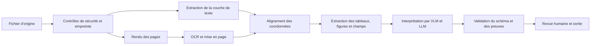



L’intelligence documentaire ne se résume pas à placer un PDF dans un LLM et à lui poser des questions.
C’est un pipeline qui préserve le texte, les tableaux, les figures, les coordonnées, l’ordre de lecture et les relations entre les pages, tout en extrayant et en validant les structures nécessaires à un cas d’usage donné.

## 1. Le problème : les documents sont plus complexes que des chaînes de caractères

Les documents d’entrée combinent des cas tels que les suivants.

- Couche de texte d’un PDF créé numériquement
- Images numérisées
- PDF hybrides mêlant les deux types
- Mises en page à plusieurs colonnes
- En-têtes, pieds de page et notes de bas de page
- Tableaux avec cellules fusionnées
- Figures et légendes
- Équations et symboles
- Écriture manuscrite et tampons
- Pages tournées
- Faible résolution et artefacts de compression

Même lorsque l’extraction du texte d’un PDF réussit, l’ordre de lecture peut être erroné.
Une chaîne issue de l’OCR peut sembler naturelle, mais la modification d’un seul chiffre peut tout de même faire échouer le résultat métier.

## 2. Modèle mental : une interprétation étape par étape qui préserve les artefacts



L’enregistrement des sorties intermédiaires de chaque étape permet de retracer l’endroit où une erreur est survenue.

- Somme de contrôle de l’original
- Image de la page et paramètres de rendu
- Texte des jetons et boîte englobante
- Blocs de mise en page et ordre de lecture
- Grille de cellules du tableau
- Champ extrait et région source
- Version du modèle et du prompt

## 3. Sécurité et normalisation des entrées

Un processeur de documents est un analyseur de fichiers non fiables.

Mesures de défense de base :

- Comparer le type MIME autorisé aux octets magiques réels.
- Limiter la taille du fichier et le nombre de pages.
- Exécuter l’analyseur dans un bac à sable.
- Ne pas exécuter automatiquement les fichiers, scripts ou liens externes incorporés.
- Traiter les documents protégés par mot de passe selon une politique explicite.
- Limiter les bombes de décompression et les dimensions d’image excessives.
- Conserver l’original comme artefact immuable.

Étapes de normalisation :

- Détecter la rotation des pages
- Effectuer le rendu à une résolution DPI uniforme
- Convertir les espaces colorimétriques
- Corriger l’inclinaison
- Supprimer le bruit
- Corriger le contraste
- Consigner si un recadrage a été effectué

Comme le prétraitement peut effacer des caractères, comparez à la fois le rendu original et le rendu prétraité.

## 4. Utiliser ensemble la couche de texte et l’OCR

Ne supposez pas que le texte numérique est nécessairement exact.

- Erreurs de tables d’encodage
- Discordances entre glyphes et Unicode
- Couches de texte invisibles
- Discordances entre positions de l’image numérisée et du texte
- Ordre de lecture incorrect

Calculez des signaux de confiance pour chaque page.

- Nombre de caractères de texte
- Proportion de caractères imprimables
- Présence des boîtes englobantes à l’intérieur de la page
- Couverture par les images
- Alignement entre le rendu et le texte

Sélectionnez les pages auxquelles appliquer l’OCR et préservez la provenance lorsque la couche de texte et les résultats de l’OCR sont en conflit.

Unité de sortie de l’OCR :

```json
{
  "page": 3,
  "text": "추출된 문자열",
  "bbox": [0.10, 0.22, 0.42, 0.27],
  "engine": "engine-version",
  "confidence": 0.91,
  "source": "ocr"
}
```

Normalisez les coordonnées selon la taille de la page, ou indiquez explicitement leurs unités et leur origine.

## 5. Mise en page et ordre de lecture

Le sens d’un document dépend de sa structure spatiale.

Exemples de classes de mise en page :

- Titre
- Paragraphe
- Liste
- Tableau
- Figure
- Légende
- En-tête ou pied de page
- Note de bas de page
- Équation

Un ordre de lecture incorrect mélange des phrases de colonnes différentes et rattache une légende à la mauvaise figure.

Stratégie de traitement :

1. Diviser la page en blocs de mise en page.
2. Calculer les relations verticales et les relations de colonnes entre les blocs.
3. Identifier les en-têtes et pieds de page répétés.
4. Construire un graphe d’ordre de lecture pour le corps du document.
5. Déterminer l’ordre des lignes et des jetons dans chaque bloc.

Un simple tri selon la coordonnée y échoue avec plusieurs colonnes et des encadrés latéraux.

## 6. Un tableau est une grille, pas une chaîne

L’extraction d’un tableau exige au minimum les informations suivantes.

- Indices de ligne et de colonne
- Boîtes englobantes des cellules
- Étendue en lignes et en colonnes
- Hiérarchie des en-têtes
- Texte et confiance de chaque cellule
- Liens vers les notes de bas de page

La conversion en Markdown peut faire perdre les cellules fusionnées, les en-têtes multiniveaux et le sens des cellules vides.
Créez d’abord un JSON canonique du tableau, puis dérivez-en le Markdown ou le CSV.

```json
{
  "table_id": "page-3-table-1",
  "cells": [
    {"row": 0, "col": 0, "row_span": 1, "col_span": 2,
     "text": "header", "source_region": "bbox-id"}
  ]
}
```

Validez les champs numériques avec les paramètres régionaux, le séparateur décimal, l’unité et le marqueur de note de bas de page.

## 7. Rôles des VLM et des LLM

Les VLM sont utiles pour interpréter les mises en page complexes et la signification des figures.
Cependant, ils ne garantissent ni des coordonnées exactes au pixel près ni la restitution de chaque petit nombre.

Rôles appropriés :

- Classification du type de document
- Interprétation des relations entre figures et légendes
- Sélection contextuelle parmi les candidats de l’OCR
- Mise en correspondance avec les champs du schéma
- Génération de résumés lisibles par un humain
- Triage des cas incertains

Rôles qu’il est dangereux de confier à un modèle seul :

- Remplir des champs absents de la source
- Extraire définitivement de petits nombres
- Fabriquer des coordonnées de citation
- Prendre des décisions de politique d’accès
- Rendre des jugements juridiques ou financiers sans validation

Associez les identifiants des blocs sources aux entrées du modèle et exigez que la sortie référence ces identifiants.

## 8. Workflow pratique d’extraction selon un schéma

```python
def extract_document(file, schema):
    artifact = validate_and_hash(file)
    pages = render_pages(artifact)
    text_layer = extract_text_layer(artifact)
    ocr = run_ocr(select_ocr_pages(pages, text_layer))
    layout = reconcile_layout(text_layer, ocr, pages)
    proposal = model_extract(layout, schema=schema)
    checked = validate_fields(proposal, schema, layout)
    return route_low_confidence(checked)
```

Exemples de validation des champs :

- Type et format
- Valeurs d’énumération autorisées
- Ordre des dates
- Concordance entre les sous-totaux et le total
- Cohérence des unités
- Existence d’une région source
- Lien entre le texte source et la valeur normalisée
- Doublons contradictoires entre plusieurs pages

Pour les corrections automatiques, conservez séparément la valeur source et la valeur normalisée.

## 9. Segmentation et recherche

Découper un document en segments de texte brut de longueur fixe pour un système RAG détruit sa structure.

Unités recommandées :

- Paragraphe accompagné du chemin de sa section
- Groupe de lignes accompagné de l’en-tête du tableau
- Figure accompagnée de sa légende
- Page accompagnée de ses notes de bas de page reliées
- Élément de liste accompagné de son titre parent

Stockez la page, la boîte englobante, la somme de contrôle de la source et le chemin de section avec chaque segment.
Il doit être possible d’afficher de nouveau la région pertinente de la page dans une réponse.

Lorsque la version du document change, identifiez et invalidez les anciens segments et caches.

## 10. Jeu de données d’évaluation

Constituez des échantillons représentatifs et des cas de contrainte pour chaque type de document.

- PDF numériques propres
- Numérisations à faible résolution
- Pages inclinées
- Mises en page à plusieurs colonnes
- Petites polices
- Tableaux complexes
- Équations et caractères spéciaux
- Mélange de langues
- Pages vides ou dupliquées
- Fichiers endommagés

La vérité terrain doit contenir davantage que des chaînes de caractères.

- Orientation au niveau de la page
- Boîtes englobantes des jetons ou des lignes
- Ordre de lecture
- Grille du tableau
- Valeur du champ et région source
- Relations à l’échelle du document

Gérez les consignes d’annotation et la concordance entre évaluateurs.

## 11. Métriques d’évaluation

OCR :

- Taux d’erreur sur les caractères
- Taux d’erreur sur les mots
- Correspondance exacte des nombres et identifiants

Mise en page :

- Précision et rappel de la détection des blocs
- Exactitude de l’ordre de lecture
- Performances par classe

Tableaux :

- Détection des cellules
- Correspondance de la structure
- Association des en-têtes
- Exactitude des champs numériques

De bout en bout :

- Correspondance exacte ou normalisée des champs du schéma
- Exactitude des citations de sources
- Réussite de la tâche au niveau du document
- Temps de correction humaine
- Précision du routage des cas de faible confiance
- Latence et coût par page

Le CER moyen peut être faible même lorsque le taux d’erreur des nombres critiques est élevé.
Utilisez les champs critiques pour l’activité comme critères de validation distincts.

## 12. Liste de contrôle de l’évaluation

- [ ] La somme de contrôle originale et l’artefact immuable sont-ils préservés ?
- [ ] L’analyseur s’exécute-t-il dans un bac à sable avec des limites de ressources ?
- [ ] Les paramètres de rendu des pages et le DPI sont-ils consignés ?
- [ ] La provenance distingue-t-elle la couche de texte de l’OCR ?
- [ ] Les jetons, blocs et champs peuvent-ils être reliés aux boîtes englobantes des pages ?
- [ ] L’ordre de lecture à plusieurs colonnes est-il testé ?
- [ ] Les tableaux sont-ils préservés sous forme de grilles canoniques ?
- [ ] Chaque champ produit par le modèle possède-t-il une région source ?
- [ ] Les nombres, dates et unités sont-ils validés de nouveau par des règles ?
- [ ] Les cas de faible confiance et les conflits sont-ils confiés à une personne ?
- [ ] Les métriques d’OCR, de mise en page, de schéma et de bout en bout sont-elles séparées ?
- [ ] La suppression d’un document se propage-t-elle au texte dérivé, aux index et aux caches ?

## 13. Échecs courants et limites

### Prendre la confiance de l’OCR pour l’exactitude réelle

La confiance fournie par le moteur peut ne pas être calibrée.
Calibrez-la par rapport aux erreurs empiriques pour chaque type de document et chaque classe de caractères.

### Considérer qu’une extraction réussie du texte du PDF suffit

L’ordre de lecture, la structure des tableaux et les positions dans les pages peuvent être incorrects.
Validez-les par rapport aux images rendues et aux coordonnées.

### Attendre d’un VLM qu’il recopie exactement un tableau entier

Les petites cellules et les nombres peuvent être omis ou altérés.
Combinez le modèle avec la détection de structure, l’OCR et une validation fondée sur des règles.

### Utiliser Markdown comme artefact canonique

Markdown est un format de présentation qui perd les cellules fusionnées et les coordonnées.
Dérivez-le d’un JSON structuré.

Les informations qui n’existent pas dans une source endommagée ou floue ne peuvent pas être récupérées.
Ne masquez pas l’incertitude ; envoyez ces documents vers une nouvelle numérisation ou une confirmation humaine.

## 14. Références officielles

- [Documentation officielle de Tesseract OCR](https://tesseract-ocr.github.io/)
- [Documentation officielle d’OCRmyPDF](https://ocrmypdf.readthedocs.io/)
- [Ressources publiques sur la spécification PDF ISO 32000](https://pdfa.org/resource/iso-32000-pdf/)
- [Article original sur LayoutLM](https://arxiv.org/abs/1912.13318)
- [Benchmark DocVQA pour l’IA documentaire](https://www.docvqa.org/)

## 15. Conclusion

La fiabilité de l’intelligence documentaire provient davantage de la provenance et de la validation étape par étape que de la taille du modèle.
Maintenir une structure retraçable jusqu’à la région de la page d’origine permet de localiser et de corriger les erreurs introduites par l’OCR, le traitement de la mise en page ou un VLM.
