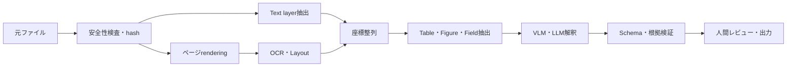



document intelligenceは、PDFをLLMへ入れて質問する機能ではない。
文字、表、図、座標、読み順、ページ間関係を保ちながら、利用目的に必要な構造を抽出して検証するpipelineである。

## 1. 問題：文書は文字列より複雑である

文書入力には次のようなケースが混在する。

- digital-born PDFのtext layer
- scan image
- 両者が混在するhybrid PDF
- multi-column layout
- header、footer、footnote
- merged cellを持つtable
- figureとcaption
- 数式とsymbol
- handwritingとstamp
- rotated page
- 低解像度と圧縮artifact

PDF text extractionが成功しても、読み順が誤っている場合がある。
OCR文字列が自然に見えても、数字が1桁変われば業務結果としては失敗である。

## 2. Mental model：artifactを保持する段階的解釈



各段階の中間成果物を保存すれば、エラーがどこで発生したか追跡できる。

- 元ファイルchecksum
- page imageとrendering設定
- token textとbounding box
- layout blockとreading order
- table cell grid
- 抽出fieldとsource region
- モデルとprompt version

## 3. 入力の安全性と正規化

文書処理系はuntrusted file parserである。

基本的な防御：

- 許可したMIMEと実際のmagic byteを比較する。
- ファイルサイズとpage数を制限する。
- parserをsandbox内で実行する。
- embedded file、script、external linkを自動実行しない。
- password-protected文書は明示的な方針で処理する。
- decompression bombと過大なimage dimensionを制限する。
- 原本をimmutable artifactとして保持する。

正規化段階：

- page rotationの検知
- consistent DPI rendering
- color space変換
- deskew
- noise除去
- contrast補正
- crop有無の記録

前処理で文字が消える可能性があるため、元renderと前処理済みrenderの両方を比較する。

## 4. Text layerとOCRを併用する

digital textがあれば無条件に正確だと仮定しない。

- encoding mapエラー
- glyphとUnicodeの不一致
- 不可視text layer
- scanとtext位置の不一致
- 誤ったreading order

pageごとに信頼性シグナルを計算する。

- text character数
- printable character比率
- bounding boxがpage内にあるか
- image coverage
- renderingとtext alignment

OCRを適用するpageを選び、text layerとOCR結果が衝突する場合はprovenanceを保持する。

OCR outputの単位：

```json
{
  "page": 3,
  "text": "추출된 문자열",
  "bbox": [0.10, 0.22, 0.42, 0.27],
  "engine": "engine-version",
  "confidence": 0.91,
  "source": "ocr"
}
```

座標をpage寸法で正規化するか、単位とoriginを明示する。

## 5. Layoutと読み順

文書の意味は空間構造に依存する。

layout classの例：

- title
- paragraph
- list
- table
- figure
- caption
- header/footer
- footnote
- equation

読み順が誤るとcolumnの文が混ざり、captionが別の図へ付く。

処理戦略：

1. pageをlayout blockへ分割する。
2. block間の上下・列関係を計算する。
3. header/footerの反復を特定する。
4. body reading order graphを作る。
5. block内でlineとtokenの順序を決める。

単純なy-coordinate sortはmulti-columnとsidebarで失敗する。

## 6. Tableは文字列ではなくgridである

table extractionには最低限、次の情報が必要である。

- rowとcolumn index
- cell bounding box
- row/column span
- header階層
- cell textとconfidence
- footnoteとの接続

Markdown変換はmerged cell、multi-level header、空cellの意味を失い得る。
まずcanonical table JSONを作り、MarkdownやCSVを派生させる。

```json
{
  "table_id": "page-3-table-1",
  "cells": [
    {"row": 0, "col": 0, "row_span": 1, "col_span": 2,
     "text": "header", "source_region": "bbox-id"}
  ]
}
```

数値fieldはlocale、decimal separator、unit、footnote markerを併せて検証する。

## 7. VLMとLLMの役割

VLMは複雑なlayoutや図の意味を解釈するのに有用である。
ただしpixel-levelで正確な座標や、すべての小さな数字を保証しない。

適した役割：

- 文書種類の分類
- figureとcaptionの関係解釈
- OCR候補間の文脈的選択
- schema field mapping
- 人が読む要約の生成
- 不確実事例のtriage

モデル単独では危険な役割：

- 原本にないfieldの補完
- 小さな数字の確定抽出
- 引用座標の恣意的生成
- アクセス方針の決定
- 検証なしの法的・財務的判断

モデル入力へsource block IDを付け、出力にそのIDを参照させる。

## 8. 実践的なschema抽出workflow

```python
def extract_document(file, schema):
    artifact = validate_and_hash(file)
    pages = render_pages(artifact)
    text_layer = extract_text_layer(artifact)
    ocr = run_ocr(select_ocr_pages(pages, text_layer))
    layout = reconcile_layout(text_layer, ocr, pages)
    proposal = model_extract(layout, schema=schema)
    checked = validate_fields(proposal, schema, layout)
    return route_low_confidence(checked)
```

field validationの例：

- typeとformat
- 許可enum
- date ordering
- subtotalとtotalの一致
- unit consistency
- source regionの存在
- source textとnormalized valueの接続
- cross-page duplicateの衝突

自動修正では原文値とnormalized valueを分離して保持する。

## 9. Chunkingと検索

文書をRAGへ入れるときにplain textを固定長で分割すると、構造が失われる。

推奨単位：

- section pathを含むparagraph
- table headerを伴うrow group
- figureとcaption
- pageとfootnoteの接続
- list itemと上位heading

各chunkへpage、bbox、source checksum、section pathを持たせる。
回答から該当page regionを再表示できなければならない。

文書versionが変わったらold chunkとcacheを特定して無効化する。

## 10. 評価dataset

文書種類ごとに代表標本とstress標本を作る。

- clean digital PDF
- 低解像度scan
- 傾いたpage
- 多段layout
- 小さいfont
- 複雑なtable
- 数式と特殊文字
- 複数言語の混在
- blankまたはduplicate page
- 破損ファイル

ground truthには文字列だけを入れない。

- page-level orientation
- tokenまたはline bbox
- reading order
- table grid
- field valueとsource region
- 文書全体の関係

annotation guidelineとreviewer agreementを管理する。

## 11. 評価指標

OCR：

- character error rate
- word error rate
- 数字・識別子のexact match

Layout：

- block detection precision/recall
- reading order accuracy
- class別性能

Table：

- cell detection
- structure match
- header association
- numeric field accuracy

End-to-end：

- schema fieldのexact/normalized match
- source citation accuracy
- document-level task success
- human correction time
- low-confidence routing precision
- pageあたりlatencyとコスト

平均CERが低くても、重要な数字のエラー率が高い場合がある。
業務上重要なfieldを別gateとして設ける。

## 12. 評価checklist

- [ ] 元ファイルchecksumとimmutable artifactを保持するか。
- [ ] parserがsandboxとresource limit内で実行されるか。
- [ ] page rendering設定とDPIが記録されるか。
- [ ] text layerとOCRのprovenanceが区別されるか。
- [ ] token・block・fieldをpage bboxへ逆追跡できるか。
- [ ] multi-column reading orderをtestするか。
- [ ] tableをcanonical gridとして保持するか。
- [ ] モデル出力fieldごとにsource regionがあるか。
- [ ] 数字、日付、単位をルールで再検証するか。
- [ ] 低confidenceと衝突を人へroutingするか。
- [ ] OCR・layout・schema・end-to-end指標を分離するか。
- [ ] 文書削除が派生text、index、cacheへ伝播するか。

## 13. よくある失敗と限界

### OCR confidenceを実際の正確度とみなす

engine confidenceはcalibrationされていない場合がある。
文書種類とcharacter class別のempirical errorで補正する。

### PDF text抽出の成功を完了とみなす

読み順、table構造、page位置が誤っている可能性がある。
rendered imageと座標を併せて検証する。

### VLMが表全体を正確にコピーすると期待する

小さなcellと数字で欠落・変形が生じ得る。
構造検出、OCR、ルール検証と組み合わせる。

### Markdownをcanonical artifactとして使う

Markdownはpresentation formatで、merged cellと座標を失う。
構造JSONから派生させる。

破損または不鮮明な原本から、存在しない情報を復元することはできない。
不確実性を隠さず、再scanまたは人による確認へ接続する。

## 14. 公式参考資料

- [Tesseract OCR公式文書](https://tesseract-ocr.github.io/)
- [OCRmyPDF公式文書](https://ocrmypdf.readthedocs.io/)
- [PDF specification ISO 32000公開資料](https://pdfa.org/resource/iso-32000-pdf/)
- [LayoutLM原論文](https://arxiv.org/abs/1912.13318)
- [Document AI benchmark DocVQA](https://www.docvqa.org/)

## 15. まとめ

document intelligenceの信頼性はモデルの大きさよりprovenanceと段階別検証から生まれる。
元のpage regionまで追跡できる構造を保てば、OCR、layout、VLMのどこで生じたエラーかを見つけて修正できる。
