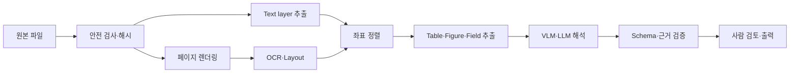



문서 지능은 PDF를 LLM에 넣고 질문하는 기능이 아니다.
문자, 표, 그림, 좌표, 읽기 순서, 페이지 관계를 보존하면서 사용 목적에 필요한 구조를 추출하고 검증하는 pipeline이다.

## 1. 문제: 문서는 문자열보다 복잡하다

문서 입력에는 다음 경우가 섞인다.

- digital-born PDF의 text layer
- scan image
- 두 유형이 섞인 hybrid PDF
- multi-column layout
- header, footer, footnote
- merged cell이 있는 table
- figure와 caption
- 수식과 symbol
- handwriting과 stamp
- rotated page
- 낮은 해상도와 압축 artifact

PDF text extraction이 성공해도 읽기 순서가 틀릴 수 있다.
OCR 문자열이 자연스러워 보여도 숫자 한 자리가 바뀌면 업무 결과는 실패다.

## 2. Mental model: artifact를 보존하는 단계별 해석



각 단계의 중간 산출물을 저장하면 오류가 어디서 발생했는지 추적할 수 있다.

- 원본 checksum
- page image와 rendering 설정
- token text와 bounding box
- layout block와 reading order
- table cell grid
- 추출 field와 source region
- 모델과 prompt version

## 3. 입력 안전과 정규화

문서 처리기는 untrusted file parser다.

기본 방어:

- 허용 MIME과 실제 magic byte를 비교한다.
- 파일 크기와 page 수를 제한한다.
- parser를 sandbox에서 실행한다.
- embedded file, script, external link를 자동 실행하지 않는다.
- password-protected 문서는 명시 정책으로 처리한다.
- decompression bomb와 과도한 image dimension을 제한한다.
- 원본은 immutable artifact로 보존한다.

정규화 단계:

- page rotation 감지
- consistent DPI rendering
- color space 변환
- deskew
- noise 제거
- contrast 보정
- crop 여부 기록

전처리가 글자를 지울 수 있으므로 원본 렌더와 전처리 렌더를 모두 비교한다.

## 4. Text layer와 OCR을 함께 사용한다

digital text가 있으면 무조건 정확하다고 가정하지 않는다.

- encoding map 오류
- glyph와 Unicode 불일치
- 보이지 않는 text layer
- scan과 text 위치 불일치
- 잘못된 reading order

page별로 신뢰 신호를 계산한다.

- text character 수
- printable character 비율
- bounding box가 page 안에 있는지
- image coverage
- rendering과 text alignment

OCR을 적용할 page를 선택하고, text layer와 OCR 결과가 충돌하면 provenance를 유지한다.

OCR output 단위:

```json
{
  "page": 3,
  "text": "추출된 문자열",
  "bbox": [0.10, 0.22, 0.42, 0.27],
  "engine": "engine-version",
  "confidence": 0.91,
  "source": "ocr"
}
```

좌표는 page 크기로 정규화하거나 단위와 origin을 명시한다.

## 5. Layout과 읽기 순서

문서 의미는 공간 구조에 의존한다.

layout class 예:

- title
- paragraph
- list
- table
- figure
- caption
- header/footer
- footnote
- equation

읽기 순서가 틀리면 column 문장이 섞이고 caption이 다른 그림에 붙는다.

처리 전략:

1. page를 layout block으로 분할한다.
2. block 간 위·아래·열 관계를 계산한다.
3. header/footer 반복을 식별한다.
4. body reading order graph를 만든다.
5. block 안에서 line과 token 순서를 결정한다.

단순 y-coordinate sort는 multi-column과 sidebar에서 실패한다.

## 6. Table은 문자열이 아니라 grid다

table extraction에는 최소한 다음 정보가 필요하다.

- row와 column index
- cell bounding box
- row/column span
- header 계층
- cell text와 confidence
- footnote 연결

Markdown 변환은 merged cell, multi-level header, 빈 cell 의미를 잃을 수 있다.
canonical table JSON을 먼저 만들고 Markdown이나 CSV를 파생한다.

```json
{
  "table_id": "page-3-table-1",
  "cells": [
    {"row": 0, "col": 0, "row_span": 1, "col_span": 2,
     "text": "header", "source_region": "bbox-id"}
  ]
}
```

숫자 field는 locale, decimal separator, unit, footnote marker를 함께 검증한다.

## 7. VLM과 LLM의 역할

VLM은 복잡한 layout과 그림의 의미를 해석하는 데 유용하다.
하지만 pixel-level 정확한 좌표와 모든 작은 숫자를 보장하지 않는다.

적합한 역할:

- 문서 유형 분류
- figure와 caption 관계 해석
- OCR 후보 간 문맥적 선택
- schema field mapping
- 사람이 읽을 요약 생성
- 불확실 사례 triage

모델이 단독으로 하면 위험한 역할:

- 원본에 없는 field 보완
- 작은 숫자의 확정 추출
- 인용 좌표를 임의 생성
- 접근 정책 결정
- 검증 없이 법적·재무적 판단

모델 입력에 source block ID를 붙이고 출력이 해당 ID를 참조하게 한다.

## 8. 실전 schema 추출 workflow

```python
def extract_document(file, schema):
    artifact = validate_and_hash(file)
    pages = render_pages(artifact)
    text_layer = extract_text_layer(artifact)
    ocr = run_ocr(select_ocr_pages(pages, text_layer))
    layout = reconcile_layout(text_layer, ocr, pages)
    proposal = model_extract(layout, schema=schema)
    checked = validate_fields(proposal, schema, layout)
    return route_low_confidence(checked)
```

field validation 예:

- type와 format
- 허용 enum
- date ordering
- subtotal과 total 일치
- unit consistency
- source region 존재
- source text와 normalized value 연결
- cross-page duplicate 충돌

자동 수정은 원문 값과 normalized 값을 분리해 보존한다.

## 9. Chunking과 검색

문서를 RAG에 넣을 때 plain text 고정 길이로 자르면 구조가 사라진다.

권장 단위:

- section path를 포함한 paragraph
- table header를 동반한 row group
- figure와 caption
- page와 footnote 연결
- list item과 상위 heading

각 chunk에 page, bbox, source checksum, section path를 둔다.
답변에서 해당 page region을 다시 표시할 수 있어야 한다.

문서 버전이 바뀌면 old chunk와 cache를 식별해 무효화한다.

## 10. 평가 dataset

문서 유형별로 대표 표본과 stress 표본을 만든다.

- clean digital PDF
- 저해상도 scan
- 기울어진 page
- 다단 layout
- 작은 font
- 복잡한 table
- 수식과 특수문자
- 여러 언어 혼합
- blank 또는 duplicate page
- 손상된 파일

ground truth에는 문자열만 넣지 않는다.

- page-level orientation
- token 또는 line bbox
- reading order
- table grid
- field value와 source region
- 문서 전체 관계

annotation guideline과 reviewer agreement를 관리한다.

## 11. 평가 지표

OCR:

- character error rate
- word error rate
- 숫자·식별자 exact match

Layout:

- block detection precision/recall
- reading order accuracy
- class별 성능

Table:

- cell detection
- structure match
- header association
- numeric field accuracy

End-to-end:

- schema field exact/normalized match
- source citation accuracy
- document-level task success
- human correction time
- low-confidence routing precision
- page당 latency와 비용

평균 CER이 낮아도 핵심 숫자 오류율이 높을 수 있다.
업무 중요 field를 별도 gate로 둔다.

## 12. 평가 checklist

- [ ] 원본 checksum과 immutable artifact를 보존하는가?
- [ ] parser가 sandbox와 resource limit 안에서 실행되는가?
- [ ] page rendering 설정과 DPI가 기록되는가?
- [ ] text layer와 OCR의 provenance가 구분되는가?
- [ ] token·block·field가 page bbox로 역추적되는가?
- [ ] multi-column reading order를 test하는가?
- [ ] table을 canonical grid로 보존하는가?
- [ ] 모델 출력 field마다 source region이 있는가?
- [ ] 숫자, 날짜, 단위를 규칙으로 재검증하는가?
- [ ] 낮은 confidence와 충돌을 사람에게 routing하는가?
- [ ] OCR·layout·schema·종단 지표를 분리하는가?
- [ ] 문서 삭제가 파생 text, index, cache에 전파되는가?

## 13. 흔한 실패와 한계

### OCR confidence를 실제 정확도로 본다

engine confidence는 calibration되지 않을 수 있다.
문서 유형과 문자 class별 empirical error로 보정한다.

### PDF text 추출 성공을 완료로 본다

읽기 순서, table 구조, page 위치가 틀릴 수 있다.
rendered image와 좌표를 함께 검증한다.

### VLM이 표 전체를 정확히 복사할 것으로 기대한다

작은 cell과 숫자에서 누락·변형이 생길 수 있다.
구조 검출, OCR, 규칙 검증과 결합한다.

### Markdown을 canonical artifact로 쓴다

Markdown은 presentation format이며 merged cell과 좌표를 잃는다.
구조 JSON에서 파생하도록 한다.

손상되거나 흐린 원본에서 존재하지 않는 정보를 복구할 수는 없다.
불확실성을 숨기지 않고 재스캔 또는 사람 확인으로 연결한다.

## 14. 공식 참고자료

- [Tesseract OCR 공식 문서](https://tesseract-ocr.github.io/)
- [OCRmyPDF 공식 문서](https://ocrmypdf.readthedocs.io/)
- [PDF specification ISO 32000 공개 자료](https://pdfa.org/resource/iso-32000-pdf/)
- [LayoutLM 원 논문](https://arxiv.org/abs/1912.13318)
- [Document AI benchmark DocVQA](https://www.docvqa.org/)

## 15. 마무리

문서 지능의 신뢰성은 모델 크기보다 provenance와 단계별 검증에서 나온다.
원본 page region까지 추적되는 구조를 유지하면 OCR, layout, VLM 중 어디서 생긴 오류인지 찾아 고칠 수 있다.
