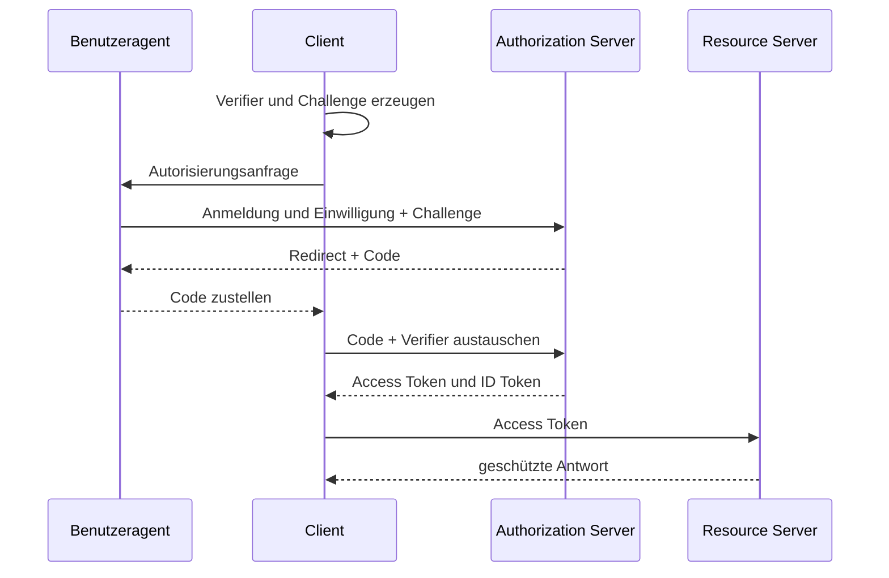



## Das Problem: Hinter einer Anmeldeschaltfläche liegen unterschiedliche Sicherheitsverträge

OAuth 2.0 ist ein Framework zur Delegation des Zugriffs auf Ressourcen.

OpenID Connect ergänzt OAuth 2.0 um eine Authentifizierungsschicht zur Übermittlung von Identitätsinformationen.

Wer beides vermischt, verursacht folgende Probleme.

- Ein Access Token wird wie ein Token für das Benutzerprofil behandelt.
- Ein ID Token wird zur API-Autorisierung verwendet.
- Redirect-URIs werden ungenau verglichen und schaffen so einen Weg für Code-Diebstahl.
- Die Zwecke von `state` und `nonce` werden verwechselt.
- Langlebige Tokens werden im Browser-Speicher aufbewahrt.
- Bei einem JWT wird nur die Signatur geprüft, nicht aber Aussteller und Zielgruppe.
- Langlebige Bearer-Zugangsdaten werden ohne Refresh-Token-Rotation ausgegeben.

Die zum Zeitpunkt der Erstellung aktuelle Sicherheitsempfehlung wird mit [OAuth 2.0 Security Best Current Practice, RFC 9700](https://www.rfc-editor.org/rfc/rfc9700.html) und [PKCE, RFC 7636](https://www.rfc-editor.org/rfc/rfc7636.html) abgeglichen.

## Denkmodell: Rollen von Artefakten trennen

### Rollen

- **Resource Owner**: Entität mit Verfügungsgewalt über eine geschützte Ressource
- **Client**: Anwendung, die delegierte Befugnisse erhält und eine API aufruft
- **Authorization Server**: Server für Benutzerfreigabe und Tokenausgabe
- **Resource Server**: Server, der Access Tokens validiert und eine geschützte API bereitstellt

### Artefakte

- **Authorization Code**: Kurzlebiger, einmalig verwendbarer Austauschwert
- **Access Token**: Autorisierungsnachweis, der einem Resource Server vorgelegt wird
- **Refresh Token**: Langlebiger Nachweis zum Erhalt eines neuen Access Tokens
- **ID Token**: Token, mit dem ein OIDC-Client ein Authentifizierungsereignis und Claims zur Benutzeridentität verifiziert

Access Tokens und ID Tokens besitzen unterschiedliche Zielgruppen und Verwendungszwecke.

### Das Risiko von Bearer Tokens

Ein Bearer Token kann von jedem verwendet werden, der ihn besitzt, ohne einen Besitznachweis zu erbringen.

Er muss daher bei Transport, Speicherung sowie in Logs und URLs vor Offenlegung geschützt werden.

Prüfen Sie selbst bei Sender-constrained Tokens ihren Geltungsbereich und die Client-Unterstützung.

## Authorization Code + PKCE Flow

Der Client bewahrt den PKCE-`code_verifier` auf.

Die Autorisierungsanfrage sendet die daraus abgeleitete `code_challenge`.

Ein Angreifer, der den Code abfängt, kann ihn ohne den Verifier nicht gegen Tokens eintauschen.

Verwenden Sie wenn möglich stets die Challenge-Methode `S256`.

## Workflow: Eine Webanwendung sicher entwerfen

### Schritt 1. Anwendungstyp und Vertrauensgrenze bestimmen

- Handelt es sich um einen serverseitigen Confidential Client?
- Handelt es sich um einen rein browserbasierten Public Client?
- Ist es eine native Anwendung?
- Kann ein Backend-for-Frontend verwendet werden?
- Ruft sie mehrere Resource Server auf?

Ein Public Client kann ein Client Secret nicht sicher aufbewahren.

Ein in Quellcode enthaltenes Geheimnis ist kein Geheimnis.

### Schritt 2. Redirect-URIs exakt registrieren

Der Authorization Server darf nur Redirects zulassen, die exakt einer registrierten URI entsprechen.

Vermeiden Sie Wildcards und offene Redirectors.

Eine native App sollte die von der Plattform empfohlene Redirect-Methode und die Loopback-Regeln befolgen.

Nach der Verarbeitung von Code und State sollte der Redirect-Endpunkt sensible Query-Parameter aus dem Browserverlauf entfernen.

### Schritt 3. State serverseitig an die Transaktion binden

Erzeugen Sie zu Beginn der Autorisierung einen starken zufälligen `state`-Wert.

Binden Sie Folgendes an den State-Datensatz.

- Browsersitzung
- Erlaubter interner Pfad für den Redirect nach der Anmeldung
- PKCE-Verifier
- Nonce
- Erstellungs- und Ablaufzeit
- Kennung des Authorization Servers

Verbrauchen Sie ihn beim Callback genau einmal.

Vertrauen Sie keiner externen URL als Redirect nach der Anmeldung, ohne sie zu validieren.

### Schritt 4. Wiederholung eines ID Tokens mit einer Nonce verhindern

Senden Sie eine Nonce in der OIDC-Autorisierungsanfrage.

Prüfen Sie, ob der Nonce-Claim im ID Token dem in der Sitzung gespeicherten Wert entspricht.

State dient der Korrelation von Anfrage und Callback sowie dem CSRF-Schutz; die Nonce bindet ein ID Token an eine bestimmte Authentifizierungsanfrage.

### Schritt 5. Den Authorization Code sicher austauschen

Senden Sie Code, Redirect-URI, Verifier und gegebenenfalls erforderliche Client-Authentifizierung an den Token-Endpunkt.

Der Code muss kurzlebig und nur einmal verwendbar sein.

Legen Sie detaillierte Gründe für Austauschfehler nicht gegenüber dem Browser offen.

Rufen Sie das Client Secret aus einem Secret Manager ab und rotieren Sie es.

### Schritt 6. Das ID Token vollständig validieren

Das Dekodieren einer JWT-Zeichenkette ist keine Validierung.

Prüfen Sie mindestens:

- Erlaubten Algorithmus
- Signatur und vertrauenswürdigen Schlüssel
- Exakten Aussteller
- Client-ID als Zielgruppe
- Ablauf- und Not-before-Zeit
- Nonce
- Regeln für Authorized Party bei mehreren Zielgruppen
- Relevante Claims, wenn ein Authentifizierungskontext erforderlich ist

Rufen Sie einen Schlüssel nicht anhand der Key-ID von einer beliebigen URL ab.

Verwenden Sie ausschließlich Discovery- und JWKS-Endpunkte eines vertrauenswürdigen Ausstellers.

Entwerfen Sie Richtlinien für Key Caching und Fehler bei der Rotation.

### Schritt 7. Das Access Token durch den Resource Server validieren lassen

Für ein opakes Token kann die Introspektion des Authorization Servers verwendet werden.

Bei einem JWT Access Token validiert der Resource Server Aussteller, Zielgruppe, Signatur, Ablauf und Scope.

Der Client darf die endgültige Autorisierungsentscheidung nicht anhand interner Claims des Tokens treffen.

Scopes können grobgranulare Berechtigungen sein; prüfen Sie Ressourceneigentum und Geschäftsrichtlinien separat.

### Schritt 8. Minimalen Scope und minimale Zielgruppe anfordern

Trennen Sie für die Anmeldung benötigte Scopes von Scopes zur API-Autorisierung.

Fordern Sie keinen Offline-Zugriff an, wenn er nicht verwendet wird.

Schränken Sie die Zielgruppe so ein, dass ein Token nicht für mehrere APIs wiederverwendet werden kann.

Eine Rechteerhöhung kann eine erneute Einwilligung oder Step-up-Authentifizierung erfordern.

### Schritt 9. Die Grenze der Tokenspeicherung definieren

Eine serverseitige Webanwendung kann Tokens in einem serverseitigen Sitzungsspeicher aufbewahren und dem Browser nur ein sicheres Sitzungscookie geben.

Wenden Sie auf das Cookie `Secure`, `HttpOnly`, eine geeignete `SameSite`-Einstellung, kurze Lebensdauer und Rotation an.

Wenn Browser-JavaScript ein Token halten muss, bewerten Sie neben Memory-only-Speicherung, CSP und Refresh-Strategie auch die Auswirkung von XSS.

Vermeiden Sie dauerhafte lokale Speicherung von Tokens als Standard.

### Schritt 10. Refresh Tokens rotieren und Wiederverwendung erkennen

Wenn einem Public Client ein Refresh Token ausgegeben wird, verwenden Sie Rotation.

Taucht ein bereits verwendetes Refresh Token erneut auf, wurde die Tokenfamilie möglicherweise gestohlen.

Widerrufen Sie die Familie und verlangen Sie erneute Authentifizierung.

Legen Sie absolute Lebensdauer und Inaktivitätsdauer getrennt fest.

### Schritt 11. Den Umfang des Logout explizit angeben

Das Beenden der lokalen Sitzung, das Beenden der Sitzung beim Authorization Server und das Widerrufen von Tokens sind unterschiedliche Vorgänge.

Machen Sie dem Benutzer klar, welcher Umfang beendet wird.

Verhindern Sie Logout-CSRF und offene Redirects.

Prüfen Sie für Back-channel- oder Front-channel-Logout die Unterstützung des Anbieters und Fehlermodi.

## Beispiel für API-Autorisierung

Middleware des Resource Servers arbeitet in folgenden Schritten.

1. Format des Authorization-Headers prüfen.
2. Eine erlaubte Ausstellerkonfiguration auswählen.
3. Algorithmus fest vorgeben, um Algorithm Confusion zu verhindern.
4. Schlüssel in einem vertrauenswürdigen JWKS finden.
5. Signatur und Zeit-Claims validieren.
6. API-spezifische Zielgruppe validieren.
7. Vom Endpunkt benötigten Scope prüfen.
8. Geschäftliche Beziehung zwischen Subject und Ressource prüfen.
9. Entscheidung ohne sensible Claims in einem Auditprotokoll erfassen.

Verwenden Sie 401, wenn Authentifizierungsdaten fehlen oder ungültig sind.

Verwenden Sie 403, wenn der Client authentifiziert ist, aber nicht über die Berechtigung verfügt.

Die tatsächliche Antwortrichtlinie sollte auch das Risiko berücksichtigen, die Existenz einer Ressource offenzulegen.

## Bedrohungsorientierte Tests

### Abfangen des Codes

Prüfen Sie, dass ein gültiger Code mit einem ungültigen Verifier abgelehnt wird.

### Nicht übereinstimmender State

Prüfen Sie, dass ein Callback aus einer anderen Browsersitzung abgelehnt wird.

### Wiederholung der Nonce

Reichen Sie ein früheres ID Token in einer neuen Anmeldetransaktion ein und prüfen Sie seine Ablehnung.

### Verwechslung des Ausstellers

Lehnen Sie ein wohlgeformtes Token eines nicht erlaubten Ausstellers ab.

### Verwechslung der Zielgruppe

Lehnen Sie ein Token ab, das für eine andere API oder einen anderen Client bestimmt ist.

### Manipulation des Redirects

Testen Sie nicht registrierte URIs, Wildcard- und kodierte Varianten.

### Wiederverwendung eines Refresh Tokens

Prüfen Sie, dass die Wiederverwendung eines Tokens von vor der Rotation die Familie widerruft.

## Checkliste zur Validierung

### Client

- [ ] Authorization Code mit PKCE S256 verwenden.
- [ ] Nicht auf den Implicit Flow verlassen.
- [ ] Redirect-URIs mit exaktem Abgleich verwalten.
- [ ] State, Nonce und Verifier an die Transaktion binden.
- [ ] Nach der Anmeldung nur Pfade aus einer Allowlist oder interne Pfade für Redirects zulassen.
- [ ] Sicherstellen, dass Codes und Tokens nicht in URLs oder Logs verbleiben.

### Tokenvalidierung

- [ ] Aussteller und Zielgruppe exakt abgleichen.
- [ ] Erlaubten Algorithmus fest vorgeben.
- [ ] Signatur, Ablauf und Nonce validieren.
- [ ] JWKS nur von einem vertrauenswürdigen Endpunkt abrufen.
- [ ] Schlüsselrotation und Abruffehler testen.
- [ ] Verwendungszwecke von Access Tokens und ID Tokens trennen.

### Sitzungen und Autorisierung

- [ ] Sichere Cookie-Attribute setzen.
- [ ] Scopes minimieren.
- [ ] Autorisierung auf Ressourcenebene durchführen.
- [ ] Refresh-Token-Rotation und Erkennung der Wiederverwendung implementieren.
- [ ] Umfang von Logout und Widerruf dokumentieren.
- [ ] Sicherheitsereignisse ohne sensible Tokens auditieren.

## Häufige Fehler und Grenzen

### JWTs für verschlüsselte Informationen halten

Die Payload eines typischen signierten JWT ist lesbar.

Legen Sie keine unnötigen sensiblen Informationen in Claims ab.

### Nur die Signatur validieren

Auch ein gültig signiertes Token für eine andere Zielgruppe oder einen anderen Aussteller kann für einen Angriff verwendet werden.

### OAuth als gesamtes Autorisierungsmodell der Anwendung behandeln

Scopes und Tokens sind ein Ausgangspunkt.

Die Anwendung muss Organisation, Ressourceneigentum und zustandsbasierte Geschäftsautorisierung bewerten.

### Glauben, Browser-Logout mache Tokens sofort ungültig

Ein bereits ausgegebenes Access Token kann bis zu seinem Ablauf gültig bleiben.

Entwerfen Sie die Abwägung zwischen kurzer Lebensdauer, Widerruf und Introspektion.

### Einen Authentifizierungsserver beiläufig selbst implementieren

Randfälle des Protokolls sowie Schlüssel-, Sitzungs- und Wiederherstellungsbetrieb sind komplex.

Verwenden Sie bewährte Bibliotheken und Plattformen und unterziehen Sie Erweiterungen einem Threat Modeling und Interoperabilitätstests.

## Offizielle Referenzen

- [OAuth 2.0 Authorization Framework, RFC 6749](https://www.rfc-editor.org/rfc/rfc6749.html)
- [OAuth 2.0 Security Best Current Practice, RFC 9700](https://www.rfc-editor.org/rfc/rfc9700.html)
- [Proof Key for Code Exchange, RFC 7636](https://www.rfc-editor.org/rfc/rfc7636.html)
- [OpenID Connect Core 1.0](https://openid.net/specs/openid-connect-core-1_0.html)
- [OAuth 2.0 für native Apps, RFC 8252](https://www.rfc-editor.org/rfc/rfc8252.html)

## Fazit

Um OAuth 2.0 und OIDC sicher einzusetzen, müssen die Grenzen zwischen Rollen, Tokens, Zielgruppen und Browsersitzungen getrennt werden.

Machen Sie Authorization Code + PKCE, exakte Redirects, vollständige Tokenvalidierung, minimale Scopes und Rotation zum Standard.

Wichtiger als eine erfolgreiche Anmeldeseite ist der Nachweis, dass Code und Tokens in eine einzige Transaktion gebunden sind, die ein Angreifer nicht verändern kann.
