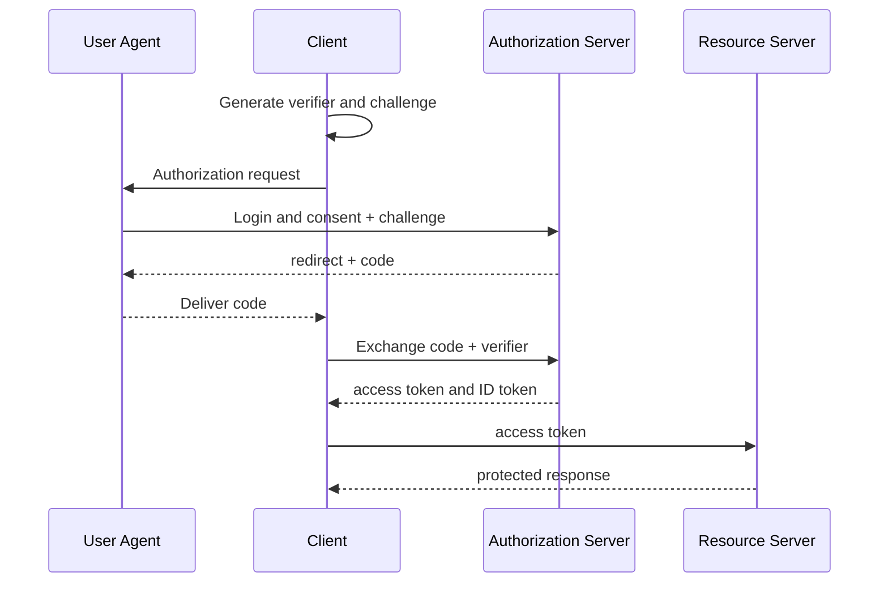



## The problem: Different security contracts lie behind a login button

OAuth 2.0 is a framework for delegating access to resources.

OpenID Connect adds an authentication layer on top of OAuth 2.0 to convey identity information.

Conflating the two leads to the following problems.

- Treating an access token as if it were a user profile token.
- Using an ID token for API authorization.
- Comparing redirect URIs loosely and thereby creating a path for code theft.
- Confusing the purposes of `state` and `nonce`.
- Keeping long-lived tokens in browser storage.
- Checking only a JWT's signature, without checking its issuer and audience.
- Issuing long-lived bearer credentials without refresh token rotation.

The security guidance current at the time of writing is reviewed against [OAuth 2.0 Security Best Current Practice, RFC 9700](https://www.rfc-editor.org/rfc/rfc9700.html) and [PKCE, RFC 7636](https://www.rfc-editor.org/rfc/rfc7636.html).

## Mental model: Separate roles from artifacts

### Roles

- **Resource Owner**: The entity that has authority over a protected resource
- **Client**: The application that receives delegated authority and calls an API
- **Authorization Server**: The server responsible for user approval and token issuance
- **Resource Server**: The server that validates access tokens and provides a protected API

### Artifacts

- **Authorization Code**: A short-lived, one-time exchange value
- **Access Token**: An authorization credential presented to a resource server
- **Refresh Token**: A long-lived credential used to obtain a new access token
- **ID Token**: A token with which an OIDC client verifies an authentication event and user identity claims

Access tokens and ID tokens have different audiences and uses.

### The risk of bearer tokens

A bearer token can be used by anyone who possesses it, without proof of possession.

It must therefore be protected from exposure in transit, storage, logs, and URLs.

Even when using sender-constrained tokens, verify their scope of application and client support.

## Authorization Code + PKCE flow

The client retains PKCE's `code_verifier`.

The authorization request sends the `code_challenge` derived from it.

An attacker who intercepts the code cannot exchange it for tokens without the verifier.

Use the `S256` challenge method whenever possible.

## Workflow: Securely designing a web application

### Step 1. Determine the application type and trust boundary

- Is it a server-side confidential client?
- Is it a browser-only public client?
- Is it a native application?
- Can you use a backend-for-frontend?
- Does it call multiple resource servers?

A public client cannot securely retain a client secret.

A secret included in source code is not a secret.

### Step 2. Register redirect URIs exactly

The authorization server must permit only redirects that exactly match a registered URI.

Avoid wildcards and open redirectors.

A native app should follow the platform-recommended redirect method and loopback rules.

After processing the code and state, the redirect endpoint should remove sensitive query parameters from the browser history.

### Step 3. Bind state to the transaction on the server side

Generate a strong random `state` value when authorization begins.

Bind the following to the state record.

- Browser session
- Allowed internal path for the post-login redirect
- PKCE verifier
- Nonce
- Creation and expiration times
- Authorization server identifier

Consume it exactly once at the callback.

Do not trust an external URL as a post-login redirect without validation.

### Step 4. Prevent ID token replay with a nonce

Send a nonce in the OIDC authorization request.

Verify that the nonce claim in the ID token matches the value stored in the session.

State is used for request/callback correlation and CSRF defense; the nonce binds an ID token to a specific authentication request.

### Step 5. Exchange the authorization code securely

Send the code, redirect URI, verifier, and any required client authentication to the token endpoint.

The code must be short-lived and usable only once.

Do not expose detailed exchange failure reasons to the browser.

Retrieve the client secret from a secret manager and rotate it.

### Step 6. Validate the ID token completely

Decoding a JWT string is not validation.

At minimum, check the following.

- Allowed algorithm
- Signature and trusted key
- Exact issuer
- Client ID audience
- Expiration and not-before times
- Nonce
- Authorized party rules when there are multiple audiences
- Relevant claims when an authentication context is required

Do not fetch a key from an arbitrary URL based on the key ID.

Use only the discovery and JWKS endpoints of a trusted issuer.

Design policies for key caching and rotation failures.

### Step 7. Let the resource server validate the access token

For an opaque token, authorization server introspection can be used.

For a JWT access token, the resource server validates the issuer, audience, signature, expiry, and scope.

The client must not make the final authorization decision based on the token's internal claims.

Scopes may be coarse-grained grants; check resource ownership and business policies separately.

### Step 8. Request the minimum scope and audience

Separate scopes needed for login from API authorization scopes.

Do not request offline access when it is not used.

Restrict the audience so that a token cannot be reused across multiple APIs.

Privilege elevation may require renewed consent or step-up authentication.

### Step 9. Define the token storage boundary

A server-side web app can retain tokens in a server session store and give the browser only a secure session cookie.

Apply `Secure`, `HttpOnly`, an appropriate `SameSite` setting, a short lifetime, and rotation to the cookie.

If browser JavaScript must hold a token, assess the impact of XSS as well as memory-only storage, CSP, and the refresh strategy.

Avoid making long-term local storage of tokens the default.

### Step 10. Rotate refresh tokens and detect reuse

If issuing a refresh token to a public client, use rotation.

If a refresh token that has already been used appears again, the token family may have been stolen.

Revoke the family and require reauthentication.

Set the absolute lifetime and inactivity lifetime separately.

### Step 11. State the scope of logout explicitly

Ending the local session, ending the authorization server session, and revoking tokens are different operations.

Make clear to the user which scope is being terminated.

Prevent logout CSRF and open redirects.

For back-channel or front-channel logout features, review provider support and failure modes.

## API authorization example

Resource server middleware operates in the following steps.

1. Check the format of the Authorization header.
2. Select an allowed issuer configuration.
3. Pin the algorithm to prevent algorithm confusion.
4. Find the key in a trusted JWKS.
5. Validate the signature and time claims.
6. Validate the API-specific audience.
7. Check the scope required by the endpoint.
8. Check the business relationship between the subject and the resource.
9. Record the decision in an audit log without sensitive claims.

Use 401 when authentication credentials are absent or invalid.

Use 403 when the client is authenticated but lacks permission.

The actual response policy should also consider the risk of revealing whether a resource exists.

## Threat-focused tests

### Code interception

Verify that a valid code paired with an invalid verifier is rejected.

### State mismatch

Verify that a callback from a different browser session is rejected.

### Nonce replay

Submit a previous ID token in a new login transaction and verify that it is rejected.

### Issuer confusion

Reject a well-formed token from an issuer that is not allowed.

### Audience confusion

Reject a token intended for another API or client.

### Redirect manipulation

Test unregistered URIs, wildcard variations, and encoded variations.

### Refresh reuse

Verify that reusing a pre-rotation token revokes the family.

## Validation checklist

### Client

- [ ] Use Authorization Code with PKCE S256.
- [ ] Do not rely on the implicit flow.
- [ ] Manage redirect URIs using exact matching.
- [ ] Bind state, nonce, and verifier to the transaction.
- [ ] Allow only allowlisted or internal paths for post-login redirects.
- [ ] Ensure that codes and tokens do not remain in URLs or logs.

### Token validation

- [ ] Exactly match the issuer and audience.
- [ ] Pin the allowed algorithm.
- [ ] Validate the signature, expiry, and nonce.
- [ ] Fetch the JWKS only from a trusted endpoint.
- [ ] Test key rotation and fetch failures.
- [ ] Separate the uses of access tokens and ID tokens.

### Sessions and authorization

- [ ] Set secure cookie attributes.
- [ ] Minimize scopes.
- [ ] Perform resource-level authorization.
- [ ] Implement refresh token rotation and reuse detection.
- [ ] Document the scope of logout and revocation.
- [ ] Audit security events without sensitive tokens.

## Common failures and limitations

### Mistaking JWTs for encrypted information

The payload of a typical signed JWT is readable.

Do not place unnecessary sensitive information in claims.

### Validating only the signature

A validly signed token for another audience or issuer can also be used in an attack.

### Treating OAuth as the application's entire authorization model

Scopes and tokens are a starting point.

The application must evaluate organization, resource ownership, and state-based business authorization.

### Believing that browser logout immediately invalidates tokens

An access token that has already been issued may remain valid until it expires.

Design the trade-offs among short lifetimes, revocation, and introspection.

### Attempting to implement an authentication server casually

Protocol edge cases and key, session, and recovery operations are complex.

Use proven libraries and platforms, and subject extensions to threat modeling and interoperability tests.

## Official references

- [OAuth 2.0 Authorization Framework, RFC 6749](https://www.rfc-editor.org/rfc/rfc6749.html)
- [OAuth 2.0 Security Best Current Practice, RFC 9700](https://www.rfc-editor.org/rfc/rfc9700.html)
- [Proof Key for Code Exchange, RFC 7636](https://www.rfc-editor.org/rfc/rfc7636.html)
- [OpenID Connect Core 1.0](https://openid.net/specs/openid-connect-core-1_0.html)
- [OAuth 2.0 for Native Apps, RFC 8252](https://www.rfc-editor.org/rfc/rfc8252.html)

## Conclusion

To use OAuth 2.0 and OIDC securely, separate the boundaries among roles, tokens, audiences, and browser sessions.

Make Authorization Code + PKCE, exact redirects, complete token validation, minimal scopes, and rotation the defaults.

More important than a successful login screen is evidence that the code and tokens are bound into a single transaction that an attacker cannot alter.
