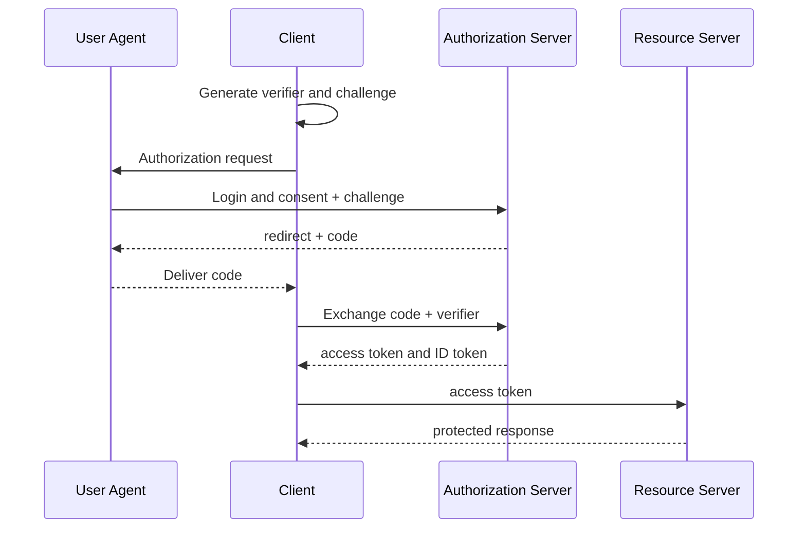



## El problema: detrás de un botón de inicio de sesión se esconden diferentes contratos de seguridad

OAuth 2.0 es un marco para delegar el acceso a recursos.

OpenID Connect agrega una capa de autenticación además de OAuth 2.0 para transmitir información de identidad.

Combinar los dos conduce a los siguientes problemas.

- Tratar un token de acceso como si fuera un token de perfil de usuario.
- Usar un token ID para la autorización API.
- Comparar los URI de redireccionamiento de manera flexible y, por lo tanto, crear una ruta para el robo de código.
- Confundir los propósitos de `state` y `nonce`.
- Mantener tokens de larga duración en el almacenamiento del navegador.
- Verificar solo la firma de JWT, sin verificar su emisor y audiencia.
- Emitir credenciales de portador de larga duración sin rotación de token de actualización.

La guía de seguridad vigente en el momento de escribir este artículo se revisa con [Mejores prácticas actuales de seguridad de OAuth 2.0, RFC 9700](https://www.rfc-editor.org/rfc/rfc9700.html) y [PKCE, RFC 7636](https://www.rfc-editor.org/rfc/rfc7636.html).

## Modelo mental: roles separados de artefactos

### Roles

- **Propietario del recurso**: la entidad que tiene autoridad sobre un recurso protegido
- **Cliente**: la aplicación que recibe autoridad delegada y llama a un API
- **Servidor de autorización**: el servidor responsable de la aprobación del usuario y la emisión de tokens.
- **Servidor de recursos**: el servidor que valida los tokens de acceso y proporciona un API protegido

### Artefactos

- **Código de autorización**: un valor de cambio único y de corta duración
- **Token de acceso**: una credencial de autorización presentada a un servidor de recursos
- **Refresh Token**: una credencial de larga duración que se utiliza para obtener un nuevo token de acceso.
- **ID Token**: un token con el que un cliente OIDC verifica un evento de autenticación y reclamaciones de identidad del usuario.

Los tokens de acceso y los tokens ID tienen diferentes audiencias y usos.

### El riesgo de los tokens al portador

Un token al portador puede ser utilizado por cualquier persona que lo posea, sin prueba de posesión.

Por lo tanto, debe protegerse de la exposición durante el tránsito, el almacenamiento, los registros y las URL.

Incluso cuando utilice tokens restringidos por el remitente, verifique su alcance de aplicación y soporte al cliente.

## Código de autorización + flujo PKCE

El cliente conserva el `code_verifier` de PKCE.

La solicitud de autorización envía el `code_challenge` derivado de la misma.

Un atacante que intercepta el código no puede cambiarlo por tokens sin el verificador.

Utilice el método de desafío `S256` siempre que sea posible.

## Flujo de trabajo: diseño seguro de una aplicación web

### Paso 1. Determinar el tipo de aplicación y el límite de confianza

- ¿Es un cliente confidencial del lado del servidor?
- ¿Es un cliente público sólo para navegador?
- ¿Es una aplicación nativa?
- ¿Puedes utilizar un backend para frontend?
- ¿Llama a varios servidores de recursos?

Un cliente público no puede retener de forma segura el secreto de un cliente.

Un secreto incluido en el código fuente no es un secreto.

### Paso 2. Registrar exactamente los URI de redireccionamiento

El servidor de autorización debe permitir únicamente redireccionamientos que coincidan exactamente con un URI registrado.

Evite comodines y redirectores abiertos.

Una aplicación nativa debe seguir el método de redireccionamiento y las reglas de bucle invertido recomendados por la plataforma.

Después de procesar el código y el estado, el punto final de redireccionamiento debería eliminar los parámetros de consulta confidenciales del historial del navegador.

### Paso 3. Vincular el estado a la transacción en el lado del servidor

Genere un valor `state` aleatorio fuerte cuando comience la autorización.

Vincule lo siguiente al registro estatal.

- Sesión del navegador
- Ruta interna permitida para la redirección posterior al inicio de sesión
- Verificador PKCE
-Nonce
- Tiempos de creación y caducidad.
- Identificador del servidor de autorización

Consúmelo exactamente una vez en la devolución de llamada.

No confíe en un URL externo como redireccionamiento posterior al inicio de sesión sin validación.

### Paso 4. Evite la reproducción del token ID con un nonce

Envíe un nonce en la solicitud de autorización OIDC.

Verifique que el reclamo nonce en el token ID coincida con el valor almacenado en la sesión.

El estado se utiliza para la correlación de solicitud/devolución de llamada y la defensa CSRF; el nonce vincula un token ID a una solicitud de autenticación específica.

### Paso 5. Intercambie el código de autorización de forma segura

Envíe el código, redirija URI, el verificador y cualquier autenticación de cliente requerida al punto final del token.

El código debe ser de corta duración y utilizarse sólo una vez.

No exponga los motivos detallados del error de intercambio al navegador.

Recupere el secreto del cliente de un administrador de secretos y gírelo.

### Paso 6. Validar completamente el token ID

Decodificar una cadena JWT no es validación.

Como mínimo, verifique lo siguiente.

- Algoritmo permitido
- Firma y clave de confianza
- Emisor exacto
- Cliente ID audiencia
- Vencimientos y no antes
-Nonce
- Reglas del partido autorizado cuando hay múltiples audiencias
- Reclamaciones relevantes cuando se requiere un contexto de autenticación

No obtenga una clave de un URL arbitrario basado en la clave ID.

Utilice únicamente los puntos finales de descubrimiento y JWKS de un emisor confiable.

Diseñar políticas para fallas de rotación y almacenamiento en caché de claves.

### Paso 7. Deje que el servidor de recursos valide el token de acceso

Para un token opaco, se puede utilizar la introspección del servidor de autorización.

Para un token de acceso JWT, el servidor de recursos valida el emisor, la audiencia, la firma, el vencimiento y el alcance.

El cliente no debe tomar la decisión de autorización final basándose en las afirmaciones internas del token.

Los alcances pueden ser subvenciones generales; verifique la propiedad de los recursos y las políticas comerciales por separado.

### Paso 8. Solicitar el alcance y audiencia mínimos

Separe los ámbitos necesarios para iniciar sesión de los ámbitos de autorización API.

No solicite acceso sin conexión cuando no se utilice.

Restrinja la audiencia para que un token no se pueda reutilizar en varias API.

La elevación de privilegios puede requerir un consentimiento renovado o una autenticación intensificada.

### Paso 9. Definir el límite de almacenamiento del token

Una aplicación web del lado del servidor puede retener tokens en un almacén de sesiones del servidor y proporcionar al navegador solo una cookie de sesión segura.

Aplique `Secure`, `HttpOnly`, una configuración `SameSite` adecuada, una vida útil corta y rotación de la cookie.

Si el JavaScript del navegador debe contener un token, evalúe el impacto de XSS así como el almacenamiento de solo memoria, CSP y la estrategia de actualización.

Evite que el almacenamiento local de tokens a largo plazo sea el predeterminado.

### Paso 10. Rotar los tokens de actualización y detectar la reutilización

Si emite un token de actualización a un cliente público, utilice la rotación.

Si vuelve a aparecer un token de actualización que ya se ha utilizado, es posible que la familia de tokens haya sido robada.

Revocar la familia y exigir reautenticación.

Establezca la vida útil absoluta y la vida útil de inactividad por separado.

### Paso 11. Indique explícitamente el alcance del cierre de sesión

Finalizar la sesión local, finalizar la sesión del servidor de autorización y revocar tokens son operaciones diferentes.

Deje claro al usuario qué alcance se está cancelando.

Evite el cierre de sesión CSRF y abra redireccionamientos.

Para conocer las funciones de cierre de sesión del canal posterior o frontal, revise el soporte del proveedor y los modos de falla.

## ejemplo de autorización API

El middleware del servidor de recursos funciona en los siguientes pasos.

1. Verifique el formato del encabezado de Autorización.
2. Seleccione una configuración de emisor permitida.
3. Fije el algoritmo para evitar confusiones.
4. Busque la clave en un JWKS de confianza.
5. Validar los reclamos de firma y tiempo.
6. Valide la API-audiencia específica.
7. Verifique el alcance requerido por el punto final.
8. Verificar la relación comercial entre el sujeto y el recurso.
9. Registre la decisión en un registro de auditoría sin reclamos confidenciales.

Utilice 401 cuando las credenciales de autenticación no existan o no sean válidas.

Utilice 403 cuando el cliente esté autenticado pero carezca de permiso.

La política de respuesta real también debería considerar el riesgo de revelar si existe un recurso.

## Pruebas centradas en amenazas

### Intercepción de código

Verifique que se rechace un código válido emparejado con un verificador no válido.

### Estado no coincidente

Verifique que se rechace una devolución de llamada de una sesión de navegador diferente.

### No hay repetición

Envíe un token ID anterior en una nueva transacción de inicio de sesión y verifique que sea rechazado.

### Confusión del emisor

Rechazar un token bien formado de un emisor que no esté permitido.

### Confusión de la audiencia

Rechazar un token destinado a otro API o cliente.

### Manipulación de redireccionamiento

Pruebe URI no registrados, variaciones con comodines y variaciones codificadas.

### Actualizar reutilización

Verifique que la reutilización de un token previo a la rotación revoca la familia.

## Lista de verificación de validación

### Cliente

- [ ] Usar código de autorización con PKCE S256.
- [ ] No confíe en el flujo implícito.
- [] Administrar URI de redireccionamiento utilizando coincidencias exactas.
- [] Vincular estado, nonce y verificador a la transacción.
- [] Permitir solo rutas internas o incluidas en la lista permitida para redireccionamientos posteriores al inicio de sesión.
- [] Asegúrese de que los códigos y tokens no permanezcan en URL o registros.

### Validación de tokens

- [ ] Coincide exactamente con el emisor y la audiencia.
- [] Fijar el algoritmo permitido.
- [ ] Validar la firma, caducidad y nonce.
- [] Obtenga el JWKS solo desde un punto final confiable.
- [] Prueba de rotación de claves y fallas de recuperación.
- [] Separe los usos de los tokens de acceso y los tokens ID.

### Sesiones y autorización

- [] Establecer atributos de cookies seguras.
- [] Minimizar alcances.
- [] Realizar autorización a nivel de recursos.
- [] Implementar la rotación de tokens de actualización y la detección de reutilización.
- [ ] Documentar el alcance del cierre de sesión y la revocación.
- [] Auditar eventos de seguridad sin tokens confidenciales.

## Fallos y limitaciones comunes

### Confundir JWT con información cifrada

La carga útil de un JWT típico firmado es legible.

No incluya información confidencial innecesaria en los reclamos.

### Validando solo la firma

También se puede utilizar en un ataque un token firmado válidamente para otra audiencia o emisor.

### Tratar a OAuth como el modelo de autorización completo de la aplicación

Los alcances y los tokens son un punto de partida.

La solicitud debe evaluar la organización, la propiedad de los recursos y la autorización comercial estatal.

### Creer que cerrar sesión en el navegador invalida inmediatamente los tokens

Un token de acceso que ya haya sido emitido puede seguir siendo válido hasta que caduque.

Diseñe las compensaciones entre vidas cortas, revocación e introspección.

### Intentando implementar un servidor de autenticación casualmente

Los casos extremos de protocolo y las operaciones de clave, sesión y recuperación son complejos.

Utilice bibliotecas y plataformas comprobadas y someta las extensiones a pruebas de interoperabilidad y modelado de amenazas.

## Referencias oficiales

- [Marco de autorización de OAuth 2.0, RFC 6749](https://www.rfc-editor.org/rfc/rfc6749.html)
- [Mejores prácticas actuales de seguridad de OAuth 2.0, RFC 9700](https://www.rfc-editor.org/rfc/rfc9700.html)
- [Clave de prueba para intercambio de códigos, RFC 7636](https://www.rfc-editor.org/rfc/rfc7636.html)
- [OpenID Conectar núcleo 1.0](https://openid.net/specs/openid-connect-core-1_0.html)
- [OAuth 2.0 para aplicaciones nativas, RFC 8252](https://www.rfc-editor.org/rfc/rfc8252.html)

## Conclusión

Para utilizar OAuth 2.0 y OIDC de forma segura, separe los límites entre roles, tokens, audiencias y sesiones de navegador.

Cree el código de autorización + PKCE, redirecciones exactas, validación completa del token, alcances mínimos y rotación de los valores predeterminados.

Más importante que una pantalla de inicio de sesión exitosa es la evidencia de que el código y los tokens están vinculados a una sola transacción que un atacante no puede alterar.
