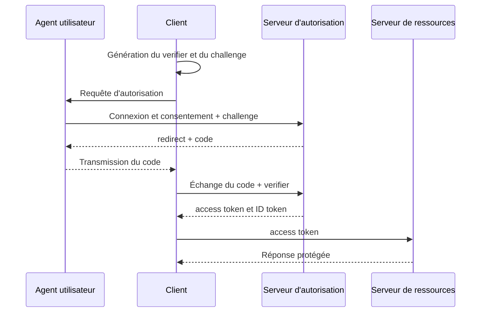



## Problème : derrière un bouton de connexion se cachent plusieurs contrats de sécurité

OAuth 2.0 est un cadre de délégation des droits d’accès à une ressource.

OpenID Connect ajoute à OAuth 2.0 une couche d’authentification qui transmet des informations d’identité.

Les confondre entraîne les problèmes suivants.

- Interpréter un access token comme un jeton de profil utilisateur.
- Utiliser un ID token pour l’autorisation d’une API.
- Comparer les redirect URI de manière trop permissive et créer une voie de vol du code.
- Confondre les objectifs de `state` et de `nonce`.
- Stocker des jetons à longue durée de vie dans le navigateur.
- Vérifier uniquement la signature JWT sans contrôler l’émetteur ni l’audience.
- Émettre un credential bearer de longue durée sans rotation du refresh token.

Les recommandations de sécurité en vigueur au moment de la rédaction sont examinées à la lumière de l’[OAuth 2.0 Security Best Current Practice, RFC 9700](https://www.rfc-editor.org/rfc/rfc9700.html) et de [PKCE, RFC 7636](https://www.rfc-editor.org/rfc/rfc7636.html).

## Modèle mental : séparer les rôles et les artefacts

### Rôles

- **Resource Owner** : entité détenant les droits sur la ressource protégée ;
- **Client** : application qui reçoit la délégation et appelle l’API ;
- **Authorization Server** : serveur chargé du consentement de l’utilisateur et de l’émission des jetons ;
- **Resource Server** : serveur qui valide l’access token et fournit l’API protégée.

### Artefacts

- **Authorization Code** : valeur d’échange à usage unique et de courte durée ;
- **Access Token** : credential d’autorisation présenté au resource server ;
- **Refresh Token** : credential à longue durée de vie permettant d’obtenir un nouvel access token ;
- **ID Token** : jeton qui permet au client OIDC de vérifier l’événement d’authentification et les claims d’identité de l’utilisateur.

L’access token et l’ID token ont des audiences et des usages différents.

### Risque des bearer tokens

Toute personne qui possède un bearer token peut l’utiliser sans preuve de possession.

Il faut donc éviter son exposition pendant le transport, le stockage, dans les journaux et dans les URL.

Même avec des jetons liés à l’émetteur, vérifiez leur champ d’application et la prise en charge par le client.

## Flux Authorization Code + PKCE

Le client conserve le `code_verifier` de PKCE.

La requête d’autorisation contient le `code_challenge` qui en est dérivé.

Un attaquant qui intercepte le code ne dispose pas du verifier et ne peut donc pas l’échanger contre un jeton.

Utilisez si possible la méthode de challenge `S256`.

## Workflow : concevoir une application web sûre

### Étape 1. Définir le type d’application et la frontière de confiance

- S’agit-il d’un client confidentiel côté serveur ?
- S’agit-il d’un client public fonctionnant uniquement dans le navigateur ?
- S’agit-il d’une application native ?
- Peut-on mettre en place un backend-for-frontend ?
- Plusieurs resource servers seront-ils appelés ?

Un client public ne peut pas conserver un client secret de manière sûre.

Un secret inclus dans le code source n’est pas un secret.

### Étape 2. Enregistrer précisément la redirect URI

Le serveur d’autorisation ne doit accepter que les redirects correspondant exactement à une URI enregistrée.

Évitez les jokers et les redirecteurs ouverts.

Une application native doit suivre la méthode de redirect recommandée par sa plateforme et les règles de loopback.

Après avoir traité le code et le state, l’endpoint de redirect doit retirer la requête sensible de l’historique du navigateur.

### Étape 3. Lier le state et la transaction côté serveur

Au début de l’autorisation, générez un `state` aléatoire robuste.

L’enregistrement du state doit relier :

- la session du navigateur ;
- le chemin interne autorisé après la connexion ;
- le verifier PKCE ;
- le nonce ;
- les heures de création et d’expiration ;
- l’identifiant du serveur d’autorisation.

Consommez-le une seule fois dans le callback.

Ne faites jamais confiance à une URL externe fournie telle quelle pour la redirect après connexion.

### Étape 4. Empêcher le rejeu de l’ID token avec un nonce

Envoyez un nonce dans la requête d’autorisation OIDC.

Vérifiez que le claim nonce de l’ID token correspond à la valeur enregistrée dans la session.

Le state sert à mettre en corrélation la requête et le callback et à contrer les attaques CSRF ; le nonce lie l’ID token à une requête d’authentification précise.

### Étape 5. Échanger l’authorization code en sécurité

Envoyez au token endpoint le code, la redirect URI, le verifier et, si nécessaire, l’authentification du client.

Le code doit être à usage unique et de courte durée.

N’exposez pas dans le navigateur les détails de la cause d’un échec d’échange.

Récupérez le client secret depuis un gestionnaire de secrets et faites-le tourner.

### Étape 6. Valider entièrement l’ID token

Décoder une chaîne JWT ne constitue pas une validation.

Vérifiez au minimum :

- l’algorithme autorisé ;
- la signature et la clé de confiance ;
- l’émetteur exact ;
- l’audience correspondant à l’ID du client ;
- l’expiration et la date de début de validité ;
- le nonce ;
- les règles relatives à la partie autorisée en cas d’audiences multiples ;
- les claims pertinents lorsqu’un contexte d’authentification est requis.

Ne récupérez pas une clé depuis une URL arbitraire indiquée par son identifiant de clé.

Utilisez uniquement les endpoints de découverte et JWKS de l’émetteur de confiance.

Concevez la mise en cache des clés et la politique applicable en cas d’échec de rotation.

### Étape 7. Faire valider l’access token par le resource server

Pour un jeton opaque, le resource server peut utiliser l’introspection du serveur d’autorisation.

Pour un access token JWT, il valide l’émetteur, l’audience, la signature, l’expiration et le scope.

Le client ne doit pas remplacer la décision finale d’autorisation en lisant lui-même les claims internes du jeton.

Le scope peut n’être qu’une permission grossière ; la propriété de la ressource et les règles métier doivent être contrôlées séparément.

### Étape 8. Demander le scope et l’audience minimaux

Séparez les scopes nécessaires à la connexion de ceux qui donnent accès aux API.

Ne demandez pas d’accès hors ligne s’il n’est pas utilisé.

Limitez l’audience afin d’empêcher la réutilisation du même jeton sur plusieurs API.

Une nouvelle approbation ou une authentification renforcée peut être nécessaire pour une élévation de privilèges.

### Étape 9. Définir la frontière de stockage des jetons

Une application web côté serveur peut conserver les jetons dans son magasin de sessions et ne remettre au navigateur qu’un cookie de session sécurisé.

Appliquez au cookie `Secure`, `HttpOnly`, un attribut `SameSite` adapté, une courte durée de vie et une rotation.

Si l’architecture exige que le JavaScript du navigateur possède un jeton, examinez les conséquences d’une faille XSS, le stockage en mémoire seulement, la CSP et la stratégie de rafraîchissement.

Évitez de conserver par défaut des jetons de longue durée dans le stockage local.

### Étape 10. Faire tourner les refresh tokens et détecter leur réutilisation

Si un refresh token est émis à un client public, utilisez la rotation.

La réapparition d’un refresh token déjà utilisé peut indiquer le vol de toute la famille de jetons.

Révoquez cette famille et exigez une nouvelle authentification.

Définissez séparément la durée de vie absolue et celle liée à l’inactivité.

### Étape 11. Expliciter la portée de la déconnexion

La fin de la session locale, celle de la session sur le serveur d’autorisation et la révocation des jetons sont trois opérations différentes.

Indiquez clairement à l’utilisateur quelle portée prend fin.

Empêchez les attaques CSRF de déconnexion et les redirects ouverts.

Pour les fonctions de déconnexion back-channel ou front-channel, examinez la prise en charge du fournisseur et les modes de défaillance.

## Exemple d’autorisation d’API

Le middleware du resource server suit les étapes suivantes.

1. Vérifier le format de l’en-tête Authorization.
2. Choisir une configuration d’émetteur autorisée.
3. Fixer l’algorithme afin d’empêcher toute confusion d’algorithme.
4. Rechercher la clé dans un JWKS de confiance.
5. Valider la signature et les claims temporels.
6. Valider l’audience propre à l’API.
7. Vérifier le scope requis par l’endpoint.
8. Vérifier la relation métier entre le sujet et la ressource.
9. Consigner la décision dans un journal d’audit sans claim sensible.

Utilisez 401 lorsque le credential d’authentification est absent ou invalide.

Utilisez 403 lorsque l’utilisateur est authentifié mais ne dispose pas des droits suffisants.

La politique de réponse doit également tenir compte du risque de révéler l’existence de la ressource.

## Tests centrés sur les menaces

### Interception du code

Vérifiez qu’un code valide associé à un verifier erroné est refusé.

### Incohérence du state

Vérifiez qu’un callback provenant d’une autre session de navigateur est refusé.

### Rejeu du nonce

Insérez un ancien ID token dans une nouvelle transaction de connexion et vérifiez son refus.

### Confusion de l’émetteur

Refusez un jeton correctement formé mais provenant d’un émetteur non autorisé.

### Confusion de l’audience

Refusez un jeton destiné à une autre API ou à un autre client.

### Manipulation du redirect

Testez les URI non enregistrées, les variantes avec joker et les variantes encodées.

### Réutilisation d’un refresh token

Vérifiez que la famille est révoquée lorsqu’un jeton antérieur à la rotation est réutilisé.

## Checklist de validation

### Client

- [ ] Authorization Code et PKCE S256 sont-ils utilisés ?
- [ ] Le système ne dépend-il pas de l’implicit flow ?
- [ ] La redirect URI est-elle gérée par correspondance exacte ?
- [ ] Le state, le nonce et le verifier sont-ils liés à la transaction ?
- [ ] Le redirect après connexion est-il limité à une liste autorisée ou à des chemins internes ?
- [ ] Le code et les jetons sont-ils absents des URL et des journaux ?

### Validation des jetons

- [ ] L’émetteur et l’audience sont-ils comparés exactement ?
- [ ] L’algorithme autorisé est-il fixé ?
- [ ] La signature, l’expiration et le nonce sont-ils validés ?
- [ ] Le JWKS provient-il uniquement d’un endpoint de confiance ?
- [ ] La rotation des clés et les échecs de récupération ont-ils été testés ?
- [ ] Les usages de l’access token et de l’ID token sont-ils séparés ?

### Session et autorisations

- [ ] Les attributs de sécurité des cookies sont-ils configurés ?
- [ ] Les scopes sont-ils minimisés ?
- [ ] Une autorisation au niveau de la ressource est-elle effectuée ?
- [ ] La rotation et la détection de réutilisation des refresh tokens sont-elles en place ?
- [ ] La portée de la déconnexion et de la révocation est-elle documentée ?
- [ ] Les événements de sécurité sont-ils audités sans jeton sensible ?

## Échecs fréquents et limites

### Prendre un JWT pour une information chiffrée

Le payload d’un JWT signé ordinaire est lisible.

N’ajoutez pas inutilement des informations sensibles aux claims.

### Vérifier uniquement la signature

Un jeton validement signé mais destiné à une autre audience ou provenant d’un autre émetteur peut servir à une attaque.

### Considérer OAuth comme l’intégralité du modèle d’autorisation de l’application

Les scopes et les jetons ne sont qu’un point de départ.

L’application doit évaluer l’organisation, la propriété des ressources et les autorisations métier fondées sur l’état.

### Croire que la déconnexion du navigateur invalide immédiatement les jetons

Un access token déjà émis peut rester valable jusqu’à son expiration.

Concevez les compromis entre courte durée de vie, révocation et introspection.

### Chercher à implémenter facilement son propre serveur d’authentification

Les cas limites du protocole et l’exploitation des clés, des sessions et de la récupération sont complexes.

Utilisez une bibliothèque et une plateforme éprouvées ; soumettez toute extension à un modèle de menaces et à des tests d’interopérabilité.

## Références officielles

- [OAuth 2.0 Authorization Framework, RFC 6749](https://www.rfc-editor.org/rfc/rfc6749.html)
- [OAuth 2.0 Security Best Current Practice, RFC 9700](https://www.rfc-editor.org/rfc/rfc9700.html)
- [Proof Key for Code Exchange, RFC 7636](https://www.rfc-editor.org/rfc/rfc7636.html)
- [OpenID Connect Core 1.0](https://openid.net/specs/openid-connect-core-1_0.html)
- [OAuth 2.0 for Native Apps, RFC 8252](https://www.rfc-editor.org/rfc/rfc8252.html)

## Conclusion

Pour utiliser OAuth 2.0 et OIDC de manière sûre, il faut séparer les frontières des rôles, des jetons, des audiences et des sessions de navigateur.

Adoptez par défaut Authorization Code + PKCE, des redirects exacts, une validation complète des jetons, des scopes minimaux et la rotation.

Plus que l’écran annonçant la réussite de la connexion, ce qui compte est la preuve que le code et les jetons appartiennent à une transaction unique qu’un attaquant ne peut pas modifier.
