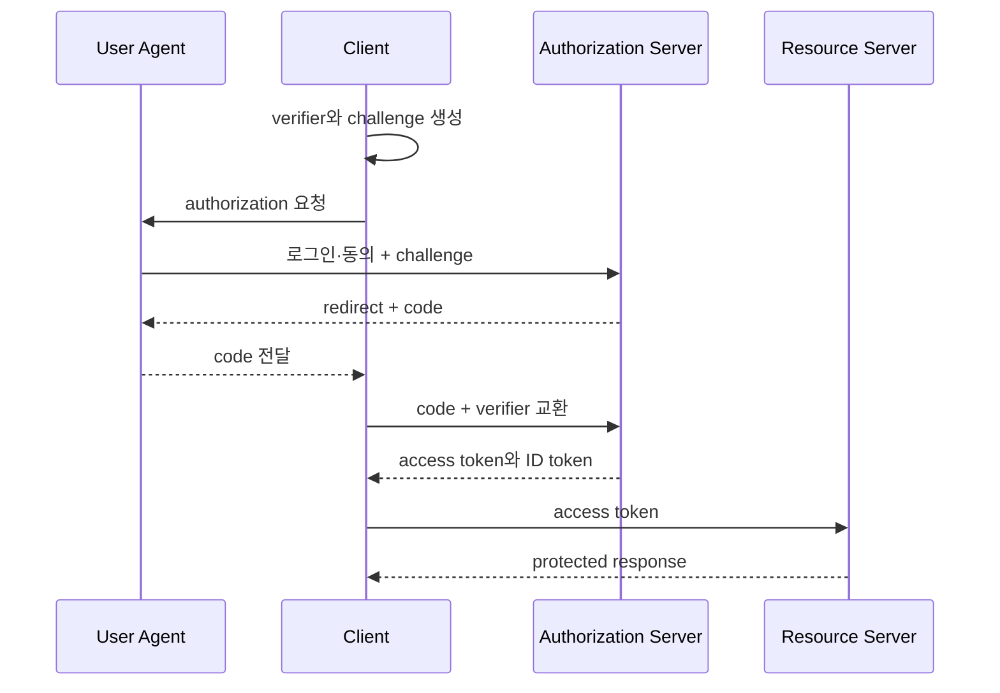



## 問題：login buttonの背後には異なるセキュリティ契約がある

OAuth 2.0は委任認可のframeworkであり、OpenID Connectはその上にidentity layerを加える。access token、ID token、application sessionを同じものとして扱うと、token theft、audience confusion、権限誤用が起きる。最新のsecurity best current practiceも確認する。[OAuth security BCP](https://www.rfc-editor.org/rfc/rfc9700.html)

## Mental model：roleとartifactを分離する

### role

- resource owner：権限を持つ利用者
- client：許可を得てresourceへアクセスするapplication
- authorization server：認証・同意・token発行
- resource server：access tokenを検証してAPIを保護
- user agent：redirectを運ぶbrowser

### artifact

- authorization code：短寿命で一回限りの交換材料
- access token：resource server向けの権限証明
- ID token：client向けの認証event情報
- refresh token：新access tokenを得る高価値credential
- application session：application独自のlogin状態

### bearer tokenの危険

bearer tokenは所有者であること自体が権限になる。log、URL、browser storage、error、analyticsへ露出させず、TLS、短寿命、最小audience・scope、sender constraintなどで被害を限定する。

## Authorization Code + PKCE flow

PKCEでは高entropy verifierからchallengeを作り、code交換時にverifierを提示する。interceptされたcodeだけではtokenへ交換できない。[PKCE specification](https://www.rfc-editor.org/rfc/rfc7636.html)

## Workflow：web applicationを安全に設計する

### Step 1. application種類とtrust boundaryを決める

confidential web client、browser-based public client、native appではsecret保持能力が違う。browserや配布binary内のclient secretは秘密と見なさない。backend-for-frontendを使う場合もcookie、CSRF、token保管境界を明示する。

### Step 2. redirect URIを正確に登録する

redirect URIは完全一致を基本とし、広いwildcard、open redirect、利用者指定URLを避ける。HTTPSを使い、native loopbackなどの例外は仕様に従う。

### Step 3. stateとtransactionをserver-sideで結ぶ

予測不能な `state` をlogin transactionへ結び付け、一回使用後に廃棄する。return URLはallowlistで検証し、stateを単なるredirect先として信頼しない。

### Step 4. nonceでID token replayを防ぐ

OIDC requestごとにnonceを生成・保存し、返却ID tokenのclaimとconstant-timeで比較する。stateはrequest correlation、nonceはID token replay防止という異なる役割を持つ。

### Step 5. authorization codeを安全に交換する

codeは短寿命・一回限りで、client、redirect URI、PKCE verifierへbindingする。token endpoint認証方式はclient種類に合わせる。codeやtokenをlogへ残さない。

### Step 6. ID tokenを完全に検証する

署名だけでなくissuer、audience、authorized party、expiration、issued-at、nonce、許可algorithmを検証する。key取得では信頼issuerのmetadataだけを使い、未知issuerが指定するURLを追跡しない。

### Step 7. access tokenはresource serverが検証する

APIはtoken formatを推測せず、issuer契約に従いJWT検証またはintrospectionを行う。issuer、audience、expiration、scope、token type、署名keyを検証し、ID tokenをAPI access tokenとして受け入れない。

### Step 8. 最小scopeとaudienceを要求する

必要なresourceと操作に限定し、広いoffline accessや管理scopeを既定要求しない。OAuth scopeはapplication内のobject-level authorizationを置き換えない。

### Step 9. token保存境界を決める

server-side sessionならtokenをbackendの暗号化・access-controlled storeへ置き、browserにはSecure、HttpOnly、SameSiteを適切に設定したopaque session cookieだけを渡せる。local storageはXSS時のtoken theft面を広げる。

### Step 10. refresh tokenをrotationし再利用を検知する

refresh tokenを一回使用型へrotationし、旧tokenの再利用をfamily compromiseの信号として扱う。失効、device・session管理、最大寿命、idle timeoutを定義する。

### Step 11. logoutのscopeを明示する

local session終了、authorization server session終了、refresh token失効、全device logoutは別操作である。利用者UIとrunbookで保証範囲を正確に表す。

## API authorization例

APIでは「署名済みtoken」だけで許可せず、routeごとに必要audience・scopeを確認し、さらにactor、action、resource、tenant、resource stateを用いたapplication authorizationを行う。token subjectをそのままdatabase keyとして信用せずidentity mappingを管理する。

## 脅威中心の試験

### code interception

盗んだcodeを正しいverifierなしで交換できないことを確認する。

### state mismatch

欠落・未知・再利用stateを拒否し、sessionを作らないことを確認する。

### nonce replay

以前のID tokenを別transactionへ再利用すると拒否されることを確認する。

### issuer confusion

攻撃者controlled issuer・metadata・keyを受け入れないことを確認する。

### audience confusion

別client・別API向けtokenが拒否されることを確認する。

### redirect manipulation

wildcard、encoding差、subdomain、open redirect経由の回避を試験する。

### refresh reuse

rotation済みtokenの再利用を検知し、関連familyを失効できることを確認する。

## 検証Checklist

### client

- [ ] application種類とsecret保持能力を定義した。
- [ ] Authorization Code + PKCEを使用する。
- [ ] redirect URIを厳密に登録・比較する。
- [ ] state、nonce、verifierは高entropy・一回限りである。
- [ ] tokenをURL、log、analyticsへ露出しない。

### token検証

- [ ] issuer、audience、expiration、algorithmを検証する。
- [ ] ID tokenとaccess tokenの用途を分離する。
- [ ] key rotationとcache failureを試験する。
- [ ] unknown issuerのURLを取得しない。
- [ ] refresh rotationとreuse detectionがある。

### sessionと権限

- [ ] cookie security属性とCSRF防御がある。
- [ ] scopeに加えてobject・tenant権限を検査する。
- [ ] logout、revocation、session expirationの範囲が明確である。
- [ ] token theft時の失効・incident手順がある。
- [ ] 認証・認可eventが機密値なしで監査される。

## よくある失敗と限界

### JWTを暗号化情報と誤解する

一般的なsigned JWT payloadはbase64url encodingであり機密ではない。機密dataを不要にclaimへ入れない。

### signatureだけを検証する

正しい署名でも別issuer、client、API、期限のtokenなら拒否すべきである。

### OAuthをapplication権限model全体と見なす

scopeは粗い委任単位であり、resource ownership、tenant、現在stateの検査が別途必要である。

### browser logoutならtokenも即時無効と信じる

self-contained access tokenは期限まで有効な場合がある。短寿命、revocation設計、session・refresh管理を組み合わせる。

### 独自authorization serverを容易に実装しようとする

protocol edge case、key rotation、client metadata、threat対策は複雑である。十分に検証された実装を使い、拡張は標準に従う。

## 公式参考資料

- [OAuth 2.0 Authorization Framework](https://www.rfc-editor.org/rfc/rfc6749.html)
- [OAuth 2.0 Security Best Current Practice](https://www.rfc-editor.org/rfc/rfc9700.html)
- [Proof Key for Code Exchange](https://www.rfc-editor.org/rfc/rfc7636.html)
- [OpenID Connect Core 1.0](https://openid.net/specs/openid-connect-core-1_0.html)
- [OAuth 2.0 for Native Apps](https://www.rfc-editor.org/rfc/rfc8252.html)

## まとめ

安全なOAuth/OIDCはlogin buttonの設定ではない。roleとartifact、trust boundary、token audience、session、application authorizationを分離し、PKCE・state・nonce・厳密検証・最小権限・rotationを一つのflowとして設計することである。
