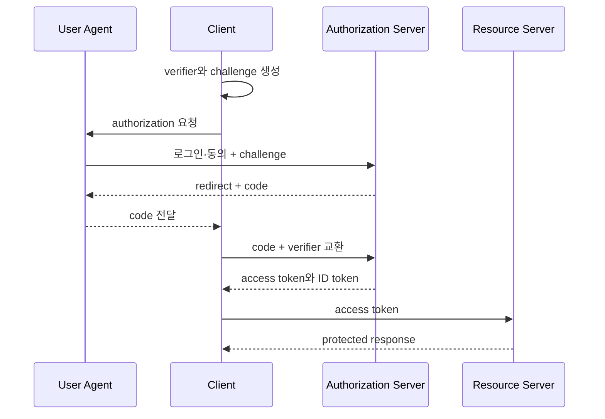



## 문제: 로그인 버튼 뒤에는 서로 다른 보안 계약이 있다

OAuth 2.0은 resource 접근 권한을 위임하는 framework다.

OpenID Connect는 OAuth 2.0 위에 identity 정보를 전달하는 인증 계층을 추가한다.

둘을 섞으면 다음 문제가 생긴다.

- access token을 사용자 profile token처럼 해석한다.
- ID token을 API authorization에 사용한다.
- redirect URI를 느슨하게 비교해 code 탈취 경로를 만든다.
- `state`와 `nonce` 목적을 혼동한다.
- browser storage에 장기 token을 둔다.
- JWT signature만 확인하고 issuer와 audience를 확인하지 않는다.
- refresh token rotation 없이 장기 bearer credential을 발급한다.

작성 시점의 보안 지침은 [OAuth 2.0 Security Best Current Practice, RFC 9700](https://www.rfc-editor.org/rfc/rfc9700.html)과 [PKCE, RFC 7636](https://www.rfc-editor.org/rfc/rfc7636.html)을 기준으로 검토한다.

## Mental model: 역할과 artifact를 분리한다

### 역할

- **Resource Owner**: 보호된 자원의 권한을 가진 주체
- **Client**: 권한을 위임받아 API를 호출하는 애플리케이션
- **Authorization Server**: 사용자 승인과 token 발급 담당
- **Resource Server**: access token을 검증하고 보호 API 제공

### artifact

- **Authorization Code**: 짧은 수명의 일회용 교환 값
- **Access Token**: resource server에 제시하는 권한 credential
- **Refresh Token**: 새 access token을 얻기 위한 장기 credential
- **ID Token**: OIDC client가 인증 event와 사용자 identity claim을 확인하는 token

access token과 ID token은 audience와 사용처가 다르다.

### bearer token의 위험

bearer token은 소유 증명 없이 가진 자가 사용할 수 있다.

따라서 전송, 저장, log, URL 노출을 막아야 한다.

sender-constrained token을 쓰는 경우에도 적용 범위와 client 지원을 확인한다.

## Authorization Code + PKCE 흐름

PKCE의 `code_verifier`는 client가 보관한다.

authorization request에는 그로부터 만든 `code_challenge`를 보낸다.

code를 가로챈 공격자는 verifier가 없으므로 token 교환에 실패한다.

가능하면 `S256` challenge method를 사용한다.

## Workflow: web application을 안전하게 설계

### Step 1. application 유형과 trust boundary를 정한다

- server-side confidential client인가?
- browser-only public client인가?
- native application인가?
- backend-for-frontend를 둘 수 있는가?
- 여러 resource server를 호출하는가?

public client는 client secret을 안전하게 보관할 수 없다.

source에 포함된 secret은 secret이 아니다.

### Step 2. redirect URI를 정확히 등록한다

authorization server는 등록된 URI와 정확하게 일치하는 redirect만 허용해야 한다.

wildcard와 open redirector를 피한다.

native app은 platform 권장 redirect 방식과 loopback 규칙을 따른다.

redirect endpoint는 code와 state를 처리한 뒤 민감 query를 browser history에서 제거한다.

### Step 3. state와 transaction을 server-side로 묶는다

authorization 시작 때 강한 random `state`를 만든다.

state record에는 다음을 묶는다.

- browser session
- redirect after login의 허용된 내부 경로
- PKCE verifier
- nonce
- 생성·만료 시각
- authorization server 식별

callback에서 일회용으로 소비한다.

외부 URL을 그대로 post-login redirect로 신뢰하지 않는다.

### Step 4. nonce로 ID token replay를 방지한다

OIDC authorization request에 nonce를 보낸다.

ID token의 nonce claim이 세션에 저장한 값과 일치하는지 확인한다.

state는 request/callback correlation과 CSRF 방어에 쓰이고 nonce는 ID token을 특정 인증 request에 묶는다.

### Step 5. authorization code를 안전하게 교환한다

token endpoint에는 code, redirect URI, verifier, 필요한 client authentication을 보낸다.

code는 짧은 수명과 일회용이어야 한다.

교환 실패 원인을 browser에 상세 노출하지 않는다.

client secret은 secret manager에서 가져오고 rotation한다.

### Step 6. ID token을 완전히 검증한다

JWT 문자열을 decode하는 것은 검증이 아니다.

최소한 다음을 확인한다.

- 허용한 algorithm
- signature와 신뢰한 key
- exact issuer
- client ID audience
- expiration과 not-before
- nonce
- 여러 audience일 때 authorized party 규칙
- 인증 context가 필요한 경우 관련 claim

key ID를 보고 임의 URL에서 key를 가져오지 않는다.

신뢰한 issuer의 discovery와 JWKS endpoint만 사용한다.

key cache와 rotation 실패 정책을 설계한다.

### Step 7. access token은 resource server가 검증한다

opaque token이면 authorization server introspection을 사용할 수 있다.

JWT access token이면 resource server가 issuer, audience, signature, expiry, scope를 검증한다.

client가 token의 내부 claim을 보고 최종 권한 결정을 대신하지 않는다.

scope는 coarse grant일 수 있으며 resource ownership과 업무 policy를 별도로 검사한다.

### Step 8. 최소 scope와 audience를 요청한다

로그인에 필요한 scope와 API 권한 scope를 분리한다.

사용하지 않는 offline access를 요청하지 않는다.

token이 여러 API에서 재사용되지 않도록 audience를 제한한다.

권한 상승에는 재동의나 step-up authentication이 필요할 수 있다.

### Step 9. token 저장 경계를 정한다

server-side web app은 token을 server session store에 보관하고 browser에는 secure session cookie만 줄 수 있다.

cookie에는 `Secure`, `HttpOnly`, 적절한 `SameSite`, 짧은 수명과 rotation을 적용한다.

browser JavaScript가 token을 가져야 하는 구조라면 XSS 영향과 memory-only 저장, CSP, refresh 전략을 검토한다.

token을 local storage에 장기 보관하는 기본값을 피한다.

### Step 10. refresh token을 회전하고 재사용을 탐지한다

public client에 refresh token을 발급한다면 rotation을 사용한다.

한 번 사용한 refresh token이 다시 보이면 token family 탈취 가능성이 있다.

family를 폐기하고 재인증을 요구한다.

absolute lifetime과 inactivity lifetime을 별도로 정한다.

### Step 11. logout의 범위를 명시한다

local session 종료, authorization server session 종료, token revocation은 서로 다르다.

사용자에게 어떤 범위가 종료되는지 명확히 한다.

logout CSRF와 open redirect를 방지한다.

back-channel 또는 front-channel logout 기능은 provider 지원과 failure mode를 검토한다.

## API authorization 예제

resource server middleware는 다음 단계로 동작한다.

1. Authorization header 형식을 검사한다.
2. 허용 issuer configuration을 선택한다.
3. algorithm confusion을 막도록 algorithm을 고정한다.
4. 신뢰한 JWKS에서 key를 찾는다.
5. signature와 time claim을 검증한다.
6. API 고유 audience를 검증한다.
7. endpoint에 필요한 scope를 확인한다.
8. subject와 resource의 업무 관계를 확인한다.
9. 결정 결과를 민감 claim 없이 audit log에 남긴다.

401은 인증 credential 부재·무효에 사용한다.

403은 인증됐지만 권한이 부족한 경우에 사용한다.

실제 응답 정책은 resource 존재 정보 노출 위험도 고려한다.

## 위협 중심 시험

### code interception

정상 code와 잘못된 verifier 조합이 거부되는지 확인한다.

### state mismatch

다른 browser session의 callback이 거부되는지 확인한다.

### nonce replay

이전 ID token을 새 login transaction에 넣어 거부되는지 확인한다.

### issuer confusion

형식은 맞지만 허용하지 않은 issuer token을 거부한다.

### audience confusion

다른 API나 client용 token을 거부한다.

### redirect manipulation

등록되지 않은 URI, wildcard 변형, encoded 변형을 시험한다.

### refresh reuse

회전 전 token 재사용 시 family가 폐기되는지 확인한다.

## 검증 Checklist

### client

- [ ] Authorization Code와 PKCE S256을 사용한다.
- [ ] implicit flow에 의존하지 않는다.
- [ ] redirect URI가 exact match로 관리된다.
- [ ] state, nonce, verifier가 transaction에 묶인다.
- [ ] post-login redirect는 allowlist 또는 내부 경로만 허용한다.
- [ ] code와 token이 URL·log에 남지 않는다.

### token 검증

- [ ] issuer와 audience를 exact match한다.
- [ ] 허용 algorithm을 고정한다.
- [ ] signature, expiry, nonce를 검증한다.
- [ ] JWKS는 신뢰한 endpoint에서만 가져온다.
- [ ] key rotation과 fetch 실패를 시험했다.
- [ ] access token과 ID token 사용처가 분리된다.

### session과 권한

- [ ] cookie 보안 속성이 설정되어 있다.
- [ ] scope가 최소화되어 있다.
- [ ] resource-level authorization을 수행한다.
- [ ] refresh token rotation과 reuse detection이 있다.
- [ ] logout과 revocation 범위가 문서화되어 있다.
- [ ] 보안 event가 민감 token 없이 감사된다.

## 자주 겪는 실패와 한계

### JWT를 암호화된 정보로 오해한다

일반적인 signed JWT payload는 읽을 수 있다.

민감정보를 불필요하게 claim에 넣지 않는다.

### signature만 검증한다

유효하게 서명된 다른 audience 또는 issuer token도 공격에 사용될 수 있다.

### OAuth를 애플리케이션 권한 모델 전체로 본다

scope와 token은 시작점이다.

조직, resource ownership, 상태 기반 업무 권한은 application이 평가해야 한다.

### browser logout이면 token도 즉시 무효라고 믿는다

이미 발급된 access token은 만료 전까지 유효할 수 있다.

짧은 수명, revocation, introspection의 trade-off를 설계한다.

### 자체 인증 server를 쉽게 구현하려 한다

protocol edge case와 key·session·recovery 운영이 복잡하다.

검증된 library와 platform을 사용하고 extension은 위협 모델과 상호운용 test를 거친다.

## 공식 참고자료

- [OAuth 2.0 Authorization Framework, RFC 6749](https://www.rfc-editor.org/rfc/rfc6749.html)
- [OAuth 2.0 Security Best Current Practice, RFC 9700](https://www.rfc-editor.org/rfc/rfc9700.html)
- [Proof Key for Code Exchange, RFC 7636](https://www.rfc-editor.org/rfc/rfc7636.html)
- [OpenID Connect Core 1.0](https://openid.net/specs/openid-connect-core-1_0.html)
- [OAuth 2.0 for Native Apps, RFC 8252](https://www.rfc-editor.org/rfc/rfc8252.html)

## 마무리

OAuth 2.0과 OIDC를 안전하게 쓰려면 역할, token, audience, browser session의 경계를 분리해야 한다.

Authorization Code + PKCE, exact redirect, 완전한 token 검증, 최소 scope, rotation을 기본값으로 삼자.

로그인 성공 화면보다 중요한 것은 code와 token이 공격자가 바꿀 수 없는 하나의 transaction에 묶여 있다는 증거다.
