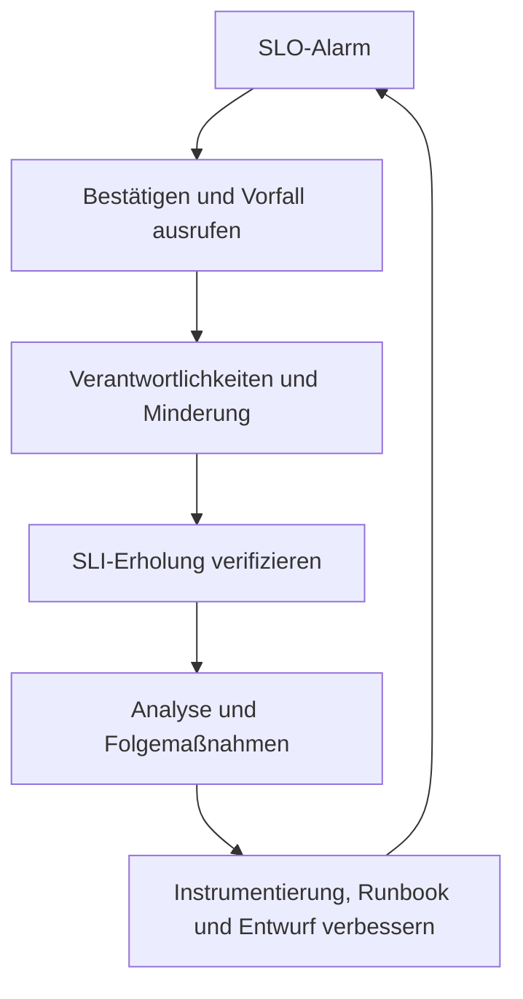



## Das Problem: Auch umfangreiche Telemetrie erklärt einen Vorfall nicht automatisch

Das Erfassen von CPU, Speicher, Protokollen und Traces schafft keine Observability, solange daraus nicht hervorgeht, welche Fehler Benutzer erleben. Umgekehrt kann schon eine kleine Zahl von Dashboards den Betrieb unterstützen, wenn sie folgende Fragen schnell beantwortet.

- Scheitern Benutzer tatsächlich?
- Welcher Benutzerablauf und welche Änderung markieren den Beginn der Auswirkung?
- Entsteht der Fehler in der Anwendung, in einer Abhängigkeit oder durch Ressourcensättigung?
- Müssen wir jetzt abmildern, oder können wir weiter beobachten?
- Hat die Gegenmaßnahme tatsächlich gewirkt?

Die wichtigste Leistung von Observability ist kein Diagramm, sondern eine **kürzere Entscheidungszeit**. Dafür müssen nutzerbezogene Zuverlässigkeitsziele (SLOs), Untersuchungssignale für Ursachen (Metriken, Protokolle und Traces) sowie menschliche Reaktionsverfahren (Runbooks) in einem System zusammenwirken.

## Mentales Modell: vom Benutzerablauf zum Fehlerbudget und zur Reaktionsrichtlinie

Die folgende Beziehung verhindert einen rein werkzeugzentrierten Entwurf.

```text
사용자 여정
  -> SLI 측정 규칙
  -> SLO 목표와 평가 구간
  -> 오류 예산과 burn rate
  -> 경보·release 정책
  -> incident 대응과 학습
```

### SLI, SLO und SLA

- **SLI (Service Level Indicator)**: ein Zuverlässigkeitsmaß, etwa der Anteil erfolgreicher Anfragen oder innerhalb eines Latenzgrenzwerts abgeschlossener Arbeiten.
- **SLO (Service Level Objective)**: das erwartete SLI-Ziel über einen bestimmten Evaluierungszeitraum.
- **SLA (Service Level Agreement)**: ein Vertrag, der externe Verpflichtungen und Folgen von Verstößen umfassen kann.

Interne SLOs sind gewöhnlich strenger als SLAs, damit Reaktionsspielraum bleibt. Ausgangspunkt sind Benutzerabläufe und Produktzusagen, nicht willkürlich vergebene „Verfügbarkeitsziele“ für jede interne Komponente.

Die Grundform eines ereignisbasierten Verfügbarkeits-SLI lautet:

$$
\text{Availability SLI} =
\frac{\text{gute berücksichtigte Ereignisse}}
{\text{alle berücksichtigten Ereignisse}}
$$

Ein Latenz-SLI kann als Anteil der Ereignisse definiert werden, die innerhalb eines Grenzwerts abgeschlossen werden, statt als Durchschnittslatenz.

$$
\text{Latency SLI} =
\frac{\text{berücksichtigte Ereignisse innerhalb des Grenzwerts}}
{\text{alle berücksichtigten Ereignisse}}
$$

Besonders wichtig ist der Nenner. Es muss dokumentiert sein, ob Health Checks, Lasttests, clientseitige Validierungsfehler und abgebrochene Anfragen ein- oder ausgeschlossen werden. Zusätzliche Ausschlüsse können die Kennzahl verbessern, sie aber von der Nutzerrealität entfernen.

### Ein Fehlerbudget ist die zulässige Menge an Fehlern

Bei einem Ziel \(SLO\) beträgt der zulässige Fehleranteil:

$$
\text{Fehlerbudgetanteil} = 1 - SLO
$$

Ein zeitbasiertes 30-Tage-Ziel von 99,9 % erlaubt rechnerisch etwa 43,2 Minuten beeinträchtigten Betriebs. Bei anfragebasierten Diensten bildet die Zahl fehlgeschlagener Ereignisse die tatsächliche Benutzerauswirkung jedoch oft besser ab als Ausfallminuten.

Die Burn-Rate zeigt, wie schnell die aktuelle Fehlerquote das Fehlerbudget verbraucht.

$$
\text{Burn-Rate} =
\frac{\text{beobachtete Fehlerquote}}
{1 - SLO}
$$

Eine Burn-Rate von 1 verbraucht über den Bewertungszeitraum genau das gesamte Budget. Eine hohe Rate verlangt schon nach kurzer Zeit eine dringende Reaktion; eine niedrige, aber anhaltende Rate erfordert ein Ticket und eine strukturelle Verbesserung.

### Metriken, Protokolle und Traces beantworten unterschiedliche Fragen

| Signal | Starke Frage | Schwäche |
|---|---|---|
| Metrik | Wie viel hat sich wann und in welcher Kategorie geändert? | wenig Detail zu einzelnen Events |
| Logs | Was wurde für ein bestimmtes Ereignis aufgezeichnet? | Kosten, Suche, Schemadrift und mögliche Auslassungen |
| Traces | Wo wurde eine Anfrage beim Übergang zwischen Komponenten langsam oder fehlerhaft? | begrenzt durch Sampling und Instrumentierung |
| Profile | Welcher Code verbraucht CPU oder Speicher? | benötigt eine direkte Verknüpfung zur Benutzerauswirkung |

Kein Signal ersetzt ein anderes. Entscheidend ist ihre Verknüpfung: Von einem Metrikalarm führt ein Exemplar oder eine Trace-ID zum Trace; mit derselben Trace-ID und einem stabilen Fehlercode lassen sich anschließend die Protokolle abfragen.

## Praktisches Muster: vom symptombasierten SLO zu Ursachensignalen und Runbook

### 1. Kritische Benutzerabläufe inventarisieren

Zeichnen Sie für jede Reise Folgendes auf.

| Aspekt | Frage |
|---|---|
| Benutzer | Wer ist von diesem Verhalten abhängig? |
| Erfolg | Welches Ergebnis ist Erfolg? |
| Fehler | Handelt es sich um Timeout, falsches Ergebnis oder doppelte Verarbeitung? |
| Messgrenze | Erfolgt die Messung beim Client, am Edge, im Dienst oder an der Warteschlange? |
| Auswertung | Ist das Fenster rollierend oder kalenderbasiert? |
| Verantwortung | Wer pflegt Ziel und Instrumentierung gemeinsam? |

Ein Server, der `200` zurückgibt, bedeutet noch keinen Benutzererfolg, wenn der Antwortinhalt falsch oder ein asynchroner Auftrag noch nicht abgeschlossen ist. Umgekehrt verzerrt es die Systemgesundheit, fehlerhafte Clientanfragen als Zuverlässigkeitsfehler des Servers zu zählen. Deshalb ist ein fachlich passendes „gutes Ereignis“ zu definieren.

Um ein SLO zu setzen, geht es nicht darum, sofort eine perfekte Nummer zu wählen. Erstellen Sie ein erstes Ziel aus historischen Verteilungen, Benutzererwartungen, architektonischen Grenzen und Kosten und passen Sie es dann in regelmäßigen Bewertungen an. Unterscheiden Sie ein realistisches Ziel von der Senkung des Ziels, nur ein Dashboard grün zu drehen.

### 2. RED auf Dienste und USE auf Ressourcen anwenden

RED für anfragende Dienste:

- **Rate**: Anfrage oder Arbeitsvolumen
- **Fehler**: Fehlerquote und Fehlerklasse
- **Dauer**: Latenzverteilung

USE für Ressourcen:

- **Utilization**: Zeitanteil, in dem die Ressource ausgelastet ist
- **Sättigung**: Ausmaß, in dem die Nachfrage die Kapazität übersteigt, etwa Warteschlangen, Drosselung oder Wartezeiten
- **Fehler**: Geräte- oder Laufzeitfehler

Eine Skalierung allein nach CPU-Auslastung übersieht Warteschlangen, I/O und Sperren. SLO-Alarme sollten auf Benutzersymptomen beruhen; RED und USE dienen Ursachenanalyse und Kapazitätsplanung.

### 3. Metriklabels nach Fragen gestalten und Kardinalität begrenzen

Beispiele für begrenzte Labels:

```text
service, environment, region, route_template, method, status_class
```

Beispiele für unbegrenzte Labels:

```text
user_id, email, raw_url, request_id, stack_trace, arbitrary_error_message
```

Eindeutige Anfrage-IDs gehören in Protokolle oder Trace-Attribute, nicht in Metriken. Verwenden Sie eine Routenvorlage wie `/orders/{id}` statt einer Roh-URL. Explodierende Kardinalität erhöht Kosten und Abfragelatenz und kann die Überwachung gerade während eines Vorfalls ausfallen lassen.

Histogramm-Buckets sollten die tatsächlichen SLO-Latenzgrenzen und Benutzerverteilungen abbilden. Durchschnittslatenz verbirgt Ausreißer am Verteilungsende. Auch Perzentile können irreführen, wenn Werte getrennter Instanzen ohne Verständnis von Aggregation und Sampling gemittelt werden.

### 4. Strukturierten Protokollen ein stabiles Ereignisschema geben

```json
{
  "timestamp": "<RFC3339_TIMESTAMP>",
  "severity": "ERROR",
  "service": "<SERVICE_NAME>",
  "environment": "<ENVIRONMENT>",
  "event_name": "dependency_call_failed",
  "error_code": "DEPENDENCY_TIMEOUT",
  "trace_id": "<TRACE_ID>",
  "span_id": "<SPAN_ID>",
  "duration_ms": 2034,
  "retryable": true
}
```

Statt jedes Detail in einen Prosasatz zu packen, werden stabile Felder und Fehlercodes verwendet. Ein Stacktrace kann in einem separaten Feld stehen; bei häufig wiederkehrenden Fehlern sind Sampling oder Ratenbegrenzung erforderlich.

Werte, die nicht standardmäßig protokolliert werden sollten:

- Zugriffs-Token, Cookies und Autorisierungs-Header
- unverschlüsselte Passwörter, Schlüssel und Verbindungszeichenfolgen
- komplette Anfrage- und Antwortkörper
- unnötige personenbezogene Daten und direkte Identifikatoren

Redaktion sollte nahe an der Anwendung erfolgen, nicht erst im Sammel-Backend. Wird erst nach zentraler Aufnahme maskiert, verbleibt der Rohwert in Transportweg, Puffern und Agenten.

### 5. Traces über Dienst- und asynchrone Grenzen hinweg verbinden

Standardisierten Trace-Kontext in HTTP-/RPC-Headern und zugelassenen Propagationsmetadaten von Warteschlangennachrichten weitergeben. Für Spans sind folgende Elemente zu unterscheiden.

- Operationsname: begrenzt und stabil
- Status: konsistente Erfolgs-/Fehlersemantik
- Dauer: automatisch erfasste Zeit
- Attribute: Untersuchungsdimensionen wie Route, Abhängigkeit und Wiederholungszahl
- Ereignisse: Ausnahmen oder wesentliche Lebenszyklusänderungen

Roh-URLs oder IDs in Spans verschlechtern Suche und Kosten. Tail-basiertes Sampling kann Fehler und Traces mit hoher Latenz bewahren und zugleich das Datenvolumen begrenzen. Da der Collector Traces bis zur Entscheidung puffern muss, sind Ressourcenbedarf und Verlustmodi ausdrücklich zu berücksichtigen.

### 6. Schnelle und anhaltende Fehler mit Mehrfenster-Burn-Rate-Alarmen verbinden

Ein kurzes Fenster reagiert schnell, ist bei vorübergehenden Spitzen jedoch laut; ein langes ist stabil, aber langsam. Eine Bereitschaftsalarmierung erfolgt, wenn derselbe Burn-Rate-Grenzwert im langen und im kurzen Fenster überschritten wird.

Konzeptionelles Beispiel für ein Verfügbarkeits-SLO von 99,9 %:

```yaml
groups:
  - name: service-slo
    rules:
      - alert: ServiceAvailabilityFastBurn
        expr: |
          service:sli_error_ratio:rate1h > (14.4 * 0.001)
          and
          service:sli_error_ratio:rate5m > (14.4 * 0.001)
        for: 2m
        labels:
          severity: page
        annotations:
          summary: "Availability error budget is burning rapidly"
          runbook_url: "https://docs.example.invalid/runbooks/<SERVICE>/availability"
```

Die Recording Rules `service:sli_error_ratio:*` müssen aus derselben Definition berücksichtigter und guter Ereignisse abgeleitet werden. Zahlen und Fenster sind nur übliche Ausgangspunkte und müssen gegen reales Verkehrsaufkommen, Bewertungszeiträume und Bereitschaftskapazität getestet werden. Bei geringem Verkehr können einzelne Ereignisse die Quote stark bewegen; deshalb helfen Mindestereigniszahlen, synthetische Sonden und längere Fenster.

Alarmannotationen enthalten:

- Benutzersymptome und Wirkungsumfang
- aktueller Wert und Ziel
- Dashboard und Trace/Log-Abfragelinks
- ein handlungsfähiges Laufbuch
- verantwortlichen Dienst und Eskalationsweg

Hohe CPU-Auslastung einer einzelnen Instanz rechtfertigt allein keinen nächtlichen Bereitschaftsalarm. Erfordert ein bestimmtes System Eingriffe, bevor die CPU das Benutzer-SLO gefährdet, wird dafür eine getrennte Kapazitäts-Leitplanke mit ausdrücklicher Begründung eingerichtet.

### 7. Dashboards vom Überblick bis zur Ursache gliedern

Ebene 1: Nutzerperspektive

- SLO-Erfüllung und verbleibendes Fehlerbudget
- Anfragerate, Fehlerquote und Latenz-SLI
- betroffene Region, Route und Kundenklasse
- Markierungen für Bereitstellungs- und Konfigurationsänderungen

Ebene 2: Serviceperspektive

- Latenz und Fehler nach Abhängigkeit
- Tiefe und Alter der Warteschlange
- Wiederholungen, Timeouts und Circuit Breaker
- Instanz/Pod-Verteilung und Rollout

Ebene 3: Ressourcenperspektive

- CPU-Drosselung, Speicherdruck und GC
- Verbindungs- und Threadpools sowie Dateideskriptoren
- Platten- und Netzwerksättigung
- relevante Abhängigkeitssignale wie Datenbankschlösser und Replikationsverzögerung

Während eines Vorfalls müssen selbst erstmalige Betrachter Zeitbereich, Einheiten und Normalbereich des Dashboards verstehen. Paneltitel benennen die beantwortete Frage, nicht die Abfrageimplementierung.

### 8. Bereitstellungen und Konfigurationsänderungen mit Telemetrie verknüpfen

Viele Vorfälle hängen mit jüngsten Änderungen zusammen; die manuelle Frage „Was hat sich geändert?“ kostet jedoch Zeit. Bei Bereitstellungsereignissen werden deshalb folgende Angaben erfasst.

- Quellrevision
- Artefakt-/Image-Digest
- Konfiguration und Feature-Flag-Version
- Umgebung und Rollout
- Start- und Endzeiten und Ergebnis

Statt eines Personennamens werden eine Automatisierungsidentität und eine auditierbare Änderungs-ID verwendet. Verknüpft man die Release-ID mit Dashboard-Annotationen und Trace-Ressourcenattributen, lassen sich Kohorten vor und nach der Änderung vergleichen.

### 9. Für jeden Alarm ein Runbook als Entscheidungshilfe der ersten 15 Minuten erstellen

Runbookvorlage:

```markdown
# <ALERT_NAME>

## 의미
- 이 경보가 측정하는 사용자 증상
- SLI, SLO, burn window

## 즉시 확인
1. 경보가 실제 traffic과 여러 관측 지점에서 재현되는지 확인
2. 영향 환경·region·route·release 식별
3. 최근 deploy/config/dependency change 확인

## 안전한 완화
- 검증된 이전 artifact digest로 rollback
- 문제 기능을 승인된 feature flag로 비활성화
- traffic shift 또는 rate limit 적용 조건
- 각 동작의 담당 권한과 검증 query

## 중단 조건
- 데이터 손상 가능성
- rollback이 schema 호환성을 깨뜨리는 경우
- 보안 사고 징후가 있는 경우

## 검증
- SLI와 burn rate 회복
- backlog/queue가 감소하는지 확인
- synthetic 및 핵심 사용자 여정 확인

## escalation
- service owner, dependency owner, incident commander 호출 기준
```

Befehle verwenden Platzhalter wie `<ENVIRONMENT>` und `<SERVICE>`; der aktuelle Kontext wird vor der Ausführung geprüft. Wildcard-Löschungen, Neustarts des gesamten Clusters oder unbegrenztes Scale-out dürfen nicht die erste Reaktion sein.

Eine reine Dokumentenprüfung validiert kein Runbook. Echte Links, Berechtigungen und Befehle werden in Game Days, Staging-Fehlerinjektionen und Einweisungen neuer Bereitschaftskräfte getestet; das Datum der letzten Verifikation wird festgehalten.

## Vorfallbetrieb: vom Erkennen bis zum Lernen dieselbe Schleife verwenden



### Getrennte Rollen

Je nach Umfang kann eine Person mehrere Rollen übernehmen, die Verantwortlichkeiten bleiben jedoch getrennt.

- **Incident Commander**: steuert Prioritäten, Rollen und Entscheidungstakt
- **Operations Lead**: koordiniert Diagnose und Minderung
- **Communications Lead**: informiert Beteiligte und aktualisiert den Status
- **Scribe**: protokolliert Beobachtungen, Entscheidungen und Handlungsergebnisse

Die Person mit der größten technischen Tiefe muss nicht den Vorfall leiten. Sie kann sich auf die Diagnose konzentrieren, während die Einsatzleitung Ablauf und Risiko steuert.

### Minderung vor Ursachenanalyse optimieren

Zunächst werden reversible Maßnahmen priorisiert, welche die Benutzerauswirkung schon vor vollständiger Ursachenklärung verringern.

1. Tatsächliche Auswirkung sowie Sicherheits- und Datenintegritätsrisiken bestätigen.
2. Schweregrad festlegen und Incident Commander benennen.
3. Eine risikoarme Gegenmaßnahme anwenden, etwa eine jüngste Änderung zurückrollen, Verkehr verlagern oder eine Funktion deaktivieren.
4. Überprüfen Sie die Wirksamkeit durch SLI und Rückstand.
5. Nach der Stabilisierung eine vertiefte Ursachenanalyse durchführen.

Vor jeder Maßnahme werden erwartetes Ergebnis und Rollback-Bedingung in einem Satz festgehalten. Mehrere gleichzeitige Änderungen verschleiern, welche Maßnahme gewirkt hat.

### Eine Zeitleiste ist ein Echtzeitwerkzeug, kein nachträgliches Dokument

```text
<TIME> 관찰: availability fast-burn alert 발생
<TIME> 결정: incident 선언, 영향 범위 확인 시작
<TIME> 실행: release <REVISION> traffic 중단
<TIME> 결과: error ratio 감소, queue는 아직 증가
```

Persönliche Namen, Kundenkennungen oder Geheimnisse werden nicht erfasst. Fakten, Hypothesen und Entscheidungen bleiben unterscheidbar. Statt „Datenbankproblem“ wird eine beobachtbare Aussage wie „Schreiblatenz liegt über der Baseline“ notiert.

### Nachbesprechungen analysieren Bedingungen und Schutzschichten, nicht Personen

Geeignete Leitfragen:

- Welche Kombination von Bedingungen ermöglichte den Vorfall?
- Welche Verteidigungsschichten funktionierten, und was nicht?
- Warum wurde die Erkennung oder Minderung verzögert?
- Gibt es den gleichen Fehlermodus in anderen Diensten?
- Welche Maßnahmen reduzieren tatsächlich die Wahrscheinlichkeit oder Auswirkungen?

Jede Maßnahme erhält eine verantwortliche Rolle, Frist, Verifikationsmethode und erwartete Risikoreduktion. „Vorsichtiger sein“ oder „überwachen“ ist nicht prüfbar; daraus müssen konkrete Systemänderungen wie Tests, Leitplanken, Timeouts, Isolation oder automatischer Rollback werden.

## Verifikationscheckliste

SLO:

- [ ] Benutzerablauf und erfolgreiches Ereignis sind definiert.
- [ ] Zähler, Nenner, Ausschlussregeln, Messpunkt und Fenster sind dokumentiert.
- [ ] Das Ziel spiegelt reale Nutzerwartungen und architektonische Kosten wider.
- [ ] Das SLI-Verhalten wurde bei geringem Verkehr und Teilausfällen rückwirkend geprüft.
- [ ] Fehlerbudgets verbinden sich mit der Release- und Zuverlässigkeitsinvestitionspolitik.

Telemetrie:

- [ ] Die Kardinalität von Metriklabels ist begrenzt und budgetiert.
- [ ] Protokolle sind strukturiert und sammeln keine Geheimnisse oder unnötige personenbezogene Daten.
- [ ] Trace-Kontext wird über synchrone und asynchrone Grenzen weitergegeben.
- [ ] Release- und Konfigurationsversionen sind mit Metriken, Protokollen und Traces verknüpft.
- [ ] Verzögerung, Verlust, Sampling und Kosten der Telemetrie-Pipeline werden beobachtet.

Warnungen und Runbooks:

- [ ] Bereitschaftsalarme sind an Symptome gekoppelt, die aufgrund von Auswirkung und Dringlichkeit Handeln erfordern.
- [ ] Mehrfenster-Burn-Rate-Alarme wurden gegen frühere Vorfälle und reales Verkehrsaufkommen validiert.
- [ ] Dashboard, Abfrage und Runbook-Links öffnen sich mit tatsächlichen Responder-Berechtigungen.
- [ ] Gegenmaßnahmen sind konkret und reversibel und besitzen Verifikationsabfragen.
- [ ] Laufbücher werden regelmäßig ausgeübt und von ihren Besitzern aktualisiert.
- [ ] Jede Warnung hat eine Aktion, die der Empfänger jetzt ergreifen kann.

Vorfälle:

- [ ] Rollen für Einsatzleitung, Betrieb, Kommunikation und Protokollführung sind klar festgelegt.
- [ ] Die Zeitleiste zeichnet Fakten, Hypothesen, Entscheidungen und Aktionsergebnisse auf.
- [ ] Nach der Gegenmaßnahme wird die Erholung anhand von SLI, Rückstand und synthetischen Abläufen bestätigt.
- [ ] Folgemaßnahmen besitzen Verantwortliche, Fristen und Verifikationskriterien.
- [ ] Ähnliche Fehlermodi werden in anderen Diensten überprüft.

## Fehlmuster und Grenzen

### Annehmen, dass vollständige Datensammlung später jede Antwort liefert

Unbegrenzte Telemetrie erhöht Kosten und Datenschutzrisiken und verschüttet wichtige Signale. Fragen, Aufbewahrung, Kardinalität und Sampling müssen entworfen und ungenutzte Signale entfernt werden.

### Benutzererfahrung allein durch Uptime darstellen

Ein laufender Prozess kann dennoch hohe Latenz, veraltete Daten oder Teilausfälle aufweisen. Für jeden kritischen Ablauf sind die erforderlichen Dimensionen Verfügbarkeit, Latenz, Korrektheit und Aktualität zu wählen.

### Perzentile mitteln oder nur einem Lastgenerator vertrauen

Der Mittelwert instanzbezogener Perzentile ist nicht das Perzentil der Gesamtverteilung. Eine serverseitige Messung, die clientseitiges Warten und Timeouts auslässt, kann Tail-Latenz durch koordinierte Auslassung unterschätzen. Server- und Clientperspektive müssen gegengeprüft werden.

### Erhöhung der Alarmschwelle nach jedem Vorfall

Bestimmen Sie, ob der Lärm in der SLI-Definition, der Verkehrssaisonalität, den Messfehlern oder dem Mangel an Handlung entsteht. Allein die Anhebung der Schwelle verliert die Erkennungsfähigkeit.

### Fehlerbudget als „Ausfallzeit, die wir ausgeben dürfen“ missverstehen

Ein Fehlerbudget ist keine Erlaubnis, Ausfälle einzuplanen. Es liefert Rückmeldung, um Releasegeschwindigkeit und Zuverlässigkeitsinvestitionen auszubalancieren. Sicherheit, Datenintegrität und regulatorische Risiken können getrennte Nulltoleranz-Leitplanken erfordern.

### Automatisches Rollback als universelle Lösung behandeln

Sind Datenbankschemas, irreversible Nebenwirkungen oder Abhängigkeitsverträge mit der vorigen Binärversion unvereinbar, kann ein Rollback gefährlicher sein. Expand-/Contract-Migrationen, Feature-Flags, Roll-forward und Wiederherstellungsübungen müssen gemeinsam entworfen werden.

### Die Observability-Infrastruktur selbst vergessen

Collector-Verluste, Zeitabweichungen, Sampling, Abfrageverzögerung und Alarmierungsfehler können „keine Daten“ fälschlich in „kein Problem“ verwandeln. Die Telemetrie-Pipeline benötigt eigene SLOs und unabhängige synthetische Kontrollen.

Betriebssicherheit endet nicht beim Bau von Dashboards. Telemetrie wird erst dann zur operativen Fähigkeit, wenn sie Benutzererfolg misst, die Verbrauchsgeschwindigkeit des Fehlerbudgets in Handlungsentscheidungen übersetzt und sichere Gegenmaßnahmen sowie Lernen durch Runbooks verbindet.
