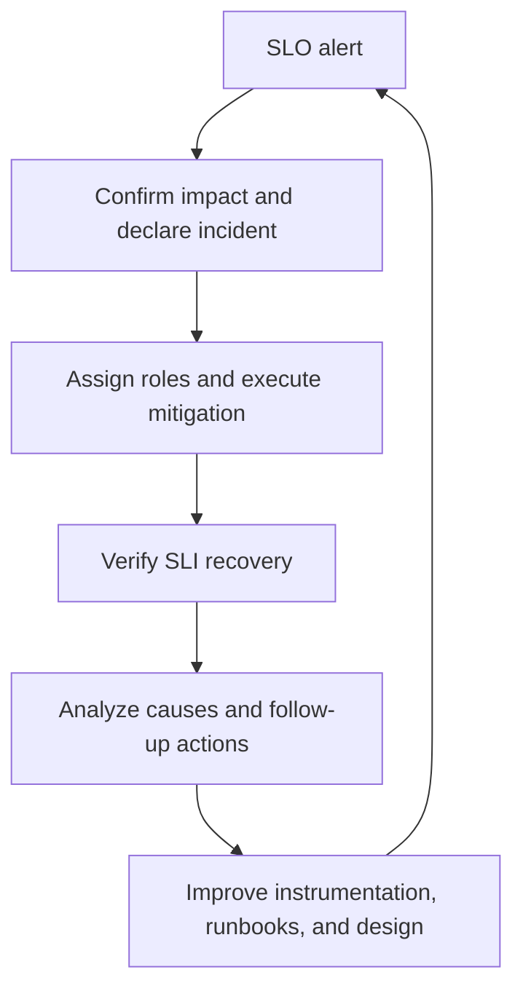



## The problem: abundant telemetry may still fail to explain an incident

Collecting CPU, memory, logs, and traces is not observability if it cannot explain what failures users experience. Conversely, even a small number of dashboards helps operations if it quickly answers these questions.

- Are users actually failing?
- Which user journey and change marked the beginning of the impact?
- Is the failure amplified in the application, a dependency, or resource saturation?
- Must we mitigate now, or can we keep observing?
- Did the mitigation actually work?

The core output of observability is not a graph but **shorter decision time**. Achieving it requires connecting user reliability objectives (SLOs), causal investigation signals (metrics, logs, and traces), and human response procedures (runbooks) in one system.

## Mental model: from user journey to error budget and response policy

Following the relationship in order avoids tool-centric design.

```text
사용자 여정
  -> SLI 측정 규칙
  -> SLO 목표와 평가 구간
  -> 오류 예산과 burn rate
  -> 경보·release 정책
  -> incident 대응과 학습
```

### Distinguish SLI, SLO, and SLA

- **SLI (Service Level Indicator)**: a reliability measure, such as the proportion of successful requests or work completed within a latency threshold.
- **SLO (Service Level Objective)**: the expected SLI target over a specified evaluation period.
- **SLA (Service Level Agreement)**: a contract that may include external commitments and consequences of violation.

Internal SLOs are usually stricter than SLAs to create response headroom. Start with user journeys and product commitments rather than assigning arbitrary “availability” targets to every internal component.

The basic form of an event-based availability SLI is:

$$
\text{Availability SLI} =
\frac{\text{good eligible events}}
{\text{all eligible events}}
$$

A latency SLI can be defined as the proportion of events completed within a threshold rather than an average.

$$
\text{Latency SLI} =
\frac{\text{eligible events completed within threshold}}
{\text{all eligible events}}
$$

The denominator matters most. Document whether health checks, load tests, client validation errors, and canceled requests are included or excluded. More exclusion rules improve the number but may distance it from users' reality.

### An error budget is the allowed amount of failure

If the target is $SLO$, the allowed failure ratio is:

$$
\text{Error budget fraction} = 1 - SLO
$$

For example, over a time-based 30-day window, a 99.9% target allows about 43.2 minutes of unhealthy time by simple calculation. For request-based services, however, the number of failed events may represent actual user impact better than minutes of downtime.

Burn rate indicates how quickly the current failure rate consumes the error budget.

$$
\text{Burn rate} =
\frac{\text{observed error ratio}}
{1 - SLO}
$$

A burn rate of 1 consumes exactly the entire budget over the evaluation period. A high burn rate requires urgent response even over a short time; a low but sustained burn requires a ticket and structural improvement.

### Metrics, logs, and traces answer different questions

| Signal | Strong question | Weakness |
|---|---|---|
| metrics | How much changed, when, and in which category? | little detail about individual events |
| logs | What was recorded for a particular event? | cost, search, schema drift, and possible omissions |
| traces | Where did a request slow or fail as it crossed components? | affected by sampling and instrumentation boundaries |
| profiles | Which code consumes CPU or memory? | requires a direct link to user impact |

No signal replaces another. The important property is connectivity: open a trace from a metric alert through an exemplar or trace ID, then query logs with the same trace ID and stable error code.

## Practical pattern: descend from a symptom-based SLO to causal signals and a runbook

### 1. Inventory critical user journeys first

Record the following for each journey.

| Item | Question |
|---|---|
| User | Who depends on this behavior? |
| Success | What result constitutes success? |
| Failure | Is it a timeout, an incorrect result, or duplicate processing? |
| Boundary | Is it measured at the client, edge, service, or queue? |
| Evaluation | Is the window rolling or calendar-based? |
| Owner | Who jointly manages the objective and instrumentation? |

A server returning `200` may not mean user success if the response body is wrong or an asynchronous task has not completed. Conversely, including malformed client requests as server reliability failures can distort system health. Define a domain-appropriate “good event.”

Setting an SLO is not about choosing a perfect number immediately. Establish an initial target from historical distributions, user expectations, architectural limits, and cost, then adjust it in periodic reviews. Distinguish a realistic objective from lowering the target merely to turn a dashboard green.

### 2. Apply RED to services and USE to resources

RED for request-driven services:

- **Rate**: request or work volume
- **Errors**: failure ratio and error class
- **Duration**: latency distribution

USE for resources:

- **Utilization**: proportion of time the resource is busy
- **Saturation**: the degree to which demand exceeds capacity, such as queues, throttling, or waits
- **Errors**: device or runtime errors

Scaling from CPU utilization alone misses queuing, I/O, and lock contention. Put SLO alerts on user symptoms and use RED/USE for causal investigation and capacity planning.

### 3. Let metric labels express questions while controlling cardinality

Examples of good bounded labels:

```text
service, environment, region, route_template, method, status_class
```

Examples of unbounded labels to avoid:

```text
user_id, email, raw_url, request_id, stack_trace, arbitrary_error_message
```

Put unique request IDs in logs or trace attributes, not metric labels. Use a route template such as `/orders/{id}` instead of a raw URL. Exploding cardinality increases observability-backend cost and query latency and can break monitoring itself during an incident.

Histogram buckets should reflect actual SLO latency thresholds and user distributions. Mean latency hides tail failures. Percentiles can also be wrong if values from separate instances are simply averaged without understanding aggregation and sampling.

### 4. Give structured logs a stable event schema

```json
{
  "timestamp": "<RFC3339_TIMESTAMP>",
  "severity": "ERROR",
  "service": "<SERVICE_NAME>",
  "environment": "<ENVIRONMENT>",
  "event_name": "dependency_call_failed",
  "error_code": "DEPENDENCY_TIMEOUT",
  "trace_id": "<TRACE_ID>",
  "span_id": "<SPAN_ID>",
  "duration_ms": 2034,
  "retryable": true
}
```

Do not pack every detail into a human sentence; use stable fields and error codes. A stack trace may be stored in a separate field, but sampling or rate limits are needed when the same error floods logs.

Values that should not be logged by default:

- access tokens, cookies, and authorization headers
- raw passwords, keys, and connection strings
- complete request and response bodies
- unnecessary personal data and direct identifiers

Perform redaction close to the application, not only in the collection backend. If masking occurs after central ingestion, the raw value remains in transport, buffers, and agents.

### 5. Connect traces across service and asynchronous boundaries

Propagate standard trace context in HTTP/RPC headers and approved propagation metadata in queue messages. Distinguish the following on spans.

- operation name: bounded and stable
- status: success/error semantics
- duration: automatic instrumentation
- attributes: investigative dimensions such as route, dependency, and retry count
- events: exceptions or significant lifecycle changes

Putting raw URLs or IDs in span names harms trace search and cost. Consider tail-based sampling that preserves error and high-latency traces as well as traffic volume. Because the collector must buffer traces before deciding, review resource costs and loss modes.

### 6. Combine speed and persistence with multi-window burn-rate alerts

A short window is fast but noisy during transient spikes; a long window is stable but slow. Page when the same burn threshold appears in both a long and short window.

Conceptual example for a 99.9% availability SLO:

```yaml
groups:
  - name: service-slo
    rules:
      - alert: ServiceAvailabilityFastBurn
        expr: |
          service:sli_error_ratio:rate1h > (14.4 * 0.001)
          and
          service:sli_error_ratio:rate5m > (14.4 * 0.001)
        for: 2m
        labels:
          severity: page
        annotations:
          summary: "Availability error budget is burning rapidly"
          runbook_url: "https://docs.example.invalid/runbooks/<SERVICE>/availability"
```

The `service:sli_error_ratio:*` recording rules must derive from the same eligible/good event definition. These numbers and windows are only common starting points; backtest them against actual traffic, evaluation periods, and paging capacity. At low traffic, one or two events can swing the ratio sharply, so combine minimum event counts, synthetic probes, and longer windows.

Alert annotations should include:

- user symptoms and impact scope
- current value and target
- dashboard and trace/log query links
- an actionable runbook
- owning service and escalation path

Do not page at night merely because an instance has high CPU. If a special system requires intervention before CPU threatens its user SLO, establish a separate capacity guardrail with explicit rationale.

### 7. Let dashboards drill down from summary to cause

Level 1: user perspective

- SLO compliance and remaining error budget
- request rate, error ratio, and latency SLI
- affected region, route, and client class
- deployment/configuration change markers

Level 2: service perspective

- latency and errors by dependency
- queue depth and age
- retry, timeout, and circuit-breaker state
- instance/Pod distribution and rollout state

Level 3: resource perspective

- CPU throttling, memory pressure, and GC
- connection pools, thread pools, and file descriptors
- disk and network saturation
- relevant dependency signals such as database locks and replication lag

During an incident, even a first-time viewer must understand the dashboard's time range, units, and normal range. Write the question rather than the query implementation in panel titles.

### 8. Connect deployments and configuration changes to telemetry

Many incidents relate to recent changes, but relying on human memory for “recent” is slow. Record the following on deployment events.

- source revision
- artifact/image digest
- configuration and feature-flag version
- environment and rollout phase
- start and end times and result

Use an automation identity and auditable change ID rather than a person's name. Connecting a release identifier to dashboard annotations and trace resource attributes lets you compare before and after cohorts.

### 9. Make a runbook a first-15-minutes decision tool for each alert

Runbook template:

```markdown
# <ALERT_NAME>

## 의미
- 이 경보가 측정하는 사용자 증상
- SLI, SLO, burn window

## 즉시 확인
1. 경보가 실제 traffic과 여러 관측 지점에서 재현되는지 확인
2. 영향 환경·region·route·release 식별
3. 최근 deploy/config/dependency change 확인

## 안전한 완화
- 검증된 이전 artifact digest로 rollback
- 문제 기능을 승인된 feature flag로 비활성화
- traffic shift 또는 rate limit 적용 조건
- 각 동작의 담당 권한과 검증 query

## 중단 조건
- 데이터 손상 가능성
- rollback이 schema 호환성을 깨뜨리는 경우
- 보안 사고 징후가 있는 경우

## 검증
- SLI와 burn rate 회복
- backlog/queue가 감소하는지 확인
- synthetic 및 핵심 사용자 여정 확인

## escalation
- service owner, dependency owner, incident commander 호출 기준
```

When adding commands, require placeholders such as `<ENVIRONMENT>` and `<SERVICE>` and print the current context before execution. Do not make wildcard deletion, a full-cluster restart, or unlimited scale-out the first response.

A document review alone does not validate a runbook. Test actual links, permissions, and commands through game days, staging failure injection, and new on-call walkthroughs, and maintain the last verification date.

## Incident operations: use the same loop from detection through learning



### Separate roles

One person may hold multiple roles depending on scale, but responsibilities remain distinct.

- **Incident Commander**: manages priorities, roles, and decision cadence
- **Operations Lead**: coordinates diagnosis and mitigation execution
- **Communications Lead**: updates stakeholders and status
- **Scribe**: records times, observations, decisions, and action results

The deepest technical expert need not be the commander. The expert can focus on diagnosis while the commander manages flow and risk.

### Optimize mitigation before root cause

At first, prioritize reversible actions that reduce user impact over a complete root cause.

1. Confirm actual impact and security/data-integrity risk.
2. Declare incident severity and commander.
3. Apply low-risk mitigation such as rolling back a recent change, shifting traffic, or disabling a feature.
4. Verify effectiveness through SLI and backlog.
5. Perform deeper causal analysis after stabilization.

Before each action, record its expected result and rollback condition in one sentence. Making several changes simultaneously obscures which action worked.

### A timeline is a real-time operating tool, not an after-action document

```text
<TIME> 관찰: availability fast-burn alert 발생
<TIME> 결정: incident 선언, 영향 범위 확인 시작
<TIME> 실행: release <REVISION> traffic 중단
<TIME> 결과: error ratio 감소, queue는 아직 증가
```

Do not record personal names, customer identifiers, or secrets. Distinguish facts, hypotheses, and decisions. Write observable statements such as “write latency increased above baseline,” not “database problem.”

### Post-incident reviews analyze conditions and defense layers rather than people

Good review questions:

- What combination of conditions made the incident possible?
- Which defense layers worked, and which did not?
- Why was detection or mitigation delayed?
- Does the same failure mode exist in other services?
- Which actions actually reduce recurrence probability or impact?

Attach an owner role, deadline, verification method, and expected risk reduction to each action item. “Be careful” and “improve monitoring” are not verifiable. Convert them into system changes such as tests, guardrails, timeouts, isolation, or automatic rollback.

## Verification checklist

SLO:

- [ ] The user journey and successful event are specified.
- [ ] Numerator, denominator, exclusion rules, measurement point, and window are documented.
- [ ] The target reflects real user expectations and architectural cost.
- [ ] SLI behavior has been backtested under low traffic and partial failure.
- [ ] Error budgets connect to release and reliability investment policies.

Telemetry:

- [ ] Metric label cardinality is bounded and has a budget.
- [ ] Logs are structured and do not collect secrets or unnecessary personal data.
- [ ] Trace context connects across synchronous and asynchronous boundaries.
- [ ] Release/configuration versions connect to metrics, logs, and traces.
- [ ] Delay, drops, sampling, and cost in the telemetry pipeline itself are observed.

Alerts and runbooks:

- [ ] Pages connect to symptoms that require action and their urgency.
- [ ] Multi-window burn alerts have been validated against past incidents and traffic.
- [ ] Dashboard, query, and runbook links open with actual responder permissions.
- [ ] Mitigations are concrete and reversible and have verification queries.
- [ ] Runbooks are exercised regularly and updated by their owners.
- [ ] Every alert has an action the recipient can take now.

Incidents:

- [ ] Commander, operations, communications, and scribe roles are clear.
- [ ] The timeline records facts, hypotheses, decisions, and action results.
- [ ] Recovery is confirmed through SLI, backlog, and synthetic journeys after mitigation.
- [ ] Follow-up actions have owners, deadlines, and verification criteria.
- [ ] Similar failure modes are checked across other services.

## Failure cases and limitations

### Assuming that collecting everything will reveal the answer later

Unlimited telemetry increases cost and privacy risk and buries important signals. Design questions, retention, cardinality, and sampling, and remove unused signals.

### Representing user experience with uptime alone

A live process may still have high latency, stale data, or partial failure. Choose the necessary dimensions among availability, latency, correctness, and freshness for each critical journey.

### Averaging percentiles or trusting only a load generator

An average of instance percentiles is not the percentile of the full distribution. Server-side measurement that omits client-side queuing and timeouts can understate real tail latency through coordinated omission. Cross-check server and client perspectives.

### Raising the alert threshold after every incident

Determine whether the noise originates in the SLI definition, traffic seasonality, instrumentation errors, or lack of action. Raising the threshold alone loses detection ability.

### Mistaking an error budget for “outage time we are allowed to spend”

An error budget is not permission to plan outages; it is feedback for balancing release speed with reliability investment. Security, data-integrity, and regulatory risks may require separate zero-tolerance guardrails.

### Treating automatic rollback as a universal solution

If database schemas, irreversible side effects, or dependency contracts are incompatible with the previous binary, rollback can be more dangerous. Design expand/contract migrations, feature flags, roll-forward, and recovery exercises together.

### Forgetting the observability backend itself

Collector drops, clock skew, sampling, query delay, and alert-delivery failure can turn “no data” into “no problem.” The telemetry pipeline needs its own SLOs and independent synthetic checks.

Operational reliability does not end with building dashboards. Observability data becomes operational capability when it measures user success, uses budget-consumption speed to decide when to act, and connects safe mitigation and learning through runbooks.
