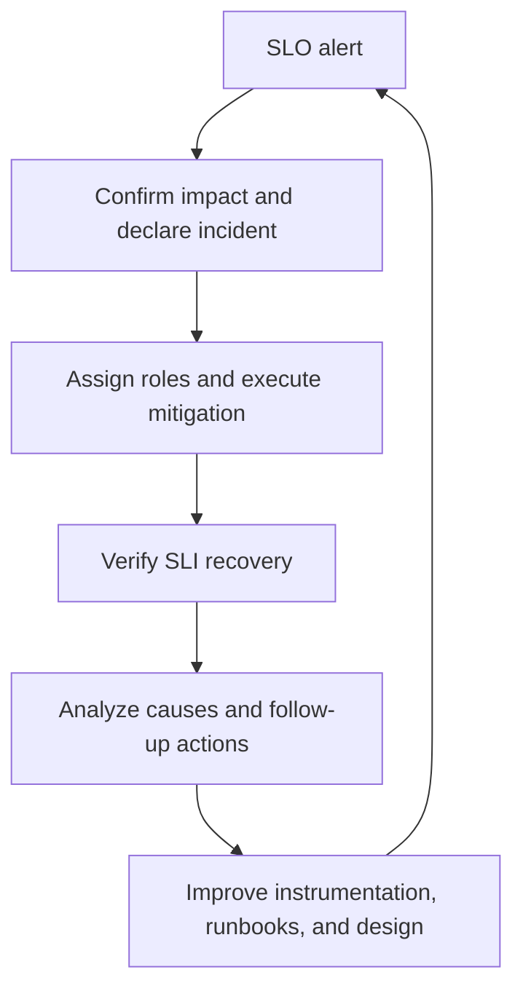



## El problema: la abundante telemetría aún puede no explicar un incidente

La recopilación de CPU, memoria, registros y seguimientos no es observable si no puede explicar qué fallas experimentan los usuarios. Por el contrario, incluso una pequeña cantidad de paneles ayuda a las operaciones si responde rápidamente a estas preguntas.

- ¿Están realmente fallando los usuarios?
- ¿Qué recorrido del usuario y qué cambio marcaron el inicio del impacto?
- ¿El fallo se amplifica en la aplicación, es una dependencia o saturación de recursos?
- ¿Debemos mitigar ahora o podemos seguir observando?
- ¿Funcionó realmente la mitigación?

El resultado principal de la observabilidad no es un gráfico, sino un **tiempo de decisión más corto**. Lograrlo requiere conectar objetivos de confiabilidad del usuario (SLO), señales de investigación causal (métricas, registros y seguimientos) y procedimientos de respuesta humana (runbooks) en un solo sistema.

## Modelo mental: del recorrido del usuario al presupuesto de errores y la política de respuesta

Seguir la relación en orden evita el diseño centrado en herramientas.

```text
사용자 여정
  -> SLI 측정 규칙
  -> SLO 목표와 평가 구간
  -> 오류 예산과 burn rate
  -> 경보·release 정책
  -> incident 대응과 학습
```

### Distinguir SLI, SLO y SLA

- **SLI (Indicador de nivel de servicio)**: una medida de confiabilidad, como la proporción de solicitudes exitosas o trabajo completado dentro de un umbral de latencia.
- **SLO (Objetivo de nivel de servicio)**: el objetivo SLI esperado durante un período de evaluación específico.
- **SLA (Acuerdo de Nivel de Servicio)**: un contrato que puede incluir compromisos externos y consecuencias de su violación.

Los SLO internos suelen ser más estrictos que los SLA para crear margen de respuesta. Comience con los recorridos de los usuarios y los compromisos del producto en lugar de asignar objetivos de "disponibilidad" arbitrarios a cada componente interno.

La forma básica de una disponibilidad basada en eventos SLI es:

$$
\text{Availability SLI} =
\frac{\text{good eligible events}}
{\text{all eligible events}}
$$

Una latencia SLI se puede definir como la proporción de eventos completados dentro de un umbral en lugar de un promedio.

$$
\text{Latency SLI} =
\frac{\text{eligible events completed within threshold}}
{\text{all eligible events}}
$$

El denominador es lo más importante. Documente si se incluyen o excluyen comprobaciones de estado, pruebas de carga, errores de validación de clientes y solicitudes canceladas. Más reglas de exclusión mejoran la cifra, pero pueden alejarla de la realidad de los usuarios.

### Un presupuesto de error es la cantidad permitida de error

Si el objetivo es $SLO$, la tasa de error permitida es:

$$
\text{Error budget fraction} = 1 - SLO
$$

Por ejemplo, en un período de 30 días basado en el tiempo, un objetivo del 99,9 % permite aproximadamente 43,2 minutos de tiempo no saludable mediante un simple cálculo. Sin embargo, para los servicios basados ​​en solicitudes, la cantidad de eventos fallidos puede representar el impacto real en el usuario mejor que los minutos de tiempo de inactividad.

La tasa de quemado indica qué tan rápido la tasa de fallas actual consume el presupuesto de errores.

$$
\text{Burn rate} =
\frac{\text{observed error ratio}}
{1 - SLO}
$$

Una tasa de consumo de 1 consume exactamente todo el presupuesto durante el período de evaluación. Una alta tasa de quema requiere una respuesta urgente incluso en un corto período de tiempo; una quema baja pero sostenida requiere un billete y una mejora estructural.

### Las métricas, los registros y los seguimientos responden a diferentes preguntas

| Señal | Pregunta fuerte | Debilidad |
|---|---|---|
| métricas | ¿Cuánto cambió, cuándo y en qué categoría? | pequeños detalles sobre eventos individuales |
| registros | ¿Qué se registró para un evento en particular? | costo, búsqueda, deriva del esquema y posibles omisiones |
| huellas | ¿Dónde se ralentizó o falló una solicitud al cruzar componentes? | afectados por los límites de muestreo e instrumentación |
| perfiles | ¿Qué código consume CPU o memoria? | requiere un enlace directo al impacto en el usuario |

Ninguna señal reemplaza a otra. La propiedad importante es la conectividad: abra un seguimiento de una alerta de métrica a través de un ejemplo o seguimiento ID, luego consulte los registros con el mismo seguimiento ID y código de error estable.

## Patrón práctico: descender de un SLO basado en síntomas a señales causales y un runbook

### 1. Primero haga un inventario de los recorridos críticos de los usuarios

Registre lo siguiente para cada viaje.

| Artículo | Pregunta |
|---|---|
| Usuario | ¿Quién depende de este comportamiento? |
| Éxito | ¿Qué resultado constituye el éxito? |
| Fracaso | ¿Es un tiempo de espera, un resultado incorrecto o un procesamiento duplicado? |
| Límite | ¿Se mide en el cliente, borde, servicio o cola? |
| Evaluación | ¿La ventana es móvil o se basa en un calendario? |
| Propietario | ¿Quién gestiona conjuntamente el objetivo y la instrumentación? |

Un servidor que devuelve `200` puede no significar el éxito del usuario si el cuerpo de la respuesta es incorrecto o no se ha completado una tarea asincrónica. Por el contrario, incluir solicitudes de clientes con formato incorrecto como fallas de confiabilidad del servidor puede distorsionar la salud del sistema. Defina un "buen evento" apropiado para el dominio.

Establecer un SLO no se trata de elegir un número perfecto de inmediato. Establezca un objetivo inicial a partir de distribuciones históricas, expectativas de los usuarios, límites arquitectónicos y costos, luego ajústelo en revisiones periódicas. Distinga un objetivo realista de bajar el objetivo simplemente para que el tablero se vuelva verde.

### 2. Aplicar RED a los servicios y USE a los recursos

RED para servicios basados en solicitudes:

- **Tarifa**: solicitud o volumen de trabajo
- **Errores**: índice de fallos y clase de error
- **Duración**: distribución de latencia

USE para recursos:

- **Utilización**: proporción de tiempo que el recurso está ocupado
- **Saturación**: el grado en que la demanda excede la capacidad, como colas, limitaciones o esperas.
- **Errores**: errores de dispositivo o de tiempo de ejecución

Al escalar únicamente a partir de la utilización de CPU se pierden las colas, I/O y la contención de bloqueos. Coloque SLO alertas sobre los síntomas del usuario y utilice RED/USE para la investigación causal y la planificación de capacidad.

### 3. Deje que las etiquetas de métricas expresen preguntas mientras controla la cardinalidad

Ejemplos de buenas etiquetas acotadas:

```text
service, environment, region, route_template, method, status_class
```

Ejemplos de etiquetas ilimitadas que se deben evitar:

```text
user_id, email, raw_url, request_id, stack_trace, arbitrary_error_message
```

Coloque ID de solicitud únicos en registros o atributos de seguimiento, no en etiquetas de métricas. Utilice una plantilla de ruta como `/orders/{id}` en lugar de una URL sin formato. La explosión de la cardinalidad aumenta el costo de la observabilidad del backend y la latencia de las consultas y puede interrumpir el monitoreo durante un incidente.

Los depósitos de histograma deben reflejar los SLO umbrales de latencia y distribuciones de usuarios reales. La latencia media oculta fallos en la cola. Los percentiles también pueden ser incorrectos si los valores de instancias separadas simplemente se promedian sin entender la agregación y el muestreo.

### 4. Proporcionar a los registros estructurados un esquema de eventos estable

```json
{
  "timestamp": "<RFC3339_TIMESTAMP>",
  "severity": "ERROR",
  "service": "<SERVICE_NAME>",
  "environment": "<ENVIRONMENT>",
  "event_name": "dependency_call_failed",
  "error_code": "DEPENDENCY_TIMEOUT",
  "trace_id": "<TRACE_ID>",
  "span_id": "<SPAN_ID>",
  "duration_ms": 2034,
  "retryable": true
}
```

No incluyas cada detalle en una frase humana; Utilice campos estables y códigos de error. Se puede almacenar un seguimiento de la pila en un campo separado, pero se necesitan límites de frecuencia o muestreo cuando el mismo error inunda los registros.

Valores que no deben registrarse de forma predeterminada:

- tokens de acceso, cookies y encabezados de autorización
- contraseñas, claves y cadenas de conexión sin formato
- cuerpos completos de solicitud y respuesta
- datos personales innecesarios e identificadores directos

Realice la redacción cerca de la aplicación, no solo en el backend de la colección. Si se produce enmascaramiento después de la ingestión central, el valor bruto permanece en el transporte, los amortiguadores y los agentes.

### 5. Conecte trazas a través de límites asincrónicos y de servicio

Propague el contexto de seguimiento estándar en los encabezados HTTP/RPC y los metadatos de propagación aprobados en los mensajes de la cola. Distinguir lo siguiente por tramos.

- nombre de la operación: acotada y estable
- estado: semántica de éxito/error
- duración: instrumentación automática
- atributos: dimensiones de investigación como ruta, dependencia y recuento de reintentos
- eventos: excepciones o cambios significativos en el ciclo de vida

Poner URL o ID sin procesar en nombres de tramo perjudica la búsqueda de rastreo y el costo. Considere el muestreo basado en cola que preserva los rastros de errores y de alta latencia, así como el volumen de tráfico. Debido a que el recopilador debe almacenar los rastros antes de tomar una decisión, revise los costos de los recursos y los modos de pérdida.

### 6. Combine velocidad y persistencia con alertas de velocidad de grabación de ventanas múltiples

Una ventana corta es rápida pero ruidosa durante picos transitorios; una ventana larga es estable pero lenta. Página cuando aparece el mismo umbral de grabación tanto en una ventana larga como en una corta.

Ejemplo conceptual para una disponibilidad del 99,9 % SLO:

```yaml
groups:
  - name: service-slo
    rules:
      - alert: ServiceAvailabilityFastBurn
        expr: |
          service:sli_error_ratio:rate1h > (14.4 * 0.001)
          and
          service:sli_error_ratio:rate5m > (14.4 * 0.001)
        for: 2m
        labels:
          severity: page
        annotations:
          summary: "Availability error budget is burning rapidly"
          runbook_url: "https://docs.example.invalid/runbooks/<SERVICE>/availability"
```

Las reglas de grabación `service:sli_error_ratio:*` deben derivar de la misma definición de evento elegible/bueno. Estos números y ventanas son sólo puntos de partida comunes; Realice una prueba retrospectiva con el tráfico real, los períodos de evaluación y la capacidad de paginación. Con poco tráfico, uno o dos eventos pueden hacer variar bruscamente la proporción, así que combine recuentos mínimos de eventos, sondas sintéticas y ventanas más largas.

Las anotaciones de alerta deben incluir:

- síntomas del usuario y alcance del impacto
- valor actual y objetivo
- Panel de control y enlaces de consulta de seguimiento/registro.
- un runbook procesable
- poseer el servicio y la ruta de escalada

No busque por la noche simplemente porque una instancia tiene un CPU alto. Si un sistema especial requiere intervención antes de que CPU amenace a su usuario SLO, establezca una barrera de seguridad de capacidad separada con una justificación explícita.

### 7. Deje que los paneles profundicen desde el resumen hasta la causa

Nivel 1: perspectiva del usuario

- SLO cumplimiento y presupuesto de error restante
- tasa de solicitudes, tasa de errores y latencia SLI
- región afectada, ruta y clase de cliente
- marcadores de cambio de implementación/configuración

Nivel 2: perspectiva de servicio

- latencia y errores por dependencia
- profundidad y edad de la cola
- reintento, tiempo de espera y estado del disyuntor
- Distribución de instancia/Pod y estado de implementación

Nivel 3: perspectiva de recursos

- CPU aceleración, presión de memoria y GC
- grupos de conexiones, grupos de subprocesos y descriptores de archivos
- saturación de disco y red.
- señales de dependencia relevantes, como bloqueos de bases de datos y retrasos en la replicación

Durante un incidente, incluso quien lo ve por primera vez debe comprender el rango de tiempo, las unidades y el rango normal del tablero. Escriba la pregunta en lugar de la implementación de la consulta en los títulos de los paneles.

### 8. Conecte implementaciones y cambios de configuración a la telemetría

Muchos incidentes se relacionan con cambios recientes, pero confiar en la memoria humana para lo "reciente" es lento. Registre lo siguiente sobre los eventos de implementación.

- revisión de fuente
- resumen de artefacto/imagen
- configuración y versión de indicador de características
- entorno y fase de implementación
- horas de inicio y finalización y resultado

Utilice una identidad de automatización y un cambio auditable ID en lugar del nombre de una persona. Conectar un identificador de versión a las anotaciones del panel y rastrear atributos de recursos le permite comparar cohortes antes y después.

### 9. Haga de un runbook una herramienta de decisión de los primeros 15 minutos para cada alerta.

Plantilla de libro de ejecución:

```markdown
# <ALERT_NAME>

## 의미
- 이 경보가 측정하는 사용자 증상
- SLI, SLO, burn window

## 즉시 확인
1. 경보가 실제 traffic과 여러 관측 지점에서 재현되는지 확인
2. 영향 환경·region·route·release 식별
3. 최근 deploy/config/dependency change 확인

## 안전한 완화
- 검증된 이전 artifact digest로 rollback
- 문제 기능을 승인된 feature flag로 비활성화
- traffic shift 또는 rate limit 적용 조건
- 각 동작의 담당 권한과 검증 query

## 중단 조건
- 데이터 손상 가능성
- rollback이 schema 호환성을 깨뜨리는 경우
- 보안 사고 징후가 있는 경우

## 검증
- SLI와 burn rate 회복
- backlog/queue가 감소하는지 확인
- synthetic 및 핵심 사용자 여정 확인

## escalation
- service owner, dependency owner, incident commander 호출 기준
```

Al agregar comandos, solicite marcadores de posición como `<ENVIRONMENT>` y `<SERVICE>` e imprima el contexto actual antes de la ejecución. No elimine comodines, reinicie el clúster completo ni realice un escalamiento horizontal ilimitado como primera respuesta.

La revisión de un documento por sí sola no valida un runbook. Pruebe enlaces, permisos y comandos reales durante los días de juego, inyección de fallas de preparación y nuevos tutoriales de guardia, y mantenga la última fecha de verificación.

## Operaciones de incidentes: utilice el mismo bucle desde la detección hasta el aprendizaje



### Roles separados

Una persona puede desempeñar múltiples funciones según la escala, pero las responsabilidades siguen siendo distintas.

- **Comandante de incidentes**: gestiona prioridades, roles y cadencia de decisiones
- **Líder de Operaciones**: coordina el diagnóstico y la ejecución de mitigación.
- **Líder de comunicaciones**: actualiza las partes interesadas y el estado
- **Escriba**: registra tiempos, observaciones, decisiones y resultados de acciones.

El experto técnico más profundo no tiene por qué ser el comandante. El experto puede centrarse en el diagnóstico mientras el comandante gestiona el flujo y el riesgo.

### Optimizar la mitigación antes que la causa raíz

Al principio, priorice las acciones reversibles que reduzcan el impacto en el usuario sobre una causa raíz completa.

1. Confirmar el impacto real y el riesgo de seguridad/integridad de los datos.
2. Declarar la gravedad del incidente y su comandante.
3. Aplique mitigaciones de bajo riesgo, como revertir un cambio reciente, desviar el tráfico o deshabilitar una función.
4. Verificar la efectividad a través de SLI y el trabajo pendiente.
5. Realizar un análisis causal más profundo después de la estabilización.

Antes de cada acción, registre el resultado esperado y la condición de reversión en una oración. Hacer varios cambios simultáneamente oscurece qué acción funcionó.

### Una línea de tiempo es una herramienta operativa en tiempo real, no un documento posterior a la acción

```text
<TIME> 관찰: availability fast-burn alert 발생
<TIME> 결정: incident 선언, 영향 범위 확인 시작
<TIME> 실행: release <REVISION> traffic 중단
<TIME> 결과: error ratio 감소, queue는 아직 증가
```

No registre nombres personales, identificadores de clientes ni secretos. Distinguir hechos, hipótesis y decisiones. Escriba declaraciones observables como "la latencia de escritura aumentó por encima del valor inicial", no "problema de base de datos".

### Las revisiones posteriores al incidente analizan las condiciones y los niveles de defensa en lugar de las personas.

Buenas preguntas de revisión:

- ¿Qué combinación de condiciones hicieron posible el incidente?
- ¿Qué capas defensivas funcionaron y cuáles no?
- ¿Por qué se retrasó la detección o mitigación?
- ¿Existe el mismo modo de falla en otros servicios?
- ¿Qué acciones realmente reducen la probabilidad o el impacto de la recurrencia?

Adjunte una función de propietario, una fecha límite, un método de verificación y una reducción de riesgo esperada para cada elemento de acción. “Tener cuidado” y “mejorar el seguimiento” no son verificables. Conviértalos en cambios del sistema, como pruebas, barreras de seguridad, tiempos de espera, aislamiento o reversión automática.

## Lista de verificación de verificación

SLO:

- [] Se especifican el recorrido del usuario y el evento exitoso.
- [ ] Se documentan el numerador, el denominador, las reglas de exclusión, el punto de medición y la ventana.
- [ ] El objetivo refleja las expectativas reales del usuario y el coste arquitectónico.
- [ ] Se ha realizado una prueba retrospectiva del comportamiento SLI en condiciones de poco tráfico y fallo parcial.
- [ ] Los presupuestos de error se conectan con las políticas de inversión en liberación y confiabilidad.

Telemetría:

- [] La cardinalidad de la etiqueta métrica está limitada y tiene un presupuesto.
- [ ] Los registros están estructurados y no recopilan secretos ni datos personales innecesarios.
- [] El contexto de seguimiento se conecta a través de límites sincrónicos y asincrónicos.
- [] Las versiones de lanzamiento/configuración se conectan a métricas, registros y seguimientos.
- [ ] Se observan retrasos, caídas, muestreos y costos en el propio pipeline de telemetría.

Alertas y runbooks:

- [] Las páginas se conectan con síntomas que requieren acción y su urgencia.
- [] Las alertas de grabación de ventanas múltiples se han validado frente a incidentes y tráfico pasados.
- [] Los enlaces del panel, la consulta y el runbook se abren con permisos de respuesta reales.
- [ ] Las mitigaciones son concretas y reversibles y tienen consultas de verificación.
- [ ] Los runbooks son utilizados periódicamente y actualizados por sus propietarios.
- [] Cada alerta tiene una acción que el destinatario puede realizar ahora.

Incidentes:

- [ ] Las funciones de comandante, operaciones, comunicaciones y escriba son claras.
- [ ] La línea de tiempo registra hechos, hipótesis, decisiones y resultados de acciones.
- [ ] La recuperación se confirma mediante SLI, trabajos pendientes y recorridos sintéticos después de la mitigación.
- [ ] Las acciones de seguimiento tienen dueños, plazos y criterios de verificación.
- [] Se verifican modos de falla similares en otros servicios.

## Casos de falla y limitaciones

### Suponiendo que recopilar todo revelará la respuesta más adelante

La telemetría ilimitada aumenta el costo y el riesgo de privacidad y oculta señales importantes. Diseñe preguntas, retención, cardinalidad y muestreo, y elimine señales no utilizadas.

### Representar la experiencia del usuario solo con tiempo de actividad

Un proceso en vivo aún puede tener una latencia alta, datos obsoletos o una falla parcial. Elija las dimensiones necesarias entre disponibilidad, latencia, corrección y frescura para cada viaje crítico.

### Promediar percentiles o confiar solo en un generador de carga

Un promedio de percentiles de instancia no es el percentil de la distribución completa. La medición del lado del servidor que omite las colas y los tiempos de espera del lado del cliente puede subestimar la latencia de cola real mediante una omisión coordinada. Verifique las perspectivas del servidor y del cliente.

### Elevar el umbral de alerta después de cada incidente

Determine si el ruido se origina en la definición SLI, la estacionalidad del tráfico, errores de instrumentación o falta de acción. Al elevar el umbral por sí solo se pierde la capacidad de detección.

### Confundir un presupuesto de error con "tiempo de interrupción que podemos gastar"

Un presupuesto erróneo no es un permiso para planificar interrupciones; es retroalimentación para equilibrar la velocidad de lanzamiento con la inversión en confiabilidad. Los riesgos de seguridad, integridad de los datos y regulatorios pueden requerir medidas de seguridad separadas de tolerancia cero.

### Tratar la reversión automática como una solución universal

Si los esquemas de la base de datos, los efectos secundarios irreversibles o los contratos de dependencia son incompatibles con el binario anterior, la reversión puede ser más peligrosa. Diseñe juntos migraciones de expansión/contracción, indicadores de funciones, ejercicios de avance y recuperación.

### Olvidar el backend de observabilidad en sí

Las caídas del recopilador, el desfase del reloj, el muestreo, el retraso en las consultas y los fallos en la entrega de alertas pueden convertir "sin datos" en "sin problemas". El canal de telemetría necesita sus propios SLO y verificaciones sintéticas independientes.

La confiabilidad operativa no termina con la creación de paneles de control. Los datos de observabilidad se convierten en capacidad operativa cuando miden el éxito del usuario, utilizan la velocidad del consumo del presupuesto para decidir cuándo actuar y conectan la mitigación segura y el aprendizaje a través de runbooks.
