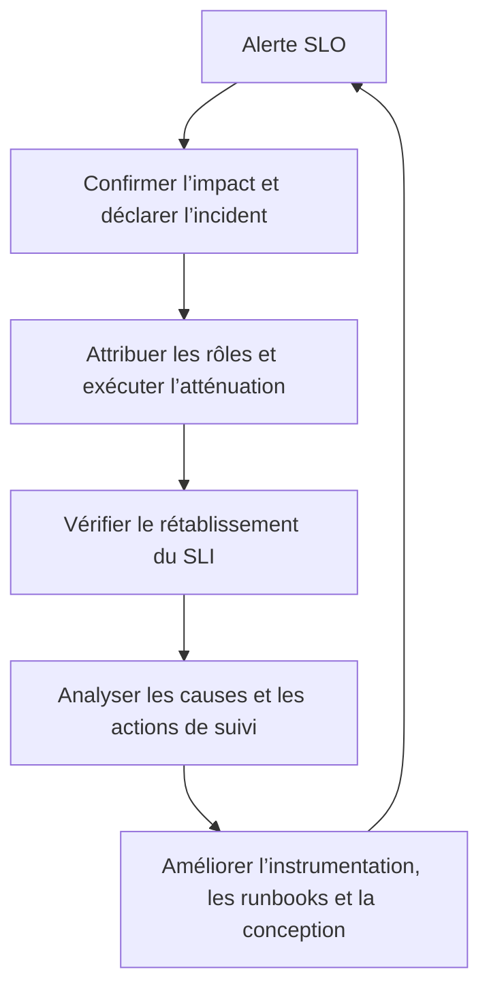



## Le problème : une télémétrie abondante peut tout de même échouer à expliquer un incident

Collecter le CPU, la mémoire, les journaux et les traces ne constitue pas de l’observabilité si cela ne permet pas d’expliquer les défaillances vécues par les utilisateurs. À l’inverse, même un petit nombre de tableaux de bord facilite l’exploitation s’il répond rapidement aux questions suivantes.

- Les utilisateurs rencontrent-ils réellement des échecs ?
- Quel parcours utilisateur et quel changement ont marqué le début de l’impact ?
- La défaillance est-elle amplifiée dans l’application, une dépendance ou la saturation d’une ressource ?
- Devons-nous atténuer le problème immédiatement, ou pouvons-nous poursuivre l’observation ?
- L’atténuation a-t-elle réellement fonctionné ?

Le principal résultat de l’observabilité n’est pas un graphique, mais un **temps de décision plus court**. Pour y parvenir, il faut relier dans un même système les objectifs de fiabilité utilisateur (SLO), les signaux d’investigation causale (métriques, journaux et traces) et les procédures d’intervention humaines (runbooks).

## Modèle mental : du parcours utilisateur au budget d’erreur et à la politique d’intervention

Suivre la relation dans l’ordre évite une conception centrée sur les outils.

```text
사용자 여정
  -> SLI 측정 규칙
  -> SLO 목표와 평가 구간
  -> 오류 예산과 burn rate
  -> 경보·release 정책
  -> incident 대응과 학습
```

### Distinguer SLI, SLO et SLA

- **SLI (Service Level Indicator)** : mesure de fiabilité, telle que la proportion de requêtes réussies ou de travaux achevés sous un seuil de latence.
- **SLO (Service Level Objective)** : objectif attendu du SLI sur une période d’évaluation déterminée.
- **SLA (Service Level Agreement)** : contrat pouvant inclure des engagements externes et les conséquences d’une violation.

Les SLO internes sont généralement plus stricts que les SLA afin de conserver une marge d’intervention. Partez des parcours utilisateurs et des engagements produit plutôt que d’attribuer arbitrairement des objectifs de « disponibilité » à chaque composant interne.

La forme de base d’un SLI de disponibilité fondé sur les événements est :

$$
\text{SLI de disponibilité} =
\frac{\text{bons événements admissibles}}
{\text{tous les événements admissibles}}
$$

Un SLI de latence peut être défini comme la proportion d’événements achevés sous un seuil plutôt que comme une moyenne.

$$
\text{SLI de latence} =
\frac{\text{événements admissibles achevés sous le seuil}}
{\text{tous les événements admissibles}}
$$

Le dénominateur est l’élément le plus important. Documentez si les contrôles de santé, tests de charge, erreurs de validation du client et requêtes annulées sont inclus ou exclus. Davantage de règles d’exclusion améliorent la valeur, mais risquent de l’éloigner de la réalité vécue par les utilisateurs.

### Un budget d’erreur est la quantité de défaillances autorisée

Si l’objectif est $SLO$, la proportion de défaillances autorisée est :

$$
\text{Fraction du budget d’erreur} = 1 - SLO
$$

Par exemple, sur une fenêtre temporelle de 30 jours, un objectif de 99,9 % autorise environ 43,2 minutes d’indisponibilité d’après un calcul simple. Pour les services fondés sur les requêtes, le nombre d’événements en échec peut toutefois mieux représenter l’impact réel sur les utilisateurs que des minutes d’indisponibilité.

Le taux de consommation indique à quelle vitesse le taux de défaillance actuel consomme le budget d’erreur.

$$
\text{Taux de consommation} =
\frac{\text{proportion d’erreurs observée}}
{1 - SLO}
$$

Un taux de consommation égal à 1 consomme exactement l’intégralité du budget sur la période d’évaluation. Un taux élevé impose une intervention urgente, même sur une courte durée ; un taux faible mais persistant exige un ticket et une amélioration structurelle.

### Métriques, journaux et traces répondent à des questions différentes

| Signal | Question à laquelle il répond bien | Faiblesse |
|---|---|---|
| métriques | Quelle quantité a changé, quand et dans quelle catégorie ? | peu de détails sur les événements individuels |
| journaux | Qu’a-t-on enregistré pour un événement donné ? | coût, recherche, dérive du schéma et omissions possibles |
| traces | Où une requête a-t-elle ralenti ou échoué en traversant les composants ? | influencées par l’échantillonnage et les limites de l’instrumentation |
| profils | Quel code consomme le CPU ou la mémoire ? | nécessite un lien direct avec l’impact utilisateur |

Aucun signal n’en remplace un autre. La propriété importante est leur connectivité : ouvrir une trace depuis une alerte métrique grâce à un exemplaire ou un ID de trace, puis interroger les journaux avec le même ID de trace et un code d’erreur stable.

## Modèle pratique : descendre d’un SLO fondé sur les symptômes vers les signaux causaux et un runbook

### 1. Commencer par inventorier les parcours utilisateurs critiques

Consignez les éléments suivants pour chaque parcours.

| Élément | Question |
|---|---|
| Utilisateur | Qui dépend de ce comportement ? |
| Réussite | Quel résultat constitue une réussite ? |
| Échec | S’agit-il d’un timeout, d’un résultat incorrect ou d’un traitement dupliqué ? |
| Frontière | La mesure est-elle effectuée côté client, edge, service ou file d’attente ? |
| Évaluation | La fenêtre est-elle glissante ou calendaire ? |
| Propriétaire | Qui gère conjointement l’objectif et l’instrumentation ? |

Un serveur qui renvoie `200` ne signifie pas nécessairement une réussite utilisateur si le corps de la réponse est incorrect ou qu’une tâche asynchrone n’est pas terminée. À l’inverse, compter les requêtes client mal formées comme des défaillances de fiabilité du serveur peut fausser la santé du système. Définissez un « bon événement » adapté au domaine.

Définir un SLO ne consiste pas à choisir immédiatement le nombre parfait. Établissez un objectif initial à partir des distributions historiques, des attentes des utilisateurs, des limites architecturales et du coût, puis ajustez-le lors de revues périodiques. Distinguez un objectif réaliste d’un abaissement visant seulement à faire passer un tableau de bord au vert.

### 2. Appliquer RED aux services et USE aux ressources

RED pour les services pilotés par les requêtes :

- **Rate** : volume de requêtes ou de travaux
- **Errors** : proportion d’échecs et classe d’erreur
- **Duration** : distribution de la latence

USE pour les ressources :

- **Utilization** : proportion du temps pendant laquelle la ressource est occupée
- **Saturation** : degré auquel la demande dépasse la capacité, par exemple files d’attente, throttling ou attentes
- **Errors** : erreurs du périphérique ou du runtime

Un dimensionnement fondé sur la seule utilisation CPU ignore la mise en file d’attente, les E/S et la contention des verrous. Placez les alertes SLO sur les symptômes utilisateurs et employez RED/USE pour l’investigation causale et la planification de capacité.

### 3. Faire exprimer les questions par les labels des métriques tout en contrôlant leur cardinalité

Exemples de bons labels bornés :

```text
service, environment, region, route_template, method, status_class
```

Exemples de labels non bornés à éviter :

```text
user_id, email, raw_url, request_id, stack_trace, arbitrary_error_message
```

Placez les ID de requête uniques dans les journaux ou les attributs de trace, pas dans les labels de métriques. Utilisez un modèle de route tel que `/orders/{id}` plutôt qu’une URL brute. Une explosion de cardinalité augmente le coût du backend d’observabilité et la latence des requêtes, et peut mettre en panne la surveillance elle-même pendant un incident.

Les compartiments des histogrammes doivent refléter les seuils de latence réels du SLO et les distributions des utilisateurs. La latence moyenne masque les défaillances en queue de distribution. Les percentiles peuvent également être erronés si les valeurs d’instances distinctes sont simplement moyennées sans comprendre l’agrégation et l’échantillonnage.

### 4. Donner aux journaux structurés un schéma d’événement stable

```json
{
  "timestamp": "<RFC3339_TIMESTAMP>",
  "severity": "ERROR",
  "service": "<SERVICE_NAME>",
  "environment": "<ENVIRONMENT>",
  "event_name": "dependency_call_failed",
  "error_code": "DEPENDENCY_TIMEOUT",
  "trace_id": "<TRACE_ID>",
  "span_id": "<SPAN_ID>",
  "duration_ms": 2034,
  "retryable": true
}
```

Ne rassemblez pas tous les détails dans une phrase destinée aux humains ; utilisez des champs et des codes d’erreur stables. Une trace de pile peut être stockée dans un champ séparé, mais un échantillonnage ou une limitation de débit est nécessaire lorsque la même erreur inonde les journaux.

Valeurs à ne pas journaliser par défaut :

- jetons d’accès, cookies et en-têtes d’autorisation
- mots de passe, clés et chaînes de connexion bruts
- corps complets des requêtes et des réponses
- données personnelles et identifiants directs inutiles

Effectuez l’expurgation près de l’application, pas uniquement dans le backend de collecte. Si le masquage intervient après l’ingestion centrale, la valeur brute demeure dans le transport, les tampons et les agents.

### 5. Relier les traces au-delà des frontières entre services et des frontières asynchrones

Propagez le contexte de trace standard dans les en-têtes HTTP/RPC et les métadonnées de propagation approuvées dans les messages des files d’attente. Distinguez les éléments suivants sur les spans.

- nom de l’opération : borné et stable
- état : sémantique de réussite/d’erreur
- durée : instrumentation automatique
- attributs : dimensions d’investigation telles que route, dépendance et nombre de nouvelles tentatives
- événements : exceptions ou changements significatifs du cycle de vie

Placer des URL ou ID bruts dans les noms de spans nuit à la recherche de traces et au coût. Envisagez un échantillonnage en aval qui conserve les traces en erreur et à forte latence, en plus du volume de trafic. Comme le collecteur doit mettre les traces en tampon avant de décider, examinez les coûts en ressources et les modes de perte.

### 6. Combiner rapidité et persistance avec des alertes de taux de consommation sur plusieurs fenêtres

Une fenêtre courte est rapide, mais bruyante lors des pics transitoires ; une fenêtre longue est stable, mais lente. Déclenchez une alerte d’astreinte lorsque le même seuil de consommation apparaît à la fois dans une fenêtre longue et une fenêtre courte.

Exemple conceptuel pour un SLO de disponibilité de 99,9 % :

```yaml
groups:
  - name: service-slo
    rules:
      - alert: ServiceAvailabilityFastBurn
        expr: |
          service:sli_error_ratio:rate1h > (14.4 * 0.001)
          and
          service:sli_error_ratio:rate5m > (14.4 * 0.001)
        for: 2m
        labels:
          severity: page
        annotations:
          summary: "Availability error budget is burning rapidly"
          runbook_url: "https://docs.example.invalid/runbooks/<SERVICE>/availability"
```

Les règles d’enregistrement `service:sli_error_ratio:*` doivent découler de la même définition des événements admissibles/bons. Ces nombres et fenêtres ne sont que des points de départ courants ; rétroduisez-les sur le trafic réel, les périodes d’évaluation et la capacité d’astreinte. Avec un faible trafic, un ou deux événements peuvent faire fortement varier la proportion ; combinez donc un nombre minimal d’événements, des sondes synthétiques et des fenêtres plus longues.

Les annotations d’alerte doivent inclure :

- les symptômes utilisateurs et la portée de l’impact
- la valeur actuelle et l’objectif
- des liens vers le tableau de bord et les requêtes de traces/journaux
- un runbook exploitable
- le service propriétaire et le chemin d’escalade

Ne déclenchez pas une astreinte de nuit simplement parce qu’une instance présente une forte utilisation CPU. Si un système particulier exige une intervention avant que le CPU ne menace son SLO utilisateur, établissez une limite de capacité distincte avec une justification explicite.

### 7. Permettre aux tableaux de bord de descendre du résumé à la cause

Niveau 1 : perspective utilisateur

- conformité au SLO et budget d’erreur restant
- débit de requêtes, proportion d’erreurs et SLI de latence
- région, route et classe de client affectées
- marqueurs de changement de déploiement/configuration

Niveau 2 : perspective du service

- latence et erreurs par dépendance
- profondeur et âge de la file d’attente
- état des nouvelles tentatives, timeouts et coupe-circuit
- distribution des instances/Pods et état du rollout

Niveau 3 : perspective des ressources

- throttling CPU, pression mémoire et GC
- pools de connexions, pools de threads et descripteurs de fichiers
- saturation du disque et du réseau
- signaux pertinents des dépendances, tels que les verrous de base de données et le retard de réplication

Pendant un incident, même une personne qui consulte le tableau de bord pour la première fois doit comprendre sa plage temporelle, ses unités et la plage normale. Dans les titres des panneaux, écrivez la question plutôt que l’implémentation de la requête.

### 8. Relier les déploiements et les changements de configuration à la télémétrie

Beaucoup d’incidents sont liés à des changements récents, mais se fier à la mémoire humaine pour définir ce qui est « récent » est lent. Consignez les éléments suivants sur les événements de déploiement.

- révision source
- digest de l’artefact/de l’image
- version de la configuration et des feature flags
- environnement et phase du rollout
- heures de début et de fin, et résultat

Utilisez une identité d’automatisation et un ID de changement auditable plutôt que le nom d’une personne. Relier un identifiant de release aux annotations des tableaux de bord et aux attributs de ressource des traces permet de comparer les cohortes avant et après.

### 9. Faire d’un runbook un outil de décision pour les quinze premières minutes de chaque alerte

Modèle de runbook :

```markdown
# <ALERT_NAME>

## 의미
- 이 경보가 측정하는 사용자 증상
- SLI, SLO, burn window

## 즉시 확인
1. 경보가 실제 traffic과 여러 관측 지점에서 재현되는지 확인
2. 영향 환경·region·route·release 식별
3. 최근 deploy/config/dependency change 확인

## 안전한 완화
- 검증된 이전 artifact digest로 rollback
- 문제 기능을 승인된 feature flag로 비활성화
- traffic shift 또는 rate limit 적용 조건
- 각 동작의 담당 권한과 검증 query

## 중단 조건
- 데이터 손상 가능성
- rollback이 schema 호환성을 깨뜨리는 경우
- 보안 사고 징후가 있는 경우

## 검증
- SLI와 burn rate 회복
- backlog/queue가 감소하는지 확인
- synthetic 및 핵심 사용자 여정 확인

## escalation
- service owner, dependency owner, incident commander 호출 기준
```

Lorsque vous ajoutez des commandes, exigez des placeholders tels que `<ENVIRONMENT>` et `<SERVICE>`, et affichez le contexte actuel avant l’exécution. Ne faites pas de suppression par joker, de redémarrage de tout le cluster ou de mise à l’échelle illimitée la première réponse à un incident.

La seule revue du document ne valide pas un runbook. Testez les liens, autorisations et commandes réels au moyen de journées d’exercice, d’injections de défaillance en staging et de parcours avec les nouveaux membres d’astreinte, et maintenez la date de dernière vérification.

## Exploitation des incidents : utiliser la même boucle, de la détection à l’apprentissage



### Séparer les rôles

Une même personne peut cumuler plusieurs rôles selon l’échelle, mais les responsabilités restent distinctes.

- **Incident Commander** : gère les priorités, les rôles et la cadence des décisions
- **Responsable des opérations** : coordonne le diagnostic et l’exécution de l’atténuation
- **Responsable de la communication** : informe les parties prenantes et communique l’état
- **Scribe** : consigne les heures, observations, décisions et résultats des actions

L’expert technique le plus pointu n’a pas besoin d’être le commandant. Il peut se concentrer sur le diagnostic pendant que le commandant gère le déroulement et les risques.

### Privilégier l’atténuation avant la cause racine

Au début, privilégiez les actions réversibles qui réduisent l’impact utilisateur plutôt que la recherche d’une cause racine complète.

1. Confirmer l’impact réel et les risques pour la sécurité/l’intégrité des données.
2. Déclarer la gravité de l’incident et nommer le commandant.
3. Appliquer une atténuation à faible risque, par exemple annuler un changement récent, déplacer le trafic ou désactiver une fonctionnalité.
4. Vérifier l’efficacité à l’aide du SLI et du backlog.
5. Mener une analyse causale approfondie après stabilisation.

Avant chaque action, consignez en une phrase son résultat attendu et sa condition de retour arrière. Effectuer plusieurs changements simultanément empêche de savoir quelle action a fonctionné.

### Une chronologie est un outil opérationnel en temps réel, pas un document rédigé après coup

```text
<TIME> 관찰: availability fast-burn alert 발생
<TIME> 결정: incident 선언, 영향 범위 확인 시작
<TIME> 실행: release <REVISION> traffic 중단
<TIME> 결과: error ratio 감소, queue는 아직 증가
```

Ne consignez ni noms de personnes, ni identifiants de clients, ni secrets. Distinguez les faits, les hypothèses et les décisions. Écrivez des affirmations observables comme « la latence d’écriture a dépassé son niveau de référence », et non « problème de base de données ».

### Les revues post-incident analysent les conditions et les couches de défense, pas les personnes

Bonnes questions de revue :

- Quelle combinaison de conditions a rendu l’incident possible ?
- Quelles couches de défense ont fonctionné et lesquelles ont échoué ?
- Pourquoi la détection ou l’atténuation a-t-elle été retardée ?
- Le même mode de défaillance existe-t-il dans d’autres services ?
- Quelles actions réduisent réellement la probabilité de récidive ou l’impact ?

Associez à chaque action de suivi un rôle responsable, une échéance, une méthode de vérification et la réduction de risque attendue. « Faire attention » et « améliorer la surveillance » ne sont pas vérifiables. Transformez-les en changements du système : tests, garde-fous, timeouts, isolation ou retour arrière automatique.

## Liste de contrôle de vérification

SLO :

- [ ] Le parcours utilisateur et l’événement réussi sont précisés.
- [ ] Le numérateur, le dénominateur, les règles d’exclusion, le point de mesure et la fenêtre sont documentés.
- [ ] L’objectif reflète les véritables attentes des utilisateurs et le coût architectural.
- [ ] Le comportement du SLI a été rétroduit sous faible trafic et défaillance partielle.
- [ ] Les budgets d’erreur sont reliés aux politiques de release et d’investissement dans la fiabilité.

Télémétrie :

- [ ] La cardinalité des labels de métriques est bornée et dispose d’un budget.
- [ ] Les journaux sont structurés et ne collectent ni secrets ni données personnelles inutiles.
- [ ] Le contexte de trace traverse les frontières synchrones et asynchrones.
- [ ] Les versions des releases/configurations sont reliées aux métriques, journaux et traces.
- [ ] Les délais, pertes, échantillonnages et coûts du pipeline de télémétrie lui-même sont observés.

Alertes et runbooks :

- [ ] Les alertes d’astreinte sont reliées aux symptômes exigeant une action et à leur urgence.
- [ ] Les alertes de consommation sur plusieurs fenêtres ont été validées sur les incidents et le trafic passés.
- [ ] Les liens vers tableaux de bord, requêtes et runbooks s’ouvrent avec les autorisations réelles des intervenants.
- [ ] Les atténuations sont concrètes et réversibles, et disposent de requêtes de vérification.
- [ ] Les runbooks sont exercés régulièrement et mis à jour par leurs propriétaires.
- [ ] Chaque alerte propose une action que son destinataire peut entreprendre immédiatement.

Incidents :

- [ ] Les rôles de commandant, opérations, communication et scribe sont clairs.
- [ ] La chronologie consigne les faits, hypothèses, décisions et résultats des actions.
- [ ] Après atténuation, le rétablissement est confirmé par le SLI, le backlog et les parcours synthétiques.
- [ ] Les actions de suivi ont des propriétaires, des échéances et des critères de vérification.
- [ ] Les modes de défaillance similaires sont recherchés dans les autres services.

## Cas d’échec et limites

### Supposer que tout collecter révélera la réponse plus tard

Une télémétrie illimitée augmente le coût et le risque pour la vie privée, et enfouit les signaux importants. Concevez les questions, la rétention, la cardinalité et l’échantillonnage, puis supprimez les signaux inutilisés.

### Représenter l’expérience utilisateur par le seul uptime

Un processus vivant peut tout de même présenter une forte latence, des données obsolètes ou une défaillance partielle. Choisissez pour chaque parcours critique les dimensions nécessaires parmi disponibilité, latence, justesse et fraîcheur.

### Calculer la moyenne des percentiles ou ne faire confiance qu’à un générateur de charge

La moyenne des percentiles des instances n’est pas le percentile de la distribution complète. Une mesure côté serveur qui omet la file d’attente et les timeouts côté client peut sous-estimer la latence réelle en queue de distribution par omission coordonnée. Recoupez les perspectives du serveur et du client.

### Relever le seuil d’alerte après chaque incident

Déterminez si le bruit provient de la définition du SLI, de la saisonnalité du trafic, d’erreurs d’instrumentation ou de l’absence d’action. Relever le seuil seul fait perdre la capacité de détection.

### Prendre un budget d’erreur pour « du temps d’indisponibilité que nous sommes autorisés à dépenser »

Un budget d’erreur n’autorise pas à planifier des interruptions ; il fournit un retour pour équilibrer vitesse de release et investissement dans la fiabilité. Les risques de sécurité, d’intégrité des données et de conformité réglementaire peuvent exiger des garde-fous distincts à tolérance zéro.

### Traiter le retour arrière automatique comme une solution universelle

Si les schémas de base de données, les effets de bord irréversibles ou les contrats des dépendances sont incompatibles avec le binaire précédent, le retour arrière peut être plus dangereux. Concevez ensemble les migrations expand/contract, les feature flags, le roll-forward et les exercices de récupération.

### Oublier le backend d’observabilité lui-même

Les pertes du collecteur, la dérive des horloges, l’échantillonnage, le délai des requêtes et l’échec de livraison des alertes peuvent transformer « aucune donnée » en « aucun problème ». Le pipeline de télémétrie a besoin de ses propres SLO et de contrôles synthétiques indépendants.

La fiabilité opérationnelle ne s’arrête pas à la construction de tableaux de bord. Les données d’observabilité deviennent une capacité opérationnelle lorsqu’elles mesurent la réussite utilisateur, utilisent la vitesse de consommation du budget pour décider quand agir et relient atténuation sûre et apprentissage au moyen de runbooks.
