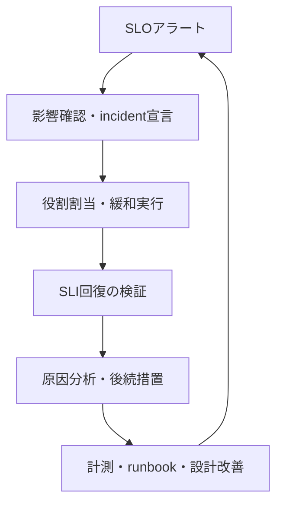



## 問題：telemetryが多くても障害を説明できないことがある

CPU、memory、log、traceをすべて収集しても、利用者がどのような失敗を経験しているか答えられなければobservabilityとはいえない。逆にdashboardが少なくても、次の問いへすばやく答えられれば運用の助けになる。

- 利用者は実際に失敗しているか。
- どのユーザージャーニーと変更から影響が始まったか。
- 失敗はapplication、dependency、resource saturationのどこで増幅しているか。
- 今すぐ緩和すべきか、さらに観察してよいか。
- 緩和策は実際に効果があったか。

observabilityの中心的な成果物はグラフではなく、**意思決定時間の短縮**である。そのために、利用者向け信頼性目標（SLO）、原因探索シグナル（metrics/logs/traces）、人が実行する対応手順（runbook）を一つの体系へ結び付ける。

## Mental model：ユーザージャーニーからエラー予算と対応方針まで

関係を順に追えば、ツール中心の設計を避けられる。

```text
사용자 여정
  -> SLI 측정 규칙
  -> SLO 목표와 평가 구간
  -> 오류 예산과 burn rate
  -> 경보·release 정책
  -> incident 대응과 학습
```

### SLI、SLO、SLAを区別する

- **SLI（Service Level Indicator）**：信頼性を測定する指標。例：成功リクエストの割合、閾値時間内に完了した割合。
- **SLO（Service Level Objective）**：特定の評価区間で期待するSLI目標。
- **SLA（Service Level Agreement）**：外部への約束と違反時の結果を含み得る契約。

内部SLOは通常SLAより厳しく設定し、対応の余裕を作る。すべての内部componentへ恣意的な「稼働率」を付けるのではなく、ユーザージャーニーと製品上の約束から始める。

eventベースのavailability SLIの基本形は次のとおりである。

$$
\text{Availability SLI} =
\frac{\text{good eligible events}}
{\text{all eligible events}}
$$

latency SLIは平均ではなく、閾値時間内に終わったeventの割合として定義できる。

$$
\text{Latency SLI} =
\frac{\text{eligible events completed within threshold}}
{\text{all eligible events}}
$$

最も重要なのは分母である。healthcheck、load test、client validation error、キャンセルリクエストを含めるか除外するかを文書化しなければならない。除外規則を増やせば数値は良くなるが、利用者の現実から遠ざかり得る。

### エラー予算は許容される失敗量である

目標が\(SLO\)なら、許容失敗率は次のとおりである。

$$
\text{Error budget fraction} = 1 - SLO
$$

たとえば時間ベースの30日windowで99.9%という目標は、単純計算で約43.2分の異常時間を許容する。ただしrequestベースのサービスでは、分単位のdowntimeより失敗event数の方が実際の利用者影響をよく表す場合がある。

burn rateは、現在の速度でエラー予算をどれだけ速く消費しているかを示す。

$$
\text{Burn rate} =
\frac{\text{observed error ratio}}
{1 - SLO}
$$

burn rateが1なら、評価区間全体で予算をちょうど使い切る速度である。高いburn rateでは短時間でも緊急対応が必要で、低くても持続するburnにはticketと構造的改善が必要である。

### metrics、logs、tracesは異なる問いに答える

| シグナル | 得意な問い | 弱点 |
|---|---|---|
| metrics | どれだけ、いつ、どの分類で変化したか。 | 個別eventの詳細な文脈が少ない |
| logs | 特定eventで何が記録されたか。 | コスト・検索・schema drift、欠落の可能性 |
| traces | リクエストがcomponentを通る際、どこで遅延・失敗したか。 | samplingと計測境界の影響 |
| profiles | どのcodeがCPU・memoryを消費するか。 | 利用者影響との直接的な接続が必要 |

どれか一つが他を代替するわけではない。metric alertのexemplarやtrace IDからtraceを開き、同じtrace IDとstable error codeでlogを検索できる接続性が重要である。

## 実践パターン：症状ベースのSLOから原因シグナルとrunbookへ降りる

### 1. 重要なユーザージャーニーを先に列挙する

各ジャーニーについて次を記す。

| 項目 | 問い |
|---|---|
| 利用者 | 誰がこの動作に依存するか。 |
| 成功 | どの結果を受け取れば成功か。 |
| 失敗 | timeout、誤った結果、重複処理のどれか。 |
| 境界 | client、edge、service、queueのどこで測るか。 |
| 評価 | rolling windowかcalendar windowか。 |
| 所有者 | 目標と計測を誰が一緒に管理するか。 |

サーバーが`200`を返してもresponse bodyが誤っている、または非同期ジョブが完了していなければ、利用者の成功ではない場合がある。反対にclientの誤ったリクエストをサーバーreliabilityの失敗へ含めると、システム状態を歪め得る。domainに合う「good event」を明示する。

SLOは最初から完璧な数値を決める作業ではない。過去分布、利用者の期待、architectureの限界、コストを観察して初期目標を立て、定期reviewで調整する。目標を下げてdashboardを緑色にすることと、現実的な目標を作ることを区別しなければならない。

### 2. サービスにはRED、リソースにはUSEを適用する

request-drivenサービスのRED：

- **Rate**：リクエストまたはジョブ量
- **Errors**：失敗率とerror class
- **Duration**：latency distribution

リソースのUSE：

- **Utilization**：リソースが稼働中である割合
- **Saturation**：queue、throttling、waitのように需要が容量を超える程度
- **Errors**：device/runtimeエラー

CPU utilizationだけを見てscaleするとqueueing、I/O、lock contentionを見逃す。SLOアラートは利用者症状へ置き、RED/USEは原因探索と容量計画に使う。

### 3. metric labelは問いを表現しつつcardinalityを制御する

良いbounded labelの例：

```text
service, environment, region, route_template, method, status_class
```

避けるべきunbounded labelの例：

```text
user_id, email, raw_url, request_id, stack_trace, arbitrary_error_message
```

一意なrequest IDはmetric labelではなく、logまたはtrace attributeへ置く。raw URLではなく`/orders/{id}`のようなroute templateを使う。cardinalityの急増はobservability backendのコストとquery latencyを高め、障害時にmonitoring自体を壊し得る。

histogram bucketは実際のSLO latency thresholdと利用者分布を反映する。平均latencyはtail failureを隠す。percentileもaggregationとsampling方法を確認しなければ、異なるinstanceの値を単純平均する誤りが生じる。

### 4. 構造化logへ安定したevent schemaを置く

```json
{
  "timestamp": "<RFC3339_TIMESTAMP>",
  "severity": "ERROR",
  "service": "<SERVICE_NAME>",
  "environment": "<ENVIRONMENT>",
  "event_name": "dependency_call_failed",
  "error_code": "DEPENDENCY_TIMEOUT",
  "trace_id": "<TRACE_ID>",
  "span_id": "<SPAN_ID>",
  "duration_ms": 2034,
  "retryable": true
}
```

人間向けの一文へすべての情報を詰め込まず、stable fieldとstable error codeを設ける。stack traceは別fieldへ保持できるが、同じエラーが急増するときにはsamplingまたはrate limitが必要である。

基本的にlogへ入れない値：

- access token、cookie、authorization header
- password、key、connection string原文
- リクエスト・レスポンスbody全体
- 不要な個人情報と直接識別子

redactionは収集backendではなく、アプリケーションに近い場所で行う。中央logへ入ってからmaskingすると、転送・buffer・agent段階に原文が残る。

### 5. traceはサービス境界と非同期境界を結び付ける

HTTP/RPC headerの標準trace contextを伝播し、queue messageにも許可されたpropagation metadataを入れる。spanでは次を区別する。

- operation名：boundedかつstable
- status：成功・エラーの意味
- duration：自動計測
- attribute：route、dependency、retry countのような探索次元
- event：exceptionまたは重要なlifecycle変化

span名にraw URLやIDを含めると、trace検索とコストが悪化する。samplingではtraffic volumeだけでなく、エラー・高遅延traceを保持するtail-based方針を検討する。ただしcollectorが判断する前にtraceをbufferする必要があるため、resourceコストと損失モードを検討する。

### 6. 複数windowのburn-rateアラートで速度と持続性を同時に見る

短いwindowだけなら速いが瞬間的なspikeに騒がしく、長いwindowだけなら安定するが遅い。同じburn thresholdが長いwindowと短いwindowの両方に現れたときにpageする。

99.9% availability SLOの概念例：

```yaml
groups:
  - name: service-slo
    rules:
      - alert: ServiceAvailabilityFastBurn
        expr: |
          service:sli_error_ratio:rate1h > (14.4 * 0.001)
          and
          service:sli_error_ratio:rate5m > (14.4 * 0.001)
        for: 2m
        labels:
          severity: page
        annotations:
          summary: "Availability error budget is burning rapidly"
          runbook_url: "https://docs.example.invalid/runbooks/<SERVICE>/availability"
```

`service:sli_error_ratio:*` recording ruleは、同一のeligible/good event定義から生成されなければならない。上記の数値とwindowは広く使われる出発例にすぎず、実際のtraffic特性、評価区間、page対応能力に合わせてbacktestする。低trafficでは比率が1、2件のeventで大きく揺れるため、最小event数、synthetic probe、longer windowを組み合わせる。

アラートannotationには次を含める。

- 利用者症状と影響範囲
- 現在値と目標
- dashboardとtrace/log queryへのlink
- 実行可能なrunbook
- 所有serviceとescalation経路

instance CPUが高いという理由だけで夜間にpageしない。CPUが利用者SLOを脅かす前に対応すべき特殊なシステムなら、capacity guardrailとして別の根拠を置く。

### 7. dashboardは要約から原因へdrill-downする

第1段階：利用者視点

- SLO complianceと残りエラー予算
- request rate、error ratio、latency SLI
- 影響region、route、client class
- deploy/config change marker

第2段階：service視点

- dependency別latency/error
- queue depthとage
- retry、timeout、circuit breaker状態
- instance/pod分布とrollout状態

第3段階：resource視点

- CPU throttling、memory pressure、GC
- connection pool、thread pool、file descriptor
- disk/network saturation
- database lock、replication lagなど該当dependencyのシグナル

dashboardはincident中に初めて見る人でも、時間範囲、単位、正常範囲を理解できなければならない。panel titleにはquery実装ではなく問いを書く。

### 8. デプロイと設定変更をtelemetryへ接続する

incidentの多くは最近の変更と関係するが、「最近」を人の記憶に頼ると遅くなる。deploy eventへ次を記録する。

- source revision
- artifact/image digest
- configとfeature flag version
- environmentとrollout phase
- 開始・終了時刻と結果

個人名ではなくautomation identityと監査可能なchange IDを使う。dashboard annotationとtrace resource attributeへrelease identifierを結び付ければ、変更前後のcohortを比較できる。

### 9. runbookをアラート別の最初の15分に使う意思決定ツールにする

runbook template：

```markdown
# <ALERT_NAME>

## 의미
- 이 경보가 측정하는 사용자 증상
- SLI, SLO, burn window

## 즉시 확인
1. 경보가 실제 traffic과 여러 관측 지점에서 재현되는지 확인
2. 영향 환경·region·route·release 식별
3. 최근 deploy/config/dependency change 확인

## 안전한 완화
- 검증된 이전 artifact digest로 rollback
- 문제 기능을 승인된 feature flag로 비활성화
- traffic shift 또는 rate limit 적용 조건
- 각 동작의 담당 권한과 검증 query

## 중단 조건
- 데이터 손상 가능성
- rollback이 schema 호환성을 깨뜨리는 경우
- 보안 사고 징후가 있는 경우

## 검증
- SLI와 burn rate 회복
- backlog/queue가 감소하는지 확인
- synthetic 및 핵심 사용자 여정 확인

## escalation
- service owner, dependency owner, incident commander 호출 기준
```

コマンドを入れるときは`<ENVIRONMENT>`、`<SERVICE>`のようなplaceholderを強制し、実行前に現在のcontextを出力させる。wildcard削除、cluster全体の再起動、無制限scale-outを初動対応に置かない。

runbookは文書reviewだけでは検証されない。game day、staging failure injection、新規on-call walkthroughで実際のlink・権限・コマンドを試し、最終検証日を管理する。

## incident運用：検知から学習まで同じloopを使う



### 役割を分離する

規模に応じて1人が複数役を担えるが、責任は区別する。

- **Incident Commander**：優先順位、役割、意思決定のリズムを管理
- **Operations Lead**：診断と緩和実行を調整
- **Communications Lead**：関係者とstatus update
- **Scribe**：時刻、観察、決定、実行結果を記録

最も深い技術知識を持つ人が必ずcommanderである必要はない。技術者は診断に集中し、commanderは全体の流れとリスクを管理する。

### 原因より緩和を先に最適化する

初期段階では完全なroot causeより、利用者影響を減らすreversible actionを優先する。

1. 実際の影響とsecurity/data integrityリスクを確認
2. incident severityとcommanderを宣言
3. 最近の変更のrollback、traffic shift、feature disableなど低リスク緩和
4. SLIとbacklogで効果を検証
5. 安定化後に深い原因分析

各actionの前に、期待結果とrollback条件を1文で記録する。複数変更を同時に行うと、どの措置が有効だったか分からない。

### 時刻記録は事後文書ではなくリアルタイム運用ツールである

```text
<TIME> 관찰: availability fast-burn alert 발생
<TIME> 결정: incident 선언, 영향 범위 확인 시작
<TIME> 실행: release <REVISION> traffic 중단
<TIME> 결과: error ratio 감소, queue는 아직 증가
```

人名、顧客識別子、secretを記録しない。事実、仮説、決定を区別する。「databaseの問題」ではなく「write latencyがbaselineより上昇」のように、観察可能な文を書く。

### post-incident reviewは人ではなく条件と防御層を分析する

良いreviewの問い：

- どの条件の組み合わせが障害を可能にしたか。
- どの防御層が機能し、何が機能しなかったか。
- なぜdetectionまたはmitigationが遅れたか。
- 同じfailure modeが他のserviceにも存在するか。
- どのactionが再発可能性または影響の大きさを実際に減らすか。

action itemには所有role、期限、検証方法、期待されるリスク低減を付ける。「注意する」「monitoringを強化する」では完了を検証できない。test、guardrail、timeout、isolation、自動rollbackのようなシステム変更へ変える。

## 検証チェックリスト

SLO：

- [ ] ユーザージャーニーと成功eventが明示されている。
- [ ] 分子・分母、除外規則、測定位置、windowが文書化されている。
- [ ] 目標が実際の利用者期待とarchitectureコストを反映する。
- [ ] 低trafficと部分障害におけるSLIの動作をbacktestした。
- [ ] エラー予算にrelease・reliability投資方針が結び付いている。

telemetry：

- [ ] metrics labelのcardinalityがboundedでbudgetがある。
- [ ] logが構造化され、secret・不要な個人情報を収集しない。
- [ ] trace contextが同期・非同期境界を越えて接続される。
- [ ] release/config versionがmetrics・logs・tracesと関連付けられる。
- [ ] telemetry pipeline自体の遅延、drop、sampling、コストを観測する。

alertとrunbook：

- [ ] pageは利用者が行動すべき症状と緊急性に結び付く。
- [ ] multi-window burn alertを過去incidentとtrafficで検証した。
- [ ] dashboard、query、runbook linkが実際の権限で開く。
- [ ] 緩和措置が具体的かつreversibleで、検証queryがある。
- [ ] runbookを定期的に実行試験し、所有者が更新する。
- [ ] 各alertには受信者が今できる行動がある。

incident：

- [ ] commander、operations、communications、scribeの役割が明確である。
- [ ] 事実・仮説・決定・実行結果のtimelineを残す。
- [ ] 緩和後にSLI、backlog、synthetic journeyで回復を確認する。
- [ ] 後続措置が所有者・期限・検証基準を持つ。
- [ ] 類似failure modeを他サービスまで拡張して点検する。

## 失敗事例と限界

### すべて収集すれば後で答えを見つけられると考える

無制限なtelemetryはコストと個人情報リスクを高め、重要なシグナルを埋もれさせる。問い、retention、cardinality、samplingを設計し、使われていないシグナルを整理する。

### uptime一つで利用者体験を代表する

processが生きていても、高latency、stale data、partial failureがあり得る。重要ジャーニーごとにavailability、latency、correctness、freshnessから必要な次元を選ぶ。

### percentileを単純平均する、またはload generatorだけを信じる

instance percentileの平均は全体分布のpercentileではない。client側のqueueingとtimeoutを除いたサーバー側測定は、coordinated omissionによって実際のtail latencyを低く見積もり得る。serverとclientの視点を相互検証する。

### alert thresholdを障害のたびに上げる

noiseの原因がSLI定義、traffic seasonality、計測エラー、action不在のどれかを分析する。thresholdを上げるだけでは検知能力を失う。

### エラー予算を「使ってよい障害時間」と誤解する

エラー予算は障害を計画する許可ではなく、release速度とreliability投資を調整するfeedbackである。security・data integrity・規制リスクには別のzero-tolerance guardrailが必要な場合がある。

### 自動rollbackを万能とみなす

database schema、irreversible side effect、dependency contractが旧binaryと互換でなければ、rollbackの方が危険になり得る。expand/contract migration、feature flag、roll-forward、復元訓練を併せて設計する。

### observability backend自体を忘れる

collector drop、clock skew、sampling、query delay、alert delivery failureがあると、「データがない」を「問題がない」と誤解する。telemetry pipelineにも独自SLOと独立synthetic checkが必要である。

運用信頼性はdashboardを作ることで終わらない。利用者の成功を測定し、予算消費速度から行動時点を決め、安全な緩和と学習をrunbookへ結び付けたとき、観測データが実際の運用能力になる。
