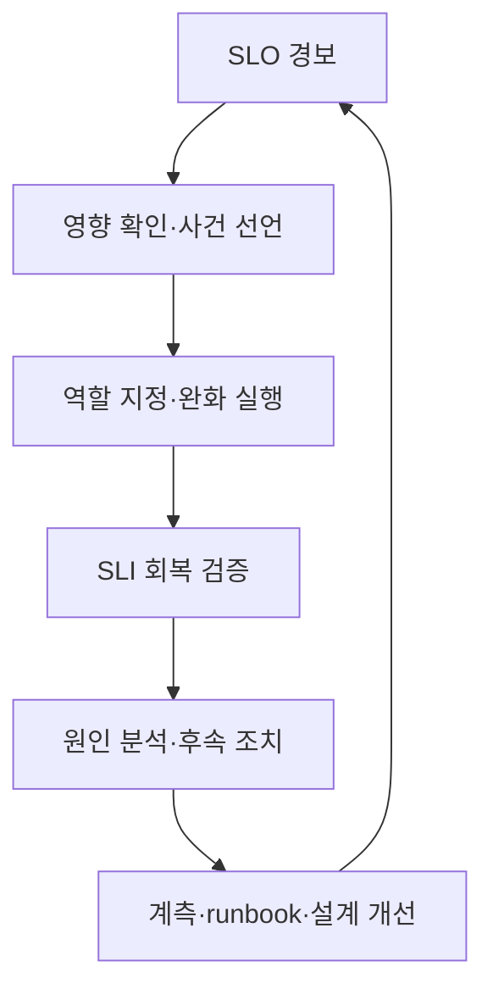

## 문제: telemetry가 많아도 장애를 설명하지 못할 수 있다

CPU, memory, log, trace를 모두 수집해도 사용자가 어떤 실패를 겪는지 답하지 못하면 관측성이 아니다. 반대로 dashboard 수가 적어도 다음 질문에 빠르게 답할 수 있다면 운영에 도움이 된다.

- 사용자가 실제로 실패하고 있는가?
- 어느 사용자 여정과 변경부터 영향이 시작됐는가?
- 실패가 application, dependency, resource saturation 중 어디에서 증폭되는가?
- 지금 완화해야 하는가, 더 관찰해도 되는가?
- 완화가 실제로 효과가 있었는가?

관측성의 핵심 산출물은 그래프가 아니라 **의사결정 시간 단축**이다. 이를 위해 사용자 신뢰성 목표(SLO), 원인 탐색 신호(metrics/logs/traces), 사람이 실행할 대응 절차(runbook)를 하나의 체계로 연결한다.

## Mental model: 사용자 여정에서 오류 예산과 대응 정책까지

관계를 순서대로 보면 도구 중심 설계를 피할 수 있다.

```text
사용자 여정
  -> SLI 측정 규칙
  -> SLO 목표와 평가 구간
  -> 오류 예산과 burn rate
  -> 경보·release 정책
  -> incident 대응과 학습
```

### SLI, SLO, SLA를 구분한다

- **SLI(Service Level Indicator)**: 신뢰성을 측정하는 지표. 예: 성공 요청 비율, 임계시간 내 완료 비율.
- **SLO(Service Level Objective)**: 특정 평가 구간에 기대하는 SLI 목표.
- **SLA(Service Level Agreement)**: 외부 약속과 위반 결과를 포함할 수 있는 계약.

내부 SLO는 보통 SLA보다 엄격하게 두어 대응 여유를 만든다. 모든 내부 component에 임의의 “가동률”을 부여하기보다 사용자 여정과 제품 약속에서 시작한다.

event 기반 availability SLI의 기본형은 다음과 같다.

$$
\text{Availability SLI} =
\frac{\text{good eligible events}}
{\text{all eligible events}}
$$

latency SLI는 평균이 아니라 임계시간 안에 끝난 event의 비율로 정의할 수 있다.

$$
\text{Latency SLI} =
\frac{\text{eligible events completed within threshold}}
{\text{all eligible events}}
$$

분모가 가장 중요하다. healthcheck, load test, client validation error, 취소 요청을 포함할지 제외할지 문서화해야 한다. 제외 규칙을 늘리면 숫자는 좋아지지만 사용자 현실과 멀어질 수 있다.

### 오류 예산은 허용 실패량이다

목표가 $SLO$라면 허용 실패 비율은 다음과 같다.

$$
\text{Error budget fraction} = 1 - SLO
$$

예를 들어 시간 기반 30일 window에서 99.9% 목표는 단순 계산으로 약 43.2분의 비정상 시간을 허용한다. 그러나 request 기반 서비스에서는 분 단위 downtime보다 실패 event 수가 실제 사용자 영향을 더 잘 나타낼 수 있다.

burn rate는 현재 속도로 오류 예산을 얼마나 빠르게 소비하는지 나타낸다.

$$
\text{Burn rate} =
\frac{\text{observed error ratio}}
{1 - SLO}
$$

burn rate가 1이면 평가 구간 전체에 걸쳐 예산을 정확히 소진하는 속도다. 높은 burn rate는 짧은 시간에도 긴급 대응이 필요하고, 낮지만 지속적인 burn은 ticket과 구조적 개선이 필요하다.

### metrics, logs, traces는 서로 다른 질문에 답한다

| 신호 | 강한 질문 | 약점 |
|---|---|---|
| metrics | 얼마나, 언제, 어떤 범주에서 변했는가? | 개별 event의 상세 맥락이 적음 |
| logs | 특정 event에서 무슨 일이 기록됐는가? | 비용·검색·schema drift, 누락 가능성 |
| traces | 요청이 component를 지나며 어디서 지연·실패했는가? | sampling과 계측 경계의 영향 |
| profiles | CPU·memory를 어떤 코드가 소비하는가? | 사용자 영향과 직접 연결이 필요 |

하나가 다른 것을 대체하지 않는다. metric alert에서 exemplar나 trace ID로 trace를 열고, 동일 trace ID와 stable error code로 log를 조회하는 연결성이 중요하다.

## 실전 패턴: 증상 기반 SLO에서 원인 신호와 runbook으로 내려간다

### 1. 중요한 사용자 여정을 먼저 목록화한다

각 여정에 다음을 적는다.

| 항목 | 질문 |
|---|---|
| 사용자 | 누가 이 동작에 의존하는가? |
| 성공 | 어떤 결과를 받으면 성공인가? |
| 실패 | timeout, 잘못된 결과, 중복 처리 중 무엇인가? |
| 경계 | client, edge, service, queue 중 어디서 측정하는가? |
| 평가 | rolling window인가 calendar window인가? |
| 소유자 | 목표와 계측을 누가 함께 관리하는가? |

서버가 `200`을 반환해도 response body가 잘못됐거나 비동기 작업이 끝나지 않으면 사용자 성공이 아닐 수 있다. 반대로 client의 잘못된 요청을 서버 reliability 실패로 포함하면 시스템 상태를 왜곡할 수 있다. domain에 맞는 “good event”를 명시한다.

SLO는 처음부터 완벽한 숫자를 정하는 작업이 아니다. 과거 분포, 사용자 기대, architecture 한계, 비용을 관찰해 초기 목표를 세우고 정기 review에서 조정한다. 목표를 낮춰 dashboard를 초록색으로 만드는 것과 현실적인 목표를 만드는 것을 구분해야 한다.

### 2. 서비스에는 RED, 자원에는 USE를 적용한다

request-driven 서비스의 RED:

- **Rate**: 요청 또는 작업량
- **Errors**: 실패 비율과 error class
- **Duration**: latency distribution

자원의 USE:

- **Utilization**: 자원이 바쁜 비율
- **Saturation**: queue, throttling, wait처럼 수요가 용량을 넘는 정도
- **Errors**: device/runtime 오류

CPU utilization만 보고 scale하면 queueing, I/O, lock contention을 놓친다. SLO 경보는 사용자 증상에 두고, RED/USE는 원인 탐색과 용량 계획에 사용한다.

### 3. metric label은 질문을 표현하되 cardinality를 통제한다

좋은 bounded label 예:

```text
service, environment, region, route_template, method, status_class
```

피해야 할 unbounded label 예:

```text
user_id, email, raw_url, request_id, stack_trace, arbitrary_error_message
```

고유 request ID는 metric label이 아니라 log 또는 trace attribute에 둔다. raw URL 대신 `/orders/{id}` 같은 route template을 사용한다. cardinality 폭증은 관측 backend 비용과 query latency를 높이고, 장애 시 monitoring 자체를 망가뜨릴 수 있다.

histogram bucket은 실제 SLO latency threshold와 사용자 분포를 반영한다. 평균 latency는 tail failure를 숨긴다. percentile도 aggregation과 sampling 방법을 확인하지 않으면 서로 다른 instance 값을 단순 평균내는 오류가 생긴다.

### 4. 구조화 log에 안정된 event schema를 둔다

```json
{
  "timestamp": "<RFC3339_TIMESTAMP>",
  "severity": "ERROR",
  "service": "<SERVICE_NAME>",
  "environment": "<ENVIRONMENT>",
  "event_name": "dependency_call_failed",
  "error_code": "DEPENDENCY_TIMEOUT",
  "trace_id": "<TRACE_ID>",
  "span_id": "<SPAN_ID>",
  "duration_ms": 2034,
  "retryable": true
}
```

사람 문장 하나에 모든 정보를 넣지 말고 stable field와 stable error code를 둔다. stack trace는 별도 field에 보관할 수 있지만 동일 오류가 폭주할 때 sampling 또는 rate limit이 필요하다.

기본적으로 log에 넣지 않을 값:

- access token, cookie, authorization header
- password, key, connection string 원문
- 요청·응답 body 전체
- 불필요한 개인정보와 직접 식별자

redaction은 수집 backend가 아니라 애플리케이션 가까운 곳에서 수행한다. 이미 중앙 log에 들어간 뒤 마스킹하면 전송·buffer·agent 단계에 원문이 남는다.

### 5. trace는 서비스 경계와 비동기 경계를 연결한다

HTTP/RPC header의 표준 trace context를 전달하고, queue message에도 허용된 propagation metadata를 넣는다. span에는 다음을 구분한다.

- operation 이름: bounded, stable
- status: 성공/오류 의미
- duration: 자동 계측
- attribute: route, dependency, retry count 같은 탐색 차원
- event: exception 또는 중요한 lifecycle 변화

span 이름에 raw URL이나 ID를 넣으면 trace 검색과 비용이 악화된다. sampling은 traffic volume뿐 아니라 오류·고지연 trace를 보존하는 tail-based 정책을 고려한다. 다만 collector가 판단하기 전 trace를 buffer해야 하므로 resource 비용과 유실 모드를 검토한다.

### 6. 다중 window burn-rate 경보로 속도와 지속성을 함께 본다

짧은 window 하나는 빠르지만 순간 spike에 시끄럽고, 긴 window 하나는 안정적이지만 늦다. 같은 burn threshold가 긴 window와 짧은 window에서 모두 나타날 때 page한다.

99.9% availability SLO의 개념 예시:

```yaml
groups:
  - name: service-slo
    rules:
      - alert: ServiceAvailabilityFastBurn
        expr: |
          service:sli_error_ratio:rate1h > (14.4 * 0.001)
          and
          service:sli_error_ratio:rate5m > (14.4 * 0.001)
        for: 2m
        labels:
          severity: page
        annotations:
          summary: "Availability error budget is burning rapidly"
          runbook_url: "https://docs.example.invalid/runbooks/<SERVICE>/availability"
```

`service:sli_error_ratio:*` recording rule은 동일한 eligible/good event 정의에서 생성돼야 한다. 위 수치와 window는 널리 쓰이는 출발 예시일 뿐, 실제 traffic 특성, 평가 구간, page 대응 능력에 맞게 backtest해야 한다. 낮은 traffic에서는 비율이 한두 event에 크게 흔들리므로 최소 event 수, synthetic probe, longer window를 조합한다.

경보 annotation에는 다음을 넣는다.

- 사용자 증상과 영향 범위
- 현재 값과 목표
- dashboard와 trace/log query link
- 실행 가능한 runbook
- 소유 service와 escalation 경로

instance CPU가 높다는 이유만으로 야간 page하지 않는다. CPU가 사용자 SLO를 위협하기 전에 대응해야 하는 특별한 시스템이라면 capacity guardrail로 별도 근거를 둔다.

### 7. dashboard는 요약에서 원인으로 drill-down한다

1단계: 사용자 관점

- SLO compliance와 남은 오류 예산
- request rate, error ratio, latency SLI
- 영향 region, route, client class
- deploy/config change marker

2단계: service 관점

- dependency별 latency/error
- queue depth와 age
- retry, timeout, circuit breaker 상태
- instance/pod 분포와 rollout 상태

3단계: resource 관점

- CPU throttling, memory pressure, GC
- connection pool, thread pool, file descriptor
- disk/network saturation
- database lock, replication lag 등 해당 dependency 신호

dashboard는 incident 중 처음 보는 사람도 시간 범위, 단위, 정상 범위를 이해할 수 있어야 한다. panel title에 query 구현보다 질문을 쓴다.

### 8. 배포와 설정 변경을 telemetry에 연결한다

incident의 많은 원인은 최근 변경과 관련 있지만 “최근”을 사람 기억에 의존하면 늦어진다. deploy event에 다음을 기록한다.

- source revision
- artifact/image digest
- config와 feature flag version
- environment와 rollout phase
- 시작·종료 시각과 결과

개인 이름 대신 automation identity와 감사 가능한 change ID를 사용한다. dashboard annotation과 trace resource attribute에 release identifier를 연결하면 이전/이후 cohort를 비교할 수 있다.

### 9. runbook을 경보별 첫 15분 의사결정 도구로 만든다

runbook template:

```markdown
# <ALERT_NAME>

## 의미
- 이 경보가 측정하는 사용자 증상
- SLI, SLO, burn window

## 즉시 확인
1. 경보가 실제 traffic과 여러 관측 지점에서 재현되는지 확인
2. 영향 환경·region·route·release 식별
3. 최근 deploy/config/dependency change 확인

## 안전한 완화
- 검증된 이전 artifact digest로 rollback
- 문제 기능을 승인된 feature flag로 비활성화
- traffic shift 또는 rate limit 적용 조건
- 각 동작의 담당 권한과 검증 query

## 중단 조건
- 데이터 손상 가능성
- rollback이 schema 호환성을 깨뜨리는 경우
- 보안 사고 징후가 있는 경우

## 검증
- SLI와 burn rate 회복
- backlog/queue가 감소하는지 확인
- synthetic 및 핵심 사용자 여정 확인

## escalation
- service owner, dependency owner, incident commander 호출 기준
```

명령을 넣을 때는 `<ENVIRONMENT>`, `<SERVICE>` 같은 placeholder를 강제하고 실행 전 현재 context를 출력하게 한다. wildcard 삭제, 전체 cluster 재시작, 무제한 scale-out을 첫 대응으로 두지 않는다.

runbook은 문서 review만으로 검증되지 않는다. game day, staging failure injection, 신규 on-call walkthrough에서 실제 링크·권한·명령을 시험하고 마지막 검증 일자를 관리한다.

## incident 운영: 탐지부터 학습까지 같은 루프를 사용한다



### 역할을 분리한다

규모에 따라 한 사람이 여러 역할을 맡을 수 있지만 책임은 구분한다.

- **Incident Commander**: 우선순위, 역할, 의사결정 리듬 관리
- **Operations Lead**: 진단과 완화 실행 조정
- **Communications Lead**: 이해관계자와 status update
- **Scribe**: 시각, 관찰, 결정, 실행 결과 기록

가장 깊은 기술자가 반드시 commander일 필요는 없다. 기술자는 진단에 집중하고 commander는 전체 흐름과 위험을 관리한다.

### 원인보다 완화를 먼저 최적화한다

초기에는 완전한 root cause보다 사용자 영향을 줄이는 reversible action을 우선한다.

1. 실제 영향과 security/data integrity 위험 확인
2. incident severity와 commander 선언
3. 최근 변경 rollback, traffic shift, feature disable 등 낮은 위험 완화
4. SLI와 backlog로 효과 검증
5. 안정화 후 깊은 원인 분석

각 action 전에 기대 결과와 rollback 조건을 한 문장으로 기록한다. 여러 변경을 동시에 하면 어떤 조치가 효과가 있었는지 알기 어렵다.

### 시간 기록은 사후 문서가 아니라 실시간 운영 도구다

```text
<TIME> 관찰: availability fast-burn alert 발생
<TIME> 결정: incident 선언, 영향 범위 확인 시작
<TIME> 실행: release <REVISION> traffic 중단
<TIME> 결과: error ratio 감소, queue는 아직 증가
```

사람 이름, 고객 식별자, secret을 기록하지 않는다. 사실, 가설, 결정을 구분한다. “database 문제” 대신 “write latency가 baseline 대비 상승”처럼 관찰 가능한 문장을 쓴다.

### post-incident review는 사람보다 조건과 방어층을 분석한다

좋은 review 질문:

- 어떤 조건 조합이 장애를 가능하게 했는가?
- 어떤 방어층이 작동했고 무엇이 작동하지 않았는가?
- 왜 detection 또는 mitigation이 늦었는가?
- 같은 failure mode가 다른 service에도 있는가?
- 어떤 action이 재발 가능성 또는 영향 크기를 실제로 줄이는가?

action item에는 소유 role, 기한, 검증 방법, 기대 위험 감소를 붙인다. “주의한다”, “모니터링 강화”는 완료를 검증할 수 없다. test, guardrail, timeout, isolation, 자동 rollback처럼 시스템 변경으로 바꾼다.

## 검증 체크리스트

SLO:

- [ ] 사용자 여정과 성공 event가 명시돼 있다.
- [ ] 분자·분모, 제외 규칙, 측정 위치, window가 문서화돼 있다.
- [ ] 목표가 실제 사용자 기대와 architecture 비용을 반영한다.
- [ ] 낮은 traffic과 부분 장애에서 SLI 동작을 backtest했다.
- [ ] 오류 예산에 release·reliability 투자 정책이 연결된다.

telemetry:

- [ ] metrics label cardinality가 bounded이고 budget이 있다.
- [ ] log가 구조화됐고 secret·불필요한 개인정보를 수집하지 않는다.
- [ ] trace context가 동기·비동기 경계를 지나 연결된다.
- [ ] release/config version이 metrics·logs·traces와 연계된다.
- [ ] telemetry pipeline 자체의 지연, drop, sampling, 비용을 관측한다.

alert와 runbook:

- [ ] page는 사용자가 행동해야 하는 증상과 긴급성에 연결된다.
- [ ] multi-window burn alert를 과거 incident와 traffic으로 검증했다.
- [ ] dashboard, query, runbook link가 실제 권한으로 열린다.
- [ ] 완화 동작이 구체적이고 reversible하며 검증 query가 있다.
- [ ] runbook을 정기적으로 실행 시험하고 소유자가 갱신한다.
- [ ] alert마다 수신자가 지금 할 수 있는 행동이 있다.

incident:

- [ ] commander, operations, communications, scribe 역할이 명확하다.
- [ ] 사실·가설·결정·실행 결과의 timeline을 남긴다.
- [ ] 완화 뒤 SLI, backlog, synthetic journey로 회복을 확인한다.
- [ ] 후속 조치가 소유자·기한·검증 기준을 가진다.
- [ ] 유사 failure mode를 다른 서비스까지 확장 점검한다.

## 실패 사례와 한계

### 모든 것을 수집하면 나중에 답을 찾을 수 있다고 생각하기

무제한 telemetry는 비용과 개인정보 위험을 키우고, 중요한 신호를 묻는다. 질문, retention, cardinality, sampling을 설계하고 사용되지 않는 신호를 정리한다.

### uptime 하나로 사용자 경험을 대표하기

process가 살아 있어도 높은 latency, stale data, partial failure가 있을 수 있다. 중요 여정별 availability, latency, correctness, freshness 중 필요한 차원을 선택한다.

### percentile을 단순 평균내거나 load generator만 믿기

instance percentile 평균은 전체 분포 percentile이 아니다. client 측 queueing과 timeout을 제외한 서버 측 측정은 coordinated omission으로 실제 tail latency를 낮게 볼 수 있다. server와 client 관점을 교차 검증한다.

### alert threshold를 장애가 날 때마다 높이기

noise 원인이 SLI 정의, traffic seasonality, 계측 오류, action 부재 중 무엇인지 분석한다. threshold 상향만으로는 탐지 능력을 잃는다.

### 오류 예산을 “써도 되는 장애 시간”으로 오해하기

오류 예산은 장애를 계획하는 허가가 아니라 release 속도와 reliability 투자를 조절하는 피드백이다. 보안·데이터 무결성·규제 위험은 별도 zero-tolerance guardrail이 필요할 수 있다.

### 자동 rollback을 만능으로 보기

database schema, irreversible side effect, dependency contract가 이전 binary와 호환되지 않으면 rollback이 더 위험하다. expand/contract migration, feature flag, roll-forward와 복원 훈련을 함께 설계한다.

### 관측 backend 자체를 잊기

collector drop, clock skew, sampling, query delay, alert delivery failure가 있으면 “데이터가 없다”를 “문제가 없다”로 오해한다. telemetry pipeline에도 자체 SLO와 독립 synthetic check가 필요하다.

운영 신뢰성은 dashboard를 만드는 일로 끝나지 않는다. 사용자 성공을 측정하고, 예산 소비 속도로 행동 시점을 정하며, 안전한 완화와 학습을 runbook에 연결할 때 관측 데이터가 실제 운영 능력이 된다.
