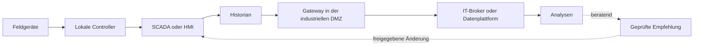



## Das Problem: Datenverbindungen dürfen nicht automatisch Steuerungsbefugnisse verbinden

OT überwacht und steuert physische Prozesse.

IT verarbeitet Geschäftsanwendungen, Analysen, Cloud-Dienste und Unternehmensidentitäten.

Die Verbindung beider Bereiche schafft Transparenz und Optimierungsmöglichkeiten, erweitert aber auch die Auswirkungen von Fehlern bis in die physische Welt.

- Ein Analysekonto greift direkt auf das Steuerungsnetz zu.
- Ein einzelner Broker-Zugang kann in jedes Topic publizieren.
- Ein abgelaufenes Zertifikat blockiert nicht nur die Datenerfassung, sondern auch die Steuerung.
- Ein Cloud-Ausfall breitet sich auf den lokalen Betrieb aus.
- Zeitstempel- und Einheitenfehler führen zu falschen Entscheidungen.
- Eine Modellempfehlung wird ohne Validierung zum Setpoint.
- Ein IT-Verfahren, das Systeme bei der Incident Response herunterfährt, beeinträchtigt den sicheren Betrieb.

Das Grundprinzip der OT/IT-Integration lautet, dass physische Sicherheit und lokaler Betrieb Vorrang vor analytischem Komfort haben.

## Denkmodell: Vertrauensgrenzen statt Schichten zeichnen

Reale Architekturen sind vielfältiger, doch dieses Diagramm hilft, Schreibpfade von Lesepfaden zu unterscheiden.

### Die Priorität von Sicherheit, Verfügbarkeit und Schutz variiert nach Kontext

In der Unternehmens-IT kann Vertraulichkeit hohe Priorität besitzen.

In der OT können physische Sicherheit und kontinuierlicher Betrieb an erster Stelle stehen.

Das bedeutet nicht, die Cybersicherheit zu verringern.

Es bedeutet, die Risiken von Patching, Scanning und Isolationsverfahren gemeinsam mit der Prozesssicherheit zu bewerten.

### Das Purdue-Modell ist ein Ausgangspunkt, kein automatischer Sicherheitsnachweis

Ein System lediglich in Ebenen und Zonen zu unterteilen schränkt keinen Traffic ein.

Dokumentieren Sie Protokolle, Richtungen, Identitäten, Befehlsrechte und Fehlerverhalten realer Conduits.

Da Cloud- und Edge-Komponenten in modernen Architekturen traditionelle Schichten überqueren können, müssen Vertrauensgrenzen anhand der Datenflüsse validiert werden.

## Protokollrollen unterscheiden

### OPC UA

OPC UA bietet typisierte Informationsmodelle, Client/Server- und PubSub-Kommunikation sowie zertifikatbasierte Sicherheitsfunktionen.

Legen Sie für jeden Endpunkt Security Policy, Modus und Vertrauen in Anwendungszertifikate fest.

Machen Sie anonymen Zugriff oder übermäßige Benutzerrechte nicht zum Standard.

Verwalten Sie Knotensemantik und technische Einheiten über Namespaces und Modelle.

### MQTT

MQTT ist ein leichtgewichtiges Publish/Subscribe-Protokoll.

Sie müssen Topic-Namen, QoS, Retained Messages, persistente Sitzungen und Will Messages entwerfen.

Interpretieren Sie QoS-Bezeichnungen nicht als Exactly-once-Garantien auf Anwendungsebene.

Begrenzen Sie mit Broker-ACLs den Publish- und Subscribe-Umfang jedes Clients.

Seien Sie bei Command Topics besonders vorsichtig, damit ein gespeicherter Befehl nicht unerwartet auf einen neuen Subscriber angewendet wird.

### Historian

Ein Historian komprimiert und bewahrt hochfrequente Tag-Werte und stellt sie für Trend- und Ereignisanalysen bereit.

Definieren Sie eindeutig die Rolle des Historian als Source of Truth, Kompression, Interpolation, Behandlung schlechter Qualität und zeitliche Ausrichtung.

### SCADA/HMI

SCADA/HMI-Systeme übernehmen Überwachung, Alarme und Bedienerinteraktion.

Gehen Sie nicht davon aus, dass ein IT-Dashboard SCADA-Sicherheitsfunktionen oder Bedienerautorität ersetzt.

## Workflow: Eine überwiegend lesende Integration entwerfen

### Schritt 1. Assets und Datenflüsse inventarisieren

- Geräte und Controller
- Firmware und Protokolle
- Netzwerkzonen
- Verantwortliche und Herstellerunterstützung
- Kritikalität
- Relevanz für Sicherheitsfunktionen
- Eingehende und ausgehende Verbindungen
- Fernzugriffspfade

Führen Sie vor der Anbindung eines unbekannten Assets eine passive Erkennung durch und prüfen Sie seine Dokumentation.

### Schritt 2. Anwendungsfälle als Lesen oder Schreiben klassifizieren

- Überwachung
- Reporting
- Predictive Maintenance
- Anomalieerkennung
- Bedienerberatung
- Setpoint-Empfehlung
- Fernbefehl
- Automatische Regelung im geschlossenen Kreis

Je weiter Sie in der Liste nach unten gehen, desto strenger müssen unabhängige Validierung und Sicherheitsanalyse werden.

Für erste Analysen ist es im Allgemeinen sicherer, rein beratend zu beginnen.

### Schritt 3. Zonen und Conduits definieren

Erlauben Sie keine beliebigen direkten Verbindungen von OT zu IT.

Verwenden Sie kontrollierte Relays in einer industriellen DMZ, etwa Broker, Historian-Replikat oder API-Gateway.

Setzen Sie erforderliches Protokoll, Quelle, Ziel, Port und Richtung auf eine Allowlist.

Trennen Sie Fernadministrationspfade von Datenpfaden.

### Schritt 4. Lokale Autonomie bewahren

Lokale Controller und Bediener müssen den sicheren Betrieb fortsetzen können, selbst wenn die IT- oder Cloud-Verbindung ausfällt.

Verwenden Sie Pufferung und Store-and-forward.

Kennzeichnen Sie Datenlücken während des Offline-Betriebs.

Beziehen Sie Cloud-Antwortzeiten nicht in das Timing des Regelkreises ein.

### Schritt 5. Lebenszyklen von Identitäten und Zertifikaten betreiben

Geben Sie für jedes Gerät oder jede Anwendung eine eigene Identität aus.

Vermeiden Sie gemeinsam genutzte Konten und private Schlüssel.

Pflegen Sie Zertifikatsinventar, Ablaufwarnungen, Rotationsproben und Widerrufsverfahren.

Berücksichtigen Sie, wie Zeitsynchronisierung die Zertifikatsvalidierung und Ereignisreihenfolge beeinflusst.

### Schritt 6. Qualität in den Datenvertrag aufnehmen

Übertragen Sie nicht nur Tag-Namen.

- Asset-ID
- Signalbedeutung
- Technische Einheit
- Skalierung
- Abtastintervall
- Quellenzeitstempel
- Ingest-Zeitstempel
- Qualitätscode
- Kalibrierungs- oder Konfigurationsversion

Wenn Sie einen Wert schlechter Qualität durch 0 ersetzen, lässt sich eine echte Null nicht mehr von einem Kommunikationsfehler unterscheiden.

### Schritt 7. MQTT-Topics und ACLs gemeinsam entwerfen

Verwenden Sie eine einheitliche Beispielstruktur wie `site/area/asset/signal`.

Nehmen Sie Umgebungsnamen und Mandantengrenzen auf.

Ein Sensorclient sollte nur Telemetrie seines eigenen Assets publizieren.

Ein Analyse-Consumer sollte nur die von ihm benötigten Zweige abonnieren.

Erwägen Sie für Command Topics einen separaten Broker oder strengere Richtlinien.

### Schritt 8. OPC-UA-Vertrauen explizit verwalten

Verifizieren Sie Serverendpunkt und Zertifikat-Fingerprint.

Aktivieren Sie in Produktion kein automatisches Trust-all-Verhalten.

Unterscheiden Sie die Rollen von Benutzer-Tokens und Anwendungszertifikaten.

Da sich Namespace-Indizes nach einem Neustart ändern können, sollten Zuordnungen anhand von Namespace-URIs erwogen werden.

### Schritt 9. Einen rein beratenden Workflow erstellen

Speichern Sie Analyseergebnisse als Empfehlung mit folgenden Informationen.

- Eingabefenster und Datenqualität
- Modell- oder Regelversion
- Empfehlung und Konfidenz
- Geltende Betriebshülle
- Verbotene Bedingungen
- Erstellungszeit und Ablauf
- Prüfende Person und Freigabestatus

Der Bediener bewertet und übernimmt sie nach den SCADA-Verfahren.

Trennen Sie sie wenn möglich physisch vom automatischen Schreibpfad.

### Schritt 10. Änderungs- und Incident Response gemeinsam entwerfen

Definieren Sie die Rollen von IT, OT, Prozesssicherheit und Herstellern.

Prüfen Sie Kompatibilität und Rollback vor dem Patching.

Führen Sie aktives Scanning und Penetrationstests in sicheren Umfängen und Zeitfenstern durch.

Verifizieren Sie, dass Incident-Eindämmung weder Sicherheitsinstrumente noch wesentliche Sichtbarkeit trennt.

## Praxisbeispiel: Historian-Daten an eine Analyseplattform liefern

1. Ein Historian-Replikat oder eine Exportschnittstelle als OT-seitige Quelle bestimmen.
2. Das Gateway in der industriellen DMZ liest nur Tags aus der Allowlist.
3. Das Gateway legt Zeitstempel, Einheiten und Qualitätscodes in einen Standard-Envelope.
4. Bei einem Verbindungsausfall speichert es Daten in einem verschlüsselten lokalen Puffer.
5. Es publiziert mittels gegenseitiger Authentifizierung an den IT-Broker.
6. Broker-ACLs erlauben nur den jedem Gateway zugewiesenen Topic-Zweig.
7. Consumer erkennen Duplikate und Lücken anhand von Nachrichten-IDs und Sequenznummern.
8. Rohdaten unveränderlich bewahren.
9. Analyseergebnisse in einem separaten Beratungsspeicher erfassen.
10. Es existiert kein automatischer Befehlsweg zurück in die OT.

Wenn ein schreibender Anwendungsfall nötig wird, unterziehen Sie ihn einem separaten Risikobewertungs- und Freigabeverfahren mit einem unabhängigen Interlock.

## Checkliste zur Validierung

### Architektur

- [ ] Das Asset- und Verbindungsinventar ist aktuell.
- [ ] OT/IT-Zonen und Conduits erscheinen im Diagramm.
- [ ] Lese- und Befehlspfade sind getrennt.
- [ ] Lokaler Betrieb wurde bei getrennter Cloud- und IT-Verbindung getestet.
- [ ] Gemeinsame Ursachen für Identitäts- und Brokerfehler wurden erkannt.

### Protokolle und Daten

- [ ] OPC-UA-Sicherheitsmodi und Trust Lists werden verwaltet.
- [ ] MQTT-ACLs pro Client setzen geringste Rechte durch.
- [ ] Verwendung von Retained Commands wurde geprüft.
- [ ] Einheiten, Zeitstempel und Qualitätscodes sind Vertragsbestandteil.
- [ ] Lücken, Duplikate und verspätete Daten werden erkannt.
- [ ] Status der Zeitsynchronisierung wird überwacht.

### Cybersicherheit und physische Sicherheit

- [ ] Fernzugriff ist genehmigt, protokolliert und zeitlich begrenzt.
- [ ] Zertifikatsrotation wurde im Betrieb getestet.
- [ ] Ein Überwachungsfehler stoppt die Steuerung nicht.
- [ ] Analysen sind standardmäßig rein beratend.
- [ ] Automatische Aktionen besitzen unabhängige Sicherheitswächter.
- [ ] OT und IT haben das Incident-Runbook gemeinsam geprobt.

## Häufige Fehler und Grenzen

### Allein dem Begriff „Air Gap“ vertrauen

Hersteller-Laptops, Wechseldatenträger, Fernwartung und betriebliche Wege um eine Datendiode herum können reale Verbindungen schaffen.

### Protokollverschlüsselung als vollständige Sicherheit behandeln

Kompromittierte Endpunkte, übermäßige Rechte, falsche Topics und Fehler der Zertifikatsverwaltung bleiben möglich.

### Historian-Werte als Ground Truth behandeln

Kompression, Substitution, Sensordrift, schlechte Qualität und Zeitprobleme müssen berücksichtigt werden.

### Ein Vorhersagemodell direkt in einen geschlossenen Regelkreis setzen

Eingaben außerhalb der Trainingsdomäne und Fehlalarme können physische Aktionen auslösen.

Validieren Sie schrittweise über Beratung, Shadow-Modus, begrenzten Pilotbetrieb und unabhängigen Interlock.

### IT-Incident-Verfahren unverändert anwenden

Bedingungslose Isolation oder Abschaltung kann Prozesssicherheit und Sichtbarkeit beeinträchtigen.

Erstellen Sie Verfahren im Voraus gemeinsam mit Betriebs- und Sicherheitspersonal am Standort.

## Offizielle Referenzen

- [NIST SP 800-82 Rev. 3: Leitfaden zur Sicherheit operativer Technologie](https://csrc.nist.gov/pubs/sp/800/82/r3/final)
- [Spezifikationen der OPC Foundation](https://reference.opcfoundation.org/)
- [OASIS MQTT Version 5.0](https://docs.oasis-open.org/mqtt/mqtt/v5.0/mqtt-v5.0.html)
- [Empfohlene Praktiken der CISA für industrielle Steuerungssysteme](https://www.cisa.gov/topics/industrial-control-systems)
- [MITRE ATT&CK für ICS](https://attack.mitre.org/matrices/ics/)

## Fazit

Ziel der OT/IT-Integration ist nicht, jedes mögliche Datenstück zu verbinden.

Es besteht darin, nur benötigte Informationen über verifizierbare Pfade bereitzustellen und dabei lokale Sicherheit und Autonomie zu bewahren.

Entwerfen Sie Vertrauensgrenzen, Identität, Datenqualität, Beratungsbefugnis und Fehlerverhalten vor den Protokollfunktionen.
