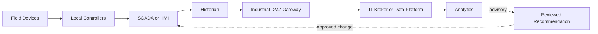



## The problem: Connecting data must not automatically connect control authority

OT monitors and controls physical processes.

IT handles business applications, analytics, cloud services, and enterprise identity.

Connecting the two creates visibility and opportunities for optimization, but it also extends the impact of failures into the physical world.

- An analytics account accesses the control network directly.
- A single broker credential can publish to every topic.
- An expired certificate blocks not only collection but also control.
- A cloud outage propagates to local operations.
- Timestamp and unit errors lead to incorrect decisions.
- A model recommendation becomes a setpoint without validation.
- An IT procedure that shuts down systems during incident response interferes with safe operations.

The fundamental principle of OT/IT integration is that physical safety and local operations take precedence over analytical convenience.

## Mental model: Draw trust boundaries rather than layers

Real architectures are more varied, but this diagram is useful for distinguishing write paths from read paths.

### The priority of safety, availability, and security varies by context

In enterprise IT, confidentiality may be a high priority.

In OT, safety and continuous operation may come first.

That does not mean lowering security.

It means assessing the risks of patching, scanning, and isolation procedures together with process safety.

### The Purdue model is a starting point, not automatic proof of security

Simply dividing a system into levels and zones does not restrict traffic.

Document the protocols, directions, identities, command privileges, and failure behavior of actual conduits.

Because cloud and edge components can cross traditional layers in modern architectures, validate trust boundaries against data flows.

## Distinguish protocol roles

### OPC UA

OPC UA provides typed information models, client/server and PubSub communication, and certificate-based security features.

Specify each endpoint's security policy, mode, and application-certificate trust.

Do not make anonymous access or excessive user privileges the default.

Manage node semantics and engineering units through namespaces and models.

### MQTT

MQTT is a lightweight publish/subscribe protocol.

You must design topic naming, QoS, retained messages, persistent sessions, and will messages.

Do not interpret QoS names as application-level exactly-once guarantees.

Use broker ACLs to limit each client's publish and subscribe scope.

Be especially careful with command topics so that a retained command is not unexpectedly applied to a new subscriber.

### Historian

A historian compresses and preserves high-frequency tag values and makes them available for trend and event analysis.

Clearly define the historian's source-of-truth role, compression, interpolation, handling of bad quality, and clock alignment.

### SCADA/HMI

SCADA/HMI systems handle monitoring, alarms, and operator interaction.

Do not assume that an IT dashboard replaces SCADA safety functions or operator authority.

## Workflow: Design a read-mostly integration

### Step 1. Inventory assets and data flows

- Devices and controllers
- Firmware and protocols
- Network zones
- Owners and vendor support
- Criticality
- Relevance to safety functions
- Inbound and outbound connections
- Remote-access paths

Before connecting an unknown asset, perform passive discovery and verify its documentation.

### Step 2. Classify use cases as read or write

- Monitoring
- Reporting
- Predictive maintenance
- Anomaly detection
- Operator advisory
- Setpoint recommendation
- Remote command
- Automatic closed-loop control

Independent validation and safety analysis must become stricter as you move down the list.

It is generally safer for initial analytics to begin as advisory-only.

### Step 3. Define zones and conduits

Do not permit arbitrary direct connections from OT to IT.

Use controlled relays in an industrial DMZ, such as a broker, historian replica, or API gateway.

Allowlist the required protocol, source, destination, port, and direction.

Separate remote-administration paths from data paths.

### Step 4. Preserve local autonomy

Local controllers and operators must be able to continue safe operations even if the IT or cloud connection is lost.

Use buffering and store-and-forward.

Indicate data gaps while offline.

Do not include cloud response times in control-loop timing.

### Step 5. Operate identity and certificate lifecycles

Issue a separate identity for each device or application.

Avoid shared accounts and shared private keys.

Maintain a certificate inventory, expiration alerts, rotation rehearsals, and revocation procedures.

Consider how clock synchronization affects certificate validation and event ordering.

### Step 6. Include quality in the data contract

Do not transmit only tag names.

- Asset ID
- Signal meaning
- Engineering unit
- Scaling
- Sampling interval
- Source timestamp
- Ingestion timestamp
- Quality code
- Calibration or configuration version

If you replace a bad-quality value with 0, you cannot distinguish a real zero from a communication failure.

### Step 7. Design MQTT topics and ACLs together

Use a consistent example structure such as `site/area/asset/signal`.

Include environment names and tenant boundaries.

A sensor client should publish only its own asset telemetry.

An analytics consumer should subscribe only to the branches it needs.

Consider a separate broker or stricter policy for command topics.

### Step 8. Manage OPC UA trust explicitly

Verify the server endpoint and certificate fingerprint.

Do not enable automatic trust-all behavior in production.

Distinguish the roles of user tokens and application certificates.

Because namespace indexes may change after a restart, consider mappings based on namespace URIs.

### Step 9. Create an advisory-only workflow

Store analytics output as a recommendation with the following information.

- Input window and data quality
- Model or rule version
- Recommendation and confidence
- Applicable operating envelope
- Prohibited conditions
- Creation time and expiration
- Reviewer and approval status

The operator evaluates and applies it according to SCADA procedures.

Physically separate it from the automatic write path when possible.

### Step 10. Design change and incident response jointly

Define the roles of IT, OT, process safety, and vendors.

Review compatibility and rollback before patching.

Perform active scanning and penetration testing within safe scopes and time windows.

Verify that incident containment will not disconnect safety instruments or essential visibility.

## Practical example: Delivering historian data to an analytics platform

1. Designate a historian replica or export interface as the OT-side source.
2. The industrial DMZ gateway reads only allowlisted tags.
3. The gateway places timestamps, units, and quality codes in a standard envelope.
4. During a connection outage, it stores data in an encrypted local buffer.
5. It publishes to the IT broker using mutual authentication.
6. Broker ACLs permit only the topic branch assigned to each gateway.
7. Consumers detect duplicates and gaps using message IDs and sequence numbers.
8. Preserve raw data immutably.
9. Record analytics results in a separate advisory store.
10. No automatic command route back to OT exists.

If a write use case becomes necessary, subject it to a separate risk analysis and approval process, with an independent interlock.

## Validation checklist

### Architecture

- [ ] The asset and connection inventory is current.
- [ ] OT/IT zones and conduits appear in the diagram.
- [ ] Read paths and command paths are separated.
- [ ] Local operations have been tested during cloud and IT disconnection.
- [ ] Common identity and broker failure causes have been identified.

### Protocols and data

- [ ] OPC UA security modes and trust lists are managed.
- [ ] Per-client MQTT ACLs enforce least privilege.
- [ ] The use of retained commands has been reviewed.
- [ ] Units, timestamps, and quality codes are part of the contract.
- [ ] Gaps, duplicates, and late data are detected.
- [ ] Clock-synchronization status is monitored.

### Security and safety

- [ ] Remote access is approved, logged, and time-limited.
- [ ] Certificate rotation has been tested during operations.
- [ ] A monitoring failure does not stop control.
- [ ] Analytics is advisory-only by default.
- [ ] Automatic actions have independent safety guards.
- [ ] OT and IT have rehearsed the incident runbook together.

## Common failures and limitations

### Trusting the phrase “air gap” by itself

Vendor laptops, removable media, remote support, and operational paths around a data diode can create actual connections.

### Treating protocol encryption as complete security

Endpoint compromise, excessive privileges, incorrect topics, and certificate-management failures remain possible.

### Treating historian values as ground truth

You must account for compression, substitution, sensor drift, bad quality, and clock problems.

### Putting a predictive model directly into a closed loop

Inputs outside the training domain and false alarms can lead to physical actions.

Validate through advisory, shadow, limited-pilot, and independent-interlock stages.

### Applying IT incident procedures unchanged

Unconditional isolation or shutdown can harm process safety and visibility.

Create procedures in advance with operations and safety personnel at the site.

## Official references

- [NIST SP 800-82 Rev. 3: Guide to Operational Technology Security](https://csrc.nist.gov/pubs/sp/800/82/r3/final)
- [OPC Foundation Specifications](https://reference.opcfoundation.org/)
- [OASIS MQTT Version 5.0](https://docs.oasis-open.org/mqtt/mqtt/v5.0/mqtt-v5.0.html)
- [CISA Industrial Control Systems Recommended Practices](https://www.cisa.gov/topics/industrial-control-systems)
- [MITRE ATT&CK for ICS](https://attack.mitre.org/matrices/ics/)

## Conclusion

The goal of OT/IT integration is not to connect every possible piece of data.

It is to deliver only the information you need through verifiable paths while preserving local safety and autonomy.

Design trust boundaries, identity, data quality, advisory authority, and failure behavior before protocol features.
