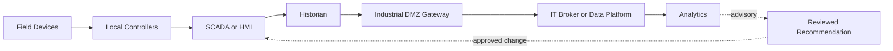



## El problema: los datos de conexión no deben conectarse automáticamente a la autoridad de control

OT monitorea y controla los procesos físicos.

IT maneja aplicaciones comerciales, análisis, servicios en la nube e identidad empresarial.

Conectar ambos crea visibilidad y oportunidades de optimización, pero también extiende el impacto de las fallas al mundo físico.

- Una cuenta de análisis accede directamente a la red de control.
- Una única credencial de corredor puede publicar en cada tema.
- Un certificado caducado bloquea no sólo la recopilación sino también el control.
- Una interrupción de la nube se propaga a las operaciones locales.
- Los errores de marca de tiempo y de unidad conducen a decisiones incorrectas.
- Una recomendación de modelo se convierte en un punto de ajuste sin validación.
- Un procedimiento IT que apaga los sistemas durante la respuesta a un incidente interfiere con las operaciones seguras.

El principio fundamental de la integración OT/IT es que la seguridad física y las operaciones locales tienen prioridad sobre la conveniencia analítica.

## Modelo mental: establezca límites de confianza en lugar de capas

Las arquitecturas reales son más variadas, pero este diagrama es útil para distinguir las rutas de escritura de las de lectura.

### La prioridad de seguridad, disponibilidad y protección varía según el contexto.

En la empresa IT, la confidencialidad puede ser una alta prioridad.

En OT, la seguridad y el funcionamiento continuo pueden ser lo primero.

Eso no significa bajar la seguridad.

Significa evaluar los riesgos de los procedimientos de parcheo, escaneo y aislamiento junto con la seguridad del proceso.

### El modelo de Purdue es un punto de partida, no una prueba automática de seguridad.

Simplemente dividir un sistema en niveles y zonas no restringe el tráfico.

Documente los protocolos, direcciones, identidades, privilegios de comando y comportamiento de falla de conductos reales.

Dado que los componentes de la nube y del borde pueden cruzar capas tradicionales en las arquitecturas modernas, valide los límites de confianza frente a los flujos de datos.

## Distinguir roles de protocolo

### OPC UA

OPC UA proporciona modelos de información mecanografiada, comunicación cliente/servidor y PubSub, y características de seguridad basadas en certificados.

Especifique la política de seguridad, el modo y la confianza del certificado de aplicación de cada punto final.

No establezca el acceso anónimo ni los privilegios de usuario excesivos como valores predeterminados.

Administre la semántica de nodos y las unidades de ingeniería a través de espacios de nombres y modelos.

### MQTT

MQTT es un protocolo ligero de publicación/suscripción.

Debe diseñar nombres de temas, QoS, mensajes retenidos, sesiones persistentes y mensajes de voluntad.

No interprete los nombres de QoS como garantías de una sola vez a nivel de aplicación.

Utilice ACL de intermediario para limitar el alcance de publicación y suscripción de cada cliente.

Tenga especial cuidado con los temas de comandos para que un comando retenido no se aplique inesperadamente a un nuevo suscriptor.

### Historiador

Un historiador comprime y conserva valores de etiquetas de alta frecuencia y los pone a disposición para análisis de tendencias y eventos.

Defina claramente el papel del historiador como fuente de verdad, compresión, interpolación, manejo de mala calidad y alineación del reloj.

### SCADA/HMI

Los sistemas SCADA/HMI manejan el monitoreo, las alarmas y la interacción del operador.

No asuma que un tablero IT reemplaza las SCADA funciones de seguridad o la autoridad del operador.

## Flujo de trabajo: diseñar una integración de lectura mayoritaria

### Paso 1. Activos de inventario y flujos de datos

- Dispositivos y controladores
- Firmware y protocolos
- Zonas de red
- Soporte a propietarios y proveedores.
- Criticidad
- Relevancia para las funciones de seguridad.
- Conexiones entrantes y salientes
- Rutas de acceso remoto

Antes de conectar un activo desconocido, realice un descubrimiento pasivo y verifique su documentación.

### Paso 2. Clasificar los casos de uso como lectura o escritura

- Monitoreo
- Informes
- Mantenimiento predictivo
- Detección de anomalías
- Asesoramiento al operador
- Recomendación de punto de ajuste
- Comando remoto
- Control automático de circuito cerrado

La validación independiente y el análisis de seguridad deben volverse más estrictos a medida que se avanza en la lista.

Generalmente es más seguro que los análisis iniciales comiencen como solo de asesoramiento.

### Paso 3. Definir zonas y conductos

No permita conexiones directas arbitrarias desde OT a IT.

Utilice relés controlados en una DMZ industrial, como un corredor, una réplica de historiador o una puerta de enlace API.

Incluya en la lista de permitidos el protocolo, origen, destino, puerto y dirección requeridos.

Separe las rutas de administración remota de las rutas de datos.

### Paso 4. Preservar la autonomía local

Los controladores y operadores locales deben poder continuar con operaciones seguras incluso si se pierde la IT o la conexión a la nube.

Utilice almacenamiento en búfer y almacenamiento y reenvío.

Indique lagunas de datos mientras está fuera de línea.

No incluya los tiempos de respuesta de la nube en la sincronización del bucle de control.

### Paso 5. Operar los ciclos de vida de identidad y certificado

Emita una identidad separada para cada dispositivo o aplicación.

Evite cuentas compartidas y claves privadas compartidas.

Mantener un inventario de certificados, alertas de vencimiento, ensayos de rotación y procedimientos de revocación.

Considere cómo la sincronización del reloj afecta la validación de certificados y el orden de eventos.

### Paso 6. Incluir calidad en el contrato de datos

No transmita sólo nombres de etiquetas.

- Activo ID
- Significado de la señal
- Unidad de ingeniería
- Escalado
- Intervalo de muestreo
- Marca de tiempo de origen
- Marca de tiempo de ingestión
- Código de calidad
- Versión de calibración o configuración

Si reemplaza un valor de mala calidad con 0, no podrá distinguir un cero real de una falla de comunicación.

### Paso 7. Diseñar MQTT temas y ACL juntos

Utilice una estructura de ejemplo coherente como `site/area/asset/signal`.

Incluya nombres de entornos y límites de inquilinos.

Un cliente de sensor debe publicar solo su propia telemetría de activos.

Un consumidor de análisis debe suscribirse sólo a las ramas que necesita.

Considere un intermediario independiente o una política más estricta para los temas de comando.

### Paso 8. Administrar la confianza OPC UA explícitamente

Verifique el punto final del servidor y la huella digital del certificado.

No habilite el comportamiento automático de confianza total en producción.

Distinguir las funciones de los tokens de usuario y los certificados de aplicación.

Dado que los índices de los espacios de nombres pueden cambiar después de un reinicio, considere las asignaciones basadas en los URI del espacio de nombres.

### Paso 9. Cree un flujo de trabajo de solo asesoramiento

Almacene los resultados de análisis como una recomendación con la siguiente información.

- Ventana de entrada y calidad de los datos.
- Modelo o versión de regla
- Recomendación y confianza.
- Entorno operativo aplicable
- Condiciones prohibidas
- Hora de creación y caducidad.
- Estado del revisor y aprobación.

El operador lo evalúa y aplica según los procedimientos SCADA.

Sepárelo físicamente de la ruta de escritura automática cuando sea posible.

### Paso 10. Cambio de diseño y respuesta a incidentes de forma conjunta

Defina las funciones de IT, OT, seguridad de procesos y proveedores.

Revise la compatibilidad y la reversión antes de aplicar el parche.

Realice escaneos activos y pruebas de penetración dentro de alcances y ventanas de tiempo seguros.

Verifique que la contención de incidentes no desconecte los instrumentos de seguridad o la visibilidad esencial.

## Ejemplo práctico: entrega de datos históricos a una plataforma de análisis

1. Designe una réplica del historiador o una interfaz de exportación como fuente secundaria OT-.
2. La puerta de enlace industrial DMZ solo lee etiquetas incluidas en la lista permitida.
3. La puerta de enlace coloca marcas de tiempo, unidades y códigos de calidad en un sobre estándar.
4. Durante una interrupción de la conexión, almacena datos en un búfer local cifrado.
5. Publica en el intermediario IT mediante autenticación mutua.
6. Las ACL del corredor solo permiten la rama temática asignada a cada puerta de enlace.
7. Los consumidores detectan duplicados y lagunas utilizando ID de mensajes y números de secuencia.
8. Preservar los datos sin procesar de forma inmutable.
9. Registre los resultados de los análisis en una tienda de asesoramiento separada.
10. No existe ninguna ruta de comando automática de regreso a OT.

Si se vuelve necesario escribir un caso de uso, sométalo a un proceso de aprobación y análisis de riesgos por separado, con un interbloqueo independiente.

## Lista de verificación de validación

### Arquitectura

- [ ] El inventario de activos y conexiones está actualizado.
- [ ] OT/IT zonas y conductos aparecen en el diagrama.
- [] Las rutas de lectura y las rutas de comando están separadas.
- [ ] Se probaron las operaciones locales durante la desconexión de la nube y IT.
- [ ] Se han identificado causas comunes de fallos de identidad y de intermediario.

### Protocolos y datos

- [ ] OPC UA se administran los modos de seguridad y las listas de confianza.
- [ ] Las ACL MQTT por cliente imponen privilegios mínimos.
- [] Se ha revisado el uso de comandos retenidos.
- [ ] Unidades, marcas de tiempo y códigos de calidad son parte del contrato.
- [ ] Se detectan lagunas, duplicados y datos tardíos.
- [ ] Se monitorea el estado de sincronización del reloj.

### Seguridad y protección

- [ ] El acceso remoto se aprueba, se registra y tiene un límite de tiempo.
- [ ] Se ha probado la rotación de certificados durante las operaciones.
- [ ] Un fallo de monitorización no detiene el control.
- [ ] Analytics es solo de asesoramiento de forma predeterminada.
- [ ] Las acciones automáticas cuentan con guardas de seguridad independientes.
- [ ] OT y IT han ensayado juntos el runbook de incidentes.

## Fallos y limitaciones comunes

### Confiar en la frase “espacio de aire” por sí sola

Las computadoras portátiles de los proveedores, los medios extraíbles, el soporte remoto y las rutas operativas alrededor de un diodo de datos pueden crear conexiones reales.

### Tratar el cifrado de protocolo como seguridad total

Siguen siendo posibles el compromiso de los terminales, privilegios excesivos, temas incorrectos y fallas en la administración de certificados.

### Tratar los valores de los historiadores como verdad fundamental

Debe tener en cuenta la compresión, la sustitución, la desviación del sensor, la mala calidad y los problemas de reloj.

### Poner un modelo predictivo directamente en un circuito cerrado

Las entradas fuera del ámbito del entrenamiento y las falsas alarmas pueden provocar acciones físicas.

Valide a través de etapas de asesoramiento, sombra, piloto limitado y enclavamiento independiente.

### Aplicando IT procedimientos de incidentes sin cambios

El aislamiento o el apagado incondicional pueden dañar la seguridad y la visibilidad del proceso.

Crear procedimientos con anticipación con el personal de operaciones y seguridad en el sitio.

## Referencias oficiales

- [NIST SP 800-82 Rev. 3: Guía para la seguridad de la tecnología operativa](https://csrc.nist.gov/pubs/sp/800/82/r3/final)
- [OPC Especificaciones de la base](https://reference.opcfoundation.org/)
- [OASIS MQTT Versión 5.0](https://docs.oasis-open.org/mqtt/mqtt/v5.0/mqtt-v5.0.html)
- [CISA Prácticas recomendadas para sistemas de control industrial](https://www.cisa.gov/topics/industrial-control-systems)
- [MITRE ATT&CK para ICS](https://attack.mitre.org/matrices/ics/)

## Conclusión

El objetivo de la integración OT/IT no es conectar todos los datos posibles.

Se trata de entregar solo la información que necesita a través de caminos verificables y al mismo tiempo preservar la seguridad y la autonomía locales.

Diseñe límites de confianza, identidad, calidad de datos, autoridad de asesoramiento y comportamiento ante fallos antes que las características del protocolo.
