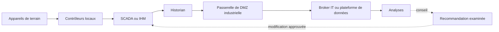



## Problème : connecter les données ne doit pas revenir à connecter les droits de commande

L’OT surveille et commande des processus physiques.

L’IT gère les applications métier, l’analyse, le cloud et les identités d’entreprise.

Relier les deux apporte de la visibilité et des possibilités d’optimisation, mais étend aussi les conséquences des défaillances au monde physique.

- Un compte d’analyse accède directement au réseau de commande.
- Un seul identifiant de broker peut publier dans tous les topics.
- L’expiration d’un certificat bloque non seulement la collecte, mais aussi la commande.
- Une panne du cloud se propage aux opérations locales.
- Des erreurs d’horodatage ou d’unité conduisent à de mauvaises décisions.
- Une recommandation de modèle devient une consigne sans validation.
- Une procédure IT qui arrête les systèmes pendant la réponse à un incident perturbe la conduite sûre des installations.

Le principe fondamental de l’intégration OT/IT est que la sûreté physique et les opérations locales priment sur la commodité des analyses.

## Modèle mental : tracer les frontières de confiance plutôt que les couches

Les architectures réelles sont plus variées, mais ce schéma aide à distinguer les chemins d’écriture des chemins de lecture.

### La priorité relative de la sûreté, de la disponibilité et de la sécurité dépend du contexte

Dans l’IT d’entreprise, la confidentialité peut être hautement prioritaire.

Dans l’OT, la sûreté et la continuité d’exploitation peuvent passer en premier.

Cela ne signifie pas qu’il faille réduire la sécurité.

Cela signifie qu’il faut évaluer les risques des correctifs, des analyses et des procédures d’isolation conjointement avec la sûreté des procédés.

### Le modèle Purdue est un point de départ, pas une preuve automatique de sécurité

Le simple découpage d’un système en niveaux et en zones ne limite pas le trafic.

Documentez les protocoles, les directions, les identités, les droits de commande et le comportement en cas de défaillance des conduits réels.

Le cloud et l’edge pouvant traverser les couches traditionnelles dans les architectures modernes, validez les frontières de confiance par rapport aux flux de données.

## Distinguer les rôles des protocoles

### OPC UA

OPC UA fournit des modèles d’information typés, des communications client/serveur et PubSub, ainsi que des fonctions de sécurité fondées sur les certificats.

Précisez la politique et le mode de sécurité de chaque endpoint, ainsi que la confiance accordée au certificat de l’application.

Ne faites pas de l’accès anonyme ou de droits utilisateur excessifs le réglage par défaut.

Gérez la sémantique des nœuds et les unités d’ingénierie au moyen des espaces de noms et des modèles.

### MQTT

MQTT est un protocole léger de publication/abonnement.

Il faut concevoir le nommage des topics, la QoS, les messages conservés, les sessions persistantes et les messages de dernière volonté.

N’interprétez pas les noms des niveaux de QoS comme une garantie « exactement une fois » au niveau métier.

Utilisez les ACL du broker pour limiter le périmètre de publication et d’abonnement de chaque client.

Soyez particulièrement prudent avec les topics de commande, afin qu’une commande conservée ne soit pas appliquée inopinément à un nouvel abonné.

### Historian

Un historian compresse et conserve les valeurs de tags à haute fréquence, puis les met à disposition pour l’analyse des tendances et des événements.

Définissez clairement son rôle de source de vérité, la compression, l’interpolation, le traitement des données de mauvaise qualité et l’alignement des horloges.

### SCADA/IHM

Les systèmes SCADA/IHM assurent la supervision, les alarmes et les interactions avec les opérateurs.

Ne supposez pas qu’un tableau de bord IT remplace les fonctions de sûreté de SCADA ou l’autorité de l’opérateur.

## Démarche : concevoir une intégration principalement en lecture

### Étape 1. Inventorier les actifs et les flux de données

- Appareils et contrôleurs
- Micrologiciels et protocoles
- Zones réseau
- Propriétaires et assistance des fournisseurs
- Criticité
- Rapport avec les fonctions de sûreté
- Connexions entrantes et sortantes
- Chemins d’accès à distance

Avant de connecter un actif inconnu, effectuez une découverte passive et vérifiez sa documentation.

### Étape 2. Classer les cas d’usage en lecture ou en écriture

- Supervision
- Rapports
- Maintenance prédictive
- Détection d’anomalies
- Aide à l’opérateur
- Recommandation de consigne
- Commande à distance
- Commande automatique en boucle fermée

La validation indépendante et l’analyse de sûreté doivent devenir plus strictes à mesure que l’on descend dans cette liste.

Il est généralement plus sûr de commencer les premières analyses en mode conseil uniquement.

### Étape 3. Définir les zones et les conduits

N’autorisez pas de connexions directes arbitraires de l’OT vers l’IT.

Utilisez des relais contrôlés dans une DMZ industrielle, tels qu’un broker, une réplique d’historian ou une passerelle API.

Placez sur liste blanche le protocole, la source, la destination, le port et la direction nécessaires.

Séparez les chemins d’administration à distance des chemins de données.

### Étape 4. Préserver l’autonomie locale

Les contrôleurs locaux et les opérateurs doivent pouvoir poursuivre une conduite sûre même en cas de perte de la connexion IT ou cloud.

Utilisez une mémoire tampon et un mécanisme de stockage puis retransmission.

Signalez les lacunes dans les données pendant les périodes hors ligne.

N’intégrez pas le temps de réponse du cloud au minutage de la boucle de commande.

### Étape 5. Exploiter le cycle de vie des identités et des certificats

Attribuez une identité distincte à chaque appareil ou application.

Évitez les comptes et les clés privées partagés.

Tenez un inventaire des certificats, configurez des alertes d’expiration, répétez leur rotation et établissez des procédures de révocation.

Tenez compte des effets de la synchronisation des horloges sur la validation des certificats et l’ordre des événements.

### Étape 6. Inclure la qualité dans le contrat de données

Ne transmettez pas uniquement le nom des tags.

- Identifiant de l’actif
- Signification du signal
- Unité d’ingénierie
- Mise à l’échelle
- Intervalle d’échantillonnage
- Horodatage à la source
- Horodatage à l’ingestion
- Code de qualité
- Version de l’étalonnage ou de la configuration

Si vous remplacez une valeur de mauvaise qualité par 0, vous ne pouvez plus distinguer un véritable zéro d’un échec de communication.

### Étape 7. Concevoir ensemble les topics MQTT et les ACL

Adoptez une structure cohérente telle que `site/area/asset/signal`.

Incluez le nom de l’environnement et les frontières entre tenants.

Un client de capteur ne doit publier que la télémétrie de son propre actif.

Un consommateur analytique ne doit s’abonner qu’aux branches dont il a besoin.

Envisagez un broker séparé ou une politique plus stricte pour les topics de commande.

### Étape 8. Gérer explicitement la confiance OPC UA

Vérifiez l’endpoint du serveur et l’empreinte du certificat.

N’activez pas l’approbation automatique de tous les certificats en production.

Distinguez le rôle des jetons utilisateur de celui des certificats d’application.

Comme les index d’espaces de noms peuvent changer après un redémarrage, envisagez un mapping fondé sur les URI d’espaces de noms.

### Étape 9. Créer un workflow limité au conseil

Enregistrez la sortie analytique sous forme de recommandation contenant les informations suivantes.

- Fenêtre d’entrée et qualité des données
- Version du modèle ou de la règle
- Recommandation et niveau de confiance
- Domaine d’exploitation applicable
- Conditions d’interdiction
- Heure de création et expiration
- Réviseur et état d’approbation

L’opérateur l’évalue et l’applique conformément aux procédures SCADA.

Lorsque c’est possible, séparez-la physiquement du chemin d’écriture automatique.

### Étape 10. Concevoir conjointement la gestion des changements et la réponse aux incidents

Définissez les rôles de l’IT, de l’OT, de la sûreté des procédés et des fournisseurs.

Vérifiez la compatibilité et le rollback avant d’appliquer un correctif.

Effectuez les analyses actives et les tests d’intrusion dans des périmètres et à des horaires sûrs.

Vérifiez que le confinement d’un incident ne déconnectera pas des instruments de sûreté ni des moyens essentiels de visibilité.

## Exemple pratique : transmettre les données d’un historian à une plateforme d’analyse

1. Désignez une réplique d’historian ou une interface d’exportation comme source côté OT.
2. La passerelle de DMZ industrielle ne lit que les tags placés sur liste blanche.
3. La passerelle insère les horodatages, les unités et les codes de qualité dans une enveloppe standard.
4. Pendant une interruption de connexion, elle stocke les données dans une mémoire tampon locale chiffrée.
5. Elle publie vers le broker IT au moyen d’une authentification mutuelle.
6. Les ACL du broker n’autorisent que la branche de topics affectée à chaque passerelle.
7. Les consommateurs détectent les doublons et les lacunes à l’aide des identifiants de message et des numéros de séquence.
8. Conservez les données brutes de manière immuable.
9. Enregistrez les résultats d’analyse dans un espace distinct réservé aux conseils.
10. Il n’existe aucun chemin de commande automatique vers l’OT.

Si un cas d’usage en écriture devient nécessaire, soumettez-le à une analyse de risques et à une approbation distinctes, avec un interverrouillage indépendant.

## Liste de contrôle de validation

### Architecture

- [ ] L’inventaire des actifs et des connexions est à jour.
- [ ] Les zones et conduits OT/IT figurent dans le schéma.
- [ ] Les chemins de lecture et de commande sont séparés.
- [ ] Les opérations locales ont été testées en cas de déconnexion du cloud et de l’IT.
- [ ] Les causes communes de défaillance liées aux identités et au broker ont été identifiées.

### Protocoles et données

- [ ] Les modes de sécurité et les listes de confiance OPC UA sont administrés.
- [ ] Les ACL MQTT propres à chaque client appliquent le moindre privilège.
- [ ] L’utilisation de commandes conservées a été examinée.
- [ ] Les unités, les horodatages et les codes de qualité font partie du contrat.
- [ ] Les lacunes, les doublons et les données tardives sont détectés.
- [ ] L’état de la synchronisation des horloges est surveillé.

### Sécurité et sûreté

- [ ] Les accès distants sont approuvés, journalisés et limités dans le temps.
- [ ] La rotation des certificats a été testée en cours d’exploitation.
- [ ] Une défaillance de la supervision n’arrête pas la commande.
- [ ] Par défaut, les analyses sont limitées au conseil.
- [ ] Les actions automatiques disposent de protections de sûreté indépendantes.
- [ ] Les équipes OT et IT ont répété ensemble le runbook de réponse aux incidents.

## Défaillances et limites fréquentes

### Faire confiance à la seule expression « air gap »

Les ordinateurs portables des fournisseurs, les supports amovibles, l’assistance à distance et les chemins opérationnels contournant une diode de données peuvent créer de véritables connexions.

### Considérer le chiffrement du protocole comme une sécurité complète

La compromission des endpoints, les droits excessifs, les topics incorrects et les défaillances de gestion des certificats restent possibles.

### Considérer les valeurs de l’historian comme une vérité terrain

Il faut tenir compte de la compression, de la substitution, de la dérive des capteurs, des données de mauvaise qualité et des problèmes d’horloge.

### Placer directement un modèle prédictif dans une boucle fermée

Des entrées hors du domaine d’entraînement et de fausses alertes peuvent entraîner des actions physiques.

Validez successivement en mode conseil, en mode fantôme, lors d’un pilote limité, puis avec un interverrouillage indépendant.

### Appliquer telles quelles les procédures d’incident IT

Une isolation ou un arrêt systématique peut nuire à la sûreté des procédés et à la visibilité.

Préparez les procédures en amont avec le personnel d’exploitation et de sûreté du site.

## Références officielles

- [NIST SP 800-82 rév. 3 : guide de la sécurité des technologies opérationnelles](https://csrc.nist.gov/pubs/sp/800/82/r3/final)
- [Spécifications de l’OPC Foundation](https://reference.opcfoundation.org/)
- [OASIS MQTT version 5.0](https://docs.oasis-open.org/mqtt/mqtt/v5.0/mqtt-v5.0.html)
- [Pratiques recommandées par la CISA pour les systèmes de contrôle industriel](https://www.cisa.gov/topics/industrial-control-systems)
- [MITRE ATT&CK pour les ICS](https://attack.mitre.org/matrices/ics/)

## Conclusion

Le but de l’intégration OT/IT n’est pas de connecter toutes les données possibles.

Il consiste à ne transmettre que les informations nécessaires par des chemins vérifiables, tout en préservant la sûreté et l’autonomie locales.

Concevez les frontières de confiance, les identités, la qualité des données, l’autorité des conseils et le comportement en cas de défaillance avant les fonctions des protocoles.
