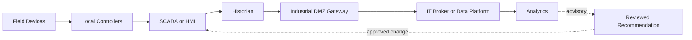



## 問題：データの接続がそのまま制御権限の接続になってはならない

OTは物理processを監視し、制御する。

ITは業務application、分析、cloud、enterprise identityを扱う。

両者を接続すれば可視性と最適化の機会が生まれる一方、障害の影響も物理世界へ広がる。

- analyticsアカウントがcontrol networkへ直接アクセスする。
- 一つのbroker credentialですべてのtopicへpublishできる。
- certificateの期限切れが収集だけでなく制御まで妨げる。
- cloud障害がlocal operationへ波及する。
- timestampとunitのエラーが誤った判断を生む。
- model recommendationが検証なしにsetpointになる。
- incident対応でsystemを停止するIT手順が安全な運転を妨げる。

OT/IT統合の基本原則は、物理的な安全とlocal operationを分析の利便性より優先することである。

## Mental model：階層ではなくtrust boundaryを描く

実際のarchitectureはさらに多様だが、write pathとread pathを区別するうえでこの図は有用である。

### 安全性、可用性、セキュリティの優先順位はcontextによって異なる

enterprise ITではconfidentialityが高い優先順位を持つことがある。

OTでは安全性と連続運転が先に来ることがある。

だからといってセキュリティを低くするという意味ではない。

patch、scanning、isolationの手順をprocess safetyと併せてリスク評価するという意味である。

### Purdue modelは出発点であり、自動的なセキュリティ証明ではない

levelとzoneを分けるだけではtrafficは制限されない。

実際のconduitのprotocol、direction、identity、command権限、fail behaviorを文書化する。

modern architectureではcloudとedgeが従来の階層を横断する可能性があるため、trust boundaryをデータフローに基づいて検証する。

## Protocolの役割を区別する

### OPC UA

typed information model、client/serverとPubSub、certificateベースのセキュリティ機能を提供する。

endpointのsecurity policy、mode、application certificate trustを明示する。

anonymousまたは過剰なuser権限をdefaultにしない。

nodeの意味とengineering unitをnamespaceとmodelで管理する。

### MQTT

軽量publish/subscribe protocolである。

topic naming、QoS、retained message、persistent session、will messageを設計しなければならない。

QoSという名称を業務上のexactly-onceだと解釈しない。

broker ACLによってclientごとのpublish/subscribe範囲を制限する。

retained commandが新しいsubscriberへ意図せず適用されないよう、command topicには特に注意する。

### Historian

高周期のtag値を圧縮・保存し、trendとeventの分析に提供する。

historianはsource of truthとしての役割、compression、interpolation、bad qualityの処理、clock alignmentを明確にしなければならない。

### SCADA/HMI

監視、alarm、operator interactionを担う。

IT dashboardがSCADAの安全機能とoperator authorityを代替すると想定しない。

## Workflow：read-mostly統合の設計

### Step 1. assetとデータフローをinventoryする

- deviceとcontroller
- firmwareとprotocol
- network zone
- ownerとvendor support
- criticality
- safety functionとの関連
- inbound/outbound connection
- remote access経路

不明なassetを接続する前にpassive discoveryと文書検証を行う。

### Step 2. use caseをreadとwriteに分類する

- monitoring
- reporting
- predictive maintenance
- anomaly detection
- operator advisory
- setpoint recommendation
- remote command
- automatic closed-loop control

後になるほど独立した検証と安全分析を厳格にしなければならない。

初期のanalyticsはadvisory-onlyから始めるのが一般的に安全である。

### Step 3. zoneとconduitを定義する

OTからITへの任意の直接connectionを許可しない。

industrial DMZのbroker、historian replica、API gatewayのような制御されたrelayを使用する。

必要なprotocol、source、destination、port、directionをallowlistする。

remote administration経路はdata pathから分離する。

### Step 4. local autonomyを維持する

ITまたはcloudとの接続が切れても、local controllerとoperatorが安全な運転を続けられなければならない。

bufferingとstore-and-forwardを使用する。

offline時にはdata gapを表示する。

cloud responseをcontrol loop timingに含めない。

### Step 5. identityとcertificate lifecycleを運用する

deviceまたはapplicationごとにidentityを発行する。

共有アカウントと共有private keyを避ける。

certificate inventory、期限切れ警告、rotation rehearsal、revocation手順を設ける。

clock syncがcertificate検証とevent orderingへ与える影響を考慮する。

### Step 6. data contractに品質を含める

tag名だけを渡さない。

- asset ID
- signalの意味
- engineering unit
- scaling
- sampling interval
- source timestamp
- ingestion timestamp
- quality code
- calibrationまたはconfiguration version

bad qualityの値を0に置き換えると、実際の0と通信障害を区別できない。

### Step 7. MQTT topicとACLを併せて設計する

例となる構造は`site/area/asset/signal`のように一貫させる。

環境名とtenant境界を含める。

sensor clientは自身のasset telemetryだけをpublishする。

analytics consumerは必要なbranchだけをsubscribeする。

command topicには別のbrokerまたはより厳格なpolicyを検討する。

### Step 8. OPC UA trustを明示的に管理する

server endpointとcertificate fingerprintを検証する。

自動的なtrust-allをproductionに置かない。

user tokenとapplication certificateの役割を区別する。

namespace indexは再起動後に変わる可能性があるため、namespace URIに基づくmappingを検討する。

### Step 9. advisory-only workflowを作る

analytics outputは次の情報を持つrecommendationとして保存する。

- input windowとdata quality
- modelまたはrule version
- recommendationとconfidence
- 適用可能なoperating envelope
- 禁止条件
- 生成時刻と有効期限
- reviewerと承認状態

operatorがSCADAの手順に従って判断し、適用する。

自動write pathと物理的に分離できるなら分離する。

### Step 10. changeとincident responseを共同設計する

IT、OT、process safety、vendorの役割を定める。

patch前にcompatibilityとrollbackを検討する。

active scanningとpenetration testは安全な範囲と時間に実施する。

incident containmentがsafety instrumentまたは必須のvisibilityを切断しないか確認する。

## 実践例：historianデータを分析プラットフォームへ送る

1. historian replicaまたはexport interfaceをOT側のsourceとして定める。
2. industrial DMZ gatewayがallowlistされたtagだけを読み取る。
3. gatewayはtimestamp、unit、quality codeを標準envelopeへ入れる。
4. 接続中断時はencrypted local bufferへ保存する。
5. IT brokerへmutual authenticationでpublishする。
6. broker ACLはgatewayごとのtopic branchだけを許可する。
7. consumerはmessage IDとsequenceで重複・gapを検出する。
8. raw dataをimmutableに保存する。
9. analytics resultは別のadvisory storeに記録する。
10. OTへの自動command routeは存在しない。

必要なwrite use caseが生じた場合は、別途リスク分析と承認、independent interlockを経る。

## 検証Checklist

### architecture

- [ ] assetとconnectionのinventoryが最新である。
- [ ] OT/IT zoneとconduitがdiagramにある。
- [ ] read pathとcommand pathが分離されている。
- [ ] cloud・IT切断時のlocal operationを試験した。
- [ ] 共通identityとbrokerの障害原因を特定した。

### protocolとdata

- [ ] OPC UA security modeとtrust listが管理されている。
- [ ] MQTT clientごとのACLが最小権限になっている。
- [ ] retained commandの使用を検討した。
- [ ] unit、timestamp、quality codeが契約に含まれる。
- [ ] gap、duplicate、late dataを検出する。
- [ ] clock synchronizationの状態を観察する。

### securityとsafety

- [ ] remote accessは承認・記録され、時間制限されている。
- [ ] certificate rotationを運転中に試験した。
- [ ] monitoring障害がcontrolを停止させない。
- [ ] analyticsは原則としてadvisory-onlyである。
- [ ] automatic actionには独立したsafety guardがある。
- [ ] incident runbookをOTとITが共同でrehearsalした。

## よくある失敗と限界

### air gapという表現だけを信じる

vendor laptop、removable media、remote support、data diode周辺の運用経路が実際の接続を作ることがある。

### protocolの暗号化をセキュリティ全体とみなす

endpoint compromise、過剰な権限、誤ったtopic、certificate運用の失敗は残る。

### historianの値をground truthとみなす

compression、substitution、sensor drift、bad quality、clockの問題を考慮しなければならない。

### predictive modelをすぐにclosed loopへ入れる

training domain外の入力とfalse alarmが物理actionにつながる可能性がある。

advisory、shadow、限定的なpilot、independent interlockの各段階で検証する。

### ITのincident手順をそのまま適用する

無条件に隔離・shutdownするとprocess safetyとvisibilityを損なう可能性がある。

現場の運転・安全担当者と事前に手順を作る。

## 公式参考資料

- [NIST SP 800-82 Rev. 3: Guide to Operational Technology Security](https://csrc.nist.gov/pubs/sp/800/82/r3/final)
- [OPC Foundation Specifications](https://reference.opcfoundation.org/)
- [OASIS MQTT Version 5.0](https://docs.oasis-open.org/mqtt/mqtt/v5.0/mqtt-v5.0.html)
- [CISA Industrial Control Systems Recommended Practices](https://www.cisa.gov/topics/industrial-control-systems)
- [MITRE ATT&CK for ICS](https://attack.mitre.org/matrices/ics/)

## まとめ

OT/IT統合の目標は、可能なすべてのデータを接続することではない。

local safetyとautonomyを守りながら、必要な情報だけを検証可能な経路で伝達することである。

protocolの機能よりも、trust boundary、identity、data quality、advisory authority、failure behaviorを先に設計しよう。
