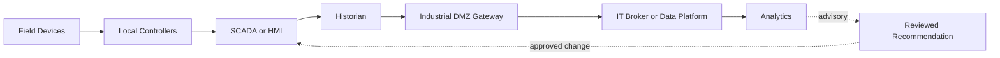



## 문제: 데이터 연결이 곧 제어 권한 연결이 되어서는 안 된다

OT는 물리 process를 감시하고 제어한다.

IT는 업무 application, 분석, cloud, enterprise identity를 다룬다.

둘을 연결하면 가시성과 최적화 기회가 생기지만 실패 영향도 물리 세계로 확장된다.

- analytics 계정이 control network에 직접 접근한다.
- broker credential 하나가 모든 topic을 publish할 수 있다.
- certificate 만료가 수집뿐 아니라 제어까지 막는다.
- cloud 장애가 local operation에 전파된다.
- timestamp와 unit 오류가 잘못된 판단을 만든다.
- model recommendation이 검증 없이 setpoint가 된다.
- incident 대응을 위해 system을 끄는 IT 절차가 안전 운전을 방해한다.

OT/IT 통합의 기본 원칙은 물리 안전과 local operation이 분석 편의보다 우선한다는 것이다.

## Mental model: 계층보다 trust boundary를 그린다

실제 architecture는 더 다양하지만 write path와 read path를 구분하는 데 이 그림이 유용하다.

### 안전, 가용성, 보안의 우선순위가 context에 따라 다르다

enterprise IT에서는 confidentiality가 높은 우선순위를 가질 수 있다.

OT에서는 안전과 연속 운전이 먼저일 수 있다.

그렇다고 보안을 낮춘다는 뜻은 아니다.

patch, scanning, isolation 절차를 process safety와 함께 위험 평가한다는 뜻이다.

### Purdue model은 출발점이지 자동 보안 증명이 아니다

level과 zone을 나누는 것만으로 traffic이 제한되지 않는다.

실제 conduit의 protocol, direction, identity, command 권한, fail behavior를 문서화한다.

modern architecture에서는 cloud와 edge가 고전적 계층을 가로지를 수 있으므로 trust boundary를 데이터 흐름 기준으로 검증한다.

## Protocol 역할을 구분한다

### OPC UA

typed information model, client/server와 PubSub, certificate 기반 보안 기능을 제공한다.

endpoint의 security policy, mode, application certificate trust를 명시한다.

anonymous 또는 과도한 user 권한을 기본값으로 두지 않는다.

node 의미와 engineering unit을 namespace와 model로 관리한다.

### MQTT

경량 publish/subscribe protocol이다.

topic naming, QoS, retained message, persistent session, will message를 설계해야 한다.

QoS 이름을 업무 exactly-once로 해석하지 않는다.

broker ACL로 client별 publish/subscribe 범위를 제한한다.

retained command가 새 subscriber에 예기치 않게 적용되지 않도록 command topic은 특히 조심한다.

### Historian

고주기 tag 값을 압축·보존하고 trend와 event 분석에 제공한다.

historian은 source of truth 역할, compression, interpolation, bad quality 처리, clock alignment를 명확히 해야 한다.

### SCADA/HMI

감시, alarm, operator interaction을 담당한다.

IT dashboard가 SCADA의 안전 기능과 operator authority를 대체한다고 가정하지 않는다.

## Workflow: read-mostly 통합 설계

### Step 1. asset와 데이터 흐름을 inventory한다

- device와 controller
- firmware와 protocol
- network zone
- owner와 vendor support
- criticality
- safety function 관련성
- inbound/outbound connection
- remote access 경로

알 수 없는 asset를 연결하기 전에 passive discovery와 문서 검증을 한다.

### Step 2. use case를 read와 write로 분류한다

- monitoring
- reporting
- predictive maintenance
- anomaly detection
- operator advisory
- setpoint recommendation
- remote command
- automatic closed-loop control

뒤로 갈수록 독립 검증과 안전 분석이 더 엄격해야 한다.

초기 analytics는 advisory-only로 시작하는 것이 일반적으로 안전하다.

### Step 3. zone과 conduit를 정의한다

OT에서 IT로 직접 임의 connection을 허용하지 않는다.

industrial DMZ의 broker, historian replica, API gateway 같은 통제된 relay를 사용한다.

필요한 protocol, source, destination, port, direction을 allowlist한다.

remote administration 경로는 data path와 분리한다.

### Step 4. local autonomy를 보존한다

IT 또는 cloud 연결이 끊겨도 local controller와 operator가 안전 운전을 계속할 수 있어야 한다.

buffering과 store-and-forward를 사용한다.

offline 시 data gap을 표시한다.

cloud 응답을 control loop timing에 포함하지 않는다.

### Step 5. identity와 certificate lifecycle을 운영한다

device 또는 application별 identity를 발급한다.

공유 계정과 공유 private key를 피한다.

certificate inventory, 만료 경보, rotation rehearsal, revocation 절차를 둔다.

clock sync가 certificate 검증과 event ordering에 미치는 영향을 고려한다.

### Step 6. data contract에 품질을 넣는다

tag 이름만 전달하지 않는다.

- asset ID
- signal 의미
- engineering unit
- scaling
- sampling interval
- source timestamp
- ingestion timestamp
- quality code
- calibration 또는 configuration version

bad quality 값을 0으로 치환하면 실제 0과 통신 실패를 구분할 수 없다.

### Step 7. MQTT topic과 ACL을 함께 설계한다

예시 구조는 `site/area/asset/signal`처럼 일관되게 만든다.

환경 이름과 tenant 경계를 포함한다.

sensor client는 자기 asset telemetry만 publish한다.

analytics consumer는 필요한 branch만 subscribe한다.

command topic은 별도 broker 또는 더 엄격한 policy를 고려한다.

### Step 8. OPC UA trust를 명시적으로 관리한다

server endpoint와 certificate fingerprint를 검증한다.

자동 trust-all을 production에 두지 않는다.

user token과 application certificate 역할을 구분한다.

namespace index가 재시작 뒤 바뀔 수 있으므로 namespace URI 기반 mapping을 검토한다.

### Step 9. advisory-only workflow를 만든다

analytics output은 다음 정보를 가진 recommendation으로 저장한다.

- input window와 data quality
- model 또는 rule version
- recommendation과 confidence
- 적용 가능한 operating envelope
- 금지 조건
- 생성 시각과 만료
- 검토자와 승인 상태

operator가 SCADA 절차에 따라 판단하고 적용한다.

자동 write path와 물리적으로 분리할 수 있으면 분리한다.

### Step 10. change와 incident response를 공동 설계한다

IT, OT, process safety, vendor 역할을 정한다.

patch 전 compatibility와 rollback을 검토한다.

active scanning과 penetration test는 안전한 범위와 시간에 수행한다.

incident containment가 안전 instrument 또는 필수 visibility를 끊지 않는지 확인한다.

## 실전 예제: historian 데이터를 분석 플랫폼으로 전달

1. historian replica 또는 export interface를 OT 측 source로 정한다.
2. industrial DMZ gateway가 allowlist된 tag만 읽는다.
3. gateway는 timestamp, unit, quality code를 표준 envelope에 넣는다.
4. 연결 중단 때 encrypted local buffer에 저장한다.
5. IT broker에 mutual authentication으로 publish한다.
6. broker ACL은 gateway별 topic branch만 허용한다.
7. consumer는 message ID와 sequence로 중복·gap을 탐지한다.
8. raw data를 immutable하게 보존한다.
9. analytics result는 별도 advisory store에 기록한다.
10. OT로의 자동 command route는 존재하지 않는다.

필요한 write use case가 생기면 별도 위험 분석과 승인, independent interlock을 거친다.

## 검증 Checklist

### architecture

- [ ] asset와 connection inventory가 최신이다.
- [ ] OT/IT zone과 conduit가 diagram에 있다.
- [ ] read path와 command path가 분리되어 있다.
- [ ] cloud·IT 단절 시 local operation을 시험했다.
- [ ] 공통 identity와 broker 실패 원인을 식별했다.

### protocol과 data

- [ ] OPC UA security mode와 trust list가 관리된다.
- [ ] MQTT client별 ACL이 최소 권한이다.
- [ ] retained command 사용을 검토했다.
- [ ] unit, timestamp, quality code가 계약에 있다.
- [ ] gap, duplicate, late data를 탐지한다.
- [ ] clock synchronization 상태를 관찰한다.

### security와 safety

- [ ] remote access는 승인·기록·시간 제한된다.
- [ ] certificate rotation을 운전 중 시험했다.
- [ ] monitoring 장애가 control을 멈추지 않는다.
- [ ] analytics는 기본적으로 advisory-only다.
- [ ] automatic action에는 독립 safety guard가 있다.
- [ ] incident runbook을 OT와 IT가 함께 rehearsal했다.

## 자주 겪는 실패와 한계

### air gap이라는 표현만 믿는다

vendor laptop, removable media, remote support, data diode 주변 운영 경로가 실제 연결을 만들 수 있다.

### protocol 암호화를 전체 보안으로 본다

endpoint compromise, 과도한 권한, 잘못된 topic, certificate 운영 실패는 남는다.

### historian 값을 ground truth로 본다

compression, substitution, sensor drift, bad quality, clock 문제를 고려해야 한다.

### predictive model을 바로 closed loop에 넣는다

training domain 밖 입력과 false alarm이 물리 action으로 이어질 수 있다.

advisory, shadow, 제한된 pilot, independent interlock 단계로 검증한다.

### IT incident 절차를 그대로 적용한다

무조건 격리·shutdown하면 process safety와 visibility를 해칠 수 있다.

현장 운전·안전 담당자와 사전 절차를 만든다.

## 공식 참고자료

- [NIST SP 800-82 Rev. 3: Guide to Operational Technology Security](https://csrc.nist.gov/pubs/sp/800/82/r3/final)
- [OPC Foundation Specifications](https://reference.opcfoundation.org/)
- [OASIS MQTT Version 5.0](https://docs.oasis-open.org/mqtt/mqtt/v5.0/mqtt-v5.0.html)
- [CISA Industrial Control Systems Recommended Practices](https://www.cisa.gov/topics/industrial-control-systems)
- [MITRE ATT&CK for ICS](https://attack.mitre.org/matrices/ics/)

## 마무리

OT/IT 통합의 목표는 가능한 모든 데이터를 연결하는 것이 아니다.

local safety와 autonomy를 지키면서 필요한 정보만 검증 가능한 경로로 전달하는 것이다.

protocol 기능보다 trust boundary, identity, data quality, advisory authority, failure behavior를 먼저 설계하자.
