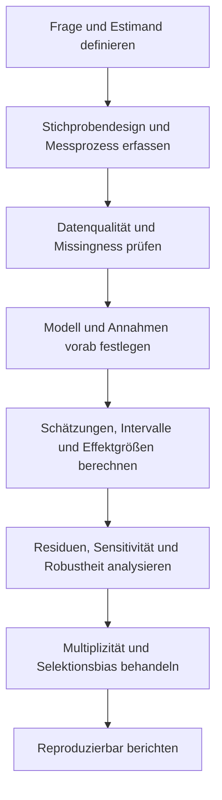



Statistik ist nicht die Technik, Daten in Formeln einzusetzen, um Zahlen zu erhalten.
Sie ist eine Sprache, um Annahmen über die Erzeugung einer Stichprobe zu treffen, unbeobachtete Unsicherheit zu quantifizieren und den Geltungsbereich von Aussagen zu begrenzen.

## 1. Wahrscheinlichkeitsmodelle und Datenerzeugungsprozesse

Die Verteilung einer Zufallsvariablen (X) sei (p(x\mid\theta)).
(\theta) kann ein Parameter wie Mittelwert oder Varianz sein oder eine komplexere Struktur besitzen.

Unterscheiden Sie vor der statistischen Analyse:

- Zielpopulation und Stichprobenrahmen
- Unabhängige Beobachtungseinheit
- Wiederholungsmessungen, Cluster und Zensierung
- Messprozess und Nachweisgrenze
- Missingness-Mechanismus
- Vorab festgelegtes primäres Outcome

Nicht unabhängige Beobachtungen als unabhängig zu zählen übertreibt die effektive Stichprobengröße.

## 2. Bedingte Wahrscheinlichkeit und Satz von Bayes

$$
P(A\mid B)=\frac{P(A\cap B)}{P(B)}
$$

und der Satz von Bayes lautet

$$
P(A\mid B)=\frac{P(B\mid A)P(A)}{P(B)}
$$

Wer bei diagnostischen Tests oder Anomalieerkennung (P(B\mid A)) mit (P(A\mid B)) verwechselt, übersieht den Effekt der Basisrate.

## 3. Erwartungswert, Varianz und Kovarianz

$$
\mathbb E[X]=\int x p(x)dx,
$$

$$
\operatorname{Var}(X)=\mathbb E[(X-\mathbb E[X])^2],
$$

$$
\operatorname{Cov}(X,Y)
=\mathbb E[(X-\mathbb E[X])(Y-\mathbb E[Y])].
$$

Korrelation ist nur eine dimensionslose Zusammenfassung einer linearen Beziehung; Kausalität, nichtlineare Abhängigkeit und Tail-Abhängigkeit erfasst sie nicht vollständig.

## 4. Eigenschaften von Schätzern

Eine Funktion (hat\theta=T(X_1,\ldots,X_n)), die einen Parameter aus einer Stichprobe (X_1,\ldots,X_n) schätzt, heißt Schätzer.

Wichtige Eigenschaften sind:

- Bias: (mathbb E[\hat\theta]-\theta)
- Varianz: Variabilität über wiederholte Stichproben
- Mittlerer quadratischer Fehler: Kombination aus Bias und Varianz
- Konsistenz: Konvergenz zum wahren Wert bei wachsender Stichprobe
- Effizienz: Relativ geringe Varianz unter gleichen Bedingungen
- Robustheit: Empfindlichkeit gegenüber Ausreißern und Modellfehlern

$$
\operatorname{MSE}(\hat\theta)
=\operatorname{Var}(\hat\theta)
+\operatorname{Bias}(\hat\theta)^2.
$$

Erwartungstreue allein bestimmt keinen guten Schätzer.

## 5. Maximum-Likelihood-Schätzung

Die Likelihood für eine unabhängige Stichprobe ist

$$
L(\theta)=\prod_{i=1}^{n}p(x_i\mid\theta)
$$

und die Log-Likelihood ist

$$
\ell(\theta)=\sum_{i=1}^{n}\log p(x_i\mid\theta)
$$

MLE maximiert (ell).

Die Likelihood ist selbst keine Wahrscheinlichkeitsverteilung über den Parameter.
Je nach Regularitätsbedingungen und Stichprobengröße kann eine asymptotische Approximation ungenau sein.

## 6. Standardfehler und Standardabweichung

- Die Standardabweichung beschreibt die Streuung einzelner Beobachtungen.
- Der Standardfehler beschreibt, wie stark ein Schätzer über wiederholte Stichproben variiert.

Für eine unabhängige, identisch verteilte Stichprobe ist der Standardfehler des Stichprobenmittelwerts

$$
\operatorname{SE}(\bar X)=\frac{s}{\sqrt n}
$$

Wenden Sie diese Formel bei Clustern, Autokorrelation oder ungleichen Gewichten nicht unverändert an.

## 7. Die genaue Bedeutung eines Konfidenzintervalls

Ein frequentistisches $100(1-\alpha)\%$-Konfidenzintervall ist ein Verfahren, das so konstruiert ist, dass bei unendlich häufiger Wiederholung des Stichprobenprozesses dieser Anteil der erzeugten Intervalle den wahren Parameter enthält.

Eine gebräuchliche Approximation hat die Form

$$
\hat\theta\pm z_{1-\alpha/2}\operatorname{SE}(\hat\theta)
$$

Dies unterscheidet sich von einer Posterior-Aussage, nach der der wahre Wert mit einer bestimmten Wahrscheinlichkeit in einem konkret berechneten Intervall liegt.
Erwägen Sie bei kleinen Stichproben, schiefen Verteilungen oder Randparametern exakte Methoden, Profile Likelihood, Bootstrap oder andere Alternativen zur Normalapproximation.

## 8. Konfidenzintervalle und Vorhersageintervalle

Unsicherheit über eine mittlere Antwort unterscheidet sich von Unsicherheit über eine neue Beobachtung.
In einem einfachen Normalmodell besitzt ein Vorhersageintervall für eine neue Beobachtung konzeptionell die Form

$$
\hat\mu\pm t\,s\sqrt{1+\frac{1}{n}}
$$

und enthält den Term 1 für Beobachtungsrauschen.
Es ist gewöhnlich breiter als das Konfidenzintervall für den Mittelwert.

Unterscheiden Sie folgende Intervalle.

- Konfidenzintervall eines Parameters
- Intervall der mittleren Antwort
- Individuelles Vorhersageintervall
- Toleranzintervall
- Simultanes Konfidenzband

## 9. Bootstrap

Bootstrap approximiert die Verteilung des Schätzers, indem mit Zurücklegen aus der empirischen Verteilung gezogen wird.

1. Eine Bootstrap-Stichprobe der Größe (n) aus der Originalstichprobe erstellen.
2. (hat\theta^*) aus jeder Stichprobe berechnen.
3. Standardfehler und Intervall aus der Verteilung der Wiederholungen schätzen.

Daten mit verletzter Unabhängigkeitsstruktur erfordern einen Block-, Cluster- oder stratifizierten Bootstrap.
Wenn die Originalstichprobe die Population nicht repräsentiert, korrigiert Bootstrap diesen Bias nicht.

## 10. Die Struktur von Hypothesentests

Legen Sie Nullhypothese (H_0) und Alternativhypothese (H_1) fest und bewerten Sie dann die Extremheit unter der (H_0)-Verteilung der Teststatistik.

- Fehler 1. Art: Eine wahre (H_0) verwerfen
- Fehler 2. Art: Eine falsche (H_0) nicht verwerfen
- Power: Wahrscheinlichkeit der Verwerfung bei Vorliegen eines realen Effekts

Ein p-Wert ist unter der Bedingung, dass (H_0) wahr ist, die Wahrscheinlichkeit, eine mindestens so extreme Statistik wie den beobachteten Wert zu erhalten.
Er ist weder die Wahrscheinlichkeit, dass (H_0) wahr ist, noch die Wahrscheinlichkeit, dass das Ergebnis zufällig entstand.

## 11. Statistische Signifikanz und praktische Bedeutung

Bei einer sehr großen Stichprobe kann selbst ein kleiner Unterschied signifikant werden.
Umgekehrt kann bei einer kleinen Stichprobe ein wichtiger Effekt nicht signifikant sein.

Berichten Sie daher gemeinsam:

- Roheffekt und Einheit
- Standardisierten Effekt
- Konfidenzintervall
- Vorab festgelegte praktische Schwelle
- Datenqualität und Modellannahmen

„Nicht signifikant“ ist kein Nachweis von Äquivalenz.
Eine Äquivalenzaussage erfordert eine Äquivalenzmarge und einen geeigneten Test.

## 12. Mehrfachvergleiche und Selektionsbias

Das Testen vieler Hypothesen erhöht die Wahrscheinlichkeit falsch positiver Ergebnisse.
Kontrollieren Sie je nach Ziel die Family-wise Error Rate oder False Discovery Rate.

Ein grundlegenderes Problem ist die Auswahl eines Outcomes, einer Subgruppe oder eines Modells nach Kenntnis der Ergebnisse.
Präregistrierung, Analyseplan und Veröffentlichung aller Ergebnisse reduzieren Selektionsbias.

## 13. Leicht übersehene Annahmen der Regression

Prüfen Sie für das lineare Modell

$$
y=X\beta+\epsilon
$$

Folgendes.

- Linearität der Mittelwertstruktur
- Struktur der Residualvarianz
- Unabhängigkeits- oder Korrelationsmodell
- Einflussreiche Beobachtungen
- Multikollinearität und Identifizierbarkeit
- Extrapolationsbereich
- Messfehler in Prädiktoren

Prüfen Sie nicht nur die Normalität der Residuen und lassen alles andere aus.

## 14. Fehlende Daten

- MCAR: Missingness hängt weder mit beobachteten noch mit unbeobachteten Werten zusammen
- MAR: Bedingt auf beobachtete Informationen hängt Missingness nicht mit unbeobachteten Werten zusammen
- MNAR: Der unbeobachtete Wert selbst hängt mit Missingness zusammen

Eine Complete-case-Analyse verliert Daten und Präzision und erzeugt abhängig von ihren Annahmen Bias.
Geben Sie auch bei Multiple Imputation und Sensitivitätsanalyse Imputationsmodell, Hilfsvariablen und Missingness-Annahmen an.

## 15. Analyseworkflow

## 16. Checkliste zur Validierung

- [ ] Die unabhängige Beobachtungseinheit wurde korrekt definiert.
- [ ] Der Unterschied zwischen Population und Stichprobenrahmen wurde erfasst.
- [ ] Das primäre Estimand wurde vor der Ergebnisprüfung festgelegt.
- [ ] Missingness und Zensierung wurden getrennt behandelt.
- [ ] Standardabweichung und Standardfehler wurden unterschieden.
- [ ] Intervalltyp und Bedeutung der Abdeckung wurden angegeben.
- [ ] Effektgröße und Originaleinheiten wurden gemeinsam berichtet.
- [ ] Modellresiduen und einflussreiche Punkte wurden geprüft.
- [ ] Mehrfachvergleiche und Subgruppenexploration wurden gekennzeichnet.
- [ ] Der Bootstrap bewahrt die Abhängigkeitsstruktur.
- [ ] Code, Seed, Paketversionen und Lineage der Analysedaten wurden erfasst.
- [ ] Schlussfolgerungen wurden nicht über den Geltungsbereich von Design und Daten hinaus verallgemeinert.

## 17. Häufige Fehlermuster und Grenzen

### Einen p-Wert als Schalter für die Schlussfolgerung verwenden

Ergebnisse auf verschiedenen Seiten einer Schwelle unterscheiden sich nicht qualitativ und vollständig.
Berichten Sie das Kontinuum von Evidenz und Unsicherheit.

### Den Typ eines Fehlerbalkens nicht angeben

SD, SE, CI und Vorhersageintervalle besitzen unterschiedliche Bedeutungen.

### Ein Modell für korrekt halten, weil es einen Normalitätstest besteht

Unabhängigkeit, Mittelwertstruktur, Varianz und Selektionsmechanismus können wichtiger sein.

### Eine datengetriebene Subgruppe als konfirmatorisch behandeln

Explorative Ergebnisse müssen mit unabhängigen Daten oder einer vorab festgelegten Analyse erneut validiert werden.

### Glauben, eine große Stichprobe beseitige jeden Bias

Stichprobengröße verringert Zufallsfehler, entfernt jedoch weder Confounding, Messbias noch Selektionsbias.

## 18. Offizielle und primäre Referenzen

- Fisher, R. A., *Statistical Methods for Research Workers*.
- Neyman und Pearson, „On the Problem of the Most Efficient Tests of Statistical Hypotheses“, 1933.
- Efron, „Bootstrap Methods: Another Look at the Jackknife“, 1979.
- NIST/SEMATECH, [e-Handbook of Statistical Methods](https://www.itl.nist.gov/div898/handbook/).
- American Statistical Association, [Erklärung zu statistischer Signifikanz und p-Werten](https://www.amstat.org/asa/files/pdfs/p-valuestatement.pdf).

Gute statistische Berichterstattung bedeutet nicht, den kleinsten p-Wert zu wählen.
Sie bedeutet, **Estimand, Stichprobendesign, Effektgröße, Intervall, Annahmen und Fehlermöglichkeiten in einem gemeinsamen Kontext offenzulegen**.
