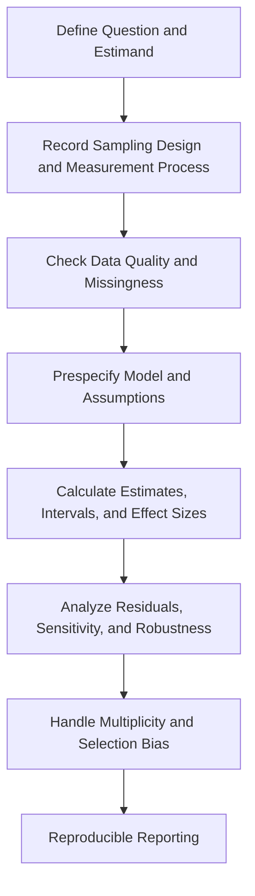



Statistics is not the technique of putting data into formulas to obtain numbers.
It is a language for assuming how a sample was generated, quantifying unobserved uncertainty, and limiting the scope of claims.

## 1. Probability models and data-generating processes

Let the distribution of a random variable (X) be (p(x\mid\theta)).
(	heta) may be a parameter such as a mean or variance, or it may have a more complex structure.

Before statistical analysis, distinguish the following.

- Target population and sampling frame
- Independent unit of observation
- Repeated measurements, clusters, and censoring
- Measurement process and detection limit
- Missingness mechanism
- Prespecified primary outcome

Counting nonindependent observations as independent exaggerates the effective sample size.

## 2. Conditional probability and Bayes' rule

$$
P(A\mid B)=\frac{P(A\cap B)}{P(B)}
$$

and Bayes' rule is

$$
P(A\mid B)=\frac{P(B\mid A)P(A)}{P(B)}
$$

Confusing (P(B\mid A)) with (P(A\mid B)) in diagnostic testing or anomaly detection causes you to miss the base-rate effect.

## 3. Expectation, variance, and covariance

$$
\mathbb E[X]=\int x p(x)dx,
$$

$$
\operatorname{Var}(X)=\mathbb E[(X-\mathbb E[X])^2],
$$

$$
\operatorname{Cov}(X,Y)
=\mathbb E[(X-\mathbb E[X])(Y-\mathbb E[Y])].
$$

Correlation is only a dimensionless summary of a linear relationship; it does not capture causality, nonlinear dependence, and tail dependence in full.

## 4. Properties of estimators

A function (hat\theta=T(X_1,\ldots,X_n)) that estimates a parameter from a sample (X_1,\ldots,X_n) is called an estimator.

Important properties include the following.

- Bias: (mathbb E[\hat\theta]-\theta)
- Variance: variability over repeated samples
- Mean squared error: a combination of bias and variance
- Consistency: convergence to the true value as the sample grows
- Efficiency: relatively small variance under the same conditions
- Robustness: sensitivity to outliers and model error

$$
\operatorname{MSE}(\hat\theta)
=\operatorname{Var}(\hat\theta)
+\operatorname{Bias}(\hat\theta)^2.
$$

Unbiasedness alone does not determine a good estimator.

## 5. Maximum likelihood estimation

The likelihood for an independent sample is

$$
L(\theta)=\prod_{i=1}^{n}p(x_i\mid\theta)
$$

and the log-likelihood is

$$
\ell(\theta)=\sum_{i=1}^{n}\log p(x_i\mid\theta)
$$

MLE maximizes (ell).

The likelihood is not itself a probability distribution over the parameter.
Depending on regularity conditions and sample size, an asymptotic approximation may be inaccurate.

## 6. Standard error and standard deviation

- Standard deviation describes the spread of individual observations.
- Standard error describes how much an estimator varies over repeated samples.

For an independent, identically distributed sample, the standard error of the sample mean is

$$
\operatorname{SE}(\bar X)=\frac{s}{\sqrt n}
$$

Do not apply this formula unchanged when clusters, autocorrelation, or unequal weights are present.

## 7. The precise meaning of a confidence interval

A frequentist \(100(1-\alpha)\%\) confidence interval is a procedure designed so that, if the sampling process were repeated infinitely, that proportion of the constructed intervals would contain the true parameter.

A common approximation has the form

$$
\hat\theta\pm z_{1-\alpha/2}\operatorname{SE}(\hat\theta)
$$

This differs from a posterior statement that the true value exists in a particular calculated interval with some probability.
For small samples, skewed distributions, or boundary parameters, consider exact methods, profile likelihood, bootstrap, or other alternatives to a normal approximation.

## 8. Confidence intervals and prediction intervals

Uncertainty about a mean response differs from uncertainty about a new observation.
In a simple normal model, a prediction interval for a new observation conceptually has the form

$$
\hat\mu\pm t\,s\sqrt{1+\frac{1}{n}}
$$

and includes the observation-noise term (1).
It is usually wider than the confidence interval for the mean.

Distinguish among the following intervals.

- Parameter confidence interval
- Mean response interval
- Individual prediction interval
- Tolerance interval
- Simultaneous confidence band

## 9. Bootstrap

Bootstrap approximates the estimator's distribution by sampling with replacement from the empirical distribution.

1. Create a bootstrap sample of size (n) from the original sample.
2. Calculate (hat\theta^*) from each sample.
3. Estimate the standard error and interval from the distribution of repetitions.

Data with a broken independence structure requires a block, cluster, or stratified bootstrap.
If the original sample is not representative of the population, bootstrap does not correct that bias.

## 10. The structure of hypothesis testing

Specify the null hypothesis (H_0) and alternative hypothesis (H_1), then evaluate extremeness under the (H_0) distribution of the test statistic.

- Type I error: rejecting a true (H_0)
- Type II error: failing to reject a false (H_0)
- Power: the probability of rejection when a real effect exists

A p-value is the probability, conditional on (H_0) being true, of observing a statistic at least as extreme as the observed value.
It is not the probability that (H_0) is true or that the result occurred by chance.

## 11. Statistical significance and practical importance

With a very large sample, even a small difference can become significant.
Conversely, with a small sample, an important effect may not be significant.

Therefore report the following together.

- Raw effect and unit
- Standardized effect
- Confidence interval
- Prespecified practical threshold
- Data quality and model assumptions

“Not significant” is not evidence of equivalence.
An equivalence claim requires an equivalence margin and an appropriate test.

## 12. Multiple comparisons and selection bias

Testing many hypotheses increases the probability of false positives.
Control the family-wise error rate or false discovery rate according to the objective.

A more fundamental problem is selecting an outcome, subgroup, or model after viewing the results.
Preregistration, an analysis plan, and publication of all results reduce selection bias.

## 13. Assumptions easily overlooked in regression

For the linear model

$$
y=X\beta+\epsilon
$$

check the following.

- Linearity of the mean structure
- Residual-variance structure
- Independence or correlation model
- Influential observations
- Multicollinearity and identifiability
- Range of extrapolation
- Measurement error in predictors

Do not check only residual normality and omit everything else.

## 14. Missing data

- MCAR: missingness is unrelated to observed and unobserved values
- MAR: conditional on observed information, missingness is unrelated to unobserved values
- MNAR: the unobserved value itself is related to missingness

Complete-case analysis loses data and precision and, depending on its assumptions, creates bias.
Even with multiple imputation and sensitivity analysis, specify the imputation model, auxiliary variables, and missingness assumptions.

## 15. Analysis workflow

## 16. Validation checklist

- [ ] The independent unit of observation was defined correctly.
- [ ] The difference between the population and sampling frame was recorded.
- [ ] The primary estimand was specified before examining results.
- [ ] Missingness and censoring were handled separately.
- [ ] Standard deviation and standard error were distinguished.
- [ ] The interval type and meaning of coverage were stated.
- [ ] Effect size and original units were reported together.
- [ ] Model residuals and influential points were checked.
- [ ] Multiple comparisons and subgroup exploration were identified.
- [ ] The bootstrap preserves the dependence structure.
- [ ] Code, seed, package versions, and analysis-data lineage were recorded.
- [ ] Conclusions were not generalized beyond the scope of the design and data.

## 17. Common failure patterns and limitations

### Using a p-value as a switch for the conclusion

Results on opposite sides of a threshold are not qualitatively and completely different.
Report the continuum of evidence and uncertainty.

### Not specifying the type of error bar

SD, SE, CI, and prediction intervals have different meanings.

### Deciding that a model is correct because it passes a normality test

Independence, mean structure, variance, and the selection mechanism may matter more.

### Treating a data-driven subgroup as confirmatory

Exploratory results must be revalidated with independent data or a prespecified analysis.

### Believing that a large sample resolves every bias

Sample size reduces random error, but does not remove confounding, measurement bias, or selection bias.

## 18. Official and primary references

- Fisher, R. A., *Statistical Methods for Research Workers*.
- Neyman and Pearson, “On the Problem of the Most Efficient Tests of Statistical Hypotheses,” 1933.
- Efron, “Bootstrap Methods: Another Look at the Jackknife,” 1979.
- NIST/SEMATECH, [e-Handbook of Statistical Methods](https://www.itl.nist.gov/div898/handbook/).
- American Statistical Association, [Statement on Statistical Significance and P-Values](https://www.amstat.org/asa/files/pdfs/p-valuestatement.pdf).

Good statistical reporting is not about choosing the smallest p-value.
It means **disclosing the estimand, sampling design, effect size, interval, assumptions, and failure possibilities in a single context**.
