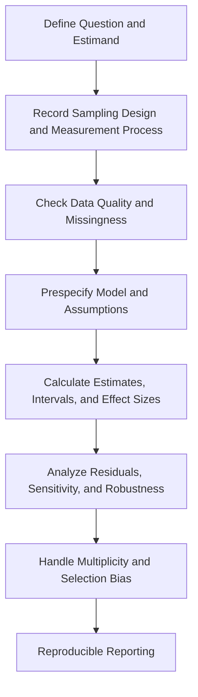



La estadística no es la técnica de poner datos en fórmulas para obtener números.
Es un lenguaje para asumir cómo se generó una muestra, cuantificar la incertidumbre no observada y limitar el alcance de las afirmaciones.

## 1. Modelos de probabilidad y procesos de generación de datos

Sea la distribución de una variable aleatoria (X) (p(x\mid\theta)).
( theta) puede ser un parámetro como la media o la varianza, o puede tener una estructura más compleja.

Antes del análisis estadístico, distinga lo siguiente.

- Población objetivo y marco muestral
- Unidad de observación independiente
- Mediciones repetidas, clusters y censura.
- Proceso de medición y límite de detección.
- Mecanismo de falta
- Resultado primario preespecificado

Contar las observaciones no independientes como independientes exagera el tamaño efectivo de la muestra.

## 2. Probabilidad condicional y regla de Bayes

$$
P(A\mid B)=\frac{P(A\cap B)}{P(B)}
$$

y la regla de Bayes es

$$
P(A\mid B)=\frac{P(B\mid A)P(A)}{P(B)}
$$

Confundir (P(B\mid A)) con (P(A\mid B)) en las pruebas de diagnóstico o en la detección de anomalías hace que se pierda el efecto de la tasa base.

## 3. Expectativa, varianza y covarianza

$$
\mathbb E[X]=\int x p(x)dx,
$$

$$
\operatorname{Var}(X)=\mathbb E[(X-\mathbb E[X])^2],
$$

$$
\operatorname{Cov}(X,Y)
=\mathbb E[(X-\mathbb E[X])(Y-\mathbb E[Y])].
$$

La correlación es sólo un resumen adimensional de una relación lineal; no captura completamente la causalidad, la dependencia no lineal y la dependencia de cola.

## 4. Propiedades de los estimadores

Una función (hat\theta=T(X_1,\ldots,X_n)) que estima un parámetro de una muestra (X_1,\ldots,X_n) se llama estimador.

Las propiedades importantes incluyen las siguientes.

- Sesgo: (mathbb E[\hat\theta]-\theta)
- Varianza: variabilidad sobre muestras repetidas.
- Error cuadrático medio: una combinación de sesgo y varianza
- Consistencia: convergencia al valor real a medida que crece la muestra.
- Eficiencia: variación relativamente pequeña en las mismas condiciones.
- Robustez: sensibilidad a valores atípicos y errores del modelo.

$$
\operatorname{MSE}(\hat\theta)
=\operatorname{Var}(\hat\theta)
+\operatorname{Bias}(\hat\theta)^2.
$$

La imparcialidad por sí sola no determina a un buen estimador.

## 5. Estimación de máxima verosimilitud

La probabilidad de una muestra independiente es

$$
L(\theta)=\prod_{i=1}^{n}p(x_i\mid\theta)
$$

y la probabilidad logarítmica es

$$
\ell(\theta)=\sum_{i=1}^{n}\log p(x_i\mid\theta)
$$

MLE maximiza (ell).

La probabilidad no es en sí misma una distribución de probabilidad sobre el parámetro.
Dependiendo de las condiciones de regularidad y del tamaño de la muestra, una aproximación asintótica puede resultar inexacta.

## 6. Error estándar y desviación estándar

- La desviación estándar describe la dispersión de las observaciones individuales.
- El error estándar describe cuánto varía un estimador en muestras repetidas.

Para una muestra independiente e idénticamente distribuida, el error estándar de la media muestral es

$$
\operatorname{SE}(\bar X)=\frac{s}{\sqrt n}
$$

No aplique esta fórmula sin cambios cuando haya conglomerados, autocorrelación o ponderaciones desiguales.

## 7. El significado preciso de un intervalo de confianza

Un intervalo de confianza frecuentista \(100(1-\alpha)\%\) es un procedimiento diseñado para que, si el proceso de muestreo se repitiera infinitamente, esa proporción de los intervalos construidos contendría el parámetro verdadero.

Una aproximación común tiene la forma

$$
\hat\theta\pm z_{1-\alpha/2}\operatorname{SE}(\hat\theta)
$$

Esto difiere de una afirmación posterior de que el valor verdadero existe en un intervalo calculado particular con cierta probabilidad.
Para muestras pequeñas, distribuciones sesgadas o parámetros de límites, considere métodos exactos, perfil de probabilidad, bootstrap u otras alternativas a una aproximación normal.

## 8. Intervalos de confianza e intervalos de predicción

La incertidumbre sobre una respuesta media difiere de la incertidumbre sobre una nueva observación.
En un modelo normal simple, un intervalo de predicción para una nueva observación tiene conceptualmente la forma

$$
\hat\mu\pm t\,s\sqrt{1+\frac{1}{n}}
$$

e incluye el término observación-ruido (1).
Generalmente es más amplio que el intervalo de confianza de la media.

Distinga entre los siguientes intervalos.

- Intervalo de confianza del parámetro
- Intervalo medio de respuesta
- Intervalo de predicción individual
- Intervalo de tolerancia
- Banda de confianza simultánea

## 9. Arranque

Bootstrap aproxima la distribución del estimador mediante muestreo con reemplazo de la distribución empírica.

1. Cree una muestra de arranque de tamaño (n) a partir de la muestra original.
2. Calcule (hat\theta^*) de cada muestra.
3. Estimar el error estándar y el intervalo a partir de la distribución de repeticiones.

Los datos con una estructura de independencia rota requieren un arranque en bloque, en grupo o estratificado.
Si la muestra original no es representativa de la población, el bootstrap no corrige ese sesgo.

## 10. La estructura de la prueba de hipótesis.

Especifique la hipótesis nula (H_0) y la hipótesis alternativa (H_1), luego evalúe el extremo bajo la distribución (H_0) de la estadística de prueba.

- Error tipo I: rechazar un verdadero (H_0)
- Error de tipo II: no se puede rechazar un mensaje falso (H_0)
- Potencia: la probabilidad de rechazo cuando existe un efecto real.

Un valor p es la probabilidad, condicionada a que (H_0) sea verdadera, de observar una estadística al menos tan extrema como el valor observado.
No es la probabilidad de que (H_0) sea cierto o de que el resultado haya ocurrido por casualidad.

## 11. Importancia estadística e importancia práctica

Con una muestra muy grande, incluso una pequeña diferencia puede volverse significativa.
Por el contrario, con una muestra pequeña, un efecto importante puede no ser significativo.

Por lo tanto, informen juntos lo siguiente.

- Efecto crudo y unidad.
- Efecto estandarizado
- Intervalo de confianza
- Umbral práctico preestablecido
- Calidad de los datos y supuestos del modelo.

“No significativo” no es evidencia de equivalencia.
Una reclamación de equivalencia requiere un margen de equivalencia y una prueba adecuada.

## 12. Comparaciones múltiples y sesgo de selección

Probar muchas hipótesis aumenta la probabilidad de falsos positivos.
Controle la tasa de error familiar o la tasa de descubrimiento falso según el objetivo.

Un problema más fundamental es seleccionar un resultado, subgrupo o modelo después de ver los resultados.
El registro previo, un plan de análisis y la publicación de todos los resultados reducen el sesgo de selección.

## 13. Supuestos que se pasan por alto fácilmente en la regresión

Para el modelo lineal

$$
y=X\beta+\epsilon
$$

verifique lo siguiente.

- Linealidad de la estructura media.
- Estructura de varianza residual
- Modelo de independencia o correlación
- Observaciones influyentes
- Multicolinealidad e identificabilidad.
- Rango de extrapolación
- Error de medición en predictores.

No compruebes sólo la normalidad residual y omitas todo lo demás.

## 14. Datos faltantes

- MCAR: la falta no está relacionada con los valores observados y no observados
- MAR: condicional a la información observada, la falta no está relacionada con los valores no observados
- MNAR: el valor no observado en sí está relacionado con la falta

El análisis de casos completos pierde datos y precisión y, dependiendo de sus supuestos, crea sesgos.
Incluso con múltiples imputaciones y análisis de sensibilidad, especifique el modelo de imputación, las variables auxiliares y los supuestos de omisión.

## 15. Flujo de trabajo de análisis

## 16. Lista de verificación de validación

- [ ] La unidad de observación independiente se definió correctamente.
- [ ] Se registró la diferencia entre la población y el marco muestral.
- [ ] La estimación primaria se especificó antes de examinar los resultados.
- [ ] Los desaparecidos y la censura se manejaron por separado.
- [ ] Se distinguió desviación estándar y error estándar.
- [ ] Se indicó el tipo de intervalo y significado de cobertura.
- [ ] El tamaño del efecto y las unidades originales se informaron juntos.
- [ ] Se comprobaron los residuos del modelo y los puntos influyentes.
- [] Se identificaron múltiples comparaciones y exploración de subgrupos.
- [] El bootstrap conserva la estructura de dependencia.
- [ ] Se registraron el código, la semilla, las versiones del paquete y el linaje de los datos de análisis.
- [ ] Las conclusiones no se generalizaron más allá del alcance del diseño y los datos.

## 17. Patrones de falla comunes y limitaciones

### Usar un valor p como interruptor para la conclusión

Los resultados en lados opuestos de un umbral no son cualitativa y completamente diferentes.
Informe el continuo de evidencia e incertidumbre.

### No especificar el tipo de barra de error

SD, SE, CI y los intervalos de predicción tienen significados diferentes.

### Decidir que un modelo es correcto porque pasa una prueba de normalidad

La independencia, la estructura media, la varianza y el mecanismo de selección pueden importar más.

### Tratar un subgrupo basado en datos como confirmatorio

Los resultados exploratorios deben revalidarse con datos independientes o un análisis preespecificado.

### Creer que una muestra grande resuelve todos los sesgos

El tamaño de la muestra reduce el error aleatorio, pero no elimina los factores de confusión, el sesgo de medición o el sesgo de selección.

## 18. Referencias oficiales y primarias.

- Fisher, R. A., *Métodos estadísticos para investigadores*.
- Neyman y Pearson, “Sobre el problema de las pruebas de hipótesis estadísticas más eficientes”, 1933.
- Efron, “Métodos Bootstrap: Otra mirada al Jackknife”, 1979.
- NIST/SEMATECH, [Manual electrónico de métodos estadísticos](https://www.itl.nist.gov/div898/handbook/).
- Asociación Estadounidense de Estadística, [Declaración sobre importancia estadística y P-Valores](https://www.amstat.org/asa/files/pdfs/p-valuestatement.pdf).

Un buen informe estadístico no consiste en elegir el valor p más pequeño.
Significa **revelar la estimación, el diseño muestral, el tamaño del efecto, el intervalo, los supuestos y las posibilidades de falla en un solo contexto**.
