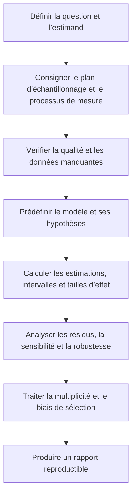



La statistique n’est pas l’art d’insérer des données dans des formules pour obtenir des nombres.
C’est un langage qui permet de poser des hypothèses sur le processus ayant produit un échantillon, de quantifier l’incertitude non observée et de limiter la portée des affirmations.

## 1. Modèles probabilistes et processus de génération des données

Notons (p(x\mid\theta)) la distribution d’une variable aléatoire (X).
( heta) peut être un paramètre tel qu’une moyenne ou une variance, ou posséder une structure plus complexe.

Avant toute analyse statistique, distinguez les éléments suivants.

- Population cible et base de sondage
- Unité d’observation indépendante
- Mesures répétées, clusters et censure
- Processus de mesure et limite de détection
- Mécanisme de données manquantes
- Critère de jugement principal défini à l’avance

Compter comme indépendantes des observations qui ne le sont pas exagère la taille effective de l’échantillon.

## 2. Probabilité conditionnelle et règle de Bayes

$$
P(A\mid B)=\frac{P(A\cap B)}{P(B)}
$$

et la règle de Bayes est

$$
P(A\mid B)=\frac{P(B\mid A)P(A)}{P(B)}
$$

Confondre (P(B\mid A)) avec (P(A\mid B)) lors d’un test diagnostique ou d’une détection d’anomalie fait perdre de vue l’effet du taux de base.

## 3. Espérance, variance et covariance

$$
\mathbb E[X]=\int x p(x)dx,
$$

$$
\operatorname{Var}(X)=\mathbb E[(X-\mathbb E[X])^2],
$$

$$
\operatorname{Cov}(X,Y)
=\mathbb E[(X-\mathbb E[X])(Y-\mathbb E[Y])].
$$

La corrélation n’est qu’un résumé sans dimension d’une relation linéaire ; elle ne décrit complètement ni la causalité, ni les dépendances non linéaires, ni la dépendance de queue.

## 4. Propriétés des estimateurs

Une fonction (hat\theta=T(X_1,\ldots,X_n)) qui estime un paramètre à partir d’un échantillon (X_1,\ldots,X_n) est appelée estimateur.

Ses propriétés importantes comprennent les suivantes.

- Biais : (mathbb E[\hat\theta]-\theta)
- Variance : variabilité entre les échantillons répétés
- Erreur quadratique moyenne : combinaison du biais et de la variance
- Convergence : rapprochement de la vraie valeur lorsque l’échantillon grandit
- Efficacité : variance relativement faible dans les mêmes conditions
- Robustesse : sensibilité aux valeurs aberrantes et aux erreurs de modèle

$$
\operatorname{MSE}(\hat\theta)
=\operatorname{Var}(\hat\theta)
+\operatorname{Bias}(\hat\theta)^2.
$$

L’absence de biais ne suffit pas à déterminer qu’un estimateur est bon.

## 5. Estimation par maximum de vraisemblance

La vraisemblance d’un échantillon indépendant est

$$
L(\theta)=\prod_{i=1}^{n}p(x_i\mid\theta)
$$

et la log-vraisemblance est

$$
\ell(\theta)=\sum_{i=1}^{n}\log p(x_i\mid\theta)
$$

L’estimation par maximum de vraisemblance maximise (ell).

La vraisemblance n’est pas en elle-même une distribution de probabilité sur le paramètre.
Selon les conditions de régularité et la taille de l’échantillon, une approximation asymptotique peut manquer de précision.

## 6. Erreur standard et écart-type

- L’écart-type décrit la dispersion des observations individuelles.
- L’erreur standard décrit la variation d’un estimateur entre des échantillons répétés.

Pour un échantillon indépendant et identiquement distribué, l’erreur standard de la moyenne d’échantillon est

$$
\operatorname{SE}(\bar X)=\frac{s}{\sqrt n}
$$

N’appliquez pas cette formule sans modification en présence de clusters, d’autocorrélation ou de poids inégaux.

## 7. Sens précis d’un intervalle de confiance

Un intervalle de confiance fréquentiste à \(100(1-\alpha)\%\) est une procédure conçue pour que, si le processus d’échantillonnage était répété indéfiniment, cette proportion des intervalles construits contienne le véritable paramètre.

Une approximation courante a la forme

$$
\hat\theta\pm z_{1-\alpha/2}\operatorname{SE}(\hat\theta)
$$

Cet énoncé diffère d’une affirmation a posteriori selon laquelle la vraie valeur se trouverait, avec une certaine probabilité, dans l’intervalle particulier qui a été calculé.
Pour les petits échantillons, les distributions asymétriques ou les paramètres à la frontière, envisagez des méthodes exactes, la vraisemblance profilée, le bootstrap ou d’autres solutions à la place d’une approximation normale.

## 8. Intervalles de confiance et intervalles de prédiction

L’incertitude portant sur une réponse moyenne diffère de celle portant sur une nouvelle observation.
Dans un modèle normal simple, l’intervalle de prédiction d’une nouvelle observation prend conceptuellement la forme

$$
\hat\mu\pm t\,s\sqrt{1+\frac{1}{n}}
$$

et comprend le terme (1) correspondant au bruit d’observation.
Il est généralement plus large que l’intervalle de confiance de la moyenne.

Distinguez les intervalles suivants.

- Intervalle de confiance d’un paramètre
- Intervalle de la réponse moyenne
- Intervalle de prédiction individuel
- Intervalle de tolérance
- Bande de confiance simultanée

## 9. Bootstrap

Le bootstrap approxime la distribution d’un estimateur en effectuant des tirages avec remise dans la distribution empirique.

1. Créez un échantillon bootstrap de taille (n) à partir de l’échantillon d’origine.
2. Calculez (hat\theta^*) pour chaque échantillon.
3. Estimez l’erreur standard et l’intervalle à partir de la distribution des répétitions.

Les données dont la structure d’indépendance est rompue nécessitent un bootstrap par blocs, par clusters ou stratifié.
Si l’échantillon d’origine n’est pas représentatif de la population, le bootstrap ne corrige pas ce biais.

## 10. Structure d’un test d’hypothèse

Définissez l’hypothèse nulle (H_0) et l’hypothèse alternative (H_1), puis évaluez le caractère extrême de la statistique de test sous sa distribution selon (H_0).

- Erreur de type I : rejeter une hypothèse (H_0) vraie
- Erreur de type II : ne pas rejeter une hypothèse (H_0) fausse
- Puissance : probabilité de rejet lorsqu’un effet réel existe

Une valeur p est la probabilité, conditionnellement à la véracité de (H_0), d’observer une statistique au moins aussi extrême que la valeur observée.
Ce n’est ni la probabilité que (H_0) soit vraie, ni celle que le résultat soit dû au hasard.

## 11. Signification statistique et importance pratique

Avec un très grand échantillon, même une petite différence peut devenir significative.
Inversement, avec un petit échantillon, un effet important peut ne pas être significatif.

Présentez donc ensemble les éléments suivants.

- Effet brut et unité
- Effet standardisé
- Intervalle de confiance
- Seuil d’importance pratique défini à l’avance
- Qualité des données et hypothèses du modèle

« Non significatif » ne prouve pas l’équivalence.
Une affirmation d’équivalence exige une marge d’équivalence et un test approprié.

## 12. Comparaisons multiples et biais de sélection

Tester de nombreuses hypothèses accroît la probabilité de faux positifs.
Contrôlez le taux d’erreur par famille ou le taux de fausses découvertes en fonction de l’objectif.

Un problème plus fondamental consiste à sélectionner un critère de jugement, un sous-groupe ou un modèle après avoir vu les résultats.
Le préenregistrement, un plan d’analyse et la publication de tous les résultats réduisent le biais de sélection.

## 13. Hypothèses facilement négligées en régression

Pour le modèle linéaire

$$
y=X\beta+\epsilon
$$

vérifiez les points suivants.

- Linéarité de la structure de la moyenne
- Structure de la variance résiduelle
- Indépendance ou modèle de corrélation
- Observations influentes
- Multicolinéarité et identifiabilité
- Domaine d’extrapolation
- Erreur de mesure sur les prédicteurs

Ne vous contentez pas de vérifier la normalité des résidus en omettant tout le reste.

## 14. Données manquantes

- MCAR : l’absence est indépendante des valeurs observées et non observées
- MAR : conditionnellement aux informations observées, l’absence est indépendante des valeurs non observées
- MNAR : la valeur non observée elle-même est liée à son absence

L’analyse des cas complets perd des données et de la précision et, selon ses hypothèses, introduit un biais.
Même avec une imputation multiple et une analyse de sensibilité, précisez le modèle d’imputation, les variables auxiliaires et les hypothèses sur les données manquantes.

## 15. Workflow d’analyse

## 16. Liste de contrôle de validation

- [ ] L’unité d’observation indépendante a été correctement définie.
- [ ] La différence entre la population et la base de sondage a été consignée.
- [ ] L’estimand principal a été défini avant l’examen des résultats.
- [ ] Les données manquantes et la censure ont été traitées séparément.
- [ ] L’écart-type et l’erreur standard ont été distingués.
- [ ] Le type d’intervalle et le sens de la couverture ont été indiqués.
- [ ] La taille d’effet et les unités d’origine ont été présentées ensemble.
- [ ] Les résidus du modèle et les points influents ont été examinés.
- [ ] Les comparaisons multiples et l’exploration des sous-groupes ont été signalées.
- [ ] Le bootstrap préserve la structure de dépendance.
- [ ] Le code, la graine, les versions des packages et la traçabilité des données d’analyse ont été consignés.
- [ ] Les conclusions n’ont pas été généralisées au-delà du périmètre du plan d’étude et des données.

## 17. Schémas d’échec fréquents et limites

### Utiliser une valeur p comme interrupteur de la conclusion

Des résultats situés de part et d’autre d’un seuil ne sont pas qualitativement et totalement différents.
Présentez le continuum des preuves et de l’incertitude.

### Ne pas préciser le type de barre d’erreur

L’écart-type, l’erreur standard, l’intervalle de confiance et l’intervalle de prédiction n’ont pas la même signification.

### Décider qu’un modèle est correct parce qu’il réussit un test de normalité

L’indépendance, la structure de la moyenne, la variance et le mécanisme de sélection peuvent être plus importants.

### Considérer un sous-groupe déterminé par les données comme confirmatoire

Les résultats exploratoires doivent être validés de nouveau avec des données indépendantes ou une analyse définie à l’avance.

### Croire qu’un grand échantillon résout tous les biais

La taille de l’échantillon réduit l’erreur aléatoire, mais ne supprime ni les facteurs de confusion, ni les biais de mesure, ni les biais de sélection.

## 18. Références officielles et sources primaires

- Fisher, R. A., *Statistical Methods for Research Workers*.
- Neyman et Pearson, « On the Problem of the Most Efficient Tests of Statistical Hypotheses », 1933.
- Efron, « Bootstrap Methods: Another Look at the Jackknife », 1979.
- NIST/SEMATECH, [manuel électronique des méthodes statistiques](https://www.itl.nist.gov/div898/handbook/).
- American Statistical Association, [déclaration sur la signification statistique et les valeurs p](https://www.amstat.org/asa/files/pdfs/p-valuestatement.pdf).

Un bon rapport statistique ne consiste pas à choisir la plus petite valeur p.
Il consiste à **présenter dans un même contexte l’estimand, le plan d’échantillonnage, la taille d’effet, l’intervalle, les hypothèses et les défaillances possibles**.
