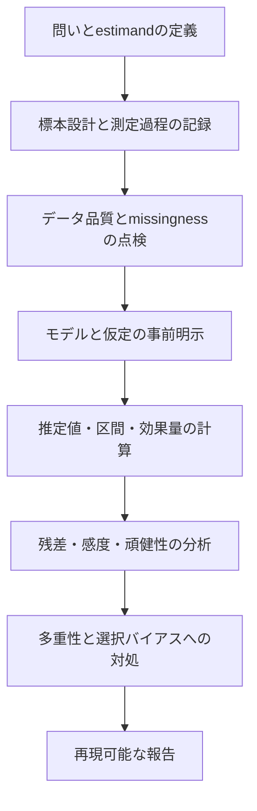



統計は、データを公式に代入して数値を得る技術ではない。
標本がどのような生成過程を経たかを仮定し、観測できない不確実性を定量化して、主張できる範囲を限定するための言語である。

## 1. 確率モデルとデータ生成過程

確率変数 \(X\) の分布を \(p(x\mid\theta)\) とする。
\(\theta\) は平均や分散のようなparameterの場合もあれば、より複雑な構造の場合もある。

統計分析の前に、次の要素を区別する。

- 対象となる母集団とsampling frame
- 独立した観測単位
- 反復測定、cluster、censoring
- measurement processとdetection limit
- missingness mechanism
- 事前に定めたprimary outcome

独立でない観測を独立として数えると、有効標本サイズを過大評価する。

## 2. 条件付き確率とBayes則

$$
P(A\mid B)=\frac{P(A\cap B)}{P(B)}
$$

であり、Bayes則は

$$
P(A\mid B)=\frac{P(B\mid A)P(A)}{P(B)}
$$

である。
検査精度や異常検知で \(P(B\mid A)\) と \(P(A\mid B)\) を混同すると、base-rate effectを見落とす。

## 3. 期待値、分散、共分散

$$
\mathbb E[X]=\int x p(x)dx,
$$

$$
\operatorname{Var}(X)=\mathbb E[(X-\mathbb E[X])^2],
$$

$$
\operatorname{Cov}(X,Y)
=\mathbb E[(X-\mathbb E[X])(Y-\mathbb E[Y])].
$$

相関は線形関係を無次元で要約したものにすぎず、因果性、非線形な依存関係、tail dependenceのすべてを表すわけではない。

## 4. 推定量の性質

標本 \(X_1,\ldots,X_n\) からparameterを推定する関数 \(\hat\theta=T(X_1,\ldots,X_n)\) を推定量という。

重要な性質は次のとおりである。

- bias：\(\mathbb E[\hat\theta]-\theta\)
- variance：標本抽出を繰り返したときの変動性
- mean squared error：biasとvarianceの組み合わせ
- consistency：標本が大きくなるにつれて真値へ近づく性質
- efficiency：同じ条件で相対的に分散が小さいこと
- robustness：外れ値とモデル誤差に対する感度

$$
\operatorname{MSE}(\hat\theta)
=\operatorname{Var}(\hat\theta)
+\operatorname{Bias}(\hat\theta)^2.
$$

不偏性だけで良い推定量が決まるわけではない。

## 5. 最尤推定

独立標本のlikelihoodは

$$
L(\theta)=\prod_{i=1}^{n}p(x_i\mid\theta)
$$

であり、log-likelihoodは

$$
\ell(\theta)=\sum_{i=1}^{n}\log p(x_i\mid\theta)
$$

である。
MLEは \(\ell\) を最大化する。

likelihoodはparameterそのものの確率分布ではない。
regularityと標本サイズによっては、asymptotic approximationが不正確になることがある。

## 6. 標準誤差と標準偏差

- 標準偏差は個々の観測値のばらつきを表す。
- 標準誤差は、標本抽出を繰り返したときに推定量がどれほど変動するかを表す。

独立同分布における標本平均の標準誤差は

$$
\operatorname{SE}(\bar X)=\frac{s}{\sqrt n}
$$

である。
cluster、autocorrelation、unequal weightがある場合、この式をそのまま使ってはならない。

## 7. 信頼区間の正確な意味

frequentistの \(100(1-\alpha)\%\) 信頼区間は、標本抽出手続きを無限に繰り返したとき、構成された区間のうちその割合が真のparameterを含むよう設計された手続きである。

一般的な近似形は

$$
\hat\theta\pm z_{1-\alpha/2}\operatorname{SE}(\hat\theta)
$$

である。

計算済みの特定の区間に真値が確率的に存在するというposteriorの言明とは異なる。
small sample、skewness、boundary parameterの場合は、normal approximationの代わりにexact、profile likelihood、bootstrapなどを検討する。

## 8. 信頼区間と予測区間

平均responseの不確実性と、新しい観測の不確実性は異なる。
単純な正規モデルで、新しい観測のprediction intervalは概念的に

$$
\hat\mu\pm t\,s\sqrt{1+\frac{1}{n}}
$$

のようにobservation noiseの項 \(1\) を含む。
平均のconfidence intervalよりも通常は広い。

次の区間を区別する。

- parameter confidence interval
- mean response interval
- individual prediction interval
- tolerance interval
- simultaneous confidence band

## 9. Bootstrap

経験分布から復元抽出を行い、推定量の分布を近似する。

1. 元の標本からサイズ \(n\) のbootstrap sampleを作る。
2. 各sampleで \(\hat\theta^*\) を計算する。
3. 反復分布から標準誤差と区間を推定する。

独立構造が崩れたデータには、block、cluster、stratified bootstrapが必要である。
元の標本が母集団を代表していなければ、bootstrapでそのbiasを修正することはできない。

## 10. 仮説検定の構造

帰無仮説 \(H_0\) と対立仮説 \(H_1\) を定め、test statisticの \(H_0\) 分布における極端さを評価する。

- Type I error：真である \(H_0\) を棄却する
- Type II error：偽である \(H_0\) を棄却できない
- power：実際に効果があるときに棄却する確率

p-valueは、\(H_0\) が真であるという条件の下で、観測値以上に極端な統計量が得られる確率である。
\(H_0\) が真である確率でも、結果が偶然である確率でもない。

## 11. 統計的有意性と実質的重要性

標本が非常に大きいと、小さな差でも有意になり得る。
反対に、標本が小さいと重要な効果でも有意にならないことがある。

したがって、次を併せて報告する。

- raw effectと単位
- standardized effect
- confidence interval
- 事前に定めたpractical threshold
- data qualityとmodel assumption

「有意ではない」ことは、同一である証拠ではない。
同等性の主張にはequivalence marginと適切な検定が必要である。

## 12. 多重比較と選択バイアス

多数の仮説を検定すると、false positiveの確率が高くなる。
目的に応じてfamily-wise error rateまたはfalse discovery rateを制御する。

さらに根本的な問題は、結果を見た後でoutcome、subgroup、modelを選択することである。
pre-registration、analysis plan、すべての結果の公開によって選択バイアスを減らす。

## 13. 回帰で見落としやすい仮定

線形モデル

$$
y=X\beta+\epsilon
$$

で確認すべき項目は次のとおりである。

- mean structureの線形性
- residual varianceの構造
- independenceまたはcorrelation model
- influential observation
- multicollinearityとidentifiability
- extrapolationの範囲
- predictorsにおけるmeasurement error

残差のnormalityだけを確認し、ほかを省略してはならない。

## 14. missing data

- MCAR：missingnessが観測値と未観測値のどちらにも関係しない
- MAR：観測済みの情報で条件付けると、missingnessが未観測値と関係しない
- MNAR：未観測値そのものがmissingnessに関係する

complete-case analysisはデータとprecisionを失い、仮定によってはbiasを生む。
multiple imputationとsensitivity analysisでも、imputation model、auxiliary variable、missingness assumptionを明示しなければならない。

## 15. 分析ワークフロー

## 16. 検証チェックリスト

- [ ] 独立した観測単位を正確に定義した。
- [ ] 母集団とsampling frameの違いを記録した。
- [ ] primary estimandを結果の確認前に定めた。
- [ ] missingnessとcensoringを別々に扱った。
- [ ] 標準偏差と標準誤差を区別した。
- [ ] 区間の種類とcoverageの意味を明示した。
- [ ] effect sizeと元の単位を併せて報告した。
- [ ] model residualとinfluential pointを確認した。
- [ ] 多重比較とsubgroup探索を明示した。
- [ ] bootstrapがdependence structureを保っている。
- [ ] code、seed、package version、analysis data lineageを記録した。
- [ ] 結論を設計とデータの範囲外へ一般化していない。

## 17. よくある失敗パターンと限界

### p-valueを結論のスイッチとして使う

thresholdの両側で結果の質が完全に変わるわけではない。
連続的な証拠と不確実性を報告する。

### error barの種類を書かない

SD、SE、CI、prediction intervalは意味が異なる。

### 正規性検定を通ればモデルが正しいと判断する

独立性、mean structure、variance、selection mechanismのほうが重要な場合もある。

### data-driven subgroupをconfirmatoryとして報告する

探索結果は、独立データまたは事前に計画した分析で再検証しなければならない。

### 大標本がすべてのbiasを解消すると考える

標本数はrandom errorを減らすが、confounding、measurement bias、selection biasは取り除かない。

## 18. 公式資料・原典

- Fisher, R. A., *Statistical Methods for Research Workers*.
- Neyman and Pearson, “On the Problem of the Most Efficient Tests of Statistical Hypotheses,” 1933.
- Efron, “Bootstrap Methods: Another Look at the Jackknife,” 1979.
- NIST/SEMATECH, [e-Handbook of Statistical Methods](https://www.itl.nist.gov/div898/handbook/).
- American Statistical Association, [Statement on Statistical Significance and P-Values](https://www.amstat.org/asa/files/pdfs/p-valuestatement.pdf).

統計的に良い報告とは、最小のp-valueを選ぶことではない。
**estimand、標本設計、効果量、区間、仮定、失敗の可能性を一つの文脈で公開すること**である。
