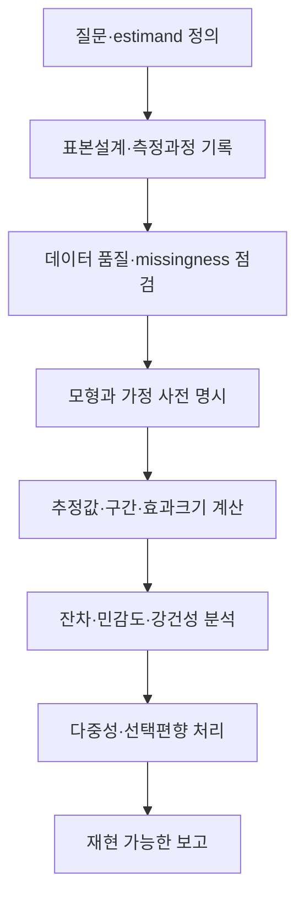



통계는 데이터를 공식에 넣어 숫자를 얻는 기술이 아니다.
표본이 어떤 생성과정을 거쳤는지 가정하고, 관측하지 못한 불확실성을 정량화해 주장의 범위를 제한하는 언어다.

## 1. 확률모형과 데이터 생성과정

확률변수 (X)의 분포를 (p(x\mid\theta))라 하자.
(	heta)는 평균·분산 같은 parameter일 수도 있고 더 복잡한 구조일 수도 있다.

통계 분석 전에 다음을 분리한다.

- 대상 모집단과 sampling frame
- 독립 관측 단위
- 반복측정, cluster, censoring
- measurement process와 detection limit
- missingness mechanism
- 사전에 정한 primary outcome

독립이 아닌 관측을 독립으로 세면 유효 표본 크기를 과장한다.

## 2. 조건부확률과 Bayes 규칙

$$
P(A\mid B)=\frac{P(A\cap B)}{P(B)}
$$

이며 Bayes 규칙은

$$
P(A\mid B)=\frac{P(B\mid A)P(A)}{P(B)}
$$

이다.
검사 정확도나 이상탐지에서 (P(B\mid A))와 (P(A\mid B))를 혼동하면 base-rate effect를 놓친다.

## 3. 기대값, 분산, 공분산

$$
\mathbb E[X]=\int x p(x)dx,
$$

$$
\operatorname{Var}(X)=\mathbb E[(X-\mathbb E[X])^2],
$$

$$
\operatorname{Cov}(X,Y)
=\mathbb E[(X-\mathbb E[X])(Y-\mathbb E[Y])].
$$

상관은 선형 관계의 무차원 요약일 뿐 인과성, 비선형 의존성, tail dependence를 모두 표현하지 않는다.

## 4. 추정량의 성질

표본 (X_1,\ldots,X_n)에서 parameter를 추정하는 함수 (hat\theta=T(X_1,\ldots,X_n))를 추정량이라 한다.

중요한 성질은 다음과 같다.

- bias: (mathbb E[\hat\theta]-\theta)
- variance: 표본 반복 시 변동성
- mean squared error: bias와 variance의 결합
- consistency: 표본이 커질 때 참값으로 접근
- efficiency: 같은 조건에서 상대적으로 작은 분산
- robustness: 이상치와 모형오류에 대한 민감도

$$
\operatorname{MSE}(\hat\theta)
=\operatorname{Var}(\hat\theta)
+\operatorname{Bias}(\hat\theta)^2.
$$

불편성만으로 좋은 추정량이 결정되지는 않는다.

## 5. 최대우도추정

독립 표본의 likelihood는

$$
L(\theta)=\prod_{i=1}^{n}p(x_i\mid\theta)
$$

이고 log-likelihood는

$$
\ell(\theta)=\sum_{i=1}^{n}\log p(x_i\mid\theta)
$$

이다.
MLE는 (ell)을 최대화한다.

likelihood는 parameter의 확률분포 자체가 아니다.
regularity와 표본 크기에 따라 asymptotic approximation이 부정확할 수 있다.

## 6. 표준오차와 표준편차

- 표준편차는 개별 관측값의 퍼짐을 나타낸다.
- 표준오차는 추정량이 표본 반복에서 얼마나 변하는지 나타낸다.

독립 동일분포에서 표본평균의 표준오차는

$$
\operatorname{SE}(\bar X)=\frac{s}{\sqrt n}
$$

이다.
cluster, autocorrelation, unequal weight가 있으면 이 공식을 그대로 쓰지 않는다.

## 7. 신뢰구간의 정확한 의미

frequentist \(100(1-\alpha)\%\) 신뢰구간은 표본추출 절차를 무한히 반복했을 때 구성된 구간 중 그 비율이 참 parameter를 포함하도록 설계된 절차다.

일반적인 근사형은

$$
\hat\theta\pm z_{1-\alpha/2}\operatorname{SE}(\hat\theta)
$$

이다.

계산된 특정 구간에 참값이 확률적으로 존재한다는 posterior 진술과는 다르다.
small sample, skewness, boundary parameter에서는 normal approximation 대신 exact, profile likelihood, bootstrap 등을 고려한다.

## 8. 신뢰구간과 예측구간

평균 response의 불확실성과 새로운 관측의 불확실성은 다르다.
단순 정규모형에서 새 관측의 prediction interval은 개념적으로

$$
\hat\mu\pm t\,s\sqrt{1+\frac{1}{n}}
$$

처럼 observation noise 항 (1)을 포함한다.
평균의 confidence interval보다 보통 넓다.

다음 구간을 구분한다.

- parameter confidence interval
- mean response interval
- individual prediction interval
- tolerance interval
- simultaneous confidence band

## 9. Bootstrap

경험분포에서 표본을 복원추출해 추정량 분포를 근사한다.

1. 원 표본에서 크기 (n)의 bootstrap sample을 만든다.
2. 각 sample에서 (hat\theta^*)를 계산한다.
3. 반복 분포로 표준오차와 구간을 추정한다.

독립구조가 깨진 데이터에는 block, cluster, stratified bootstrap이 필요하다.
원 표본이 모집단을 대표하지 못하면 bootstrap은 그 bias를 고치지 못한다.

## 10. 가설검정의 구조

귀무가설 (H_0)와 대립가설 (H_1)을 정하고 test statistic의 (H_0) 분포에서 극단성을 평가한다.

- Type I error: 참인 (H_0)를 기각
- Type II error: 거짓인 (H_0)를 기각하지 못함
- power: 실제 효과가 있을 때 기각할 확률

p-value는 (H_0)가 참이라는 조건에서 관측값 이상으로 극단적인 통계량을 볼 확률이다.
(H_0)가 참일 확률이나 결과가 우연일 확률이 아니다.

## 11. 통계적 유의성과 실질적 중요성

표본이 매우 크면 작은 차이도 유의해질 수 있다.
반대로 작은 표본에서는 중요한 효과가 유의하지 않을 수 있다.

따라서 함께 보고한다.

- raw effect와 단위
- standardized effect
- confidence interval
- 사전에 정한 practical threshold
- data quality와 model assumption

“유의하지 않음”은 동일함의 증거가 아니다.
동등성 주장은 equivalence margin과 적절한 검정이 필요하다.

## 12. 다중비교와 선택편향

가설을 많이 시험하면 false positive 확률이 커진다.
family-wise error rate 또는 false discovery rate를 목적에 맞게 제어한다.

더 근본적인 문제는 결과를 본 뒤 outcome, subgroup, model을 선택하는 것이다.
pre-registration, analysis plan, 전체 결과 공개가 선택편향을 줄인다.

## 13. 회귀에서 놓치기 쉬운 가정

선형모형

$$
y=X\beta+\epsilon
$$

에서 확인할 항목은 다음과 같다.

- mean structure의 선형성
- residual variance 구조
- independence 또는 correlation model
- influential observation
- multicollinearity와 identifiability
- extrapolation 범위
- measurement error in predictors

잔차의 normality만 확인하고 나머지를 생략해서는 안 된다.

## 14. missing data

- MCAR: missingness가 관측·미관측 값과 무관
- MAR: 관측된 정보에 조건부로 missingness가 미관측 값과 무관
- MNAR: 미관측 값 자체가 missingness와 관련

complete-case analysis는 데이터와 precision을 잃고 가정에 따라 bias를 만든다.
multiple imputation과 sensitivity analysis에서도 imputation model, auxiliary variable, missingness assumption을 명시해야 한다.

## 15. 분석 워크플로

## 16. 검증 체크리스트

- [ ] 독립 관측 단위를 정확히 정의했다.
- [ ] 모집단과 sampling frame의 차이를 기록했다.
- [ ] primary estimand를 결과 확인 전에 정했다.
- [ ] missingness와 censoring을 별도로 다뤘다.
- [ ] 표준편차와 표준오차를 구분했다.
- [ ] 구간의 종류와 coverage 의미를 명시했다.
- [ ] effect size와 원 단위를 함께 보고했다.
- [ ] model residual과 influential point를 확인했다.
- [ ] 다중비교와 subgroup 탐색을 표시했다.
- [ ] bootstrap이 dependence structure를 보존한다.
- [ ] code, seed, package version, analysis data lineage를 기록했다.
- [ ] 결론을 설계와 데이터 범위 밖으로 일반화하지 않았다.

## 17. 자주 실패하는 패턴과 한계

### p-value를 결론의 스위치로 사용

threshold 양쪽의 결과가 질적으로 완전히 다른 것은 아니다.
연속적인 증거와 불확실성을 보고한다.

### error bar의 종류를 쓰지 않기

SD, SE, CI, prediction interval은 의미가 다르다.

### 정규성 검정만 통과하면 모형이 맞다고 판단

독립성, mean structure, variance, selection mechanism이 더 중요할 수 있다.

### data-driven subgroup을 confirmatory로 보고

탐색 결과는 독립 데이터나 사전 계획된 분석으로 재검증해야 한다.

### 큰 표본이 모든 bias를 해결한다고 믿기

표본 수는 random error를 줄이지만 confounding, measurement bias, selection bias를 제거하지 않는다.

## 18. 공식·원전 참고자료

- Fisher, R. A., *Statistical Methods for Research Workers*.
- Neyman and Pearson, “On the Problem of the Most Efficient Tests of Statistical Hypotheses,” 1933.
- Efron, “Bootstrap Methods: Another Look at the Jackknife,” 1979.
- NIST/SEMATECH, [e-Handbook of Statistical Methods](https://www.itl.nist.gov/div898/handbook/).
- American Statistical Association, [Statement on Statistical Significance and P-Values](https://www.amstat.org/asa/files/pdfs/p-valuestatement.pdf).

통계적으로 좋은 보고는 가장 작은 p-value를 고르는 것이 아니다.
**estimand, 표본설계, 효과크기, 구간, 가정, 실패 가능성을 한 문맥에서 공개하는 것**이다.
