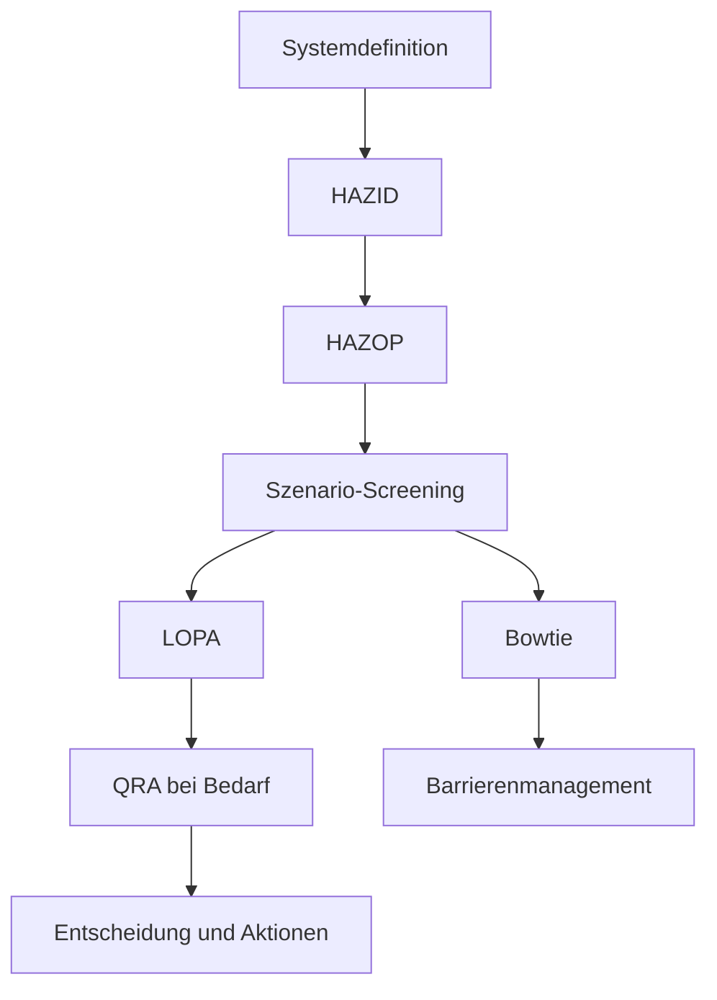



Bei Methoden der Prozesssicherheit ist wichtiger als die Kenntnis vieler Namen, **welche Frage jede Methode beantwortet und was sie an die nächste Analyse weitergibt**. HAZID, HAZOP, LOPA, Bowtie und QRA ersetzen einander nicht; sie sind Werkzeuge verschiedener Auflösung und Zielsetzung.

> Dieser Artikel bietet einen allgemeinen Bildungsüberblick über die Methoden. Tatsächliche Risikobewertungen müssen mit genehmigten Daten und Verfahren durch ein qualifiziertes multidisziplinäres Team erfolgen, das Anlage, geltende Vorschriften und Organisationsstandards kennt.
{: .prompt-warning }

## Die Schlüsselfrage jeder Methode

| Methode | Schlüsselfrage | Typische Ausgabe |
|---|---|---|
| HAZID | Welche Gefahren bestehen? | Gefahrenregister, Prioritäten |
| HAZOP | Wie kann der Prozess von seiner Entwurfsabsicht abweichen? | Ursachen, Folgen, Schutzmaßnahmen und Aktionen je Abweichung |
| LOPA | Reichen die unabhängigen Schutzebenen für das gewählte Szenario aus? | Szenariohäufigkeit, Risikolücke |
| Bowtie | Wie sind Ursachen, Top Event, Folgen und Barrieren zu verwalten? | Barrierenkarte, Degradationskontrollen |
| QRA | Welches Ausmaß und welche Verteilung besitzt das von allen Szenarien erzeugte Risiko? | Ergebnisse individuellen/gesellschaftlichen Risikos, Sensitivität |



## 1. Zuerst die Systemgrenze fixieren

Vor der Analyse wird Folgendes vereinbart.

- einbezogene und ausgeschlossene Ausrüstung sowie Betriebsphasen
- Normalbetrieb, Anfahren, Abfahren, Wartung und Notfallzustände
- Entwurfsabsicht und Sicherheitsgrenzen
- aktuelle Zeichnungen, Ursache-Wirkungs-Dokumentation, Verfahren und Stoffinformationen
- Risikoakzeptanz- und Folgenschwerekriterien
- Teamrollen, Protokollführer, Moderator und Genehmigungsverantwortung

Verschiebt sich die Grenze, unterscheiden sich Häufigkeit und Folgen desselben Szenarios zwischen Analysen. Dokumentrevisionen und Annahmen müssen in jedem Arbeitsblatt rückverfolgbar sein.

## 2. Mit HAZID breit erkunden

HAZID dient der breiten Identifikation von Gefahren vor einer detaillierten Abweichungsanalyse. Systematisch werden Stoffe, Energie, Standort, externe Ereignisse, menschliche und organisatorische Faktoren sowie Betriebsarten geprüft.

Ein gutes Gefahrenregister enthält:

- Gefahr und glaubwürdiges auslösendes Ereignis
- betroffene Menschen, Umwelt und Vermögenswerte
- mögliche Folgen
- Überblick vorhandener Kontrollen
- Unsicherheit und Bedarf weiterer Analyse
- Verantwortlicher, Fälligkeitsdatum und Status

Statt einer zu breiten Aussage wie „Explosionsgefahr“ ist ein Ausdruck, der **Ursache–Ereignis–Auswirkung** verbindet, für die nächste Analyse nützlicher.

## 3. HAZOP vergleicht Entwurfsabsicht und Abweichungen

Analyseeinheit einer HAZOP ist gewöhnlich ein Knoten und Parameter. Nach Klärung der Entwurfsabsicht wendet das Team Leitwörter an, um Abweichungen zu erzeugen.

```text
Node: 분석 경계
Design intent: 무엇이 어떻게 흘러야 하는가
Parameter: flow, pressure, temperature, level, composition 등
Guide word: no, more, less, reverse, other than 등
Deviation: 예) no flow
```

Für jede Abweichung zu erfassende Kernpunkte:

1. Kann die Ursache diese Abweichung tatsächlich erzeugen?
2. Welche Folge tritt ein, wenn keine Schutzmaßnahme als wirksam angenommen wird?
3. Ist jede vorhandene Schutzmaßnahme präventiv oder mindernd?
4. Ist die Schutzmaßnahme von der Ursache unabhängig?
5. Welche Annahmen und Aktionen bleiben ungeprüft?

Die Aussage „der Bediener reagiert“ allein bildet keine Schutzebene. Erforderlich sind Erkennungsfähigkeit, ausreichende Zeit, klares Verfahren, Schulung, Unabhängigkeit und auditierbare Leistung.

## 4. LOPA vereinfacht ein Szenario quantitativ

Für ein ausgewähltes Szenario bewertet LOPA das auslösende Ereignis und unabhängige Schutzebenen (IPLs) stufenweise. Eine übliche Struktur lautet:

$$
f_{scenario}
= f_{initiating}
\times P_{enabling}
\times P_{conditional}
\times \prod_i PFD_i
$$

Notation und Verfahren zur Anwendung von Modifikatoren können je nach Organisationsverfahren abweichen. Wichtiger als die Multiplikation von Zahlen sind Nachweise hinter den Eingaben und ihre Unabhängigkeit.

Um als IPL-Kandidat zu gelten, muss eine Schutzmaßnahme gewöhnlich nachweislich folgende Bedingungen erfüllen.

- spezifisch: Sie verhindert oder mindert tatsächlich das betreffende Szenario.
- unabhängig: Sie hängt weder vom auslösenden Ereignis noch vom Versagen einer anderen IPL ab.
- verlässlich: Ihre Wahrscheinlichkeit, bei Anforderung zu funktionieren, erfüllt einen definierten Standard.
- auditierbar: Ihre Leistung lässt sich durch Entwurf, Prüfungen und Wartungsnachweise bestätigen.

Zwei Schutzmaßnahmen mit gemeinsamem Sensor, gemeinsamer Stromversorgung, Logik oder Armatur dürfen nicht als zwei unabhängige Ebenen doppelt gezählt werden.

## 5. Bowtie zeigt Barrierenverantwortung und Degradation

Im Zentrum einer Bowtie steht das Top Event als Kontrollverlust.

- linke Seite: Bedrohungen und präventive Barrieren
- rechte Seite: Folgen und mindernde Barrieren
- unter den Barrieren: Eskalationsfaktoren und Degradationskontrollen

Eine gute Bowtie ist mit einem Barrierenregister verbunden und nicht bloß ein ansprechendes Diagramm. Jede Barriere erhält Leistungsstandard, Verantwortlichen, Sicherungsaktivität und Kriterien zum Umgang mit Beeinträchtigung.

## 6. QRA benötigt Szenarioqualität vor der Aggregation

QRA aggregiert Risiko durch Verbindung von Freisetzungshäufigkeit, Folgenmodellen und Bedingungen wie Wetter, Bevölkerung und Belegung. Selbst ein komplexes Modell kann präzise falsche Ergebnisse liefern, wenn seine Eingabeszenarien überlappen oder fehlen.

Zu prüfende Punkte:

- Ist die Szenariotaxonomie gegenseitig ausschließend und ausreichend umfassend?
- Sind Häufigkeitsquellen und ihr Anwendungsumfang angemessen?
- Welche validierten Bereiche und Grenzen besitzt das Folgenmodell?
- Wurden bedingte Wahrscheinlichkeit und Belegung doppelt angewandt?
- Welche Unsicherheiten und Sensitivitäten verbergen sich hinter Mittelwerten?
- Verwenden Ergebnisse dieselbe Risikometrik wie Entscheidungskriterien?

Neben einer einzelnen Punktschätzung werden Bereiche, große Unsicherheiten und ergebnisdominierende Annahmen berichtet.

## Dokumentationsgrundsätze zur Verbesserung der Analysequalität

- Fakten, Annahmen, Urteile und Aktionen unterscheiden.
- Folgen vor und nach Anwendung von Schutzmaßnahmen nicht verwechseln.
- Schutzmaßnahme und IPL nicht synonym verwenden.
- Quelle und Anwendungsgrundlage jeder Häufigkeit, PFD und jedes Modifikators erfassen.
- Jede Aktion benötigt Verantwortlichen, Frist und Abschlussnachweis.
- Nach einer Entwurfsänderung betroffene Szenarien und Barrieren erneut prüfen.
- Fragen des Moderators und abweichende Teammeinungen als Teil der Entscheidungsbegründung bewahren.

## Prüfliste zur Verifikation

- [ ] Systemgrenze und Betriebsarten sind ausdrücklich.
- [ ] Aktuelle Eingabedokumente und Revisionen sind rückverfolgbar.
- [ ] Szenarien werden konsistent als Ursache–Top Event–Folge formuliert.
- [ ] Ungeminderte Folgen und Restrisiko werden unterschieden.
- [ ] Funktion und Unabhängigkeit von Schutzmaßnahmen sind durch Nachweise gestützt.
- [ ] Häufigkeits- und Wahrscheinlichkeitswerte besitzen Quellen, Bereiche und Unsicherheit.
- [ ] IPLs wurden aufgrund gemeinsamer Ursachen oder Utilities nicht doppelt gezählt.
- [ ] Extrapolation über den Anwendungsbereich eines Modells hinaus ist gekennzeichnet.
- [ ] Aktionsabschluss wird durch Feld- und Testnachweise statt nur Dokumentation bestätigt.
- [ ] Änderungsmanagement und regelmäßige Prüfungen sind mit dem Barrierenregister verknüpft.

## Häufige Fehler

- Anzahl der Zeilen eines HAZOP-Arbeitsblatts mit Analysequalität verwechseln.
- Scheinbares Risiko verringern, indem eine vorhandene Schutzmaßnahme zwischen Ursache und Folge gesetzt wird.
- Alarme, Bedienerreaktionen und Interlocks ohne Prüfung ihrer Unabhängigkeit als IPLs zählen.
- Unbelegte generische Ausfallwahrscheinlichkeiten kopieren.
- Glauben, ein ausgefeiltes Folgenmodell könne fehlende Szenarien ausgleichen.
- Nicht überprüfbare Aktionen wie „Verfahren stärken“ formulieren.

Die Reife einer Prozesssicherheitsanalyse sollte nicht an der Zahl ihrer Dezimalstellen gemessen werden, sondern daran, **wie vollständig Szenarien, Annahmen, Barrieren und Entscheidungen von Anfang bis Ende rückverfolgbar bleiben**.

## Referenzen

- [UK HSE — LOPA: praktische Anwendung und Fallstricke](https://training.hse.gov.uk/courses/lopa-practical-application-and-pitfalls)
- [UK HSE — Klassifizierung explosionsgefährdeter Bereiche und Kontrolle von Zündquellen](https://www.hse.gov.uk/comah/sragtech/techmeasareaclas.htm)
