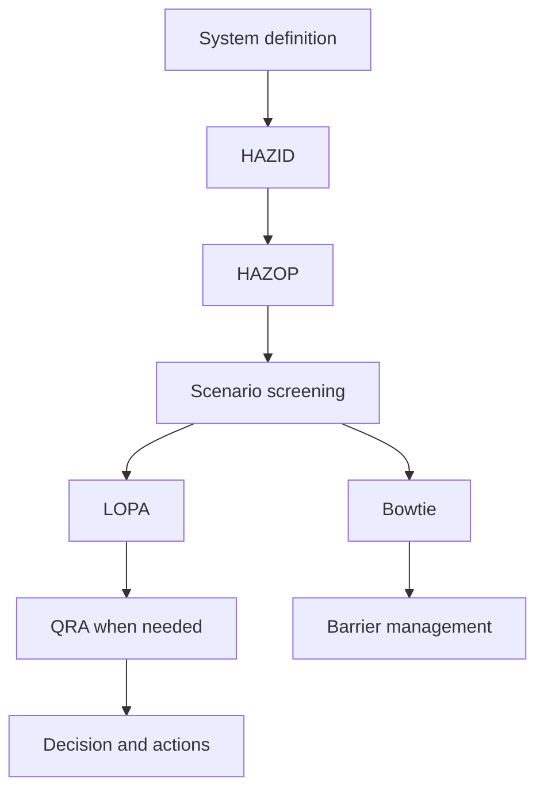



For process-safety methodologies, understanding **which question each method answers and what it passes to the next analysis** matters more than knowing many names. HAZID, HAZOP, LOPA, Bowtie, and QRA are not substitutes for one another; they are tools with different resolutions and purposes.

> This article is a general educational overview of the methodologies. Actual risk assessments must be performed with approved data and procedures by a qualified multidisciplinary team familiar with the facility, applicable regulations, and organizational standards.
{: .prompt-warning }

## The Key Question for Each Method

| Method | Key question | Typical output |
|---|---|---|
| HAZID | What hazards exist? | Hazard register, priorities |
| HAZOP | How can the process deviate from its design intent? | Causes, consequences, safeguards, and actions for each deviation |
| LOPA | Are the independent protection layers for the selected scenario sufficient? | Scenario frequency, risk gap |
| Bowtie | How should causes, the top event, consequences, and barriers be managed? | Barrier map, degradation controls |
| QRA | What are the magnitude and distribution of the risk created by all scenarios? | Individual/societal risk results, sensitivity |



## 1. Fix the System Boundary First

Agree on the following before the analysis.

- Included and excluded equipment and operating phases
- Normal operation, startup, shutdown, maintenance, and emergency states
- Design intent and safety limits
- Current drawings, cause-and-effect documentation, procedures, and material information
- Risk acceptance criteria and consequence-severity criteria
- Team roles, recorder, facilitator, and approval responsibility

If the boundary shifts, the frequency and consequences of the same scenario will differ from one analysis to another. Document revisions and assumptions must be traceable in every worksheet.

## 2. Explore Broadly with HAZID

HAZID is the stage for broadly identifying hazards before detailed deviation analysis. It systematically reviews materials, energy, location, external events, human and organizational factors, and operating modes.

A good hazard register contains the following.

- Hazard and credible initiating event
- Affected people, environment, and assets
- Potential consequences
- An outline of existing controls
- Uncertainty and the need for further analysis
- Owner, due date, and status

Rather than an overly broad statement such as “explosion hazard,” an expression that links **cause–event–impact** is more useful to the next analysis.

## 3. HAZOP Compares Design Intent with Deviations

The unit of analysis in HAZOP is usually a node and parameter. After clarifying the design intent, the team applies guide words to create deviations.

```text
Node: 분석 경계
Design intent: 무엇이 어떻게 흘러야 하는가
Parameter: flow, pressure, temperature, level, composition 등
Guide word: no, more, less, reverse, other than 등
Deviation: 예) no flow
```

Key points to record for each deviation:

1. Can the cause actually create that deviation?
2. What is the consequence if no safeguard is assumed to work?
3. Is each existing safeguard preventive or mitigative?
4. Is the safeguard independent of the cause?
5. Which assumptions and actions remain unverified?

The statement “the operator responds” alone does not constitute a protection layer. Detection capability, sufficient time, a clear procedure, training, independence, and auditable performance are necessary.

## 4. LOPA Quantitatively Simplifies One Scenario

For a screened scenario, LOPA evaluates the initiating event and independent protection layers (IPLs) in stages. A common structure is as follows.

$$
f_{scenario}
= f_{initiating}
\times P_{enabling}
\times P_{conditional}
\times \prod_i PFD_i
$$

The notation and method of applying modifiers can differ according to organizational procedures. What matters more than multiplying numbers is the evidence behind the inputs and their independence.

To qualify as an IPL candidate, a safeguard must ordinarily be demonstrated to meet the following conditions.

- specific: It actually prevents or mitigates the scenario in question.
- independent: It does not depend on the initiating event or the failure of another IPL.
- dependable: Its probability of performing on demand satisfies a defined standard.
- auditable: Its performance can be confirmed through design, testing, and maintenance records.

Two safeguards that share the same sensor, power supply, logic, or valve must not be double-counted as two independent layers.

## 5. Bowtie Shows Barrier Ownership and Degradation

At the center of a Bowtie is the top event, representing a loss of control.

- Left side: Threats and preventive barriers
- Right side: Consequences and mitigative barriers
- Beneath the barriers: Escalation factors and degradation controls

A good Bowtie is connected to a barrier register, rather than merely being an attractive diagram. Each barrier is assigned a performance standard, owner, assurance activity, and criteria for managing impairment.

## 6. QRA Requires Scenario Quality Before Aggregation

QRA aggregates risk by combining release frequency, consequence models, and conditions such as weather, population, and occupancy. Even a complex model can produce precisely wrong results when its input scenarios overlap or are missing.

Items to review:

- Is the scenario taxonomy mutually exclusive and sufficiently comprehensive?
- Are the frequency sources and their scope of application appropriate?
- What are the validated range and limitations of the consequence model?
- Have conditional probability and occupancy been applied twice?
- What uncertainties and sensitivity are hidden behind average values?
- Do the results use the same risk metric as the decision criteria?

Report ranges, major uncertainties, and assumptions that dominate the results together with, rather than only, a single point estimate.

## Documentation Principles That Improve Analysis Quality

- Distinguish facts, assumptions, judgments, and actions.
- Do not confuse consequences before and after applying safeguards.
- Do not use safeguard and IPL as synonyms.
- Record the source and basis of applicability for every frequency, PFD, and modifier.
- Every action must have an owner, due date, and closure evidence.
- After a design change, review the affected scenarios and barriers again.
- Preserve the facilitator's questions and the team's dissenting opinions as part of the rationale for decisions.

## Verification Checklist

- [ ] The system boundary and operating modes are explicit.
- [ ] Current input documents and their revisions are traceable.
- [ ] Scenarios are written consistently as cause–top event–consequence.
- [ ] Unmitigated consequences and residual risk are distinguished.
- [ ] The function and independence of safeguards are supported by evidence.
- [ ] Frequency and probability values have sources, ranges, and uncertainty.
- [ ] IPLs have not been double-counted due to common causes or shared utilities.
- [ ] Extrapolation beyond a model's scope of application is identified.
- [ ] Action closure is confirmed by field and test evidence, not only by documentation.
- [ ] Management of change and periodic reviews are linked to the barrier register.

## Common Failures

- Mistaking the number of rows in a HAZOP worksheet for analysis quality.
- Reducing the apparent risk by placing an existing safeguard between the cause and consequence.
- Counting alarms, operator responses, and interlocks as IPLs without reviewing their independence.
- Copying unsupported generic failure probabilities.
- Believing that a sophisticated consequence model can compensate for missing scenarios.
- Writing unverifiable actions such as “strengthen procedures.”

The maturity of a process-safety analysis should be judged not by the number of decimal places in its results, but by **how thoroughly its scenarios, assumptions, barriers, and decisions remain traceable from beginning to end**.

## References

- [UK HSE — LOPA: Practical application and pitfalls](https://training.hse.gov.uk/courses/lopa-practical-application-and-pitfalls)
- [UK HSE — Hazardous Area Classification and Control of Ignition Sources](https://www.hse.gov.uk/comah/sragtech/techmeasareaclas.htm)
