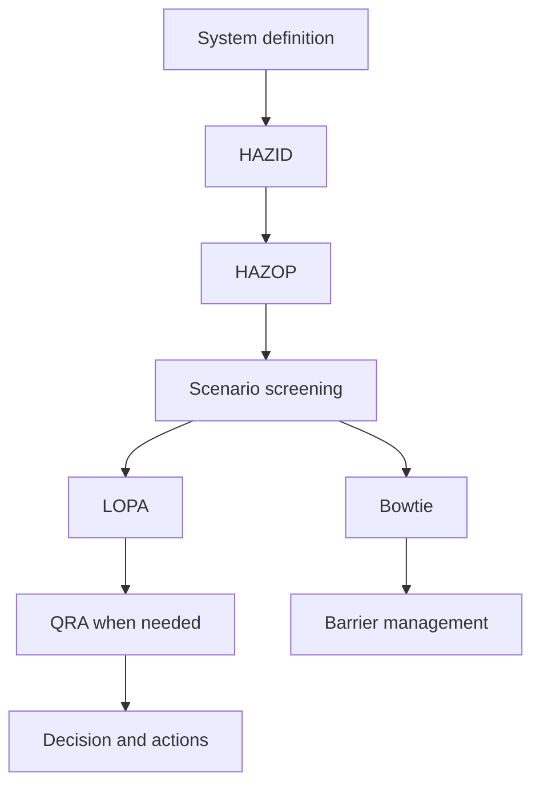



Para las metodologías de seguridad de procesos, comprender **qué pregunta responde cada método y qué pasa al siguiente análisis** es más importante que conocer muchos nombres. HAZID, HAZOP, LOPA, Bowtie y QRA no se sustituyen entre sí; son herramientas con diferentes resoluciones y propósitos.

> Este artículo es una descripción educativa general de las metodologías. Las evaluaciones de riesgos reales deben realizarse con datos y procedimientos aprobados por un equipo multidisciplinario calificado y familiarizado con las instalaciones, las regulaciones aplicables y los estándares organizacionales.
{: .prompt-warning }

## La pregunta clave para cada método

| Método | Pregunta clave | Salida típica |
|---|---|---|
| HAZID | ¿Qué peligros existen? | Registro de peligros, prioridades |
| HAZOP | ¿Cómo puede el proceso desviarse de su intención de diseño? | Causas, consecuencias, salvaguardas y acciones de cada desviación |
| LOPA | ¿Son suficientes las capas de protección independientes para el escenario seleccionado? | Frecuencia de escenarios, brecha de riesgo |
| Bowtie | ¿Cómo deberían gestionarse las causas, el evento principal, las consecuencias y las barreras? | Mapa de barreras, controles de degradación |
| QRA | ¿Cuáles son la magnitud y distribución del riesgo creado por todos los escenarios? | Resultados de riesgo individual/social, sensibilidad |



## 1. Primero arregle el límite del sistema

Acuerde lo siguiente antes del análisis.

- Equipos y fases de operación incluidos y excluidos
- Operación normal, arranque, parada, mantenimiento y estados de emergencia.
- Intención de diseño y límites de seguridad.
- Dibujos actuales, documentación de causa y efecto, procedimientos e información material.
- Criterios de aceptación de riesgos y criterios de gravedad de consecuencias.
- Roles de equipo, registrador, facilitador y responsabilidad de aprobación.

Si los límites cambian, la frecuencia y las consecuencias del mismo escenario diferirán de un análisis a otro. Las revisiones y suposiciones de los documentos deben poder rastrearse en cada hoja de trabajo.

## 2. Explora ampliamente con HAZID

HAZID es la etapa para identificar ampliamente los peligros antes del análisis detallado de la desviación. Revisa sistemáticamente materiales, energía, ubicación, eventos externos, factores humanos y organizacionales y modos de operación.

Un buen registro de peligros contiene lo siguiente.

- Peligro y evento iniciador creíble.
- Personas, medio ambiente y activos afectados
- Consecuencias potenciales
- Un resumen de los controles existentes.
- Incertidumbre y necesidad de análisis adicionales
- Propietario, fecha de vencimiento y estado.

En lugar de una afirmación demasiado amplia como “peligro de explosión”, una expresión que vincule **causa-evento-impacto** es más útil para el siguiente análisis.

## 3. HAZOP Compara la intención del diseño con las desviaciones

La unidad de análisis en HAZOP suele ser un nodo y un parámetro. Después de aclarar la intención del diseño, el equipo aplica palabras guía para crear desviaciones.

```text
Node: 분석 경계
Design intent: 무엇이 어떻게 흘러야 하는가
Parameter: flow, pressure, temperature, level, composition 등
Guide word: no, more, less, reverse, other than 등
Deviation: 예) no flow
```

Puntos clave a registrar para cada desviación:

1. ¿Puede la causa realmente crear esa desviación?
2. ¿Cuál es la consecuencia si se supone que ninguna salvaguarda funciona?
3. ¿Cada salvaguardia existente es preventiva o mitigativa?
4. ¿La salvaguarda es independiente de la causa?
5. ¿Qué supuestos y acciones quedan sin verificar?

La afirmación “el operador responde” por sí sola no constituye una capa de protección. Son necesarios capacidad de detección, tiempo suficiente, un procedimiento claro, formación, independencia y desempeño auditable.

## 4. LOPA Simplifica cuantitativamente un escenario

Para un escenario filtrado, LOPA evalúa el evento iniciador y las capas de protección independientes (IPL) por etapas. Una estructura común es la siguiente.

$$
f_{scenario}
= f_{initiating}
\times P_{enabling}
\times P_{conditional}
\times \prod_i PFD_i
$$

La notación y el método de aplicación de los modificadores pueden diferir según los procedimientos organizativos. Lo que importa más que multiplicar números es la evidencia detrás de los insumos y su independencia.

Para calificar como candidato IPL, normalmente se debe demostrar que una protección cumple con las siguientes condiciones.

- específico: Previene o mitiga efectivamente el escenario en cuestión.
- independiente: No depende del evento iniciador ni del fallo de otro IPL.
- confiable: Su probabilidad de funcionar bajo demanda satisface un estándar definido.
- auditable: Su desempeño puede confirmarse mediante registros de diseño, pruebas y mantenimiento.

Dos salvaguardas que comparten el mismo sensor, fuente de alimentación, lógica o válvula no deben contarse dos veces como dos capas independientes.

## 5. Bowtie Muestra la propiedad y degradación de la barrera

En el centro de Bowtie está el evento superior, que representa una pérdida de control.

- Lado izquierdo: Amenazas y barreras preventivas
- Lado derecho: Consecuencias y barreras mitigantes
- Debajo de las barreras: factores de escalada y controles de degradación.

Un buen Bowtie está conectado a un registro de barrera, en lugar de ser simplemente un diagrama atractivo. A cada barrera se le asigna un estándar de desempeño, un propietario, una actividad de aseguramiento y criterios para manejar el deterioro.

## 6. QRA Requiere calidad del escenario antes de la agregación

QRA agrega el riesgo combinando la frecuencia de liberación, los modelos de consecuencias y condiciones como el clima, la población y la ocupación. Incluso un modelo complejo puede producir resultados precisamente erróneos cuando sus escenarios de entrada se superponen o faltan.

Elementos a revisar:

- ¿Es la taxonomía de escenarios mutuamente excluyente y suficientemente completa?
- ¿Son adecuadas las fuentes de frecuencia y su ámbito de aplicación?
- ¿Cuáles son el rango validado y las limitaciones del modelo de consecuencias?
- ¿Se han aplicado dos veces las condiciones de probabilidad y ocupación condicionales?
- ¿Qué incertidumbres y sensibilidades se esconden detrás de los valores medios?
- ¿Los resultados utilizan la misma métrica de riesgo que los criterios de decisión?

Informe los rangos, las principales incertidumbres y los supuestos que dominan los resultados junto con, en lugar de solo, una estimación puntual única.

## Principios de documentación que mejoran la calidad del análisis

- Distinguir hechos, suposiciones, juicios y acciones.
- No confundir consecuencias antes y después de aplicar salvaguardas.
- No utilices salvaguardia y IPL como sinónimos.
- Registre la fuente y la base de aplicabilidad para cada frecuencia, PFD y modificador.
- Toda acción debe tener dueño, fecha de vencimiento y evidencia de cierre.
- Después de un cambio de diseño, revisar nuevamente los escenarios y barreras afectados.
- Preservar las preguntas del facilitador y las opiniones disidentes del equipo como parte de la justificación de las decisiones.

## Lista de verificación de verificación

- [ ] Los límites del sistema y los modos de funcionamiento son explícitos.
- [ ] Los documentos de entrada actuales y sus revisiones son rastreables.
- [ ] Los escenarios se escriben consistentemente como causa-evento principal-consecuencia.
- [ ] Se distinguen consecuencias absolutas y riesgo residual.
- [ ] La función e independencia de las salvaguardas están respaldadas por evidencia.
- [ ] Los valores de frecuencia y probabilidad tienen fuentes, rangos e incertidumbre.
- [ ] Las IPL no se han contabilizado dos veces debido a causas comunes o utilidades compartidas.
- [ ] Se identifica la extrapolación más allá del ámbito de aplicación de un modelo.
- [ ] El cierre de la acción se confirma mediante evidencia de campo y pruebas, no solo mediante documentación.
- [ ] La gestión del cambio y las revisiones periódicas están vinculadas al registro de barreras.

## Fallos comunes

- Confundir el número de filas en una hoja de trabajo HAZOP con la calidad del análisis.
- Reducir el riesgo aparente colocando una salvaguarda existente entre la causa y la consecuencia.
- Contar alarmas, respuestas de operadores y enclavamientos como IPL sin revisar su independencia.
- Copiar probabilidades de fallo genéricas no soportadas.
- Creer que un modelo de consecuencias sofisticado puede compensar los escenarios faltantes.
- Redacción de acciones no verificables como “fortalecer procedimientos”.

La madurez de un análisis de seguridad de procesos debe juzgarse no por el número de decimales en sus resultados, sino por **cuán minuciosamente sus escenarios, suposiciones, barreras y decisiones siguen siendo rastreables de principio a fin**.

## Referencias

- [UK HSE — LOPA: Aplicación práctica y dificultades](https://training.hse.gov.uk/courses/lopa-practical-application-and-pitfalls)
- [UK HSE — Clasificación de áreas peligrosas y control de fuentes de ignición](https://www.hse.gov.uk/comah/sragtech/techmeasareaclas.htm)
