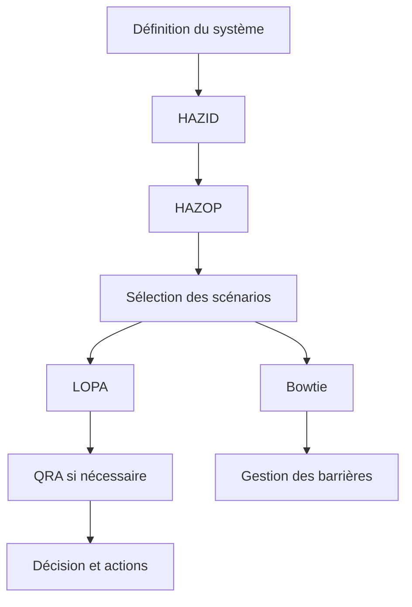



En matière de sécurité des procédés, il importe moins de connaître beaucoup de noms de méthodes que de **comprendre à quelle question chacune répond et ce qu'elle transmet à l'analyse suivante**. HAZID, HAZOP, LOPA, Bowtie et QRA ne sont pas des méthodes interchangeables, mais des outils ayant des résolutions et des objectifs différents.

> Cet article est une présentation méthodologique générale à visée pédagogique. Toute évaluation réelle des risques doit être menée, à partir de documents et de procédures approuvés, par une équipe pluridisciplinaire qualifiée connaissant l'installation, la réglementation et les normes de l'organisation concernées.
{: .prompt-warning }

## Question essentielle de chaque méthode

| Méthode | Question essentielle | Livrable type |
|---|---|---|
| HAZID | Quelles sources de danger existent ? | Registre des dangers, priorités |
| HAZOP | De quelles manières le procédé peut-il s'écarter de l'intention de conception ? | Causes, conséquences, mesures de protection et actions par déviation |
| LOPA | Les couches de protection indépendantes du scénario retenu sont-elles suffisantes ? | Fréquence du scénario, écart par rapport au risque cible |
| Bowtie | Comment gérer les causes, l'événement redouté central, les conséquences et les barrières ? | Carte des barrières, mesures de maîtrise de leur dégradation |
| QRA | Quelle est l'ampleur et la distribution du risque produit par l'ensemble des scénarios ? | Résultats du risque individuel et sociétal, sensibilité |



## 1. Fixer d'abord les limites du système

Avant l'analyse, convenez des éléments suivants.

- Équipements inclus et exclus, et phases d'exploitation
- États normal, de démarrage, d'arrêt, de maintenance et d'urgence
- Intention de conception et limites de sécurité
- Plans à jour, matrices de causes et d'effets, procédures et informations sur les substances
- Critères d'acceptation du risque et critères de gravité des conséquences
- Rôles dans l'équipe, rédacteur, animateur et responsable de l'approbation

Si les limites varient, la fréquence et les conséquences d'un même scénario changeront d'une analyse à l'autre. La révision des documents et les hypothèses doivent être traçables dans chaque feuille de travail.

## 2. Explorer largement avec HAZID

HAZID consiste à rechercher largement les sources de danger avant l'analyse détaillée des déviations. Cette méthode examine systématiquement les substances, les énergies, les emplacements, les événements externes, les facteurs humains et organisationnels ainsi que les modes d'exploitation.

Un bon registre des dangers comporte les éléments suivants.

- Danger et événement initiateur crédible
- Personnes, environnement et actifs concernés
- Conséquences potentielles
- Aperçu des mesures de maîtrise existantes
- Incertitudes et besoin d'analyses complémentaires
- Responsable, échéance et état d'avancement

Une formulation reliant **cause, événement et impact** est plus utile pour l'analyse suivante qu'un énoncé trop général tel que « risque d'explosion ».

## 3. HAZOP compare l'intention de conception aux déviations

Dans une HAZOP, l'unité d'analyse est généralement un nœud associé à un paramètre. Après avoir explicité l'intention de conception, l'équipe applique des mots-guides pour construire des déviations.

```text
Node: 분석 경계
Design intent: 무엇이 어떻게 흘러야 하는가
Parameter: flow, pressure, temperature, level, composition 등
Guide word: no, more, less, reverse, other than 등
Deviation: 예) no flow
```

Pour chaque déviation, les points essentiels à consigner sont les suivants.

1. La cause peut-elle réellement produire cette déviation ?
2. Quelle serait la conséquence en supposant qu'aucune mesure de protection ne fonctionne ?
3. Les mesures de protection existantes sont-elles préventives ou atténuatrices ?
4. La mesure de protection est-elle indépendante de la cause ?
5. Quelles hypothèses non vérifiées et quelles actions subsistent ?

La seule phrase « l'opérateur intervient » ne suffit pas à constituer une couche de protection. Il faut des moyens de détection, un délai suffisant, une procédure claire, une formation, une indépendance et des performances vérifiables par audit.

## 4. LOPA simplifie quantitativement un scénario

Pour un scénario sélectionné, LOPA évalue par étapes l'événement initiateur et les couches de protection indépendantes (IPL). La structure générale est la suivante.

$$
f_{scenario}
= f_{initiating}
\times P_{enabling}
\times P_{conditional}
\times \prod_i PFD_i
$$

Les symboles et la façon d'appliquer les modificateurs peuvent varier selon la procédure de l'organisation. L'essentiel n'est pas la multiplication des nombres, mais la justification des entrées et de leur indépendance.

Pour être retenu comme IPL, un dispositif candidat doit généralement démontrer les propriétés suivantes.

- Spécifique : il empêche ou atténue effectivement le scénario concerné.
- Indépendant : il ne dépend ni de l'événement initiateur ni de la défaillance d'une autre IPL.
- Fiable : sa probabilité de fournir la performance attendue lorsqu'il est sollicité satisfait à un critère défini.
- Auditable : sa performance peut être vérifiée au moyen des dossiers de conception, d'essai et de maintenance.

Deux mesures de protection partageant le même capteur, la même alimentation, la même logique ou la même vanne ne doivent pas être comptées deux fois comme deux couches indépendantes.

## 5. Bowtie rend visibles la responsabilité des barrières et leur dégradation

Au centre d'un Bowtie se trouve l'événement redouté central, qui représente la perte de maîtrise.

- À gauche : menaces et barrières préventives
- À droite : conséquences et barrières d'atténuation
- Sous les barrières : facteurs d'aggravation et mesures de maîtrise de la dégradation

Un bon Bowtie n'est pas un joli schéma : il est relié à un registre des barrières. Pour chaque barrière, il définit une norme de performance, un responsable, une activité d'assurance et des critères de traitement en cas d'indisponibilité.

## 6. La QRA exige des scénarios de qualité avant toute agrégation

La QRA agrège les risques en combinant la fréquence des rejets, les modèles de conséquences et des conditions telles que la météo, la population et l'occupation des lieux. Même avec un modèle complexe, si les scénarios d'entrée sont dupliqués ou incomplets, le résultat peut être faux avec une grande précision apparente.

Points à examiner :

- La taxonomie des scénarios est-elle mutuellement exclusive et suffisamment complète ?
- La source des fréquences et son domaine d'application sont-ils adaptés ?
- Quel est le domaine de validation du modèle de conséquences et quelles en sont les limites ?
- Les probabilités conditionnelles et l'occupation des lieux n'ont-elles pas été appliquées deux fois ?
- Quelles incertitudes et hypothèses dominantes se cachent derrière les valeurs moyennes ?
- Les résultats emploient-ils la même métrique de risque que les critères de décision ?

Présentez une plage, les principales incertitudes et les hypothèses qui dominent le résultat, plutôt qu'une seule estimation ponctuelle.

## Principes de consignation pour améliorer la qualité de l'analyse

- Distinguez les faits, les hypothèses, les jugements et les actions.
- Ne confondez pas les conséquences avant et après l'application des mesures de protection.
- N'employez pas « mesure de protection » et « IPL » comme des synonymes.
- Conservez, pour chaque fréquence, PFD et modificateur, la source et la justification de son application.
- Toute action doit avoir un responsable, une échéance et une preuve de clôture.
- Après une modification de conception, réexaminez les scénarios et les barrières concernés.
- Conservez comme fondements de la décision les questions de l'animateur et les avis divergents de l'équipe.

## Liste de contrôle de la vérification

- [ ] Les limites du système et les modes d'exploitation sont explicités.
- [ ] Les documents d'entrée à jour et leur révision sont traçables.
- [ ] Les scénarios sont formulés de manière cohérente sous la forme cause–événement redouté central–conséquence.
- [ ] Les conséquences sans atténuation et le risque résiduel sont distingués.
- [ ] La fonction et l'indépendance des mesures de protection sont étayées par des preuves.
- [ ] Les valeurs de fréquence et de probabilité sont accompagnées de leur source, de leur plage et de leur incertitude.
- [ ] Les IPL ne sont pas comptées deux fois en présence d'une cause commune ou d'un service auxiliaire commun.
- [ ] Toute extrapolation hors du domaine d'application du modèle est signalée.
- [ ] La clôture d'une action est confirmée non seulement par des documents, mais aussi par des preuves de terrain ou d'essai.
- [ ] La gestion des modifications et les réexamens périodiques sont reliés au registre des barrières.

## Échecs fréquents

- Confondre le nombre de lignes d'une feuille de travail HAZOP avec la qualité de l'analyse.
- Introduire une mesure de protection entre la cause et la conséquence et réduire ainsi artificiellement le risque.
- Compter les alarmes, les interventions des opérateurs et les interverrouillages comme autant d'IPL sans examiner leur indépendance.
- Copier une probabilité de défaillance générique sans fondement.
- Croire qu'un modèle de conséquences sophistiqué peut compenser des scénarios manquants.
- Formuler une action de manière invérifiable, par exemple « renforcer la procédure ».

La maturité d'une analyse de sécurité des procédés ne doit pas être jugée au nombre de décimales de ses chiffres, mais au **degré de traçabilité de bout en bout des scénarios, des hypothèses, des barrières et des décisions**.

## Références

- [UK HSE — LOPA: Practical application and pitfalls](https://training.hse.gov.uk/courses/lopa-practical-application-and-pitfalls)
- [UK HSE — Hazardous Area Classification and Control of Ignition Sources](https://www.hse.gov.uk/comah/sragtech/techmeasareaclas.htm)
