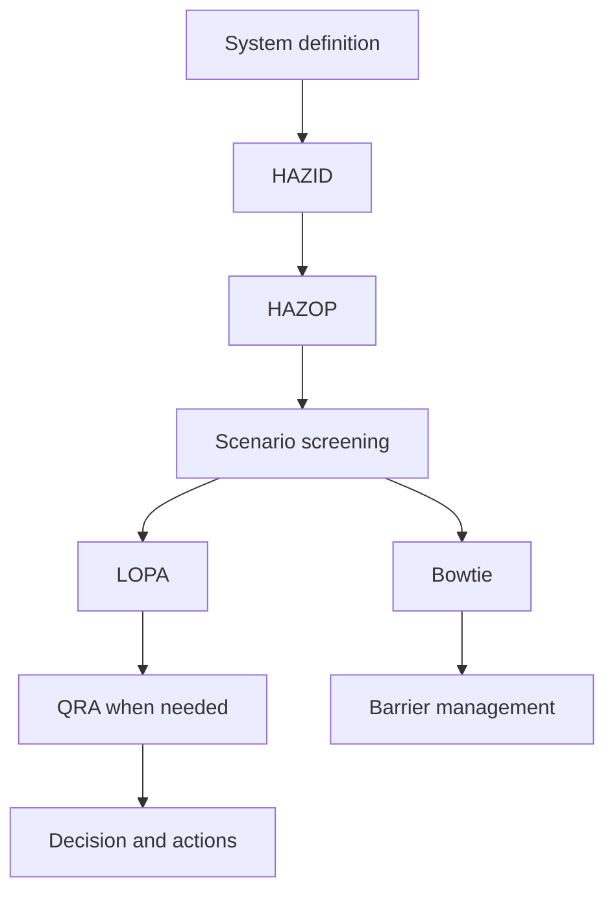



プロセス安全の手法では、名称を数多く知ることよりも、**各手法がどの問いに答え、次の分析へ何を引き渡すのか**を理解することが重要である。HAZID、HAZOP、LOPA、Bowtie、QRAは相互に代替するものではなく、解像度と目的が異なるツールである。

> 本稿は、一般的な学習を目的とした方法論の整理である。実際のリスク評価は、対象設備・法規・組織基準を理解する有資格の多分野チームが、承認済みの資料と手順に基づいて実施しなければならない。
{: .prompt-warning }

## 手法ごとの中心的な問い

| 手法 | 中心的な問い | 代表的な成果物 |
|---|---|---|
| HAZID | どのようなハザード源が存在するか | hazard register、優先順位 |
| HAZOP | 設計意図からどのように逸脱し得るか | deviationごとの原因・結果・safeguard・措置 |
| LOPA | 選定したシナリオに対する独立防護層は十分か | scenario frequency、risk gap |
| Bowtie | 原因–top event–結果とbarrierをどのように管理するか | barrier map、degradation controls |
| QRA | 全シナリオが生み出すリスクの規模と分布は何か | individual/societal riskの結果、感度 |



## 1. まずシステム境界を固定する

分析に先立ち、次の事項について合意する。

- 対象に含める設備・除外する設備、および運転段階
- 通常運転、startup、shutdown、maintenance、緊急状態
- 設計意図と安全限界
- 最新の図面、cause-and-effect、手順書、物質情報
- リスク受容基準とconsequence severity基準
- チームの役割、記録担当者、facilitator、承認責任者

境界が揺らぐと、同一シナリオの頻度と結果が分析ごとに変わる。文書のrevisionと仮定は、すべてのworksheetから追跡できなければならない。

## 2. HAZIDで広く探索する

HAZIDは、詳細な偏差分析に入る前にハザード源を幅広く抽出する段階である。物質、エネルギー、立地、外部事象、人的・組織的要因、運転モードを体系的に検討する。

優れたhazard registerには、次の項目が含まれる。

- hazardとcredible initiating event
- 影響を受ける人・環境・資産
- 潜在的consequence
- 既存controlの概要
- 不確実性と追加分析の必要性
- 担当者・期限・状態

「爆発リスク」のように広すぎる表現よりも、**原因–事象–影響**が連なる表現の方が後続分析に役立つ。

## 3. HAZOPでは設計意図と偏差を比較する

HAZOPの分析単位は、通常nodeとparameterである。チームは設計意図を明確にしたうえでguide wordを適用し、deviationを作成する。

```text
Node: 분석 경계
Design intent: 무엇이 어떻게 흘러야 하는가
Parameter: flow, pressure, temperature, level, composition 등
Guide word: no, more, less, reverse, other than 등
Deviation: 예) no flow
```

各deviationについて記録すべき要点は次のとおりである。

1. その原因は、実際に当該偏差を生じさせ得るか。
2. safeguardが一切作動しないと仮定した場合、consequenceは何か。
3. 既存safeguardは予防的か、緩和的か。
4. safeguardは原因から独立しているか。
5. 未検証の仮定とactionは何か。

「運転員が対応する」という記述だけでは、防護層とはならない。検知手段、十分な対応時間、明確な手順、訓練、独立性、監査可能な性能が必要である。

## 4. LOPAでは一つのシナリオを定量的に簡略化する

LOPAは、選定されたシナリオについてinitiating eventとindependent protection layer（IPL）を段階的に評価する。一般的な構造は次のとおりである。

$$
f_{scenario}
= f_{initiating}
\times P_{enabling}
\times P_{conditional}
\times \prod_i PFD_i
$$

記号とmodifierの適用方法は、組織の手順によって異なり得る。重要なのは数値を掛け合わせる行為そのものではなく、入力値の根拠と独立性である。

IPL候補として認めるには、通常、次の事項を立証しなければならない。

- specific：対象シナリオを実際に防止または緩和する。
- independent：initiating eventおよび他のIPLの故障に依存しない。
- dependable：要求時に性能を発揮する確率が、定められた基準を満たす。
- auditable：設計・試験・保守の記録から性能を確認できる。

同一のsensor、電源、logic、valveを共有する二つのsafeguardを、独立した二つの層として二重計上してはならない。

## 5. Bowtieはbarrierの所有者と劣化を可視化する

Bowtieの中央には、制御喪失を表すtop eventが置かれる。

- 左側：threatとpreventive barrier
- 右側：consequenceとmitigative barrier
- barrierの下：escalation factorとdegradation control

優れたBowtieは、見栄えのよい図にとどまらずbarrier registerへ接続される。各barrierについてperformance standard、owner、assurance activity、機能不全時の取扱基準を定める。

## 6. QRAは集計に先立ってシナリオ品質を要求する

QRAは、release frequency、consequence model、気象・人口・occupancyなどの条件を組み合わせてリスクを集計する。複雑なモデルを使っても、入力シナリオが重複または欠落していれば、結果は精緻に誤ったものとなり得る。

検討事項は次のとおりである。

- scenario taxonomyは相互排他的で、かつ十分に網羅されているか。
- frequencyの出典と適用範囲は適切か。
- consequence modelの検証範囲と限界は何か。
- conditional probabilityとoccupancyが二重適用されていないか。
- 平均値の背後に隠れた不確実性と感度は何か。
- 結果は意思決定基準と同じrisk metricを用いているか。

単一のpoint estimateだけでなく、範囲、主要な不確実性、結果を支配する仮定も併せて報告する。

## 分析品質を高める記録原則

- 事実、仮定、判断、actionを区別する。
- consequenceについて、safeguard適用前と適用後を混同しない。
- safeguardとIPLを同義語として扱わない。
- 頻度・PFD・modifierごとに出典と適用根拠を残す。
- actionにはowner、due date、closure evidenceが必要である。
- 設計変更後、影響を受けたscenarioとbarrierを再検討する。
- facilitatorの質問やチーム内の反対意見も、判断根拠として保存する。

## 検証チェックリスト

- [ ] システム境界と運転モードが明記されている。
- [ ] 最新の入力文書とrevisionを追跡できる。
- [ ] シナリオが原因–top event–consequenceの形で一貫して記述されている。
- [ ] unmitigated consequenceとresidual riskが区別されている。
- [ ] safeguardの機能と独立性が根拠によって確認されている。
- [ ] 頻度と確率の数値に、出典・範囲・不確実性が付されている。
- [ ] 共通原因・共通utilityによってIPLを二重計上していない。
- [ ] モデルの適用範囲を外れた外挿が明示されている。
- [ ] actionのclosureが、文書だけでなく現場・試験のエビデンスによって確認されている。
- [ ] 変更管理と定期的な再検討がbarrier registerへ接続されている。

## よくある失敗

- HAZOP worksheetの行数を分析品質だと誤認する。
- 原因とconsequenceの間に既にsafeguardを織り込み、リスクを過小評価する。
- alarm、運転員対応、interlockを、独立性の検討なしにすべてIPLとして数える。
- 根拠のないgeneric failure probabilityを転用する。
- 精緻なconsequence modelによってscenarioの欠落を補えると考える。
- actionを「手順強化」のような検証不能な表現で記述する。

プロセス安全分析の成熟度は、数値の小数点以下の桁数ではなく、**シナリオ・仮定・barrier・意思決定が最後まで追跡できる度合い**によって評価すべきである。

## 参考資料

- [UK HSE — LOPA: Practical application and pitfalls](https://training.hse.gov.uk/courses/lopa-practical-application-and-pitfalls)
- [UK HSE — Hazardous Area Classification and Control of Ignition Sources](https://www.hse.gov.uk/comah/sragtech/techmeasareaclas.htm)
