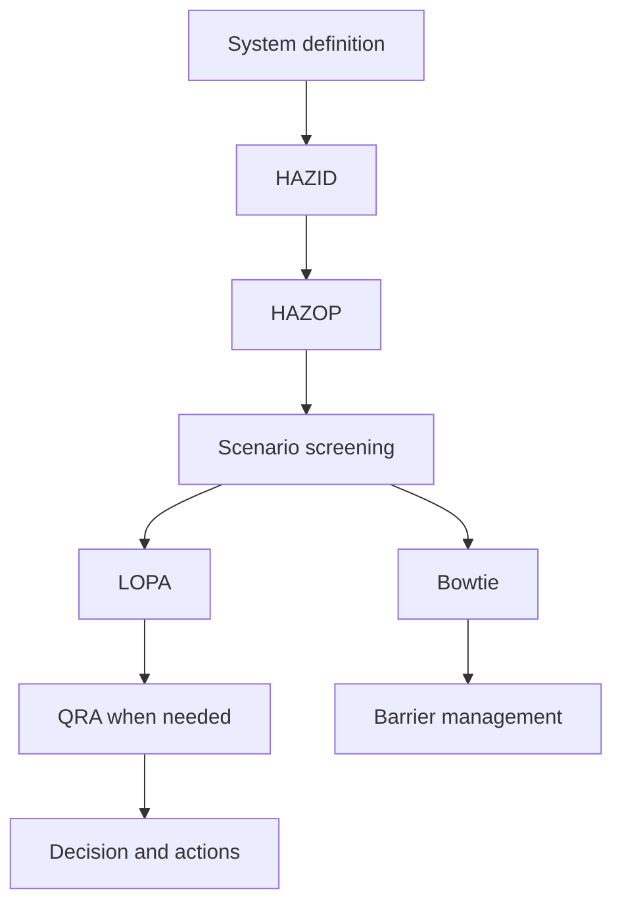



공정안전 방법론은 이름을 많이 아는 것보다 **각 방법이 어떤 질문에 답하고, 다음 분석에 무엇을 넘기는지** 이해하는 것이 중요하다. HAZID, HAZOP, LOPA, Bowtie, QRA는 서로 대체재가 아니라 해상도와 목적이 다른 도구다.

> 이 글은 일반적인 학습용 방법론 정리다. 실제 위험성평가는 해당 설비·법규·조직 기준을 이해하는 자격 있는 다학제 팀이 승인된 자료와 절차로 수행해야 한다.
{: .prompt-warning }

## 방법별 핵심 질문

| 방법 | 핵심 질문 | 대표 산출물 |
|---|---|---|
| HAZID | 어떤 위험원이 존재하는가 | hazard register, 우선순위 |
| HAZOP | 설계 의도에서 어떻게 벗어날 수 있는가 | deviation별 원인·결과·safeguard·조치 |
| LOPA | 선택한 시나리오의 독립 보호계층이 충분한가 | scenario frequency, risk gap |
| Bowtie | 원인–top event–결과와 barrier를 어떻게 관리하는가 | barrier map, degradation controls |
| QRA | 전체 시나리오가 만드는 위험의 규모와 분포는 무엇인가 | individual/societal risk 결과, 민감도 |



## 1. 시스템 경계를 먼저 고정한다

분석 전에 다음을 합의한다.

- 포함·제외 설비와 운전 단계
- 정상, startup, shutdown, maintenance, 비상 상태
- 설계 의도와 안전 한계
- 최신 도면, cause-and-effect, 절차, 물질 정보
- 위험 수용 기준과 consequence severity 기준
- 팀 역할, 기록자, facilitator, 승인 책임

경계가 흔들리면 같은 시나리오의 빈도와 결과가 분석마다 달라진다. 문서 revision과 가정은 모든 worksheet에 추적 가능해야 한다.

## 2. HAZID로 넓게 탐색한다

HAZID는 상세 편차 분석 전에 위험원을 넓게 찾는 단계다. 물질, 에너지, 위치, 외부 사건, 인적·조직 요인, 운전 모드를 체계적으로 검토한다.

좋은 hazard register에는 다음이 있다.

- hazard와 credible initiating event
- 영향을 받는 사람·환경·자산
- 잠재 consequence
- 기존 control의 개요
- 불확실성과 추가 분석 필요성
- 담당자·기한·상태

“폭발 위험”처럼 너무 넓은 문장보다 **원인–사건–영향**이 이어지는 표현이 다음 분석에 유용하다.

## 3. HAZOP은 설계 의도와 편차를 비교한다

HAZOP의 분석 단위는 보통 node와 parameter다. 팀은 설계 의도를 명확히 한 뒤 guide word를 적용해 deviation을 만든다.

```text
Node: 분석 경계
Design intent: 무엇이 어떻게 흘러야 하는가
Parameter: flow, pressure, temperature, level, composition 등
Guide word: no, more, less, reverse, other than 등
Deviation: 예) no flow
```

각 deviation에서 기록할 핵심:

1. 원인이 실제로 그 편차를 만들 수 있는가?
2. 아무 safeguard도 작동하지 않는다고 볼 때 consequence는 무엇인가?
3. 기존 safeguard는 예방인지 완화인지?
4. safeguard가 원인과 독립적인가?
5. 검증되지 않은 가정과 action은 무엇인가?

“운전자가 대응한다”는 문장만으로 보호계층이 되는 것은 아니다. 탐지 수단, 충분한 시간, 명확한 절차, 훈련, 독립성, 감사 가능한 성능이 필요하다.

## 4. LOPA는 한 시나리오를 정량적으로 단순화한다

LOPA는 선별된 시나리오에 대해 initiating event와 independent protection layer(IPL)를 단계적으로 평가한다. 일반적인 구조는 다음과 같다.

$$
f_{scenario}
= f_{initiating}
\times P_{enabling}
\times P_{conditional}
\times \prod_i PFD_i
$$

기호와 modifier 적용 방식은 조직 절차에 따라 달라질 수 있다. 중요한 것은 숫자를 곱하는 행위보다 입력의 근거와 독립성이다.

IPL 후보가 되려면 보통 다음을 입증해야 한다.

- specific: 해당 시나리오를 실제로 막거나 완화한다.
- independent: initiating event와 다른 IPL의 실패에 종속되지 않는다.
- dependable: 요구 시 성능을 낼 가능성이 정해진 기준을 만족한다.
- auditable: 설계, 시험, 유지보수 기록으로 성능을 확인할 수 있다.

같은 sensor, 전원, logic, valve를 공유하는 두 safeguard를 독립된 두 계층으로 이중 계산하면 안 된다.

## 5. Bowtie는 barrier의 소유와 열화를 보여준다

Bowtie 중앙에는 통제 상실을 나타내는 top event가 있다.

- 왼쪽: threat와 preventive barrier
- 오른쪽: consequence와 mitigative barrier
- barrier 아래: escalation factor와 degradation control

좋은 Bowtie는 예쁜 그림이 아니라 barrier register와 연결된다. 각 barrier에 performance standard, owner, assurance activity, impairment 처리 기준을 둔다.

## 6. QRA는 집계 전에 시나리오 품질을 요구한다

QRA는 release frequency, consequence model, weather·population·occupancy 같은 조건을 결합해 위험을 집계한다. 복잡한 모델을 사용해도 입력 시나리오가 중복되거나 누락되면 결과는 정교하게 틀릴 수 있다.

검토할 사항:

- scenario taxonomy가 상호 배타적이고 충분한가?
- frequency 출처와 적용 범위가 맞는가?
- consequence model의 검증 범위와 한계는 무엇인가?
- conditional probability와 occupancy가 이중 적용되지 않았는가?
- 평균값 뒤에 숨은 불확실성과 민감도는 무엇인가?
- 결과가 의사결정 기준과 같은 risk metric을 사용하는가?

point estimate 하나보다 범위, 주요 불확실성, 결과를 지배하는 가정을 함께 보고한다.

## 분석 품질을 높이는 기록 원칙

- 사실, 가정, 판단, action을 구분한다.
- consequence는 safeguard를 적용하기 전과 후를 혼동하지 않는다.
- safeguard와 IPL을 같은 의미로 쓰지 않는다.
- 빈도·PFD·modifier마다 출처와 적용 근거를 남긴다.
- action은 owner, due date, closure evidence가 있어야 한다.
- 설계 변경 후 영향을 받은 scenario와 barrier를 재검토한다.
- facilitator의 질문과 팀의 반대 의견도 판단 근거로 보존한다.

## 검증 체크리스트

- [ ] 시스템 경계와 운전 모드가 명시되어 있다.
- [ ] 최신 입력 문서와 revision이 추적된다.
- [ ] 시나리오가 원인–top event–consequence로 일관되게 쓰였다.
- [ ] unmitigated consequence와 residual risk가 구분된다.
- [ ] safeguard의 기능과 독립성이 근거로 확인된다.
- [ ] 빈도와 확률 숫자에 출처·범위·불확실성이 있다.
- [ ] 공통원인·공통유틸리티로 IPL을 이중 계산하지 않았다.
- [ ] 모델 적용 범위를 벗어난 외삽을 표시했다.
- [ ] action closure가 문서뿐 아니라 현장·시험 증거로 확인된다.
- [ ] 변경관리와 정기 재검토가 barrier register에 연결된다.

## 흔한 실패

- HAZOP worksheet 행 수를 분석 품질로 착각한다.
- 원인과 consequence 사이에 이미 safeguard를 넣어 위험을 축소한다.
- 경보, 운전자 대응, interlock을 독립성 검토 없이 모두 IPL로 센다.
- 근거 없는 generic failure probability를 복사한다.
- 정교한 consequence model로 scenario 누락을 보완할 수 있다고 믿는다.
- action을 “절차 강화”처럼 검증 불가능하게 쓴다.

공정안전 분석의 성숙도는 숫자의 소수점 자릿수가 아니라, **시나리오·가정·barrier·의사결정이 끝까지 추적되는 정도**로 판단해야 한다.

## 참고 자료

- [UK HSE — LOPA: Practical application and pitfalls](https://training.hse.gov.uk/courses/lopa-practical-application-and-pitfalls)
- [UK HSE — Hazardous Area Classification and Control of Ignition Sources](https://www.hse.gov.uk/comah/sragtech/techmeasareaclas.htm)
