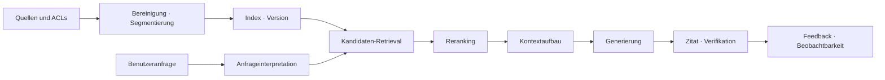



RAG ist keine Funktion, die Dokumente an ein Modell anhängt. Es ist ein **Informationsretrievalsystem**, das innerhalb begrenzter Zeit und Kosten die für eine Frage erforderlichen Nachweise findet und sie anschließend mit einer Antwort verbindet.

Selbst ein starkes generatives Modell erzeugt plausible, aber falsche Antworten, wenn der abgerufene Kontext falsch ist.
Umgekehrt liefern auch gute Suchergebnisse keine betriebliche Zuverlässigkeit, wenn Kontextaufbau, Zitatverknüpfung und Verweigerungsrichtlinien schwach sind.

## 1. Das Problem: RAG-Fehler nicht hinter einer einzigen Zahl verbergen

Eine einzelne RAG-Anfrage enthält mindestens folgende Stufen.

1. Quellenaufnahme und Zugriffskontrolle
2. Bereinigung und Einheitensegmentierung
3. Indizierung und Aktualisierungen
4. Anfrageinterpretation
5. Kandidaten-Retrieval
6. Filterung und Reranking
7. Kontextaufbau
8. Antwortgenerierung und Zitat
9. Verifikation und Beobachtbarkeit

Nur die Genauigkeit der endgültigen Antwort zu betrachten zeigt nicht, welche Stufe der Engpass ist.

- Wurde das Dokument nie indiziert?
- Wurde die Einheit mit der Antwort zu aggressiv geteilt?
- Verwendeten Anfrage und Dokument verschiedene Ausdrücke?
- Befand sich der Nachweis unter den Kandidaten, wurde aber beim Reranking entfernt?
- War der Nachweis vorhanden, wurde vom Modell jedoch nicht genutzt?
- Schlussfolgerte die Antwort über den Kontext hinaus?

Retrieval und Generierung werden daher getrennt gemessen und anschließend durch End-to-End-Metriken wieder verbunden.

## 2. Denkmodell: die Lieferkette für Nachweise



Jede Antwort sollte das Produkt einer Nachweislieferkette sein, die zu ihrer Quelle zurückverfolgt werden kann.

Kernobjekte erhalten folgende Kennungen.

- `source_id`: stabile ID des Quelldokuments
- `source_version`: Inhalts- oder Berechtigungsversion
- `chunk_id`: ID der Segmentierungseinheit
- `index_version`: Version von Embedding, Analyzer und Indexeinstellungen
- `retrieval_run_id`: ID der Retrieval-Ausführung je Anfrage
- `answer_id`: ID, die eine Antwort an ihre verwendeten Nachweise bindet

Ändert sich ein Dokument, während eine alte Antwort sichtbar bleibt, sollte diese Antwort anhand der Quellversion ungültig gemacht werden können.

## 3. Praktischer Workflow 1: Datenverträge und Segmentierungsstrategie

Zuerst wird der Vertrag der von RAG behandelten Dokumente definiert.

```yaml
document:
  required: [source_id, version, title, body, updated_at, acl]
  optional: [section_path, language, valid_from, valid_until]
chunk:
  required: [chunk_id, source_id, source_version, text, offsets]
index:
  required: [embedding_model, tokenizer, dimensions, created_at]
```

Segmentierung ist nicht nur eine Frage fester Zeichenzahl.

- Titel- und Überschriftengrenzen bewahren.
- Spaltennamen einer Tabelle nicht von ihren Zeilen trennen.
- Codedeklarationen und Erklärungen nach Möglichkeit zusammenhalten.
- Schnitte in der Satzmitte vermeiden.
- Quell-Offsets bewahren.
- Reihenfolge erfassen, damit benachbarter Kontext erweitert werden kann.

Ein kleiner Chunk ist präzise, verliert aber leicht Kontext.
Ein großer Chunk besitzt reichhaltigen Kontext, verwässert jedoch die Suchrepräsentation und erhöht Tokenkosten.

Statt eine einzige Größe anzunehmen, werden Richtlinien je Dokumenttyp erstellt und durch Evaluation entschieden.

## 4. Retrieval: zuerst sicheren Recall, dann Precision zurückgewinnen

Kandidaten-Retrieval kombiniert gewöhnlich Sparse- und Dense-Signale.

- Sparse: stark bei exakten Begriffen, Code, Kennungen und seltenen Wörtern
- Dense: findet semantisch ähnliche Dokumente auch bei unterschiedlicher Formulierung
- Metadatenfilter: erzwingt ausdrückliche Bedingungen wie Berechtigungen, Zeit, Produkt und Sprache

Eine einfache Form des kombinierten Scores lautet

$$
s(d,q)=\alpha s_{\text{sparse}}(d,q)+(1-\alpha)s_{\text{dense}}(d,q)
$$

Werden Scores verschiedener Skalen direkt addiert, kann ein Signal dominieren.
Normalisierung, Rank Fusion oder ein gelernter Kombinierer werden auf einem Validierungsset verglichen.

Das Ziel der Kandidatenstufe ist, relevante Dokumente nicht zu übersehen.
Die Reranking-Stufe verfeinert die Kandidatenreihenfolge mit einem teureren Modell.

Praktische Reihenfolge:

1. Berechtigungsfilter vor dem Retrieval anwenden.
2. Kandidaten unabhängig durch Sparse- und Dense-Retrieval gewinnen.
3. Doppelte Quellen und Near-Duplicates entfernen.
4. Durch Rank Fusion einen breiten Kandidatenpool aufbauen.
5. Cross-Encoder oder regelbasierten Reranker anwenden.
6. Diversitäts- und Aktualitätsbeschränkungen einbeziehen.

Query Rewriting ist sicherer, wenn es Kandidatensignale ergänzt, statt die ursprüngliche Anfrage zu ersetzen.

## 5. Kontextaufbau und Antwortvertrag

Die höchstplatzierten Dokumente werden nicht einfach verkettet.

- Nachweise über Teilfragen der Anfrage verteilen.
- Chunks mit wiederholtem Inhalt entfernen.
- Zeitpunkt und Autorität widersprüchlicher Versionen markieren.
- Kleinste zitierbare Einheit bewahren.
- Budget der Kontextlänge nach Nachweiswert zuteilen.

Beispiel eines Antwort-Ausgabevertrags:

```json
{
  "answer": "근거에 기반한 요약",
  "claims": [
    {"text": "검증할 주장", "citations": ["chunk-id"]}
  ],
  "insufficient_evidence": false,
  "follow_up": []
}
```

Vom Modell erzeugten Zitatnummern wird nicht vertraut.
Im Code wird validiert, dass sie zur Liste erlaubter `chunk_id`-Werte gehören.

Bei unzureichenden Nachweisen wird die Antwortgenerierung nicht erzwungen fortgesetzt.
Als Richtlinie wird Verweigerung, Rückfrage oder breiteres Retrieval gewählt.

## 6. Praxisbeispiel: eine Anfrage Stufe für Stufe diagnostizieren

Angenommen, die Beispielfrage betrifft ein von einer bestimmten Domäne unabhängiges Betriebsverfahren.

```python
def answer(query, user_context):
    scope = authorize(user_context)
    variants = rewrite_as_additional_queries(query)
    candidates = hybrid_retrieve([query, *variants], scope=scope)
    ranked = rerank(query, deduplicate(candidates))
    context = assemble_context(query, ranked, token_budget=6000)
    draft = generate_structured(query, context)
    return verify_claim_citations(draft, allowed=context.chunk_ids)
```

Wichtig an diesem Code sind nicht Bibliotheksnamen, sondern Grenzen.

- Autorisierung endet vor dem Retrieval.
- Umgeschriebene Anfragen werden gemeinsam mit der ursprünglichen verwendet.
- Kontext wird innerhalb eines ausdrücklichen Budgets aufgebaut.
- Ausgabe ist strukturiert.
- Zitate werden nach der Generierung validiert.

Bei einer falschen Antwort werden Kandidaten und Ranking anhand der gespeicherten `retrieval_run_id` reproduziert.

## 7. Evaluationsentwurf

Das Evaluationsset sollte die Verteilung realer Fragen abbilden.

- einfache Faktenfragen
- Fragen, die mehrere Dokumente verbinden müssen
- Fragen zu Tabellen, Code und Verfahren
- Fragen, bei denen Zeit oder Version wichtig ist
- mehrdeutige Anfragen, die eine Rückfrage erfordern
- Fragen, deren Antwort im Korpus fehlt
- Fragen nach Informationen außerhalb der Zugriffsberechtigungen des Benutzers

Retrieval-Metriken:

- Recall@k: Anteil der Fälle, in denen der korrekte Nachweis unter den obersten k Ergebnissen erscheint
- MRR: mittlerer Kehrwert des Rangs des ersten relevanten Dokuments
- nDCG: berücksichtigt abgestufte Relevanz und Ranking
- Filtergenauigkeit: Genauigkeit von Allow- und Block-Bedingungen

Generierungsmetriken:

- Korrektheit: Beantwortet die Ausgabe die Frage richtig?
- Groundedness: Wird jede Behauptung durch bereitgestellte Nachweise gestützt?
- Zitat-Precision: Stützt ein Zitat die Behauptung tatsächlich?
- Zitat-Recall: Sind für alle überprüfbaren Behauptungen Zitate vorhanden?
- Verweigerungsqualität: Behandelt das System unzureichende Nachweise angemessen?

Automatisierte Evaluatoren sind schnell, besitzen aber Bias- und Selbstkonsistenzprobleme.
Stichprobenartige menschliche Prüfung, regelbasierte Prüfungen und Modellevaluation werden trianguliert.

## 8. Online-Beobachtbarkeit und Änderungsmanagement

Auf dem Betriebsdashboard dürfen nicht nur Mittelwerte stehen.

- p50-, p95- und p99-End-to-End-Latenz
- Latenz der Retrieval-, Reranking- und Generierungsstufe
- Kandidatenanzahl und Kontext-Tokenzahl
- Cache-Hit-Rate
- Raten leerer Retrievals und Verweigerungen
- Fehlerrate der Zitatvalidierung
- Qualität nach Anfragetyp
- Regression nach Indexversion

Eine Indexänderung wird wie ein Modelldeployment verwaltet.

1. Offline auf einem festen Evaluationsset vergleichen.
2. Ergebnisunterschiede mit Shadow Traffic beobachten.
3. Begrenzten Canary anwenden.
4. Qualitäts-, Latenz- und Kosten-Gates prüfen.
5. Bei Problemen auf den vorigen Index-Alias zurückrollen.

Dokumentlöschung und Berechtigungsänderungen erhalten Vorrang vor gewöhnlichen Aktualisierungen.

## 9. Prüfliste zur Evaluation

- [ ] Sind Versionen von Quellen, Chunks, Indizes und Antworten verknüpft?
- [ ] Wird Zugriffskontrolle vor dem Retrieval statt nach der Generierung angewandt?
- [ ] Wurden Segmentierungsrichtlinien jedes Dokumenttyps praktisch evaluiert?
- [ ] Werden Fehlermodi von Sparse- und Dense-Retrieval getrennt gemessen?
- [ ] Werden Recall@k und Genauigkeit der endgültigen Antwort getrennt untersucht?
- [ ] Enthält das Evaluationsset nicht beantwortbare Fragen?
- [ ] Werden Zitat-IDs im Code validiert?
- [ ] Können widersprüchliche Nachweise und ihr zeitlicher Kontext dargestellt werden?
- [ ] Werden Qualität, Latenz und Kosten nach Indexversion verglichen?
- [ ] Vermeiden Logs die übermäßige Aufbewahrung sensibler Quellinhalte?
- [ ] Werden Löschanfragen an Indizes und Caches weitergegeben?
- [ ] Bleibt ein voriger Index für Rollback erhalten?

## 10. Häufige Fehler und Einschränkungen

### Glauben, nur ein Wechsel des Embedding-Modells löse das Problem

Auslassungen können aus Segmentierung, Metadaten, Berechtigungsfiltern oder Anfrageverteilung stammen.
Nur das Modell ohne stufenbezogene Metriken zu wechseln erhöht die Kosten und lässt die Ursache ungelöst.

### Glauben, längerer Kontext sei immer besser

Irrelevanter Kontext erhöht Kosten, Latenz und Ablenkung.
Optimiert wird die effektive Nachweisdichte, nicht die Tokenzahl.

### Nur mit synthetischen Fragen evaluieren

Synthetische Daten verbreitern die Abdeckung, ersetzen aber nicht Vokabular und Mehrdeutigkeit realer Benutzer.
Deidentifizierte Stichproben aus Betriebslogs werden ergänzt und das Evaluationsset im Zeitverlauf aktualisiert.

### Glauben, RAG garantiere automatisch Aktualität

Aufnahmeverzögerungen, Indizierungsfehler, Caches und Konflikte zwischen Dokumentversionen erzeugen veraltete Antworten.
Ein Aktualitäts-SLO und die Weitergabezeit von Löschungen werden getrennt gemessen.

RAG ist ein probabilistisches Retrieval- und Generierungssystem über einem geschlossenen Korpus.
Sind Quellen falsch oder fehlt das nötige Wissen, kann es keine richtige Antwort garantieren.

## 11. Offizielle Referenzen

- [Ursprüngliche Veröffentlichung zu Retrieval-Augmented Generation](https://arxiv.org/abs/2005.11401)
- [Ursprüngliche Veröffentlichung zu Dense Passage Retrieval](https://arxiv.org/abs/2004.04906)
- [Ursprüngliche Veröffentlichung zum BEIR-Benchmark](https://arxiv.org/abs/2104.08663)
- [Offizielle Elasticsearch-Dokumentation zur hybriden Suche](https://www.elastic.co/docs/solutions/search/hybrid-search)
- [NIST AI Risk Management Framework](https://www.nist.gov/itl/ai-risk-management-framework)

## 12. Fazit

Der Kern produktionsreifen RAG ist kein größeres Modell, sondern **eine rückverfolgbare Nachweislieferkette und stufenweise Evaluation**.

Werden Retrieval-Recall, Reranking-Precision, Kontextgültigkeit, Groundedness der Generierung und Zugriffskontrolle getrennt gemessen, werden Fehler zu diagnostizierbaren Engineering-Problemen.
