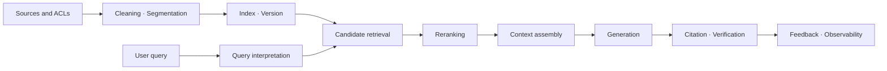



RAG is not a feature that attaches documents to a model. It is an **information retrieval system** that finds the evidence needed for a question within limited time and cost, then connects that evidence to an answer.

Even a strong generative model produces plausible but wrong answers when given incorrectly retrieved context.
Conversely, even good search results do not provide operational reliability when context assembly, citation linkage, and refusal policies are weak.

## 1. The Problem: Do Not Hide RAG Failures Behind One Number

A single RAG request contains at least the following stages.

1. Source ingestion and access control
2. Cleaning and unit segmentation
3. Indexing and updates
4. Query interpretation
5. Candidate retrieval
6. Filtering and reranking
7. Context assembly
8. Answer generation and citation
9. Verification and observability

Looking only at final-answer accuracy does not reveal which stage is the bottleneck.

- Was the document never indexed?
- Was the answer-bearing unit split too aggressively?
- Did the query and document use different expressions?
- Was the evidence among the candidates but eliminated during reranking?
- Was the evidence present but not used by the model?
- Did the answer reason beyond the context?

Therefore, measure retrieval and generation separately, then reconnect them through end-to-end metrics.

## 2. Mental Model: The Evidence Supply Chain



Every answer should be the product of an evidence supply chain that can be traced back to its source.

Give core objects the following identifiers.

- `source_id`: Stable ID of the source document
- `source_version`: Content or permission version
- `chunk_id`: Segmentation-unit ID
- `index_version`: Version of the embedding, analyzer, and index settings
- `retrieval_run_id`: Retrieval-execution ID for each query
- `answer_id`: ID that binds an answer to the evidence it used

If a document changes while an old answer remains visible, it should be possible to invalidate that answer using the source version.

## 3. Practical Workflow 1: Data Contracts and Segmentation Strategy

First define the contract for documents handled by RAG.

```yaml
document:
  required: [source_id, version, title, body, updated_at, acl]
  optional: [section_path, language, valid_from, valid_until]
chunk:
  required: [chunk_id, source_id, source_version, text, offsets]
index:
  required: [embedding_model, tokenizer, dimensions, created_at]
```

Segmentation is not merely a question of a fixed character count.

- Preserve title and heading boundaries.
- Do not separate table column names from their rows.
- Keep code declarations and explanations together when possible.
- Avoid cuts in the middle of a sentence.
- Preserve source offsets.
- Record order so that neighboring context can be expanded.

A small chunk is precise but easily loses context.
A large chunk has rich context but dilutes the search representation and increases token cost.

Instead of assuming one size, create policies by document type and decide through evaluation.

## 4. Retrieval: Secure Recall First, Then Recover Precision

Candidate retrieval usually combines sparse and dense signals.

- sparse: Strong for exact terms, code, identifiers, and rare words.
- dense: Effective at finding semantically similar documents even when their wording differs.
- metadata filter: Enforces explicit conditions such as permissions, time, product, and language.

A simple form of combined score is

$$
s(d,q)=\alpha s_{\text{sparse}}(d,q)+(1-\alpha)s_{\text{dense}}(d,q)
$$

Adding scores on different scales directly may allow one signal to dominate.
Compare normalization, rank fusion, or a learned combiner on a validation set.

The objective of the candidate stage is not to miss relevant documents.
The reranking stage uses a more expensive model to refine the candidate order.

A practical sequence is as follows.

1. Apply the permission filter before retrieval.
2. Obtain candidates independently from sparse and dense retrieval.
3. Remove duplicate sources and near-duplicates.
4. Build a broad candidate pool through rank fusion.
5. Apply a cross-encoder or rule-based reranker.
6. Incorporate diversity and freshness constraints.

Query rewriting is safer when it adds candidate signals rather than replacing the original query.

## 5. Context Assembly and the Answer Contract

Do not simply concatenate the top-ranked documents.

- Allocate evidence across the question's subissues.
- Remove chunks that repeat the same content.
- Mark the time and authority of conflicting versions.
- Preserve the smallest citable unit.
- Allocate the context-length budget according to evidence value.

Example answer-output contract:

```json
{
  "answer": "근거에 기반한 요약",
  "claims": [
    {"text": "검증할 주장", "citations": ["chunk-id"]}
  ],
  "insufficient_evidence": false,
  "follow_up": []
}
```

Do not trust citation numbers generated by the model.
Validate in code that they belong to the list of allowed `chunk_id` values.

When evidence is insufficient, do not force answer generation to continue.
Choose one of refusal, a clarifying question, or broader retrieval as a policy.

## 6. Practical Example: Diagnose One Question Stage by Stage

Assume the example question is about an operational procedure independent of any specific domain.

```python
def answer(query, user_context):
    scope = authorize(user_context)
    variants = rewrite_as_additional_queries(query)
    candidates = hybrid_retrieve([query, *variants], scope=scope)
    ranked = rerank(query, deduplicate(candidates))
    context = assemble_context(query, ranked, token_budget=6000)
    draft = generate_structured(query, context)
    return verify_claim_citations(draft, allowed=context.chunk_ids)
```

The important feature of this code is not the library names, but the boundaries.

- Authorization finishes before retrieval.
- Rewritten queries are used together with the original.
- Context is constructed within an explicit budget.
- Output is structured.
- Citations are validated after generation.

When a wrong answer appears, reproduce the candidates and ranking from the saved `retrieval_run_id`.

## 7. Evaluation Design

The evaluation set should represent the distribution of real questions.

- Simple factual questions
- Questions that require combining multiple documents
- Questions about tables, code, and procedures
- Questions for which time or version matters
- Ambiguous requests that require a clarifying question
- Questions whose answer is absent from the corpus
- Questions requesting information outside the user's access permissions

Retrieval metrics:

- Recall@k: Proportion of cases in which the correct evidence appears in the top k results
- MRR: Mean reciprocal rank of the first relevant document
- nDCG: Accounts for both graded relevance and ranking
- filter accuracy: Accuracy of allow and block conditions

Generation metrics:

- correctness: Does it answer the question correctly?
- groundedness: Is each claim supported by the supplied evidence?
- citation precision: Does a citation actually support the claim?
- citation recall: Are citations present for all verifiable claims?
- refusal quality: Does the system handle insufficient evidence appropriately?

Automated evaluators are fast, but they have bias and self-consistency problems.
Triangulate with sampled human review, rule-based checks, and model evaluation.

## 8. Online Observability and Change Management

Do not put only averages on the operational dashboard.

- p50, p95, and p99 end-to-end latency
- Retrieval-, reranking-, and generation-stage latency
- Candidate count and context token count
- Cache hit ratio
- Empty-retrieval and refusal rates
- Citation-validation failure rate
- Quality by query type
- Regression by index version

Manage an index change like a model deployment.

1. Compare offline on a fixed evaluation set.
2. Observe result differences with shadow traffic.
3. Apply a limited canary.
4. Check quality, latency, and cost gates.
5. Roll back to the previous index alias if a problem occurs.

Prioritize document deletion and permission changes over routine updates.

## 9. Evaluation Checklist

- [ ] Are the versions of sources, chunks, indexes, and answers linked?
- [ ] Is access control applied before retrieval rather than after generation?
- [ ] Have segmentation policies for each document type been evaluated in practice?
- [ ] Are the failure modes of sparse and dense retrieval measured separately?
- [ ] Are Recall@k and final-answer accuracy examined separately?
- [ ] Does the evaluation set include unanswerable questions?
- [ ] Are citation IDs validated in code?
- [ ] Can conflicting evidence and its time context be represented?
- [ ] Are quality, latency, and cost compared by index version?
- [ ] Do logs avoid retaining excessive sensitive source content?
- [ ] Do deletion requests propagate to indexes and caches?
- [ ] Is a previous index preserved for rollback?

## 10. Common Failures and Limitations

### Believing That Changing Only the Embedding Model Will Solve the Problem

Omissions may originate in segmentation, metadata, permission filters, or the query distribution.
Changing only the model without stage-level metrics raises cost while leaving the cause unresolved.

### Believing That Longer Context Is Always Better

Irrelevant context increases cost, latency, and distraction.
Optimize effective evidence density, not token count.

### Evaluating Only with Synthetic Questions

Synthetic data broadens coverage but cannot replace the vocabulary and ambiguity of real users.
Add de-identified samples from operational logs and update the evaluation set over time.

### Believing That RAG Automatically Guarantees Freshness

Ingestion delays, indexing failures, caches, and document-version conflicts produce stale answers.
Measure a freshness SLO and deletion-propagation time separately.

RAG is a probabilistic retrieval and generation system over a closed corpus.
It cannot guarantee a correct answer if the sources are wrong or the required knowledge is absent.

## 11. Official References

- [Original paper on Retrieval-Augmented Generation](https://arxiv.org/abs/2005.11401)
- [Original paper on Dense Passage Retrieval](https://arxiv.org/abs/2004.04906)
- [Original paper on the BEIR benchmark](https://arxiv.org/abs/2104.08663)
- [Official Elasticsearch documentation on hybrid search](https://www.elastic.co/docs/solutions/search/hybrid-search)
- [NIST AI Risk Management Framework](https://www.nist.gov/itl/ai-risk-management-framework)

## 12. Conclusion

The core of production-ready RAG is not a larger model, but **a traceable evidence supply chain and stage-by-stage evaluation**.

By measuring retrieval recall, reranking precision, context validity, generation groundedness, and access control separately, failures become debuggable engineering problems.
