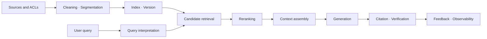



RAG no es una función que adjunta documentos a un modelo. Es un **sistema de recuperación de información** que encuentra la evidencia necesaria para una pregunta en un tiempo y costo limitados y luego conecta esa evidencia con una respuesta.

Incluso un modelo generativo fuerte produce respuestas plausibles pero incorrectas cuando se le da un contexto recuperado incorrectamente.
Por el contrario, incluso los buenos resultados de búsqueda no proporcionan confiabilidad operativa cuando las políticas de ensamblaje del contexto, vinculación de citas y rechazo son débiles.

## 1. El problema: no ocultar RAG fallos detrás de un número

Una única solicitud RAG contiene al menos las siguientes etapas.

1. Ingestión de fuentes y control de acceso
2. Limpieza y segmentación de unidades
3. Indexación y actualizaciones
4. Interpretación de consultas
5. Recuperación de candidatos
6. Filtrado y reclasificación
7. Asamblea de contexto
8. Generación de respuestas y citas.
9. Verificación y observabilidad

Observar únicamente la precisión de la respuesta final no revela cuál etapa es el cuello de botella.

- ¿El documento nunca fue indexado?
- ¿La unidad portadora de la respuesta se dividió de manera demasiado agresiva?
- ¿La consulta y el documento utilizaron expresiones diferentes?
- ¿La evidencia estuvo entre los candidatos pero fue eliminada durante la reclasificación?
- ¿Estaba la evidencia presente pero el modelo no la utilizó?
- ¿La respuesta razonó más allá del contexto?

Por lo tanto, mida la recuperación y la generación por separado y luego vuelva a conectarlas mediante métricas de un extremo a otro.

## 2. Modelo mental: la cadena de suministro de evidencia



Cada respuesta debe ser producto de una cadena de suministro de evidencia que pueda rastrearse hasta su fuente.

Asigne a los objetos principales los siguientes identificadores.

- `source_id`: Estable ID del documento fuente
- `source_version`: Contenido o versión de permiso
- `chunk_id`: Unidad de segmentación ID
- `index_version`: versión de la configuración de incrustación, analizador y índice
- `retrieval_run_id`: recuperación-ejecución ID para cada consulta
- `answer_id`: ID que vincula una respuesta a la evidencia que utilizó

Si un documento cambia mientras una respuesta anterior permanece visible, debería ser posible invalidar esa respuesta utilizando la versión fuente.

## 3. Flujo de trabajo práctico 1: contratos de datos y estrategia de segmentación

Primero defina el contrato para los documentos manejados por RAG.

```yaml
document:
  required: [source_id, version, title, body, updated_at, acl]
  optional: [section_path, language, valid_from, valid_until]
chunk:
  required: [chunk_id, source_id, source_version, text, offsets]
index:
  required: [embedding_model, tokenizer, dimensions, created_at]
```

La segmentación no es simplemente una cuestión de un número fijo de caracteres.

- Preservar el título y los límites del encabezado.
- No separe los nombres de las columnas de la tabla de sus filas.
- Mantenga las declaraciones y explicaciones del código juntas cuando sea posible.
- Evitar cortes a mitad de frase.
- Preservar las compensaciones de origen.
- Orden de registro para que se pueda ampliar el contexto vecino.

Una pequeña parte es precisa pero pierde contexto fácilmente.
Una gran parte tiene un contexto rico pero diluye la representación de búsqueda y aumenta el costo del token.

En lugar de asumir un tamaño único, cree políticas por tipo de documento y decida mediante evaluación.

## 4. Recuperación: recuperación segura primero, luego recuperación de precisión

La recuperación de candidatos suele combinar señales densas y escasas.

- disperso: fuerte para términos exactos, códigos, identificadores y palabras raras.
- denso: eficaz para encontrar documentos semánticamente similares incluso cuando su redacción difiere.
- filtro de metadatos: aplica condiciones explícitas como permisos, tiempo, producto e idioma.

Una forma simple de puntuación combinada es

$$
s(d,q)=\alpha s_{\text{sparse}}(d,q)+(1-\alpha)s_{\text{dense}}(d,q)
$$

Agregar puntuaciones en diferentes escalas directamente puede permitir que una señal domine.
Compare la normalización, la fusión de rangos o un combinador aprendido en un conjunto de validación.

El objetivo de la etapa de candidato es no perder documentos relevantes.
La etapa de reclasificación utiliza un modelo más caro para refinar el orden de los candidatos.

Una secuencia práctica es la siguiente.

1. Aplique el filtro de permisos antes de la recuperación.
2. Obtener candidatos independientemente de una recuperación densa y escasa.
3. Elimine las fuentes duplicadas y casi duplicadas.
4. Cree un amplio grupo de candidatos mediante la fusión de rangos.
5. Aplique un codificador cruzado o un reordenador basado en reglas.
6. Incorporar limitaciones de diversidad y frescura.

La reescritura de consultas es más segura cuando agrega señales candidatas en lugar de reemplazar la consulta original.

## 5. Conjunto de contexto y contrato de respuesta

No se limite a concatenar los documentos mejor clasificados.

- Asignar evidencia entre los subtemas de la pregunta.
- Eliminar fragmentos que repitan el mismo contenido.
- Marcar el tiempo y la autoridad de las versiones contradictorias.
- Preservar la unidad citable más pequeña.
- Asignar el presupuesto de duración del contexto según el valor de la evidencia.

Ejemplo de contrato de salida de respuesta:

```json
{
  "answer": "근거에 기반한 요약",
  "claims": [
    {"text": "검증할 주장", "citations": ["chunk-id"]}
  ],
  "insufficient_evidence": false,
  "follow_up": []
}
```

No confíe en los números de citas generados por el modelo.
Validar en código que pertenecen a la lista de valores `chunk_id` permitidos.

Cuando la evidencia sea insuficiente, no fuerce la generación de respuestas para continuar.
Elija como política una de rechazo, una pregunta aclaratoria o una recuperación más amplia.

## 6. Ejemplo práctico: diagnosticar una pregunta etapa por etapa

Supongamos que la pregunta de ejemplo trata sobre un procedimiento operativo independiente de cualquier dominio específico.

```python
def answer(query, user_context):
    scope = authorize(user_context)
    variants = rewrite_as_additional_queries(query)
    candidates = hybrid_retrieve([query, *variants], scope=scope)
    ranked = rerank(query, deduplicate(candidates))
    context = assemble_context(query, ranked, token_budget=6000)
    draft = generate_structured(query, context)
    return verify_claim_citations(draft, allowed=context.chunk_ids)
```

La característica importante de este código no son los nombres de las bibliotecas, sino los límites.

- La autorización finaliza antes de la recuperación.
- Las consultas reescritas se utilizan junto con las originales.
- El contexto se construye dentro de un presupuesto explícito.
- La producción está estructurada.
- Las citas se validan tras generación.

Cuando aparezca una respuesta incorrecta, reproduzca los candidatos y la clasificación del `retrieval_run_id` guardado.

## 7. Diseño de evaluación

El conjunto de evaluación debe representar la distribución de preguntas reales.

- Preguntas objetivas simples
- Preguntas que requieren combinar varios documentos
- Preguntas sobre tablas, códigos y procedimientos.
- Preguntas para las que importa el tiempo o la versión.
- Solicitudes ambiguas que requieren una pregunta aclaratoria.
- Preguntas cuya respuesta está ausente en el corpus
- Preguntas que solicitan información fuera de los permisos de acceso del usuario.

Métricas de recuperación:

- Recall@k: Proporción de casos en los que la evidencia correcta aparece en los k primeros resultados
- MRR: Rango recíproco medio del primer documento relevante
- nDCG: cuenta tanto para la relevancia graduada como para la clasificación
- precisión del filtro: precisión de las condiciones de permiso y bloqueo

Métricas de generación:

- corrección: ¿responde correctamente a la pregunta?
- fundamentación: ¿Cada afirmación está respaldada por la evidencia proporcionada?
- precisión de la cita: ¿una cita realmente respalda la afirmación?
- recuperación de citas: ¿Están presentes las citas para todas las afirmaciones verificables?
- calidad del rechazo: ¿El sistema maneja adecuadamente la evidencia insuficiente?

Los evaluadores automatizados son rápidos, pero tienen problemas de sesgo y de autoconsistencia.
Triangule con revisión humana de muestra, comprobaciones basadas en reglas y evaluación de modelos.

## 8. Observabilidad online y gestión del cambio

No ponga sólo promedios en el tablero operativo.

- Latencia de extremo a extremo p50, p95 y p99
- Latencia en las etapas de recuperación, reclasificación y generación
- Recuento de candidatos y recuento de tokens de contexto.
- Proporción de aciertos de caché
- Tarifas de recuperación y rechazo de vacíos.
- Tasa de fracaso de validación de citas
- Calidad por tipo de consulta
- Regresión por versión del índice.

Administre un cambio de índice como una implementación de modelo.

1. Compare fuera de línea en un conjunto de evaluación fijo.
2. Observe las diferencias de resultados con el tráfico en la sombra.
3. Aplicar un canario limitado.
4. Verifique los controles de calidad, latencia y costos.
5. Vuelva al alias de índice anterior si ocurre un problema.

Priorice la eliminación de documentos y los cambios de permisos sobre las actualizaciones de rutina.

## 9. Lista de verificación de evaluación

- [] ¿Están vinculadas las versiones de las fuentes, fragmentos, índices y respuestas?
- [] ¿Se aplica el control de acceso antes de la recuperación y no después de la generación?
- [ ] ¿Se han evaluado en la práctica las políticas de segmentación para cada tipo de documento?
- [ ] ¿Se miden por separado los modos de falla de recuperación escasa y densa?
- [ ] ¿Se examinan por separado la precisión de Recall@k y de la respuesta final?
- [ ] ¿El conjunto de evaluación incluye preguntas sin respuesta?
- [] ¿Se validan los ID de las citas en código?
- [ ] ¿Se pueden representar pruebas contradictorias y su contexto temporal?
- [] ¿Se comparan la calidad, la latencia y el costo según la versión del índice?
- [] ¿Los registros evitan retener contenido fuente excesivo y confidencial?
- [] ¿Las solicitudes de eliminación se propagan a índices y cachés?
- [] ¿Se conserva un índice anterior para su reversión?

## 10. Fallas y limitaciones comunes

### Creer que cambiar solo el modelo de incrustación resolverá el problema

Las omisiones pueden originarse en la segmentación, los metadatos, los filtros de permisos o la distribución de consultas.
Cambiar solo el modelo sin métricas a nivel de etapa aumenta el costo y deja la causa sin resolver.

### Creer que un contexto más largo siempre es mejor

El contexto irrelevante aumenta el costo, la latencia y la distracción.
Optimice la densidad de evidencia efectiva, no el recuento de tokens.

### Evaluar sólo con preguntas sintéticas

Los datos sintéticos amplían la cobertura, pero no pueden reemplazar el vocabulario y la ambigüedad de los usuarios reales.
Agregue muestras no identificadas de registros operativos y actualice el conjunto de evaluación con el tiempo.

### Creer que RAG garantiza automáticamente la frescura

Los retrasos en la ingesta, los errores de indexación, las cachés y los conflictos entre versiones de documentos producen respuestas obsoletas.
Mida la actualización SLO y el tiempo de propagación de eliminación por separado.

RAG es un sistema probabilístico de recuperación y generación sobre un corpus cerrado.
No puede garantizar una respuesta correcta si las fuentes son incorrectas o falta el conocimiento requerido.

## 11. Referencias oficiales

- [Artículo original sobre recuperación-generación aumentada](https://arxiv.org/abs/2005.11401)
- [Artículo original sobre recuperación de pasajes densos] (https://arxiv.org/abs/2004.04906)
- [Documento original sobre el punto de referencia BEIR](https://arxiv.org/abs/2104.08663)
- [Documentación oficial de Elasticsearch sobre búsqueda híbrida](https://www.elastic.co/docs/solutions/search/hybrid-search)
- [NIST AI Marco de gestión de riesgos](https://www.nist.gov/itl/ai-risk-management-framework)

## 12. Conclusión

El núcleo de RAG listo para producción no es un modelo más grande, sino **una cadena de suministro de evidencia rastreable y una evaluación etapa por etapa**.

Al medir la recuperación de recuperación, la precisión de reclasificación, la validez del contexto, la base de generación y el control de acceso por separado, las fallas se convierten en problemas de ingeniería que se pueden depurar.
