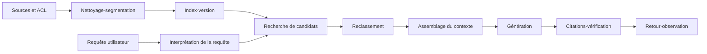



Le RAG n’est pas une fonction qui se contente de joindre des documents au modèle. C’est un **système de recherche d’information** qui doit trouver, dans des limites de temps et de coût, les éléments nécessaires à une question et les relier à la réponse.

Même un bon modèle génératif produira une erreur plausible si le contexte recherché est mauvais.
À l’inverse, d’excellents résultats de recherche ne suffisent pas à garantir la fiabilité opérationnelle si l’assemblage du contexte, le lien avec les citations ou la politique de refus sont fragiles.

## 1. Problème : ne pas masquer les échecs du RAG derrière un chiffre unique

Une requête RAG comprend au minimum les étapes suivantes.

1. Collecte des sources et contrôle d’accès
2. Nettoyage et segmentation en unités
3. Indexation et mise à jour
4. Interprétation de la requête
5. Recherche de candidats
6. Filtrage et reclassement
7. Assemblage du contexte
8. Génération de la réponse et citations
9. Vérification et observation

Le seul taux de réponses correctes ne permet pas de savoir quelle étape constitue le goulet d’étranglement.

- Le document n’a-t-il pas été indexé ?
- L’unité contenant la réponse a-t-elle été trop fragmentée ?
- La requête et le document emploient-ils des formulations différentes ?
- Le bon élément figurait-il parmi les candidats avant d’être éliminé au reclassement ?
- Le modèle disposait-il de la preuve sans l’utiliser ?
- La réponse a-t-elle été extrapolée au-delà du contexte ?

Il faut donc mesurer séparément la recherche et la génération, puis les relier à nouveau par des métriques de bout en bout.

## 2. Modèle mental : la chaîne d’approvisionnement des preuves



Chaque réponse doit être le produit d’une chaîne de preuves remontant jusqu’à la source.

Les identifiants suivants sont associés aux objets essentiels.

- `source_id` : identifiant stable du document source
- `source_version` : version du contenu ou des droits
- `chunk_id` : identifiant de l’unité segmentée
- `index_version` : version des embeddings, de l’analyseur et de la configuration de l’index
- `retrieval_run_id` : identifiant de l’exécution de recherche propre à la requête
- `answer_id` : identifiant reliant la réponse aux preuves utilisées

Si un document change alors qu’une ancienne réponse reste visible, sa version source doit permettre d’invalider cette réponse.

## 3. Processus pratique 1 : contrat des données et stratégie de segmentation

Il faut d’abord définir le contrat des documents pris en charge par le RAG.

```yaml
document:
  required: [source_id, version, title, body, updated_at, acl]
  optional: [section_path, language, valid_from, valid_until]
chunk:
  required: [chunk_id, source_id, source_version, text, offsets]
index:
  required: [embedding_model, tokenizer, dimensions, created_at]
```

La segmentation ne se réduit pas à un nombre fixe de caractères.

- Préserver les limites des titres et sous-titres.
- Ne pas séparer les en-têtes de colonnes des lignes d’un tableau.
- Garder autant que possible la déclaration d’un code avec son explication.
- Éviter de couper une phrase en son milieu.
- Conserver les décalages dans le texte source.
- Enregistrer l’ordre pour pouvoir étendre le contexte aux unités voisines.

Une petite unité est précise, mais perd facilement son contexte.
Une grande unité est riche en contexte, mais dilue les formulations utiles à la recherche et augmente le coût en jetons.

Au lieu de supposer qu’une taille unique convient, il faut établir une politique par type de document et trancher par l’évaluation.

## 4. Recherche : obtenir d’abord le rappel, puis restaurer la précision

La recherche de candidats combine généralement des signaux parcimonieux et denses.

- Parcimonieux : efficace pour les termes exacts, le code, les identifiants et les mots rares.
- Dense : adapté à la recherche de documents sémantiquement proches malgré des formulations différentes.
- Filtre de métadonnées : impose des conditions explicites, notamment les droits, la période, le produit ou la langue.

Une forme simple du score combiné est la suivante.

$$
s(d,q)=\alpha s_{\text{sparse}}(d,q)+(1-\alpha)s_{\text{dense}}(d,q)
$$

Additionner directement des scores d’échelles différentes peut laisser l’un des signaux dominer.
Il faut comparer sur un jeu de validation la normalisation, la fusion de rangs et un combinateur appris.

L’étape des candidats vise à ne manquer aucun document pertinent.
L’étape de reclassement ordonne plus finement les candidats au moyen d’un modèle plus coûteux.

L’ordre pratique est le suivant.

1. Appliquer le filtre d’autorisation avant la recherche.
2. Obtenir séparément les candidats parcimonieux et denses.
3. Éliminer les sources en double et les quasi-doublons.
4. Construire un vaste ensemble de candidats par fusion de rangs.
5. Appliquer un encodeur croisé ou un reclasseur fondé sur des règles.
6. Prendre en compte les contraintes de diversité et de fraîcheur.

La réécriture de requête est plus sûre lorsqu’elle ajoute un signal de candidats sans remplacer la requête originale.

## 5. Assemblage du contexte et contrat de réponse

Il ne faut pas simplement concaténer les documents les mieux classés.

- Répartir les preuves entre les différents sous-aspects de la question.
- Supprimer les unités qui répètent la même information.
- Indiquer la date et l’autorité des versions contradictoires.
- Préserver la plus petite unité pouvant être citée.
- Répartir le budget de longueur du contexte selon la valeur des preuves.

Exemple de contrat de sortie de la réponse :

```json
{
  "answer": "근거에 기반한 요약",
  "claims": [
    {"text": "검증할 주장", "citations": ["chunk-id"]}
  ],
  "insufficient_evidence": false,
  "follow_up": []
}
```

Il ne faut pas faire confiance aux numéros de citation générés par le modèle.
Le code doit vérifier qu’ils appartiennent à la liste autorisée de `chunk_id`.

Lorsque les preuves sont insuffisantes, il ne faut pas forcer la génération à continuer.
La politique doit choisir entre refuser, poser une question supplémentaire ou élargir le champ de la recherche.

## 6. Exemple pratique : diagnostiquer une question étape par étape

Supposons une question portant sur une procédure opérationnelle, sans domaine particulier.

```python
def answer(query, user_context):
    scope = authorize(user_context)
    variants = rewrite_as_additional_queries(query)
    candidates = hybrid_retrieve([query, *variants], scope=scope)
    ranked = rerank(query, deduplicate(candidates))
    context = assemble_context(query, ranked, token_budget=6000)
    draft = generate_structured(query, context)
    return verify_claim_citations(draft, allowed=context.chunk_ids)
```

L’important dans ce code n’est pas le nom des bibliothèques, mais les frontières.

- L’autorisation est terminée avant la recherche.
- Les requêtes réécrites sont utilisées avec l’originale.
- Le contexte est composé dans un budget explicite.
- La sortie est structurée.
- Les citations sont vérifiées après la génération.

Lorsqu’une réponse est fausse, le `retrieval_run_id` enregistré permet de reproduire les candidats et leur classement.

## 7. Conception de l’évaluation

Le jeu d’évaluation doit représenter la distribution réelle des questions.

- Questions factuelles simples
- Questions qui nécessitent de combiner plusieurs documents
- Questions sur des tableaux, du code ou des procédures
- Questions pour lesquelles la date ou la version est importante
- Demandes ambiguës nécessitant une question de clarification
- Questions dont la réponse n’existe pas dans le corpus
- Questions exigeant des informations hors des droits d’accès

Métriques de recherche :

- Recall@k : proportion des preuves correctes présentes dans les k premiers résultats
- MRR : moyenne de l’inverse du rang du premier document pertinent
- nDCG : prise en compte conjointe du degré de pertinence et de l’ordre
- exactitude du filtrage : justesse des conditions d’autorisation et de blocage

Métriques de génération :

- exactitude : la réponse correspond-elle à la question ?
- ancrage : chaque affirmation est-elle étayée par les preuves fournies ?
- précision des citations : la citation appuie-t-elle réellement l’affirmation ?
- rappel des citations : les affirmations vérifiables comportent-elles toutes une citation ?
- qualité du refus : le manque de preuves est-il traité convenablement ?

Les évaluateurs automatiques sont rapides, mais souffrent de biais et de problèmes d’auto-cohérence.
Il faut trianguler un échantillon revu par des humains, des contrôles à base de règles et une évaluation par modèle.

## 8. Observation en ligne et gestion des changements

Un tableau de bord de production ne doit pas se limiter aux moyennes.

- latence totale p50, p95 et p99 ;
- latence par étape de recherche, reclassement et génération ;
- nombre de candidats et de jetons du contexte ;
- taux de succès du cache ;
- taux de recherches vides et de refus ;
- taux d’échec de la validation des citations ;
- qualité par type de requête ;
- régressions selon la version de l’index.

Les modifications de l’index se gèrent comme un déploiement de modèle.

1. Comparaison hors ligne sur un jeu d’évaluation fixe
2. Observation des écarts de résultats avec du trafic fantôme
3. Déploiement canari limité
4. Vérification des seuils de qualité, de latence et de coût
5. En cas de problème, retour à l’alias de l’index précédent

La suppression d’un document ou la modification des droits doit être traitée avant une mise à jour ordinaire.

## 9. Liste de contrôle de l’évaluation

- [ ] Les versions de la source, de l’unité segmentée, de l’index et de la réponse sont-elles reliées ?
- [ ] Le contrôle d’accès intervient-il avant la recherche, et non après la génération ?
- [ ] La politique de segmentation propre à chaque type de document a-t-elle été réellement évaluée ?
- [ ] Les modes d’échec des signaux parcimonieux et denses sont-ils mesurés séparément ?
- [ ] Recall@k et taux final de réponses correctes sont-ils distingués ?
- [ ] Le jeu d’évaluation contient-il des questions sans réponse ?
- [ ] Les identifiants de citation sont-ils vérifiés par le code ?
- [ ] Les preuves contradictoires et leur chronologie peuvent-elles être représentées ?
- [ ] Qualité, latence et coût sont-ils comparés selon la version de l’index ?
- [ ] Les journaux évitent-ils de conserver trop d’informations sensibles provenant des sources ?
- [ ] Une demande de suppression se propage-t-elle jusqu’à l’index et au cache ?
- [ ] Un index antérieur est-il conservé pour permettre un retour arrière ?

## 10. Échecs fréquents et limites

### Croire que changer uniquement le modèle d’embedding résoudra le problème

Les omissions peuvent provenir de la segmentation, des métadonnées, du filtre d’autorisation ou de la distribution des requêtes.
Changer uniquement de modèle en l’absence de métriques par étape augmente le coût sans éliminer la cause.

### Croire qu’un contexte plus long est toujours préférable

Un contexte inutile augmente le coût, la latence et la dispersion de l’attention.
Il faut optimiser la densité de preuves utiles, et non le nombre de jetons.

### Évaluer uniquement avec des questions synthétiques

Les données synthétiques élargissent la couverture, mais ne remplacent ni le vocabulaire ni les ambiguïtés des utilisateurs réels.
Il faut ajouter des échantillons désidentifiés provenant des journaux de production et actualiser le jeu d’évaluation au fil du temps.

### Croire que le RAG garantit automatiquement la fraîcheur

Un retard de collecte, un échec d’indexation, le cache ou un conflit de versions peut produire une réponse obsolète.
L’objectif de niveau de service de fraîcheur et le délai de propagation des suppressions doivent être mesurés séparément.

Le RAG est un système probabiliste de recherche et de génération sur un corpus fermé.
Si la source est erronée ou si la connaissance nécessaire manque, il ne peut garantir une réponse correcte.

## 11. Références officielles

- [Article fondateur sur la génération augmentée par recherche](https://arxiv.org/abs/2005.11401)
- [Article fondateur sur la recherche dense de passages](https://arxiv.org/abs/2004.04906)
- [Article fondateur sur le banc d’essai BEIR](https://arxiv.org/abs/2104.08663)
- [Documentation officielle d’Elasticsearch sur la recherche hybride](https://www.elastic.co/docs/solutions/search/hybrid-search)
- [Cadre de gestion des risques liés à l’IA du NIST](https://www.nist.gov/itl/ai-risk-management-framework)

## 12. Conclusion

Le cœur d’un RAG exploitable en production n’est pas un modèle plus grand, mais **une chaîne de preuves traçable et une évaluation étape par étape**.

En mesurant séparément le rappel de la recherche, la précision du reclassement, la validité du contexte, l’ancrage de la génération et le contrôle d’accès, les échecs deviennent des problèmes d’ingénierie qu’il est possible de diagnostiquer.
