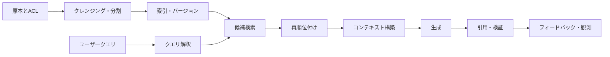



RAGはモデルに文書を添える機能ではなく、質問に必要な根拠を限られた時間とコストの中で探し、回答へ結び付ける**情報検索システム**である。

優れた生成モデルでも、誤って検索されたコンテキストを受け取れば、もっともらしい誤答を作る。
反対に検索結果が良くても、コンテキストの組み立て、引用の対応付け、拒否方針が弱ければ、運用上の信頼性は低い。

## 1. 問題：RAGの失敗を一つの数値に隠さない

一つのRAGリクエストには、少なくとも次の段階がある。

1. 原本の収集とアクセス制御
2. クレンジングと単位分割
3. 索引作成と更新
4. クエリ解釈
5. 候補検索
6. フィルタリングと再順位付け
7. コンテキスト構築
8. 回答生成と引用
9. 検証と観測

最終的な正答率だけを見ても、どの段階がボトルネックかは分からない。

- 文書が索引に登録されていなかったのか。
- 正答を含む単位が細かく分割されすぎたのか。
- クエリと文書で表現が異なっていたのか。
- 候補には入っていたが、再順位付けで落ちたのか。
- 根拠はあったが、モデルが利用しなかったのか。
- 回答がコンテキストを越えて推論されたのか。

したがって、検索と生成を分けて測定し、改めてエンドツーエンドの指標へ結び付ける必要がある。

## 2. Mental model：エビデンス・サプライチェーン



各回答は、原本まで遡れるエビデンス・サプライチェーンの産物でなければならない。

主要なオブジェクトには、次の識別子を設ける。

- `source_id`：原本文書の安定したID
- `source_version`：内容または権限のバージョン
- `chunk_id`：分割単位のID
- `index_version`：埋め込み・分析器・索引設定のバージョン
- `retrieval_run_id`：クエリごとの検索実行ID
- `answer_id`：回答と使用した根拠をまとめるID

文書が変わった後も古い回答が表示され続ける場合、出典バージョンに基づいて無効化できなければならない。

## 3. 実践workflow 1：データ契約と分割戦略

まず、RAGが扱う文書の契約を定義する。

```yaml
document:
  required: [source_id, version, title, body, updated_at, acl]
  optional: [section_path, language, valid_from, valid_until]
chunk:
  required: [chunk_id, source_id, source_version, text, offsets]
index:
  required: [embedding_model, tokenizer, dimensions, created_at]
```

分割は、固定文字数だけの問題ではない。

- 見出しと小見出しの境界を保つ。
- 表の列名と行を切り離さない。
- コードの宣言と説明をできるだけ一緒に置く。
- 文の途中での切断を避ける。
- 原文のoffsetを保持する。
- 隣接コンテキストを拡張できるよう順序を記録する。

小さなchunkは精密だが、文脈を失いやすい。
大きなchunkは文脈が豊富だが、検索表現が薄まり、トークンコストも増える。

単一の大きさを前提にせず、文書タイプごとに方針を作り、評価によって決定する。

## 4. 検索：まずrecallを確保し、precisionを取り戻す

候補検索では、一般にsparse信号とdense信号を組み合わせる。

- sparse：正確な用語、コード、識別子、希少語に強い。
- dense：表現が異なっても意味が近い文書を探すのに有利である。
- metadata filter：権限、時点、製品、言語などの明示的な条件を強制する。

結合スコアの単純な形は次のとおりである。

$$
s(d,q)=\alpha s_{\text{sparse}}(d,q)+(1-\alpha)s_{\text{dense}}(d,q)
$$

尺度の異なるスコアをそのまま加えると、一方の信号が支配する可能性がある。
正規化、rank fusion、または学習済みの結合器を検証セットで比較する。

候補段階の目標は、関連文書を取りこぼさないことである。
再順位付け段階では、より高価なモデルを使って候補の順序を精緻化する。

実践的な順序は次のとおりである。

1. 権限フィルタを検索前に適用する。
2. sparseとdenseからそれぞれ候補を得る。
3. 重複sourceとnear-duplicateを整理する。
4. rank fusionで幅広い候補プールを作る。
5. cross-encoderまたはルールベースのrerankerを適用する。
6. 多様性と鮮度の制約を反映する。

クエリ書き換えは元のクエリを置き換えず、候補信号を追加する形で用いるほうが安全である。

## 5. コンテキスト構築と回答契約

上位文書をそのまま連結してはならない。

- 質問の下位論点ごとに根拠を配分する。
- 同じ内容を繰り返すchunkを取り除く。
- 矛盾するバージョンには時点と権威を示す。
- 引用可能な最小単位を保つ。
- コンテキスト長の予算を根拠の価値に応じて配分する。

回答出力契約の例：

```json
{
  "answer": "근거에 기반한 요약",
  "claims": [
    {"text": "검증할 주장", "citations": ["chunk-id"]}
  ],
  "insufficient_evidence": false,
  "follow_up": []
}
```

モデルが生成した引用番号を信用しない。
許可された`chunk_id`一覧に含まれているかをコードで検査する。

根拠が不足している場合、回答生成を無理に続けない。
拒否、追加質問、検索範囲の拡張のいずれかを方針として選ぶ。

## 6. 実践例：一つの質問を段階別に診断する

例示する質問は、特定のドメインに依存しない運用手順の質問と仮定する。

```python
def answer(query, user_context):
    scope = authorize(user_context)
    variants = rewrite_as_additional_queries(query)
    candidates = hybrid_retrieve([query, *variants], scope=scope)
    ranked = rerank(query, deduplicate(candidates))
    context = assemble_context(query, ranked, token_budget=6000)
    draft = generate_structured(query, context)
    return verify_claim_citations(draft, allowed=context.chunk_ids)
```

このコードで重要なのはライブラリ名ではなく、境界である。

- 認可は検索前に完了する。
- 書き換えたクエリは元のクエリと一緒に使う。
- コンテキストは明示的な予算内で構成する。
- 出力を構造化する。
- 引用は生成後に検証する。

誤答が出たら、保存済みの`retrieval_run_id`から候補と順位を再現する。

## 7. 評価設計

評価セットは実際の質問分布を代表する必要がある。

- 単純な事実質問
- 複数文書を組み合わせる必要がある質問
- 表・コード・手順に関する質問
- 時点またはバージョンが重要な質問
- 曖昧で確認質問が必要なリクエスト
- corpus内に答えがない質問
- アクセス権限外の情報を求める質問

検索指標：

- Recall@k：正答の根拠が上位k件に含まれる割合
- MRR：最初の関連文書の順位の逆数平均
- nDCG：関連度の等級と順序をともに反映
- filter accuracy：許可・遮断条件の正確性

生成指標：

- correctness：質問に合っているか
- groundedness：各主張が提供された根拠で裏付けられているか
- citation precision：引用が実際に主張を裏付けているか
- citation recall：検証可能な主張に引用の漏れがないか
- refusal quality：根拠不足を適切に処理できるか

自動評価器は高速だが、偏りと自己一貫性の問題がある。
人によるレビュー標本、ルールベース検査、モデル評価を三角検証する。

## 8. オンライン観測と変更管理

運用ダッシュボードには平均値だけを置かない。

- p50、p95、p99の全体遅延
- 検索・再順位付け・生成の段階別遅延
- 候補数とコンテキストのトークン数
- cache hit ratio
- 空検索と拒否の割合
- 引用検証の失敗率
- クエリタイプ別の品質
- index version別の回帰

索引の変更はモデルのデプロイと同様に管理する。

1. 固定評価セットでoffline比較
2. shadow trafficで結果の差を観察
3. 限定的なcanary適用
4. 品質・遅延・コストのgateを確認
5. 問題発生時に以前のindex aliasへrollback

文書の削除と権限変更は、通常の更新より優先して処理する。

## 9. 評価checklist

- [ ] 原本、chunk、index、回答のバージョンがつながっているか。
- [ ] アクセス制御が生成後ではなく、検索前に適用されているか。
- [ ] 文書タイプ別の分割方針を実際に評価したか。
- [ ] sparseとdenseの失敗タイプを別々に測定しているか。
- [ ] Recall@kと最終正答率を分けて見ているか。
- [ ] 答えのない質問が評価セットに含まれているか。
- [ ] 引用IDをコードで検証しているか。
- [ ] 矛盾する根拠と時点を表現できるか。
- [ ] index version別に品質・遅延・コストを比較しているか。
- [ ] ログに原文の機密情報が過剰に残っていないか。
- [ ] 削除要求が索引とcacheまで伝播するか。
- [ ] rollback可能な以前の索引を保持しているか。

## 10. よくある失敗と限界

### 埋め込みモデルだけを変えれば解決すると考える

取りこぼしの原因は、分割、metadata、権限フィルタ、クエリ分布かもしれない。
段階別の指標なしにモデルだけを変えると、コストは増えても原因は残る。

### 長いコンテキストが常に優れていると考える

不要なコンテキストは、コスト、遅延、注意の分散を増やす。
トークン数ではなく、有効な根拠の密度を最適化する。

### 合成質問だけで評価する

合成データはcoverageを広げるが、実際の利用者の語彙や曖昧さを代替できない。
運用ログから非識別化した標本を追加し、時間の経過に応じて評価セットを更新する。

### RAGが鮮度を自動的に保証すると考える

収集遅延、索引作成の失敗、cache、文書バージョンの衝突があれば、古い回答を出す。
鮮度SLOと削除の伝播時間を別々に測定する。

RAGは閉じたcorpusに対する確率的な検索・生成システムである。
原本が誤っているか、必要な知識がなければ、正しい回答を保証できない。

## 11. 公式参考資料

- [Retrieval-Augmented Generation原論文](https://arxiv.org/abs/2005.11401)
- [Dense Passage Retrieval原論文](https://arxiv.org/abs/2004.04906)
- [BEIR benchmark原論文](https://arxiv.org/abs/2104.08663)
- [Elasticsearch hybrid search公式文書](https://www.elastic.co/docs/solutions/search/hybrid-search)
- [NIST AI Risk Management Framework](https://www.nist.gov/itl/ai-risk-management-framework)

## 12. まとめ

運用可能なRAGの核心は、より大きなモデルではなく、**追跡可能なエビデンス・サプライチェーンと段階別評価**にある。

検索recall、再順位付けprecision、コンテキストの有効性、生成の根拠性、アクセス制御をそれぞれ測定すれば、失敗はデバッグ可能なエンジニアリング問題になる。
